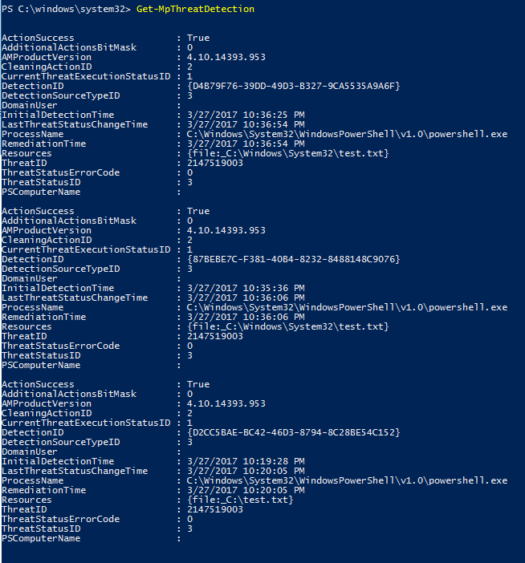

# Review Windows Defender AV scan results


**Applies to:**

- Windows 10

**Audience**

- Enterprise security administrators

**Manageability available with**

- PowerShell
- Windows Management Instrumentation (WMI)
- System Center Configuration Manager 
- Microsoft Intune
- Windows Defender Security Center app


After Windows Defender Antivirus has completed a scan, whether it is an [on-demand](run-scan-windows-defender-antivirus.md) or [scheduled scan](scheduled-catch-up-scans-windows-defender-antivirus.md), the results are recorded and you can view the results. You can also define


**Use Configuration Manager to review Windows Defender AV scan results:**

See [How to monitor Endpoint Protection status](https://docs.microsoft.com/en-us/sccm/protect/deploy-use/monitor-endpoint-protection).


**Use the Windows Defender Security Center app to review Windows Defender AV scan results:**

1. Open the Windows Defender Security Center by clicking the shield icon in the task bar or searching the start menu for **Defender**.

2. Click the **Virus & threat protection** tile (or the shield icon on the left menu bar) and then the **Scan history** label.

    - Click **See full history** for any of the sections to see previous detections and the action taken. You can also clear the list.
    - Information about the last scan is displayed at the bottom of the page.


**Use PowerShell cmdlets to review Windows Defender AV scan results:**

The following cmdlet will return each detection on the endpoint. If there are multiple detection of the same threat, each detection will be listed separately, based on the time of each detection:

```PowerShell
Get-MpThreatDetection
```



You can specify `-ThreatID` to limit the output to only show the detections for a specific threat.

If you want to list threat detections, but combine detections of the same threat into a single item, you can use the following cmdlet:

```PowerShell
Get-MpThreat
```


See [Use PowerShell cmdlets to configure and run Windows Defender Antivirus](use-powershell-cmdlets-windows-defender-antivirus.md) and [Defender cmdlets](https://technet.microsoft.com/itpro/powershell/windows/defender/index) for more information on how to use PowerShell with Windows Defender Antivirus.

**Use Windows Management Instruction (WMI) to review Windows Defender AV scan results:**

Use the [**Get** method of the **MSFT_MpThreat** and **MSFT_MpThreatDetection**](https://msdn.microsoft.com/en-us/library/dn439477(v=vs.85).aspx) classes.


**Use Microsoft Intune to review Windows Defender AV scan results:**

See [Help secure Windows PCs with Endpoint Protection for Microsoft Intune: Monitor Endpoint Protection](https://docs.microsoft.com/en-us/intune/deploy-use/help-secure-windows-pcs-with-endpoint-protection-for-microsoft-intune#monitor-endpoint-protection).


## Related topics

- [Customize, initiate, and review the results of Windows Defender AV scans and remediation](customize-run-review-remediate-scans-windows-defender-antivirus.md)
- [Windows Defender Antivirus in Windows 10](windows-defender-antivirus-in-windows-10.md)