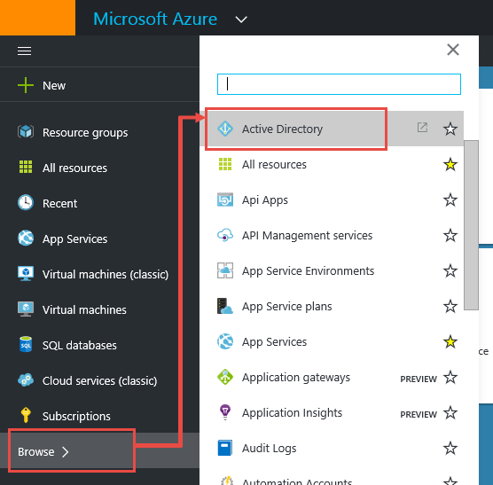
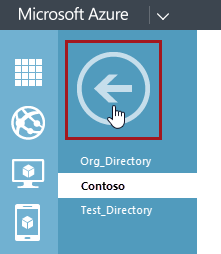
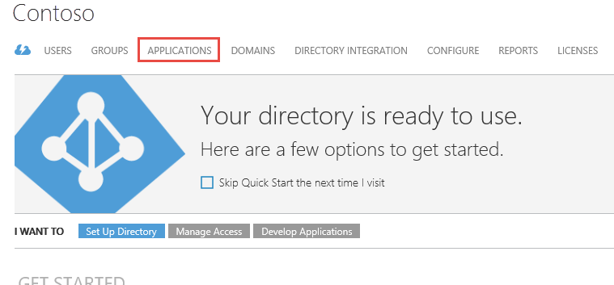
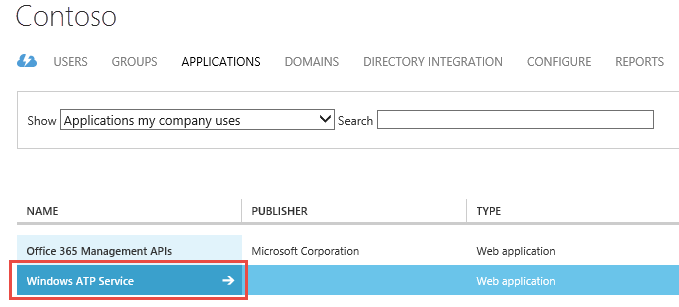
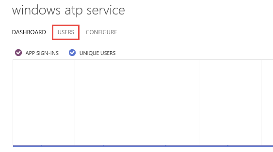
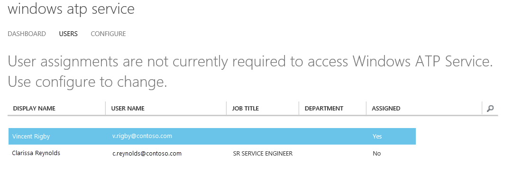
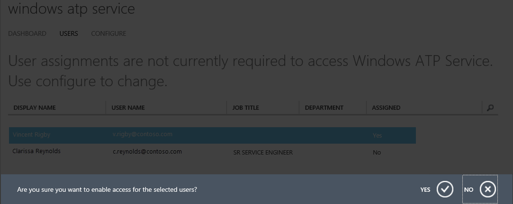

# Windows Defender ATP service onboarding

**Applies to:**

- Windows 10 Insider Preview
- Azure Active Directory

[Some information relates to pre-released product which may be substantially modified before it's commercially released. Microsoft makes no warranties, express or implied, with respect to the information provided here.]

You have to assign users to the Windows ATP Service application in Azure Active Directory (AAD) before they can access the portal.

**Manage user access to the Windows Defender ATP portal**:

1.  When you first go to the [Windows Defender ATP portal](https://seville.windows.com/) and your directory does not
    have users assigned to the Windows ATP Service application, you will
    be directed to open the [Microsoft Azure Dashboard](https://portal.azure.com) to manage user access.

    > **Note**&nbsp;&nbsp; In AAD, a directory is essentially a tenant. See the [Azure AD documentation](https://msdn.microsoft.com/en-us/library/azure/jj573650.aspx) for more information on how tenants work with AAD.

2.  Ensure you have logged in to Microsoft Azure with an account that
    has permissions to assign users to an application in AAD. You might
    need to sign out of Microsoft Azure and then sign back in again if
    you used a different account to sign in to the Windows Defender ATP
    portal:

    a.  On the top menu, click the signed-in user’s name.

    b.  Click **Sign out**.

    

    c.	Go the [Microsoft Azure Dashboard](https://portal.azure.com) again where you will be asked to sign in.

    d.	Sign in with the correct user name and password for an account that has permissions to assign users in AAD.

3. On the **Microsoft Azure Dashboard**, click **Browse** in the navigation pane and then click **Active Directory** to open the [Azure Management Portal](https://manage.windowsazure.com/).

    

4. You might need to open the **Directory** section of the [Azure Management Portal](https://manage.windowsazure.com/) so you can access your directory. There are two ways you can do this:

    a.  Click the arrow icon above the list of directories to see the full list of directories in the main area of the portal.

    

    b. Scroll down in the navigation pane and click **Active Directory**.

    

5. Click the directory that contains the Windows Defender ATP application. In the following example, the directory is
    called **Contoso**.

     

    > **Note**&nbsp;&nbsp;You can also access your directory by going straight to the [Azure Management Portal](https://manage.windowsazure.com/), clicking Active Directory and then finding your directory in the list.

6. Click **Applications** from the top menu bar.

    

7. Click the **Windows ATP Service** application. The dashboard for the application is shown.

    

    > **Note**&nbsp;&nbsp; The application might have a slightly different name than the one shown here. It might be called **Windows Defender ATP Service**.

8. Click **Users** from the top menu bar. A list of users that are in the directory is displayed.

    

    

    > **Note**&nbsp;&nbsp; If you do not normally work with AAD, you might not see any users in the directory, or we might have created a test tenant specifically for a single user’s account. See the [Troubleshoot Windows Defender Advanced Threat Protection onboarding issues](troubleshoot-onboarding-windows-defender-advanced-threat-protection.md) section for instructions on adding users to a directory.

9. Select the user you want manage.

10. Click **Assign**.

11. Confirm that you want to enable access for the user from the notification bar. If you click **Yes**, the user is given access to the Windows Defender ATP portal.  One or more progress bars will appear that indicates the user is being assigned a role, and you will see confirmation messages. You don’t need to do anything with the messages, they will go away after a short period of time.

    

12. To remove the user's access, click **Remove**.

13. Select the **Disable access to this app for the selected users** checkbox, and then click **Complete** . One or more progress bars will appear, followed by confirmation messages. The messages will disappear after a short period.

    

14. To remove the access for all users, click **Manage access**. If you click **Complete** , you will not see the Windows ATP Service in the list of applications in your directory.

    > **Note**&nbsp;&nbsp; If you want to give access to users again, see the Manage access for all users in Azure Active Directory topic in [Troubleshoot Windows Defender Advanced Threat Protection onboarding issues](troubleshoot-onboarding-windows-defender-advanced-threat-protection.md).

15. You can continue assigning roles for other users in your organization now, or you can return to the Windows Defender ATP portal to complete the service onboarding wizard.

    > **Note**&nbsp;&nbsp; You need to assign roles for every user in your organization that requires access to the Windows Defender ATP portal. You can assign roles at any time by going to the Azure Management Portal, clicking **Active Directory**, and then finding your directory in the list and following the steps above.

When you have finished assigning roles, return to the [Windows Defender ATP portal](https://seville.windows.com) and refresh the
page.

Follow the steps in the onboarding wizard to complete the onboarding process.

At the end of the wizard, you can download the Group Policy configuration package which you will use to configure endpoints on your network. You can also download the package from the **Client onboarding** menu on the portal after you have completed the onboarding wizard.

## Related topics
- [Configure Windows Defender ATP endpoints](configure-endpoints-windows-defender-advanced-threat-protection.md)
- [Monitor the Windows Defender ATP onboarding](monitor-onboarding-windows-defender-advanced-threat-protection.md)
- [Additional Windows Defender ATP configuration settings](additional-configuration-windows-defender-advanced-threat-protection.md)
- [Troubleshoot Windows Defender Advanced Threat Protection onboarding issues](troubleshoot-onboarding-windows-defender-advanced-threat-protection.md)
