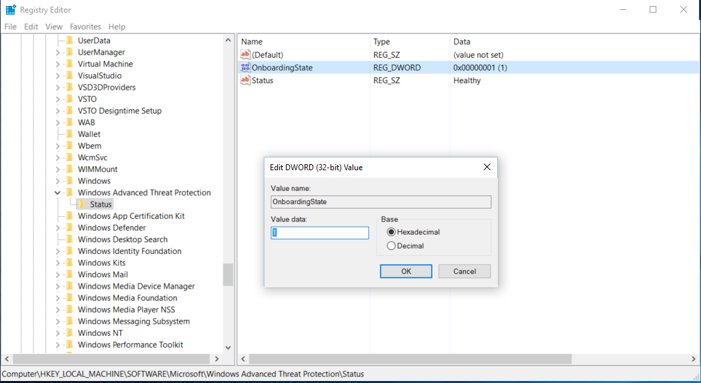
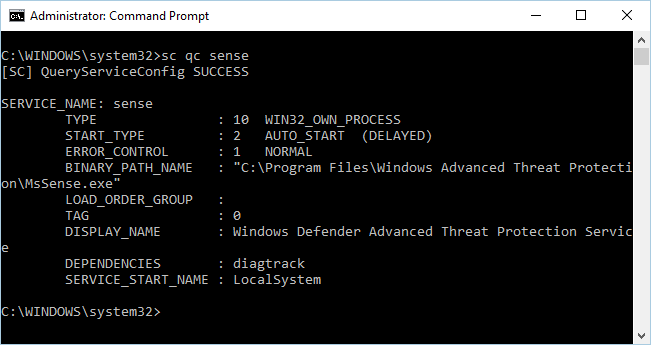
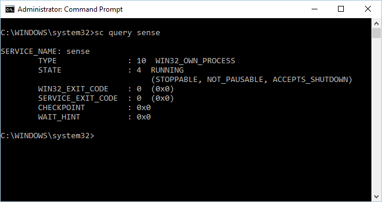
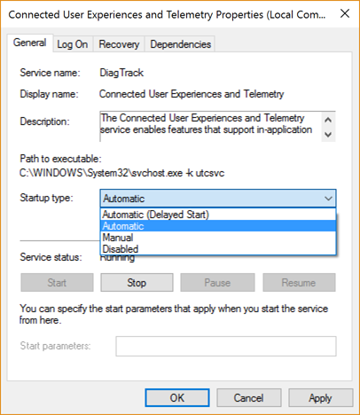
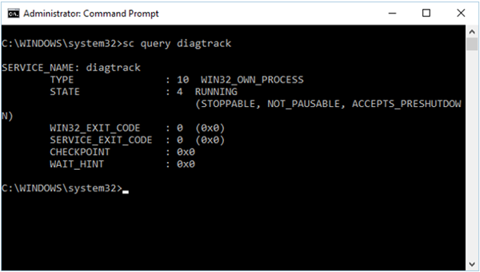
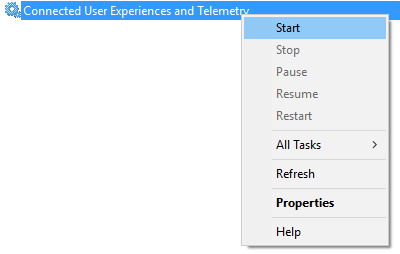
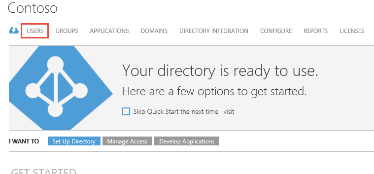

# Troubleshoot Windows Defender Advanced Threat Protection onboarding issues

**Applies to:**

- Windows 10 Insider Preview Build 14332 or later
- Windows Defender Advanced Threat Protection (Windows Defender ATP)

<span style="color:#ED1C24;">[Some information relates to pre-released product which may be substantially modified before it's commercially released. Microsoft makes no warranties, express or implied, with respect to the information provided here.]</span>

You might need to troubleshoot the Windows Defender Advanced Threat Protection onboarding process if you encounter issues.
This page provides detailed steps for troubleshooting endpoints that aren't reporting correctly, and common error codes encountered during onboarding. <!--and steps for resolving problems with Azure Active Directory (AAD).-->

## Endpoints are not reporting to the service correctly

If you have completed the endpoint onboarding process and don't see endpoints in the [Machines view](investigate-machines-windows-defender-advanced-threat-protection.md) after 20 minutes, it might indicate an endpoint onboarding or connectivity problem.

Go through the following verification topics to address this issue:

- [Ensure the endpoint is onboarded successfully](#Ensure-that-the-endpoint-is-onboarded-successfully)
- [Ensure the Windows Defender ATP service is enabled](#Ensure-that-the-Windows-Defender-ATP-service-is-enabled)
- [Ensure the telemetry and diagnostics service is enabled](#Ensure-that-telemetry-and-diagnostics-service-is-enabled)
- [Ensure the endpoint has an Internet connection](#Ensure-that-the-Windows-Defender-ATP-endpoint-has-internet-connection)


### Ensure the endpoint is onboarded successfully
If the endpoints aren't reporting correctly, you might need to check that the Windows Defender ATP service was successfully onboarded onto the endpoint.

**Check the onboarding state in Registry**:

1. Click **Start**, type **Run**, and press **Enter**.

2. From the **Run** dialog box, type **regedit** and press **Enter**.

4. In the **Registry Editor** navigate to the Status key under:

   ```text
HKEY_LOCAL_MACHINE\SOFTWARE\Microsoft\Windows Advanced Threat Protection
```

5. Check the **OnboardingState** value is set to **1**.

  

If the **OnboardingState** value is not set to **1**, you can use Event Viewer to review errors on the endpoint.

You can check the event viewer for the onboarding script results.

**Check the result of the script**:
1. Click **Start**, type **Event Viewer**, and press **Enter**.

2. Go to **Windows Logs** > **Application**.

3. Look for an event from **WDATPOnboarding** event source.

If the script fails and the event is an error, you can check the event ID in the following table to help you troubleshoot the issue.
> **Note**&nbsp;&nbsp;The following event IDs are specific to the onboarding script only. 

Event ID | Error Type | Resolution steps
:---|:---|:---
5 | Offboarding data was found but couldn't be deleted | Check the permissions on the registry, specifically ```HKLM\SOFTWARE\Policies\Microsoft\Windows Advanced Threat Protection```
10 | Onboarding data couldn't be written to registry |  Check the permissions on the registry, specifically ```HKLM\SOFTWARE\Policies\Microsoft\Windows Advanced Threat```. Verify that the script was ran as an administrator.
15 |  Failed to start SENSE service |Check the service status (```sc query sense``` command). Make sure it's not in an intermediate state (*'Pending_Stopped'*, *'Pending_Running'*) and try to run the script again (with administrator rights). 
30 |  The script failed to wait for the service to start running | The service could have taken more time to start or has encountered errors while trying to start. For more information on events and errors related to SENSE, see [Review events and errors on endpoints with Event viewer](event-error-codes-windows-defender-advanced-threat-protection.md).
35 |  The script failed to find needed onboarding status registry value | When the SENSE service starts for the first time, it writes onboarding status to the registry location ```HKLM\SOFTWARE\Microsoft\Windows Advanced Threat Protection\Status```. The script failed to find it after several seconds. You can manually test it and check if it's there. For more information on events and errors related to SENSE, see [Review events and errors on endpoints with Event viewer].(event-error-codes-windows-defender-advanced-threat-protection.md). 
40 | SENSE service onboarding status is not set to **1** | The SENSE service has failed to onboard properly. For more information on events and errors related to SENSE, see [Review events and errors on endpoints with Event viewer](event-error-codes-windows-defender-advanced-threat-protection.md). 

**Use Event Viewer to identify and adress onboarding errors**:   

1. Click **Start**, type **Event Viewer**, and press **Enter**.

2. In the **Event Viewer (Local)** pane, expand **Applications and Services Logs** > **Microsoft** > **Windows** > **SENSE**.

    > **Note**&nbsp;&nbsp;SENSE is the internal name used to refer to the behavioral sensor that powers Windows Defender ATP.

3. Select **Operational** to load the log.

4. In the **Action** pane, click **Filter Current log**.

5. On the **Filter** tab, under **Event level:** select **Critical**, **Warning**, and **Error**, and click **OK**.

  

6. Events which can indicate issues will appear in the **Operational** pane. You can attempt to troubleshoot them based on the solutions in the following table:

Event ID | Message | Resolution steps
:---|:---|:---
5 | Windows Advanced Threat Protection service failed to connect to the server at _variable_ | [Ensure the endpoint has Internet access](#ensure-the-endpoint-has-an-internet-connection).
6 | Windows Advanced Threat Protection service is not onboarded and no onboarding parameters were found. Failure code: _variable_ | [Run the onboarding script again](configure-endpoints-windows-defender-advanced-threat-protection.md#manual).
7 |  Windows Advanced Threat Protection service failed to read the onboarding parameters. Failure code: _variable_ | [Ensure the endpoint has Internet access](#ensure-the-endpoint-has-an-internet-connection), then run the entire onboarding process again.
15 | Windows Advanced Threat Protection cannot start command channel with URL: _variable_ | [Ensure the endpoint has Internet access](#ensure-the-endpoint-has-an-internet-connection).
25 | Windows Defender Advanced Threat Protection service failed to reset health status in the registry. Failure code: _variable_ | Contact support.


### Ensure the Windows Defender ATP service is enabled
If the endpoints aren't reporting correctly, you might need to check that the Windows Defender ATP service is set to automatically start and is running on the endpoint.

You can use the SC command line program for checking and managing the startup type and running state of the service.

**Check the Windows Defender ATP service startup type from the command line:**

1.  Open an elevated command-line prompt on the endpoint:

  a.  Click **Start**, type **cmd**, and press **Enter**.

  b.  Right-click **Command prompt** and select **Run as administrator**.

2.  Enter the following command, and press **Enter**:

    ```text
    sc qc sense
    ```

If the the service is running, then the result should look like the following screenshot:

  

If the service ```START_TYPE``` is not set to ```AUTO_START```, then you'll need to set the service to automatically start.

**Change the Windows Defender ATP service startup type from the command line:**

1.  Open an elevated command-line prompt on the endpoint:

  a.  Click **Start**, type **cmd**, and press **Enter**.

  b.  Right-click **Command prompt** and select **Run as administrator**.

2.  Enter the following command, and press **Enter**:

    ```text
    sc config sense start=auto
    ```

3.  A success message is displayed. Verify the change by entering the following command and press **Enter**:

    ```text
    sc qc sense
    ```

**Check the Windows Defender ATP service is running from the command line:**

1.  Open an elevated command-line prompt on the endpoint:

  a.  Click **Start**, type **cmd**, and press **Enter**.

  b.  Right-click **Command prompt** and select **Run as administrator**.

2.  Enter the following command, and press **Enter**:

    ```text
    sc query sense
    ```

If the service is running, the result should look like the following screenshot:



If the service **STATE** is not set to **RUNNING**, then you'll need to start it.

**Start the Windows Defender ATP service from the command line:**

1.  Open an elevated command-line prompt on the endpoint:

  a.  Click **Start**, type **cmd**, and press **Enter**.

  b.  Right-click **Command prompt** and select **Run as administrator**.

2.  Enter the following command, and press **Enter**:

    ```text
    sc start sense
    ```

3.  A success message is displayed. Verify the change by entering the following command and press **Enter**:

    ```text
    sc qc sense
    ```

### Ensure the telemetry and diagnostics service is enabled
If the endpoints aren't reporting correctly, you might need to check that the Windows 10 telemetry and diagnostics service is set to automatically start and is running on the endpoint. The service may have been disabled by other programs or user configuration changes.


First, you should check that the service is set to start automatically when Windows starts, then you should check that the service is currently running (and start it if it isn't).

### Ensure the service is set to start

**Use the command line to check the Windows 10 telemetry and diagnostics service startup type**:

1.  Open an elevated command-line prompt on the endpoint:

  a.  Click **Start**, type **cmd**, and press **Enter**.

  b.  Right-click **Command prompt** and select **Run as administrator**.

2.  Enter the following command, and press **Enter**:

    ```text
    sc qc diagtrack
    ```

If the service is enabled, then the result should look like the following screenshot:


If the ```START_TYPE``` is not set to ```AUTO_START```, then you'll need to set the service to automatically start.


**Use the command line to set the Windows 10 telemetry and diagnostics service to automatically start:**

1.  Open an elevated command-line prompt on the endpoint:

  a.  Click **Start**, type **cmd**, and press **Enter**.

  b.  Right-click **Command prompt** and select **Run as administrator**.

2.  Enter the following command, and press **Enter**:

    ```text
    sc config diagtrack start=auto
    ```

3.  A success message is displayed. Verify the change by entering the following command, and press **Enter**:

    ```text
    sc qc diagtrack
    ```

**Use the Windows Services console to check the Windows 10 telemetry and diagnostics service startup type**:

1.  Open the services console:

  a. Click **Start** and type **services**.

  b. Press **Enter** to open the console.

2.  Scroll through the list of services until you find **Connected User Experiences and Telemetry**.

3.  Check the **Startup type** column - the service should be set as **Automatic**.

If the startup type is not set to **Automatic**, you'll need to change it so the service starts when the endpoint does.


**Use the Windows Services console to set the Windows 10 telemetry and diagnostics service to automatically start:**

1.  Open the services console:

  a. Click **Start** and type **services**.

  b. Press **Enter** to open the console.

2.  Scroll through the list of services until you find **Connected User Experiences and Telemetry**.

3.  Right-click on the entry and click **Properties**.

4.  On the **General** tab, change the **Startup type:** to **Automatic**, as shown in the following image. Click OK.

    

### Ensure the service is running

**Use the command line to check the Windows 10 telemetry and diagnostics service is running**:

1.  Open an elevated command-line prompt on the endpoint:

  a.  **Click **Start** and type **cmd**.**

  b.  Right-click **Command prompt** and select **Run as administrator**.

2.  Enter the following command, and press **Enter**:

    ```text
    sc query diagtrack
    ```

If the service is running, the result should look like the following screenshot:



If the service **STATE** is not set to **RUNNING**, then you'll need to start it.


**Use the command line to start the Windows 10 telemetry and diagnostics service:**

1.  Open an elevated command-line prompt on the endpoint:

  a.  **Click **Start** and type **cmd**.**

  b.  Right-click **Command prompt** and select **Run as administrator**.

2.  Enter the following command, and press **Enter**:

    ```text
    sc start diagtrack
    ```

3. A success message is displayed. Verify the change by entering the following command, and press **Enter**:

    ```text
    sc query diagtrack
    ```

**Use the Windows Services console to check the Windows 10 telemetry and diagnostics service is running**:

1.  Open the services console:

  a. Click **Start** and type **services**.

  b. Press **Enter** to open the console.

2.  Scroll through the list of services until you find **Connected User Experiences and Telemetry**.

3.  Check the **Status** column - the service should be marked as **Running**.

If the service is not running, you'll need to start it.


**Use the Windows Services console to start the Windows 10 telemetry and diagnostics service:**

1.  Open the services console:

  a. Click **Start** and type **services**.

  b. Press **Enter** to open the console.

2.  Scroll through the list of services until you find **Connected User Experiences and Telemetry**.

3.  Right-click on the entry and click **Start**, as shown in the following image.




### Ensure the endpoint has an Internet connection

The Window Defender ATP sensor requires Microsoft Windows HTTP (WinHTTP) to report telemetry and communicate with the Windows Defender ATP service.

WinHTTP is independent of the Internet browsing proxy settings and other user context applications and must be able to detect the proxy servers that are available in your particular environment.

To ensure that sensor has service connectivity, follow the steps described in the [Verify client connectivity to Windows Defender ATP service URLs](configure-proxy-internet-windows-defender-advanced-threat-protection.md#verify-client-connectivity-to-windows-defender-atp-service-urls) topic.

If the verification fails and your environment is using a proxy to connect to the Internet, then follow the steps described in [Configure proxy and Internet connectivity settings](configure-proxy-internet-windows-defender-advanced-threat-protection.md) topic.    

## Troubleshoot onboarding issues with Microsoft Intune
You can use Microsoft Intune to check error codes and attempt to troubleshoot the cause of the issue.

Use the following tables to understand the possible causes of issues while onboarding:

- Microsoft Intune error codes and OMA-URIs table
- Known issues with non-compliance table
- Mobile Device Management (MDM) event logs table

If none of the event logs and troubleshooting steps work, download the Local script from the **Endpoint Management** section of the portal, and run it in an elevated command prompt.  

**Microsoft Intune error codes and OMA-URIs**:

Error Code Hex | Error Code Dec | Error Description | OMA-URI | Possible cause and troubleshooting steps
:---|:---|:---|:---|:---
0x87D1FDE8 | -2016281112 | Remediation failed | Onboarding <br> Offboarding |  **Possible cause:** Onboarding or offboarding failed on a wrong blob: wrong signature or missing PreviousOrgIds fields <br><br> **Troubleshooting steps:** <br> Check the event IDs in the [Ensure the endpoint is onboarded successfully](#ensure-the-endpoint-is-onboarded-successfully) section. <br> Check the MDM event logs in the following table or follow the instructions in [Diagnose MDM failures in Windows 10](https://msdn.microsoft.com/en-us/library/windows/hardware/mt632120%28v=vs.85%29.aspx).
 | | | Onboarding <br> Offboarding <br> SampleSharing | ***Possible cause:*** Windows Defender ATP Policy registry key does not exist or the OMA DM client doesn't have permissions to write to it. <br><br> **Troubleshooting steps:** Ensure that the following registry key exists: ```HKEY_LOCAL_MACHINE\SOFTWARE\Policies\Microsoft\Windows Advanced Threat Protection```. <br> <br> If it doesn't exist, open an elevated command and add the key. 
  | | | SenseIsRunning <br> OnboardingState <br> OrgId |  ***Possible cause:*** An attempt to remediate by read-only property. Onboarding has failed. <br><br> **Troubleshooting steps:** Check the troubleshooting steps in [Troubleshoot Windows Defender Advanced Threat Protection onboarding issues](#troubleshoot-windows-defender-advanced-threat-protection-onboarding-issues). <br> Check the MDM event logs in the following table or follow the instructions in [Diagnose MDM failures in Windows 10](https://msdn.microsoft.com/en-us/library/windows/hardware/mt632120%28v=vs.85%29.aspx).
   | | | All | ***Possible cause:*** Attempt to deploy Windows Defender ATP on non-supported SKU/Platform, particularly Holographic SKU. <br> Currently is supported platforms:  Enterprise, education, and professional. <br> Server is not supported. 
   0x87D101A9 | -2016345687 |Syncml(425): The requested command failed because the sender does not have adequate access control permissions (ACL) on the recipient.  | All |  ***Possible cause:*** Attempt to deploy Windows Defender ATP on non-supported SKU/Platform, particularly Holographic SKU. <br> Currently is supported platforms:  Enterprise, Education, and Professional. 

<br>
**Known issues with non-compliance**

The following table provides information on issues with non-compliance and how you can address the issues.

Case | Symptoms | Possible cause and troubleshooting steps
:---|:---|:---
1 | Machine is compliant by SenseIsRunning OMA-URI. But is non-compliant by OrgId, Onboarding and OnboardingState OMA-URIs. | ***Possible cause:*** Check that user passed OOBE after Windows installation or upgrade. During OOBE onboarding couldn't be completed but SENSE is running already. <br> **Troubleshooting steps:** Wait for OOBE to complete.
2 |  Machine is compliant by OrgId, Onboarding, and OnboardingState OMA-URIs, but is non-compliant by SenseIsRunning OMA-URI. |  ***Possible cause:*** Sense service's startup type is set as "Delayed Start". Sometimes this causes the Microsoft Intune server to report the machine as non-compliant by SenseIsRunning when DM session occurs on system start. <br> **Troubleshooting steps:** The issue should automatically be fixed within 24 hours.
3 | Machine is non-compliant | **Troubleshooting steps:** Ensure that Onboarding and Offboarding policies are not deployed on the same machine at same time.

<br>
**Mobile Device Management (MDM) event logs**

View the MDM event logs to troubleshoot issues that might arise during onboarding:

Log name: Microsoft\Windows\DeviceManagement-EnterpriseDiagnostics-Provider 

Channel name: Admin

ID | Severity | Event description | Description
:---|:---|:---|:---
1801 | Error | Windows Defender Advanced Threat Protection CSP: Failed to Get Node's Value. NodeId: (%1), TokenName: (%2), Result: (%3) | Windows Defender ATP has failed to get specific node's value. <br> TokenName: Contains node name that caused the error. <br> Result: Error details.  
1802 | Information | Windows Defender Advanced Threat Protection CSP: Get Node's Value complete. NodeId: (%1), TokenName: (%2), Result: (%3) |  Windows Defender ATP has completed to get specific node's value. <br> TokenName: Contains node name <br> Result: Error details or succeeded.
1819 | Error | Windows Defender Advanced Threat Protection CSP: Failed to Set Node's Value. NodeId: (%1), TokenName: (%2), Result: (%3). | Windows Defender ATP has completed to get specific node's value. <br> TokenName: Contains node name that caused the error <br> Result: Error details.
1820 | Information | Windows Defender Advanced Threat Protection CSP: Set Nod's Value complete. NodeId: (%1), TokenName: (%2), Result: (%3). | Windows Defender ATP has completed to get specific node's value. <br> TokenName: Contains node name <br> Result: Error details or succeeded.

## Troubleshoot onboarding issues with System Center Configuration Manager (current branch) version 1606

Review the issues in [Troubleshoot Windows Defender Advanced Threat Protection onboarding issues](#troubleshoot-windows-defender-advanced-threat-protection-onboarding-issues). 
If none of the event logs and troubleshooting steps work, download the Local script from the **Endpoint Management** section of the portal, and run it in an elevated command prompt.

<!--

## There are no users in the Azure Active Directory
If you don't see any users in the [Azure Management Portal](https://manage.windowsazure.com/) during the service onboarding stage, you might need to add users to the directory first.

1.  Go to the Azure Management Portal and select the directory you want to manage.

2.  Click **Users** from the top menu bar.

    

3.  Click **Add user** from the menu bar at the bottom.

    

4.  Select the type of user and enter their details. There might be multiple steps in the **Add user** dialog box depending on the type of user. When you're done, click **Complete**  or **OK**.

5.  Continue to add users. They will now appear in the **Users** section of the **Windows ATP Service** application. You must assign the user a role before they can access the [Windows Defender ATP portal](https://securitycenter.windows.com/).

## The Windows Defender ATP app doesn't appear in the Azure Management Portal
If you remove access for all users to the Windows ATP Service application (by clicking Manage access), you will not see the application in the list of applications in your directory in the [Azure Management Portal](https://manage.windowsazure.com/).

Log in to the application in the Azure Management Portal again:

1.  Sign in to the [Windows Defender ATP portal](https://securitycenter.windows.com/) with the user account you want to give access to.

2.  Confirm that you have signed in with the correct details, and click **Accept**.

3.  Go to the [Azure Management Portal](https://manage.windowsazure.com/) and navigate to your directory. You will see the **Windows ATP Service** application in the **Applications** section again.

-->

## Related topics
<!--- [Windows Defender ATP service onboarding](service-onboarding-windows-defender-advanced-threat-protection.md)-->
- [Configure Windows Defender ATP endpoints](configure-endpoints-windows-defender-advanced-threat-protection.md)
- [Configure endpoint proxy and Internet connectivity settings](configure-proxy-internet-windows-defender-advanced-threat-protection.md)
- [Additional Windows Defender ATP configuration settings](additional-configuration-windows-defender-advanced-threat-protection.md)
- [Monitor the Windows Defender ATP onboarding](monitor-onboarding-windows-defender-advanced-threat-protection.md)
