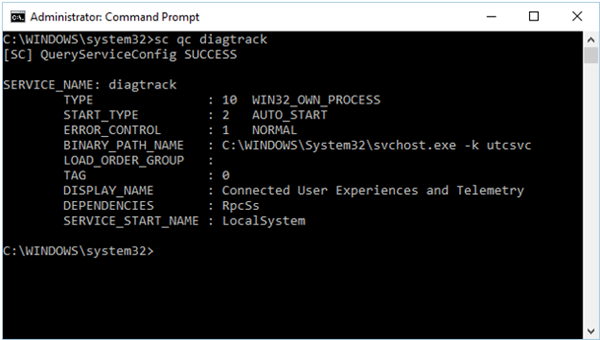

# Troubleshoot Windows Defender Advanced Threat Protection onboarding issues

**Applies to:**

- Windows 10, version 1607.
- Windows Defender Advanced Threat Protection (Windows Defender ATP)

You might need to troubleshoot the Windows Defender ATP onboarding process if you encounter issues.
This page provides detailed steps to troubleshoot onboarding issues that might occur when deploying with one of the deployment tools and common errors that might occur on the endpoints.

If you have completed the endpoint onboarding process and don't see endpoints in the [Machines view](investigate-machines-windows-defender-advanced-threat-protection.md) after an hour, it might indicate an endpoint onboarding or connectivity problem.

## Troubleshoot onboarding when deploying with Group Policy
Deployment with Group Policy is done by running the onboarding script on the endpoints.  The Group Policy console does not indicate if the deployment has succeeded or not.

If you have completed the endpoint onboarding process and don't see endpoints in the [Machines view](investigate-machines-windows-defender-advanced-threat-protection.md) after an hour, you can check the output of the script on the endpoints. For more information, see [Troubleshoot onboarding when deploying with a script on the endpoint](#troubleshoot-onboarding-when-deploying-with-a-script-on-the-endpoint).

If the script completes successfully, see [Troubleshoot onboarding issues on the endpoint](#troubleshoot-onboarding-issues-on-the-endpoint) for additional errors that might occur.

## Troubleshoot onboarding issues when deploying with System Center Configuration Manager
When onboarding endpoints using the following versions of System Center Configuration Manager:
- System Center 2012 Configuration Manager
- System Center 2012 R2 Configuration Manager
- System Center Configuration Manager (current branch) version 1511
- System Center Configuration Manager (current branch) version 1602


Deployment with the mentioned versions of System Center Configuration Manager is done by running the onboarding script on the endpoints. You can track the deployment in the Configuration Manager Console.

If the deployment fails, you can check the output of the script on the endpoints. For more information, see [Troubleshoot onboarding when deploying with a script on the endpoint](#troubleshoot-onboarding-when-deploying-with-a-script-on-the-endpoint).

If the onboarding completed successfully but the endpoints are not showing up in the Machines view after an hour, see see [Troubleshoot onboarding issues on the endpoint](#troubleshoot-onboarding-issues-on-the-endpoint) for additional errors that might occur.

## Troubleshoot onboarding when deploying with a script on the endpoint

**Check the result of the script on the endpoint**:
1. Click **Start**, type **Event Viewer**, and press **Enter**.

2. Go to **Windows Logs** > **Application**.

3. Look for an event from **WDATPOnboarding** event source.

If the script fails and the event is an error, you can check the event ID in the following table to help you troubleshoot the issue.
> [!NOTE]
> The following event IDs are specific to the onboarding script only.

Event ID | Error Type | Resolution steps
:---|:---|:---
5 | Offboarding data was found but couldn't be deleted | Check the permissions on the registry, specifically ```HKLM\SOFTWARE\Policies\Microsoft\Windows Advanced Threat Protection```
10 | Onboarding data couldn't be written to registry |  Check the permissions on the registry, specifically ```HKLM\SOFTWARE\Policies\Microsoft\Windows Advanced Threat```. Verify that the script was ran as an administrator.
15 |  Failed to start SENSE service |Check the service status (```sc query sense``` command). Make sure it's not in an intermediate state (*'Pending_Stopped'*, *'Pending_Running'*) and try to run the script again (with administrator rights).
15 | Failed to start SENSE service | If the message of the error is: System error 577 has occurred. You need to enable the Windows Defender ELAM driver, see [Ensure the Windows Defender ELAM driver is enabled](#ensure-the-windows-defender-elam-driver-is-enabled) for instructions.
30 |  The script failed to wait for the service to start running | The service could have taken more time to start or has encountered errors while trying to start. For more information on events and errors related to SENSE, see [Review events and errors on endpoints with Event viewer](event-error-codes-windows-defender-advanced-threat-protection.md)
35 |  The script failed to find needed onboarding status registry value | When the SENSE service starts for the first time, it writes onboarding status to the registry location ```HKLM\SOFTWARE\Microsoft\Windows Advanced Threat Protection\Status```. The script failed to find it after several seconds. You can manually test it and check if it's there. For more information on events and errors related to SENSE, see [Review events and errors on endpoints with Event viewer](event-error-codes-windows-defender-advanced-threat-protection.md)
40 | SENSE service onboarding status is not set to **1** | The SENSE service has failed to onboard properly. For more information on events and errors related to SENSE, see [Review events and errors on endpoints with Event viewer](event-error-codes-windows-defender-advanced-threat-protection.md)
65 | Insufficient privileges| Run the script again with administrator privileges.

## Troubleshoot onboarding issues using Microsoft Intune
You can use Microsoft Intune to check error codes and attempt to troubleshoot the cause of the issue.

Use the following tables to understand the possible causes of issues while onboarding:

- Microsoft Intune error codes and OMA-URIs table
- Known issues with non-compliance table
- Mobile Device Management (MDM) event logs table

If none of the event logs and troubleshooting steps work, download the Local script from the **Endpoint Management** section of the portal, and run it in an elevated command prompt.  

**Microsoft Intune error codes and OMA-URIs**:

Error Code Hex | Error Code Dec | Error Description | OMA-URI | Possible cause and troubleshooting steps
:---|:---|:---|:---|:---
0x87D1FDE8 | -2016281112 | Remediation failed | Onboarding <br> Offboarding |  **Possible cause:** Onboarding or offboarding failed on a wrong blob: wrong signature or missing PreviousOrgIds fields. <br><br> **Troubleshooting steps:** <br> Check the event IDs in the [View agent onboarding errors in the endpoint event log](#view-agent-onboarding-errors-in-the-endpoint-event-log) section. <br><br> Check the MDM event logs in the following table or follow the instructions in [Diagnose MDM failures in Windows 10](https://msdn.microsoft.com/en-us/library/windows/hardware/mt632120%28v=vs.85%29.aspx).
 | | | Onboarding <br> Offboarding <br> SampleSharing | **Possible cause:** Windows Defender ATP Policy registry key does not exist or the OMA DM client doesn't have permissions to write to it. <br><br> **Troubleshooting steps:** Ensure that the following registry key exists: ```HKEY_LOCAL_MACHINE\SOFTWARE\Policies\Microsoft\Windows Advanced Threat Protection```. <br> <br> If it doesn't exist, open an elevated command and add the key.
  | | | SenseIsRunning <br> OnboardingState <br> OrgId |  **Possible cause:** An attempt to remediate by read-only property. Onboarding has failed. <br><br> **Troubleshooting steps:** Check the troubleshooting steps in [Troubleshoot Windows Defender Advanced Threat Protection onboarding issues](#troubleshoot-windows-defender-advanced-threat-protection-onboarding-issues). <br><br> Check the MDM event logs in the following table or follow the instructions in [Diagnose MDM failures in Windows 10](https://msdn.microsoft.com/en-us/library/windows/hardware/mt632120%28v=vs.85%29.aspx).
   | | | All | **Possible cause:** Attempt to deploy Windows Defender ATP on non-supported SKU/Platform, particularly Holographic SKU. <br><br> Currently is supported platforms:  Enterprise, Education, and Professional. <br> Server is not supported.
   0x87D101A9 | -2016345687 |Syncml(425): The requested command failed because the sender does not have adequate access control permissions (ACL) on the recipient.  | All |  **Possible cause:** Attempt to deploy Windows Defender ATP on non-supported SKU/Platform, particularly Holographic SKU. <br><br> Currently is supported platforms:  Enterprise, Education, and Professional.

<br>
**Known issues with non-compliance**

The following table provides information on issues with non-compliance and how you can address the issues.

Case | Symptoms | Possible cause and troubleshooting steps
:---|:---|:---
1 | Machine is compliant by SenseIsRunning OMA-URI. But is non-compliant by OrgId, Onboarding and OnboardingState OMA-URIs. | **Possible cause:** Check that user passed OOBE after Windows installation or upgrade. During OOBE onboarding couldn't be completed but SENSE is running already. <br><br> **Troubleshooting steps:** Wait for OOBE to complete.
2 |  Machine is compliant by OrgId, Onboarding, and OnboardingState OMA-URIs, but is non-compliant by SenseIsRunning OMA-URI. |  **Possible cause:** Sense service's startup type is set as "Delayed Start". Sometimes this causes the Microsoft Intune server to report the machine as non-compliant by SenseIsRunning when DM session occurs on system start. <br><br> **Troubleshooting steps:** The issue should automatically be fixed within 24 hours.
3 | Machine is non-compliant | **Troubleshooting steps:** Ensure that Onboarding and Offboarding policies are not deployed on the same machine at same time.

<br>
**Mobile Device Management (MDM) event logs**

View the MDM event logs to troubleshoot issues that might arise during onboarding:

Log name: Microsoft\Windows\DeviceManagement-EnterpriseDiagnostics-Provider

Channel name: Admin

ID | Severity | Event description | Troubleshooting steps
:---|:---|:---|:---
1819 | Error | Windows Defender Advanced Threat Protection CSP: Failed to Set Node's Value. NodeId: (%1), TokenName: (%2), Result: (%3). | Windows Defender ELAM driver needs to be enabled see, [Ensure the Windows Defender ELAM driver is enabled](#ensure-the-windows-defender-elam-driver-is-enabled) for instructions.

## Troubleshoot onboarding issues on the endpoint
If the deployment tools used does not indicate an error in the onboarding process, but endpoints are still not appearing in the machines view an hour, go through the following verification topics to check if an error occurred with the Windows Defender ATP agent:
- [View agent onboarding errors in the endpoint event log](#view-agent-onboarding-errors-in-the-endpoint-event-log)
- [Ensure the Windows Defender ELAM driver is enabled](#ensure-the-windows-defender ELAM driver is enabled)
- [Ensure the Windows Defender ATP service is enabled](#ensure-the-windows-defender-elam-driver-is-enabled)
- [Ensure the telemetry and diagnostics service is enabled](#Ensure-that-telemetry-and-diagnostics-service-is-enabled)
- [Ensure the endpoint has an Internet connection](#Ensure-that-the-Windows-Defender-ATP-endpoint-has-internet-connection)

### View agent onboarding errors in the endpoint event log

1. Click **Start**, type **Event Viewer**, and press **Enter**.

2. In the **Event Viewer (Local)** pane, expand **Applications and Services Logs** > **Microsoft** > **Windows** > **SENSE**.

  > [!NOTE]
	> SENSE is the internal name used to refer to the behavioral sensor that powers Windows Defender ATP.

3. Select **Operational** to load the log.

4. In the **Action** pane, click **Filter Current log**.

5. On the **Filter** tab, under **Event level:** select **Critical**, **Warning**, and **Error**, and click **OK**.

  

6. Events which can indicate issues will appear in the **Operational** pane. You can attempt to troubleshoot them based on the solutions in the following table:

Event ID | Message | Resolution steps
:---|:---|:---
5 | Windows Defender Advanced Threat Protection service failed to connect to the server at _variable_ | [Ensure the endpoint has Internet access](#ensure-the-endpoint-has-an-internet-connection).
6 | Windows Defender Advanced Threat Protection service is not onboarded and no onboarding parameters were found. Failure code: _variable_ | [Run the onboarding script again](configure-endpoints-windows-defender-advanced-threat-protection.md#manual).
7 |  Windows Defender Advanced Threat Protection service failed to read the onboarding parameters. Failure code: _variable_ | [Ensure the endpoint has Internet access](#ensure-the-endpoint-has-an-internet-connection), then run the entire onboarding process again.
15 | Windows Defender Advanced Threat Protection cannot start command channel with URL: _variable_ | [Ensure the endpoint has Internet access](#ensure-the-endpoint-has-an-internet-connection).
25 | Windows Defender Advanced Threat Protection service failed to reset health status in the registry. Failure code: _variable_ | Contact support.

There are additional components on the endpoint that the Windows Defender ATP agent depends on to function properly. If there are no onboarding related errors in the Windows Defender ATP agent event log, proceed with the following steps to ensure that the additional components are configured correctly.

### Ensure the telemetry and diagnostics service is enabled
If the endpoints aren't reporting correctly, you might need to check that the Windows 10 telemetry and diagnostics service is set to automatically start and is running on the endpoint. The service might have been disabled by other programs or user configuration changes.

First, you should check that the service is set to start automatically when Windows starts, then you should check that the service is currently running (and start it if it isn't).

### Ensure the service is set to start

**Use the command line to check the Windows 10 telemetry and diagnostics service startup type**:

1.  Open an elevated command-line prompt on the endpoint:

  a.  Click **Start**, type **cmd**, and press **Enter**.

  b.  Right-click **Command prompt** and select **Run as administrator**.

2.  Enter the following command, and press **Enter**:

    ```text
    sc qc diagtrack
    ```

If the service is enabled, then the result should look like the following screenshot:



If the `START_TYPE` is not set to `AUTO_START`, then you'll need to set the service to automatically start.

**Use the command line to set the Windows 10 telemetry and diagnostics service to automatically start:**

1.  Open an elevated command-line prompt on the endpoint:

  a.  Click **Start**, type **cmd**, and press **Enter**.

  b.  Right-click **Command prompt** and select **Run as administrator**.

2.  Enter the following command, and press **Enter**:

    ```text
    sc config diagtrack start=auto
    ```

3.  A success message is displayed. Verify the change by entering the following command, and press **Enter**:

    ```text
    sc qc diagtrack
    ```

4. Start the service.

  a. In the command prompt, type the following command and press **Enter**:

  ```
  sc start diagtrack
  ```

### Ensure the endpoint has an Internet connection

The Window Defender ATP sensor requires Microsoft Windows HTTP (WinHTTP) to report telemetry and communicate with the Windows Defender ATP service.

WinHTTP is independent of the Internet browsing proxy settings and other user context applications and must be able to detect the proxy servers that are available in your particular environment.

To ensure that sensor has service connectivity, follow the steps described in the [Verify client connectivity to Windows Defender ATP service URLs](configure-proxy-internet-windows-defender-advanced-threat-protection.md#verify-client-connectivity-to-windows-defender-atp-service-urls) topic.

If the verification fails and your environment is using a proxy to connect to the Internet, then follow the steps described in [Configure proxy and Internet connectivity settings](configure-proxy-internet-windows-defender-advanced-threat-protection.md) topic.

## Ensure the Windows Defender ELAM driver is enabled
If your endpoints are running a third-party antimalware client, the Windows Defender ATP agent needs the Windows Defender Early Launch Antimalware (ELAM) driver to be enabled.

**Check the ELAM driver status:**
1.	Open a command-line prompt on the endpoint:

  a. Click **Start**, type **cmd**, and select **Command prompt**.

2.	Enter the following command, and press Enter:
```
sc qc WdBoot
```
If the ELAM driver is enabled, the output will be:

```
[SC] QueryServiceConfig SUCCESS

SERVICE_NAME: WdBoot
        TYPE               : 1  KERNEL_DRIVER
        START_TYPE         : 0   BOOT_START
        ERROR_CONTROL      : 1   NORMAL
        BINARY_PATH_NAME   : \SystemRoot\system32\drivers\WdBoot.sys
        LOAD_ORDER_GROUP   : Early-Launch
        TAG                : 0
        DISPLAY_NAME       : Windows Defender Boot Driver
        DEPENDENCIES       :
        SERVICE_START_NAME :
```
If the ELAM driver is disabled the output will be:
```
[SC] QueryServiceConfig SUCCESS

SERVICE_NAME: WdBoot
        TYPE               : 1  KERNEL_DRIVER
        START_TYPE         : 0   DEMAND_START
        ERROR_CONTROL      : 1   NORMAL
        BINARY_PATH_NAME   : \SystemRoot\system32\drivers\WdBoot.sys
        LOAD_ORDER_GROUP   : _Early-Launch
        TAG                : 0
        DISPLAY_NAME       : Windows Defender Boot Driver
        DEPENDENCIES       :
        SERVICE_START_NAME :
```
### Enable the ELAM driver

1. Open an elevated PowerShell console on the endpoint:

  a. Click **Start**, type **powershell**.

  b. Right-click **Command prompt** and select **Run as administrator**.

2. Run the following PowerShell cmdlet:
```
'Set-ExecutionPolicy -ExecutionPolicy Bypass’
```
3. Run the following PowerShell script:

```
Add-Type @'
using System;
using System.IO;
using System.Runtime.InteropServices;
using Microsoft.Win32.SafeHandles;
using System.ComponentModel;

public static class Elam{
    [DllImport("Kernel32", CharSet=CharSet.Auto, SetLastError=true)]
    public static extern bool InstallELAMCertificateInfo(SafeFileHandle handle);

    public static void InstallWdBoot(string path)
    {
        Console.Out.WriteLine("About to call create file on {0}", path);
        var stream = File.Open(path, FileMode.Open, FileAccess.Read, FileShare.Read);
        var handle = stream.SafeFileHandle;

        Console.Out.WriteLine("About to call InstallELAMCertificateInfo on handle {0}", handle.DangerousGetHandle());
        if (!InstallELAMCertificateInfo(handle))
        {
            Console.Out.WriteLine("Call failed.");
            throw new Win32Exception(Marshal.GetLastWin32Error());
        }
        Console.Out.WriteLine("Call successful.");
    }
}
'@

$driverPath = $env:SystemRoot + "\System32\Drivers\WdBoot.sys"
[Elam]::InstallWdBoot($driverPath)
```


## Related topics
- [Configure Windows Defender ATP endpoints](configure-endpoints-windows-defender-advanced-threat-protection.md)
- [Configure endpoint proxy and Internet connectivity settings](configure-proxy-internet-windows-defender-advanced-threat-protection.md)
