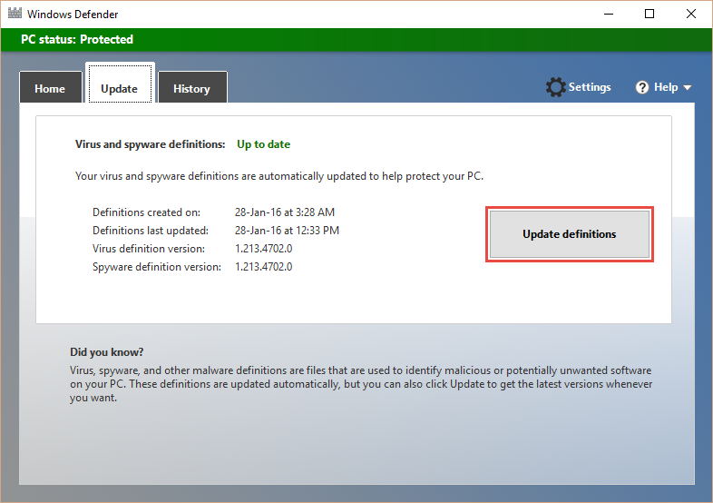

# Troubleshoot Windows Defender in Windows 10

**Applies to**

-   Windows 10

IT professionals can review information about *event IDs* in Windows Defender for Windows 10 and see any relevant action they can take.

## Windows Defender client *event IDs*

This section provides the following information about Windows Defender client events:

-   The text of the message as it appears in the event
-   The name of the source of the message
-   The symbolic name that identifies each message in the programming source code
-   Additional information about the message

Use the information in this table to help troubleshoot Windows Defender client events; these are located in the **Windows Event Viewer**, under **Windows Logs**.

**To view a Windows Defender client event**

1.  Open **Event Viewer**.
2.  In the console tree, expand **Applications and Services Logs**, then **Microsoft**, then **Windows**, then **Windows Defender**.
3.  Double-click on **Operational**.
4.  In the details pane, view the list of individual events to find your event.
5.  Click the event to see specific details about an event in the lower pane, under the **General** and **Details** tabs.

You can find a complete list of the Microsoft antimalware *event IDs*, the symbol, and the description of each ID in [Windows Server Antimalware Events TechNet](https://technet.microsoft.com/library/dn913615.aspx).

<table>
<tr>
<th rowspan="3">Event ID: 1000</th>
<td>

Symbolic name:

</td>
<td>

<b>MALWAREPROTECTION_SCAN_STARTED</b>

</td>
</tr>
<tr>
<td>

Message:

</td>
<td>

<b>An antimalware scan started.
</b>

</td>
</tr>
<tr>
<td>

Description:

</td>
<td>

<dl>
<dt>Scan ID:</dt>
<dt>Scan Type: </dt>
<dt>Scan Parameters:</dt>
<dt>Scan Resources:</dt>
<dt>User:</dt>
</dl>

</td>
</tr>
<tr>
<th rowspan="3">Event ID: 1001</th>
<td>

Symbolic name:

</td>
<td>

<b>MALWAREPROTECTION_SCAN_COMPLETED</b>

</td>
</tr>
<tr>
<td>

Message:

</td>
<td>

<b>An antimalware scan finished.</b>

</td>
</tr>
<tr>
<td>

Description:

</td>
<td>

<dl>
<dt>Scan ID:</dt>
<dt>Scan Type:</dt>
<dt>Scan Parameters:</dt>
<dt>User:</dt>
<dt>Scan Time:</dt>
</dl>

</td>
</tr>
<tr>
<th rowspan="3">Event ID: 1002</th>
<td>

Symbolic name:

</td>
<td>

<b>MALWAREPROTECTION_SCAN_CANCELLED
</b>

</td>
</tr>
<tr>
<td>

Message:

</td>
<td>

<b>An antimalware scan was stopped before it finished.
</b>

</td>
</tr>
<tr>
<td>

Description:

</td>
<td>

<dl>
<dt>Scan ID:</dt>
<dt>Scan Type:</dt>
<dt>Scan Parameters:</dt>
<dt>User:</dt>
<dt>Scan Time:</dt>
</dl>

</td>
</tr>
<tr>
<th rowspan="3">Event ID: 1003</th>
<td>

Symbolic name:

</td>
<td>

<b>MALWAREPROTECTION_SCAN_PAUSED
</b>

</td>
</tr>
<tr>
<td>

Message:

</td>
<td>

<b>An antimalware scan was paused.
</b>

</td>
</tr>
<tr>
<td>

Description:

</td>
<td>

<dl>
<dt>Scan ID:</dt>
<dt>Scan Type:</dt>
<dt>Scan Parameters:</dt>
<dt>User:</dt>
</dl>

</td>
</tr>
<tr>
<th rowspan="3">Event ID: 1004</th>
<td>

Symbolic name:

</td>
<td>

<b>MALWAREPROTECTION_SCAN_RESUMED
</b>

</td>
</tr>
<tr>
<td>

Message:

</td>
<td>

<b>An antimalware scan was resumed.
</b>

</td>
</tr>
<tr>
<td>

Description:

</td>
<td>

<dl>
<dt>Scan ID:</dt>
<dt>Scan Type:</dt>
<dt>Scan Parameters:</dt>
<dt>User:</dt>
</dl>

</td>
</tr>
<tr>
<th rowspan="4">Event ID: 1005</th>
<td>

Symbolic name:

</td>
<td>

<b>MALWAREPROTECTION_SCAN_FAILED
</b>

</td>
</tr>
<tr>
<td>

Message:

</td>
<td>

<b>An antimalware scan failed. 
</b>

</td>
</tr>
<tr>
<td>

Description:

</td>
<td>

<dl>
<dt>Scan ID: </dt>
<dt>Scan Type: </dt>
<dt>Scan Parameters:</dt>
<dt>User: </dt>
<dt>Error Code:</dt>
<dt>Error Description:</dt>
</dl>

</td>
</tr>
<tr>
<td>

User action:

</td>
<td>

The Windows Defender client encountered an error, and the current scan has stopped. The scan might fail due to a client-side issue. This event record includes the scan ID, type of scan (antivirus, antispyware, antimalware), scan parameters, the user that started the scan, the error code, and a description of the error.

To troubleshoot this event:
<ol>
<li>Run the scan again.</li>
<li>If it fails in the same way, go to the <a href="http://go.microsoft.com/fwlink/?LinkId=215163">Microsoft Support site</a>, enter the error number in the <b>Search</b> box to look for the error code.</li>
<li>Contact <a href="http://go.microsoft.com/fwlink/?LinkId=215491">Microsoft Technical Support</a>.
</li>
</ol>

</td>
</tr>
<tr>
<th rowspan="3">Event ID: 1006</th>
<td>

Symbolic name:

</td>
<td>

<b>MALWAREPROTECTION_MALWARE_DETECTED
</b>

</td>
</tr>
<tr>
<td>

Message:

</td>
<td>

<b>The antimalware engine found malware or other potentially unwanted software.
</b>

</td>
</tr>
<tr>
<td>

Description:

</td>
<td>

For more information please see the following:

<dl>
<dt>Name: </dt>
<dt>ID: </dt>
<dt>Severity: </dt>
<dt>Category</dt>
<dt>Path:</dt>
<dt>Detection Origin:</dt>
<dt>Detection Type:</dt>
<dt>Detection Source:</dt>
<dt>Status:</dt>
<dt>User: </dt>
<dt>Process Name:</dt>
<dt>Signature Version:</dt>
<dt>Engine Version:</dt>
</dl>

</td>
</tr>
<tr>
<th rowspan="3">Event ID: 1007</th>
<td>

Symbolic name:

</td>
<td>

<b>MALWAREPROTECTION_MALWARE_ACTION_TAKEN
</b>

</td>
</tr>
<tr>
<td>

Message:

</td>
<td>

<b>The antimalware platform performed an action to protect your system from malware or other potentially unwanted software.
</b>

</td>
</tr>
<tr>
<td>

Description:

</td>
<td>

Windows Defender has taken action to protect this machine from malware or other potentially unwanted software. For more information please see the following:

<dl>
<dt>User:</dt>
<dt>Name: </dt>
<dt>ID: </dt>
<dt>Severity: </dt>
<dt>Category:</dt>
<dt>Action:</dt>
<dt>Status:</dt>
<dt>Signature Version:</dt>
<dt>Engine Version:</dt>
</dl>

</td>
</tr>
<tr>
<th rowspan="3">Event ID: 1008</th>
<td>

Symbolic name:

</td>
<td>

<b>MALWAREPROTECTION_MALWARE_ACTION_FAILED</b>

</td>
</tr>
<tr>
<td>

Message:

</td>
<td>

<b>The antimalware platform attempted to perform an action to protect your system from malware or other potentially unwanted software, but the action failed.</b>

</td>
</tr>
<tr>
<td>

Description:

</td>
<td>

Windows Defender has encountered an error when taking action on malware or other potentially unwanted software. For more information please see the following:

<dl>
<dt>User:</dt>
<dt>Name: </dt>
<dt>ID: </dt>
<dt>Severity: </dt>
<dt>Category:</dt>
<dt>Path: </dt>
<dt>Action:</dt>
<dt>Error Code:</dt>
<dt>Error Description: </dt>
<dt>Status:</dt>
<dt>Signature Version:</dt>
<dt>Engine Version:</dt>
</dl>

</td>
</tr>
<tr>
<th rowspan="3">Event ID: 1009</th>
<td>

Symbolic name:

</td>
<td>

<b>MALWAREPROTECTION_QUARANTINE_RESTORE
</b>

</td>
</tr>
<tr>
<td>

Message:

</td>
<td>

<b>The antimalware platform restored an item from quarantine.
</b>

</td>
</tr>
<tr>
<td>

Description:

</td>
<td>

Windows Defender has restored an item from quarantine. For more information please see the following:

<dl>
<dt>Name: </dt>
<dt>ID: </dt>
<dt>Severity: </dt>
<dt>Category:</dt>
<dt>Path: </dt>
<dt>User:</dt>
<dt>Signature Version:</dt>
<dt>Engine Version:</dt>
</dl>

</td>
</tr>
<tr>
<th rowspan="3">Event ID: 1010</th>
<td>

Symbolic name:

</td>
<td>

<b>MALWAREPROTECTION_QUARANTINE_RESTORE_FAILED
</b>

</td>
</tr>
<tr>
<td>

Message:

</td>
<td>

<b>The antimalware platform could not restore an item from quarantine.
</b>

</td>
</tr>
<tr>
<td>

Description:

</td>
<td>

Windows Defender has encountered an error trying to restore an item from quarantine. For more information please see the following:

<dl>
<dt>Name: </dt>
<dt>ID: </dt>
<dt>Severity: </dt>
<dt>Category:</dt>
<dt>Path: </dt>
<dt>User:</dt>
<dt>Error Code:</dt>
<dt>Error Description:</dt>
<dt>Signature Version:</dt>
<dt>Engine Version:</dt>
</dl>

</td>
</tr>
<tr>
<th rowspan="3">Event ID: 1011</th>
<td>

Symbolic name:

</td>
<td>

<b>MALWAREPROTECTION_QUARANTINE_DELETE</b>

</td>
</tr>
<tr>
<td>

Message:

</td>
<td>

<b>The antimalware platform deleted an item from quarantine.
</b>

</td>
</tr>
<tr>
<td>

Description:

</td>
<td>

Windows Defender has deleted an item from quarantine.  
For more information please see the following:

<dl>
<dt>Name: </dt>
<dt>ID: </dt>
<dt>Severity: </dt>
<dt>Category:</dt>
<dt>Path: </dt>
<dt>User:</dt>
<dt>Signature Version:</dt>
<dt>Engine Version:</dt>
</dl>

</td>
</tr>
<tr>
<th rowspan="3">Event ID: 1012</th>
<td>

Symbolic name:

</td>
<td>

<b>MALWAREPROTECTION_QUARANTINE_DELETE_FAILED
</b>

</td>
</tr>
<tr>
<td>

Message:

</td>
<td>

<b>The antimalware platform could not delete an item from quarantine.</b>

</td>
</tr>
<tr>
<td>

Description:

</td>
<td>

Windows Defender has encountered an error trying to delete an item from quarantine.  
For more information please see the following:

<dl>
<dt>Name: </dt>
<dt>ID: </dt>
<dt>Severity: </dt>
<dt>Category:</dt>
<dt>Path: </dt>
<dt>User:</dt>
<dt>Error Code:</dt>
<dt>Error Description:</dt>
<dt>Signature Version:</dt>
<dt>Engine Version:</dt>
</dl>

</td>
</tr>
<tr>
<th rowspan="3">Event ID: 1013</th>
<td>

Symbolic name:

</td>
<td>

<b>MALWAREPROTECTION_MALWARE_HISTORY_DELETE
</b>

</td>
</tr>
<tr>
<td>

Message:

</td>
<td>

<b>The antimalware platform deleted history of malware and other potentially unwanted software.</b>

</td>
</tr>
<tr>
<td>

Description:

</td>
<td>

Windows Defender has removed history of malware and other potentially unwanted software.

<dl>
<dt>Time: </dt>
<dt>User:</dt>
</dl>

</td>
</tr>
<tr>
<th rowspan="3">Event ID: 1014</th>
<td>

Symbolic name:

</td>
<td>

<b>MALWAREPROTECTION_MALWARE_HISTORY_DELETE_FAILED
</b>

</td>
</tr>
<tr>
<td>

Message:

</td>
<td>

The antimalware platform could not delete history of malware and other potentially unwanted software.

</td>
</tr>
<tr>
<td>

Description:

</td>
<td>

Windows Defender has encountered an error trying to remove history of malware and other potentially unwanted software.

<dl>
<dt>Time: </dt>
<dt>User:</dt>
<dt>Error Code:</dt>
<dt>Error Description:</dt>
</dl>

</td>
</tr>
<tr>
<th rowspan="3">Event ID: 1015</th>
<td>

Symbolic name:

</td>
<td>

<b>MALWAREPROTECTION_BEHAVIOR_DETECTED
</b>

</td>
</tr>
<tr>
<td>

Message:

</td>
<td>

<b>The antimalware platform detected suspicious behavior.</b>

</td>
</tr>
<tr>
<td>

Description:

</td>
<td>

Windows Defender has detected a suspicious behavior.  
For more information please see the following:

<dl>
<dt>Name: </dt>
<dt>ID: </dt>
<dt>Severity: </dt>
<dt>Category:</dt>
<dt>Path: </dt>
<dt>Detection Origin:</dt>
<dt>Detection Type:</dt>
<dt>Detection Source:</dt>
<dt>Status:</dt>
<dt>User:</dt>
<dt>Process Name:</dt>
<dt>Signature ID:</dt>
<dt>Signature Version:</dt>
<dt>Engine Version:</dt>
<dt>Fidelity Label:</dt>
<dt>Target File Name:</dt>
</dl>

</td>
</tr>
<tr>
<th rowspan="4">Event ID: 1116</th>
<td>

Symbolic name:

</td>
<td>

<b>MALWAREPROTECTION_STATE_MALWARE_DETECTED</b>

</td>
</tr>
<tr>
<td>

Message:

</td>
<td>

<b>The antimalware platform detected malware or other potentially unwanted software.
</b>

</td>
</tr>
<tr>
<td>

Description:

</td>
<td>

Windows Defender has detected malware or other potentially unwanted software.  
For more information please see the following:

<dl>
<dt>Name: </dt>
<dt>ID: </dt>
<dt>Severity: </dt>
<dt>Category:</dt>
<dt>Path: </dt>
<dt>Detection Origin:</dt>
<dt>Detection Type:</dt>
<dt>Detection Source:</dt>
<dt>User:</dt>
<dt>Process Name:</dt>
<dt>Signature Version:</dt>
<dt>Engine Version:</dt>
</dl>

</td>
</tr>
<tr>
<td>

User action:

</td>
<td>

No action is required. Windows Defender can suspend and take routine action on this threat. If you want to remove the threat manually, in the Windows Defender interface, click <b>Clean Computer</b>.

</td>
</tr>
<tr>
<th rowspan="4">Event ID: 1117</th>
<td>

Symbolic name:

</td>
<td>

<b>MALWAREPROTECTION_STATE_MALWARE_ACTION_TAKEN
</b>

</td>
</tr>
<tr>
<td>

Message:

</td>
<td>

<b>The antimalware platform performed an action to protect your system from malware or other potentially unwanted software.
</b>

</td>
</tr>
<tr>
<td>

Description:

</td>
<td>

Windows Defender has taken action to protect this machine from malware or other potentially unwanted software.  
For more information please see the following:

<dl>
<dt>Name: </dt>
<dt>ID:</dt>
<dt>Severity: </dt>
<dt>Category:</dt>
<dt>Path: </dt>
<dt>Detection Origin:</dt>
<dt>Detection Type:</dt>
<dt>Detection Source:</dt>
<dt>User:</dt>
<dt>Process Name:</dt>
<dt>Action:</dt>
<dt>Action Status:</dt>
<dt>Error Code:</dt>
<dt>Error Description:</dt>
<dt>Signature Version:</dt>
<dt>Engine Version:</dt>
</dl>

</td>
</tr>
<tr>
<td>

User action:

</td>
<td>

No action is necessary. Windows Defender removed or quarantined a threat. 

</td>
</tr>
<tr>
<th rowspan="4">Event ID: 1118</th>
<td>

Symbolic name:

</td>
<td>

<b>MALWAREPROTECTION_STATE_MALWARE_ACTION_FAILED</b>

</td>
</tr>
<tr>
<td>

Message:

</td>
<td>

<b>The antimalware platform attempted to perform an action to protect your system from malware or other potentially unwanted software, but the action failed.
</b>

</td>
</tr>
<tr>
<td>

Description:

</td>
<td>

Windows Defender has encountered a non-critical error when taking action on malware or other potentially unwanted software.  
For more information please see the following:

<dl>
<dt>Name: </dt>
<dt>ID: </dt>
<dt>Severity: </dt>
<dt>Category:</dt>
<dt>Path: </dt>
<dt>Detection Origin:</dt>
<dt>Detection Type:</dt>
<dt>Detection Source:</dt>
<dt>User:</dt>
<dt>Process Name:</dt>
<dt>Action:</dt>
<dt>Action Status:</dt>
<dt>Error Code:</dt>
<dt>Error Description:</dt>
<dt>Signature Version:</dt>
<dt>Engine Version:</dt>
</dl>

</td>
</tr>
<tr>
<td>

User action:

</td>
<td>

No action is necessary. Windows Defender failed to complete a task related to the malware remediation. This is not a critical failure.

</td>
</tr>
<tr>
<th rowspan="4">Event ID: 1119</th>
<td>

Symbolic name:

</td>
<td>

<b>MALWAREPROTECTION_STATE_MALWARE_ACTION_CRITICALLY_FAILED
</b>

</td>
</tr>
<tr>
<td>

Message:

</td>
<td>

<b>The antimalware platform encountered a critical error when trying to take action on malware or other potentially unwanted software. There are more details in the event message.</b>

</td>
</tr>
<tr>
<td>

Description:

</td>
<td>

Windows Defender has encountered a critical error when taking action on malware or other potentially unwanted software.  
For more information please see the following:

<dl>
<dt>Name: </dt>
<dt>ID: </dt>
<dt>Severity: </dt>
<dt>Category:</dt>
<dt>Path: </dt>
<dt>Detection Origin:</dt>
<dt>Detection Type:</dt>
<dt>Detection Source:</dt>
<dt>User:</dt>
<dt>Process Name:</dt>
<dt>Action:</dt>
<dt>Action Status:</dt>
<dt>Error Code:</dt>
<dt>Error Description:</dt>
<dt>Signature Version:</dt>
<dt>Engine Version:</dt>
</dl>

</td>
</tr>
<tr>
<td>

User action:

</td>
<td>

The Windows Defender client encountered this error due to critical issues. The endpoint might not be protected. Review the error description then follow the relevant <b>User action</b> steps below.

<table>
<tr>
<th>Action</th>
<th>User action</th>
</tr>
<tr>
<td>

<b>Remove</b>

</td>
<td>

Update the definitions then verify that the removal was successful.

</td>
</tr>
<tr>
<td>

<b>Clean</b>

</td>
<td>

Update the definitions then verify that the remediation was successful.

</td>
</tr>
<tr>
<td>

<b>Quarantine</b>

</td>
<td>

Update the definitions and verify that the user has permission to access the necessary resources.

</td>
</tr>
<tr>
<td>

<b>Allow</b>

</td>
<td>

Verify that the user has permission to access the necessary resources.

</td>
</tr>
</table>

 

If this event persists:<ol>
<li>Run the scan again.</li>
<li>If it fails in the same way, go to the <a href="http://go.microsoft.com/fwlink/?LinkId=215163">Microsoft Support site</a>, enter the error number in the <b>Search</b> box to look for the error code.</li>
<li>Contact <a href="http://go.microsoft.com/fwlink/?LinkId=215491">Microsoft Technical Support</a>.
</li>
</ol>

</td>
</tr>
<tr>
<th rowspan="4">Event ID: 1120</th>
<td>

Symbolic name:

</td>
<td>

<b>MALWAREPROTECTION_THREAT_HASH</b>

</td>
</tr>
<tr>
<td>

Message:

</td>
<td>

<b>Windows Defender has deduced the hashes for a threat resource.</b>

</td>
</tr>
<tr>
<td>

Description:

</td>
<td>

Windows Defender client is up and running in a healthy state.

<dl>
<dt>Current Platform Version: </dt>
<dt>Threat Resource Path:</dt>
<dt>Hashes:</dt>
</dl>

</td>
</tr>
<tr>
<td></td>
<td>

<b>Note</b>  This event will only be logged if the following policy is set: <b>ThreatFileHashLogging 	unsigned</b>.

 

</td>
</tr>
<tr>
<th rowspan="4">Event ID: 1150</th>
<td>

Symbolic name:

</td>
<td>

<b>MALWAREPROTECTION_SERVICE_HEALTHY</b>

</td>
</tr>
<tr>
<td>

Message:

</td>
<td>

<b>If your antimalware platform reports status to a monitoring platform, this event indicates that the antimalware platform is running and in a healthy state.
</b>

</td>
</tr>
<tr>
<td>

Description:

</td>
<td>

Windows Defender client is up and running in a healthy state.

<dl>
<dt>Platform Version: </dt>
<dt>Signature Version:</dt>
<dt>Engine Version:</dt>
</dl>

</td>
</tr>
<tr>
<td>

User action:

</td>
<td>

No action is necessary. The Windows Defenderclient is in a healthy state. This event is reported on an hourly basis.

</td>
</tr>
<tr>
<th rowspan="4">Event ID: 2000</th>
<td>

Symbolic name:

</td>
<td>

<b>MALWAREPROTECTION_SIGNATURE_UPDATED
</b>

</td>
</tr>
<tr>
<td>

Message:

</td>
<td>

<b>The antimalware definitions updated successfully.
</b>

</td>
</tr>
<tr>
<td>

Description:

</td>
<td>

Windows Defender signature version has been updated.

<dl>
<dt>Current Signature Version: </dt>
<dt>Previous Signature Version:</dt>
<dt>Signature Type:</dt>
<dt>Update Type:</dt>
<dt>User:</dt>
<dt>Current Engine Version:</dt>
<dt>Previous Engine Version:</dt>
</dl>

</td>
</tr>
<tr>
<td>

User action:

</td>
<td>

No action is necessary. The Windows Defender client is in a healthy state. This event is reported when signatures are successfully updated.

</td>
</tr>
<tr>
<th rowspan="4">Event ID: 2001</th>
<td>

Symbolic name:

</td>
<td>

<b>MALWAREPROTECTION_SIGNATURE_UPDATE_FAILED</b>

</td>
</tr>
<tr>
<td>

Message:

</td>
<td>

<b>The antimalware definition update failed. 
</b>

</td>
</tr>
<tr>
<td>

Description:

</td>
<td>

Windows Defender has encountered an error trying to update signatures.

<dl>
<dt>New Signature Version: </dt>
<dt>Previous Signature Version:</dt>
<dt>Update Source:</dt>
<dt>Update Stage:</dt>
<dt>Source Path:</dt>
<dt>Signature Type:</dt>
<dt>Update Type:</dt>
<dt>User:</dt>
<dt>Current Engine Version:</dt>
<dt>Previous Engine Version:</dt>
<dt>Error Code:</dt>
<dt>Error Description:</dt>
</dl>

</td>
</tr>
<tr>
<td>

User action:

</td>
<td>

This error occurs when there is a problem updating definitions.

To troubleshoot this event:
<ol>
<li>Update the definitions. Either:<ol>
<li>Click the <b>Update definitions</b> button on the <b>Update</b> tab in Windows Defender. 
Or,

</li>
<li>Download the latest definitions from the <a href="http://go.microsoft.com/fwlink/?LinkID=200965">Microsoft Malware Protection Center</a>.

Note: The size of the definitions file downloaded from the <a href="http://go.microsoft.com/fwlink/?LinkID=200965">Microsoft Malware Protection Center</a> can exceed 60 MB and should not be used as a long-term solution for updating definitions.

</li>
</ol>
</li>
<li>Review the entries in the %Windir%\WindowsUpdate.log file for more information about this error.</li>
<li>Contact <a href="http://go.microsoft.com/fwlink/?LinkId=215491">Microsoft Technical Support</a>.
</li>
</ol>

</td>
</tr>
<tr>
<th rowspan="4">Event ID: 2002</th>
<td>

Symbolic name:

</td>
<td>

<b>MALWAREPROTECTION_ENGINE_UPDATED</b>

</td>
</tr>
<tr>
<td>

Message:

</td>
<td>

<b>The antimalware engine updated successfully.
</b>

</td>
</tr>
<tr>
<td>

Description:

</td>
<td>

Windows Defender engine version has been updated.

<dl>
<dt>Current Engine Version:</dt>
<dt>Previous Engine Version:</dt>
<dt>Engine Type:</dt>
<dt>User:</dt>
</dl>

</td>
</tr>
<tr>
<td>

User action:

</td>
<td>

No action is necessary. The Windows Defender client is in a healthy state. This event is reported when the antimalware engine is successfully updated.

</td>
</tr>
<tr>
<th rowspan="4">Event ID: 2003</th>
<td>

Symbolic name:

</td>
<td>

<b>MALWAREPROTECTION_ENGINE_UPDATE_FAILED</b>

</td>
</tr>
<tr>
<td>

Message:

</td>
<td>

<b>The antimalware engine update failed.
</b>

</td>
</tr>
<tr>
<td>

Description:

</td>
<td>

Windows Defender has encountered an error trying to update the engine.

<dl>
<dt>New Engine Version:</dt>
<dt>Previous Engine Version:</dt>
<dt>Engine Type:</dt>
<dt>User:</dt>
<dt>Error Code:</dt>
<dt>Error Description:</dt>
</dl>

</td>
</tr>
<tr>
<td>

User action:

</td>
<td>

The Windows Defender client update failed. This event occurs when the client fails to update itself. This event is usually due to an interruption in network connectivity during an update.

To troubleshoot this event:
<ol>
<li>Update the definitions. Either:<ol>
<li>Click the <b>Update definitions</b> button on the <b>Update</b> tab in Windows Defender. 
Or,

</li>
<li>Download the latest definitions from the <a href="http://go.microsoft.com/fwlink/?LinkID=200965">Microsoft Malware Protection Center</a>.

Note: The size of the definitions file downloaded from the <a href="http://go.microsoft.com/fwlink/?LinkID=200965">Microsoft Malware Protection Center</a> can exceed 60 MB and should not be used as a long-term solution for updating definitions.

</li>
</ol>
</li>
<li>Contact <a href="http://go.microsoft.com/fwlink/?LinkId=215491">Microsoft Technical Support</a>.
</li>
</ol>

</td>
</tr>
<tr>
<th rowspan="4">Event ID: 2004</th>
<td>

Symbolic name:

</td>
<td>

<b>MALWAREPROTECTION_SIGNATURE_REVERSION</b>

</td>
</tr>
<tr>
<td>

Message:

</td>
<td>

<b>There was a problem loading antimalware definitions. The antimalware engine will attempt to load the last-known good set of definitions.</b>

</td>
</tr>
<tr>
<td>

Description:

</td>
<td>

Windows Defender has encountered an error trying to load signatures and will attempt reverting back to a known-good set of signatures.

<dl>
<dt>Signatures Attempted:</dt>
<dt>Error Code:</dt>
<dt>Error Description:</dt>
<dt>Signature Version:</dt>
<dt>Engine Version: </dt>
</dl>

</td>
</tr>
<tr>
<td>

User action:

</td>
<td>

The Windows Defender client attempted to download and install the latest definitions file and failed. This error can occur when the client encounters an error while trying to load the definitions, or if the file is corrupt. Windows Defender will attempt to revert back to a known-good set of definitions.

To troubleshoot this event:
<ol>
<li>Restart the computer and try again.</li>
<li>Download the latest definitions from the <a href="http://go.microsoft.com/fwlink/?LinkID=200965">Microsoft Malware Protection Center</a>.

Note: The size of the definitions file downloaded from the <a href="http://go.microsoft.com/fwlink/?LinkID=200965">Microsoft Malware Protection Center</a> can exceed 60 MB and should not be used as a long-term solution for updating definitions.

</li>
<li>Contact <a href="http://go.microsoft.com/fwlink/?LinkId=215491">Microsoft Technical Support</a>.
</li>
</ol>

</td>
</tr>
<tr>
<th rowspan="3">Event ID: 2005</th>
<td>

Symbolic name:

</td>
<td>

<b>MALWAREPROTECTION_ENGINE_UPDATE_PLATFORMOUTOFDATE</b>

</td>
</tr>
<tr>
<td>

Message:

</td>
<td>

<b>The antimalware engine failed to load because the antimalware platform is out of date. The antimalware platform will load the last-known good antimalware engine and attempt to update.</b>

</td>
</tr>
<tr>
<td>

Description:

</td>
<td>

Windows Defender could not load antimalware engine because current platform version is not supported. Windows Defender will revert back to the last known-good engine and a platform update will be attempted.

<dl>
<dt>Current Platform Version:</dt>
</dl>

</td>
</tr>
<tr>
<th rowspan="3">Event ID: 2006</th>
<td>

Symbolic name:

</td>
<td>

<b>MALWAREPROTECTION_PLATFORM_UPDATE_FAILED
</b>

</td>
</tr>
<tr>
<td>

Message:

</td>
<td>

<b>The platform update failed.
</b>

</td>
</tr>
<tr>
<td>

Description:

</td>
<td>

Windows Defender has encountered an error trying to update the platform.

<dl>
<dt>Current Platform Version:</dt>
<dt>Error Code:</dt>
<dt>Error Description:</dt>
</dl>

</td>
</tr>
<tr>
<th rowspan="3">Event ID: 2007</th>
<td>

Symbolic name:

</td>
<td>

<b>MALWAREPROTECTION_PLATFORM_ALMOSTOUTOFDATE</b>

</td>
</tr>
<tr>
<td>

Message:

</td>
<td>

<b>The platform will soon be out of date. Download the latest platform to maintain up-to-date protection.</b>

</td>
</tr>
<tr>
<td>

Description:

</td>
<td>

Windows Defender will soon require a newer platform version to support future versions of the antimalware engine. Download the latest Windows Defender platform to maintain the best level of protection available.

<dl>
<dt>Current Platform Version:</dt>
</dl>

</td>
</tr>
<tr>
<th rowspan="3">Event ID: 2010</th>
<td>

Symbolic name:

</td>
<td>

<b>MALWAREPROTECTION_SIGNATURE_FASTPATH_UPDATED
</b>

</td>
</tr>
<tr>
<td>

Message:

</td>
<td>

<b>The antimalware engine used the Dynamic Signature Service to get additional definitions.
</b>

</td>
</tr>
<tr>
<td>

Description:

</td>
<td>

Windows Defender used <i>Dynamic Signature Service</i> to retrieve additional signatures to help protect your machine.

<dl>
<dt>Current Signature Version: </dt>
<dt>Signature Type:</dt>
<dt>Current Engine Version:</dt>
<dt>Dynamic Signature Type: </dt>
<dt>Persistence Path:</dt>
<dt>Dynamic Signature Version:</dt>
<dt>Dynamic Signature Compilation Timestamp:</dt>
<dt>Persistence Limit Type:</dt>
<dt>Persistence Limit:</dt>
</dl>

</td>
</tr>
<tr>
<th rowspan="4">Event ID: 2011</th>
<td>

Symbolic name:

</td>
<td>

<b>MALWAREPROTECTION_SIGNATURE_FASTPATH_DELETED
</b>

</td>
</tr>
<tr>
<td>

Message:

</td>
<td>

<b>The Dynamic Signature Service deleted the out-of-date dynamic definitions.
</b>

</td>
</tr>
<tr>
<td>

Description:

</td>
<td>

Windows Defender used <i>Dynamic Signature Service</i> to discard obsolete signatures.

<dl>
<dt>Current Signature Version: </dt>
<dt>Signature Type:</dt>
<dt>Current Engine Version:</dt>
<dt>Dynamic Signature Type: </dt>
<dt>Persistence Path:</dt>
<dt>Dynamic Signature Version:</dt>
<dt>Dynamic Signature Compilation Timestamp:</dt>
<dt>Removal Reason:</dt>
<dt>Persistence Limit Type:</dt>
<dt>Persistence Limit:</dt>
</dl>

</td>
</tr>
<tr>
<td>

User action:

</td>
<td>

No action is necessary. The Windows Defender client is in a healthy state. This event is reported when the Dynamic Signature Service successfully deletes out-of-date dynamic definitions.

</td>
</tr>
<tr>
<th rowspan="4">Event ID: 2012</th>
<td>

Symbolic name:

</td>
<td>

<b>MALWAREPROTECTION_SIGNATURE_FASTPATH_UPDATE_FAILED
</b>

</td>
</tr>
<tr>
<td>

Message:

</td>
<td>

<b>The antimalware engine encountered an error when trying to use the Dynamic Signature Service.
</b>

</td>
</tr>
<tr>
<td>

Description:

</td>
<td>

Windows Defender has encountered an error trying to use <i>Dynamic Signature Service</i>.

<dl>
<dt>Current Signature Version: </dt>
<dt>Signature Type:</dt>
<dt>Current Engine Version:</dt>
<dt>Error Code: </dt>
<dt>Error Description:</dt>
<dt>Dynamic Signature Type: </dt>
<dt>Persistence Path:</dt>
<dt>Dynamic Signature Version:</dt>
<dt>Dynamic Signature Compilation Timestamp:</dt>
<dt>Persistence Limit Type:</dt>
<dt>Persistence Limit:</dt>
</dl>

</td>
</tr>
<tr>
<td>

User action:

</td>
<td>

Check your Internet connectivity settings.

</td>
</tr>
<tr>
<th rowspan="3">Event ID: 2013</th>
<td>

Symbolic name:

</td>
<td>

<b>MALWAREPROTECTION_SIGNATURE_FASTPATH_DELETED_ALL
</b>

</td>
</tr>
<tr>
<td>

Message:

</td>
<td>

<b>The Dynamic Signature Service deleted all dynamic definitions.
</b>

</td>
</tr>
<tr>
<td>

Description:

</td>
<td>

Windows Defender discarded all <i>Dynamic Signature Service</i> signatures.

<dl>
<dt>Current Signature Version: </dt>
</dl>

</td>
</tr>
<tr>
<th rowspan="3">Event ID: 2020</th>
<td>

Symbolic name:

</td>
<td>

<b>MALWAREPROTECTION_CLOUD_CLEAN_RESTORE_FILE_DOWNLOADED
</b>

</td>
</tr>
<tr>
<td>

Message:

</td>
<td>

<b>The antimalware engine downloaded a clean file.
</b>

</td>
</tr>
<tr>
<td>

Description:

</td>
<td>

Windows Defender downloaded a clean file.

<dl>
<dt>Filename:</dt>
<dt>Current Signature Version: </dt>
<dt>Current Engine Version:</dt>
</dl>

</td>
</tr>
<tr>
<th rowspan="4">Event ID: 2021</th>
<td>

Symbolic name:

</td>
<td>

<b>MALWAREPROTECTION_CLOUD_CLEAN_RESTORE_FILE_DOWNLOAD_FAILED</b>

</td>
</tr>
<tr>
<td>

Message:

</td>
<td>

<b>The antimalware engine failed to download a clean file.
</b>

</td>
</tr>
<tr>
<td>

Description:

</td>
<td>

Windows Defender has encountered an error trying to download a clean file.

<dl>
<dt>Filename:</dt>
<dt>Current Signature Version: </dt>
<dt>Current Engine Version:</dt>
<dt>Error Code:</dt>
<dt>Error Description:</dt>
</dl>

</td>
</tr>
<tr>
<td>

User action:

</td>
<td>

Check your Internet connectivity settings.

The Windows Defender client encountered an error when using the Dynamic Signature Service to download the latest definitions to a specific threat. This error is likely caused by a network connectivity issue. 

</td>
</tr>
<tr>
<th rowspan="3">Event ID: 2030</th>
<td>

Symbolic name:

</td>
<td>

<b>MALWAREPROTECTION_OFFLINE_SCAN_INSTALLED</b>

</td>
</tr>
<tr>
<td>

Message:

</td>
<td>

<b>The antimalware engine was downloaded and is configured to run offline on the next system restart.</b>

</td>
</tr>
<tr>
<td>

Description:

</td>
<td>

Windows Defender downloaded and configured Windows Defender Offline to run on the next reboot.

</td>
</tr>
<tr>
<th rowspan="3">Event ID: 2031</th>
<td>

Symbolic name:

</td>
<td>

<b>MALWAREPROTECTION_OFFLINE_SCAN_INSTALL_FAILED
</b>

</td>
</tr>
<tr>
<td>

Message:

</td>
<td>

<b>The antimalware engine was unable to download and configure an offline scan.</b>

</td>
</tr>
<tr>
<td>

Description:

</td>
<td>

Windows Defender has encountered an error trying to download and configure Windows Defender Offline.

<dl>
<dt>Error Code:</dt>
<dt>Error Description:</dt>
</dl>

</td>
</tr>
<tr>
<th rowspan="3">Event ID: 2040</th>
<td>

Symbolic name:

</td>
<td>

<b>MALWAREPROTECTION_OS_EXPIRING
</b>

</td>
</tr>
<tr>
<td>

Message:

</td>
<td>

<b>Antimalware support for this operating system version will soon end.
</b>

</td>
</tr>
<tr>
<td>

Description:

</td>
<td>

The support for your operating system will expire shortly. Running Windows Defender on an out of support operating system is not an adequate solution to protect against threats.

</td>
</tr>
<tr>
<th rowspan="3">Event ID: 2041</th>
<td>

Symbolic name:

</td>
<td>

<b>MALWAREPROTECTION_OS_EOL
</b>

</td>
</tr>
<tr>
<td>

Message:

</td>
<td>

<b>Antimalware support for this operating system has ended. You must upgrade the operating system for continued support.
</b>

</td>
</tr>
<tr>
<td>

Description:

</td>
<td>

The support for your operating system has expired. Running Windows Defender on an out of support operating system is not an adequate solution to protect against threats.

</td>
</tr>
<tr>
<th rowspan="3">Event ID: 2042</th>
<td>

Symbolic name:

</td>
<td>

<b>MALWAREPROTECTION_PROTECTION_EOL
</b>

</td>
</tr>
<tr>
<td>

Message:

</td>
<td>

<b>The antimalware engine no longer supports this operating system, and is no longer protecting your system from malware.
</b>

</td>
</tr>
<tr>
<td>

Description:

</td>
<td>

The support for your operating system has expired. Windows Defender is no longer supported on your operating system, has stopped functioning, and is not protecting against malware threats.

</td>
</tr>
<tr>
<th rowspan="4">Event ID: 3002</th>
<td>

Symbolic name:

</td>
<td>

<b>MALWAREPROTECTION_RTP_FEATURE_FAILURE
</b>

</td>
</tr>
<tr>
<td>

Message:

</td>
<td>

<b>Real-time protection encountered an error and failed.</b>

</td>
</tr>
<tr>
<td>

Description:

</td>
<td>

Windows Defender Real-Time Protection feature has encountered an error and failed.

<dl>
<dt>Feature:</dt>
<dt>Error Code:</dt>
<dt>Error Description:</dt>
<dt>Reason: </dt>
</dl>

</td>
</tr>
<tr>
<td>

User action:

</td>
<td>

You should restart the system then run a full scan because it’s possible the system was not protected for some time.

The Windows Defender client’s real-time protection feature encountered an error because one of the services failed to start. 

If it is followed by a 3007 event ID, the failure was temporary and the antimalware client recovered from the failure. 

</td>
</tr>
<tr>
<th rowspan="4">Event ID: 3007</th>
<td>

Symbolic name:

</td>
<td>

<b>MALWAREPROTECTION_RTP_FEATURE_RECOVERED</b>

</td>
</tr>
<tr>
<td>

Message:

</td>
<td>

<b>Real-time protection recovered from a failure. We recommend running a full system scan when you see this error.
</b>

</td>
</tr>
<tr>
<td>

Description:

</td>
<td>

Windows Defender Real-time Protection has restarted a feature. It is recommended that you run a full system scan to detect any items that may have been missed while this agent was down.

<dl>
<dt>Feature:</dt>
<dt>Reason: </dt>
</dl>

</td>
</tr>
<tr>
<td>

User action:

</td>
<td>

The real-time protection feature has restarted. If this event happens again, contact <a href="http://go.microsoft.com/fwlink/?LinkId=215491">Microsoft Technical Support</a>. 

</td>
</tr>
<tr>
<th rowspan="3">Event ID: 5000</th>
<td>

Symbolic name:

</td>
<td>

<b>MALWAREPROTECTION_RTP_ENABLED
</b>

</td>
</tr>
<tr>
<td>

Message:

</td>
<td>

<b>Real-time protection is enabled.
</b>

</td>
</tr>
<tr>
<td>

Description:

</td>
<td>

Windows Defender Real-time Protection scanning for malware and other potentially unwanted software was enabled.

</td>
</tr>
<tr>
<th rowspan="3">Event ID: 5001</th>
<td>

Symbolic name:

</td>
<td>

<b>MALWAREPROTECTION_RTP_DISABLED</b>

</td>
</tr>
<tr>
<td>

Message:

</td>
<td>

<b>Real-time protection is disabled.
</b>

</td>
</tr>
<tr>
<td>

Description:

</td>
<td>

Windows Defender Real-time Protection scanning for malware and other potentially unwanted software was disabled. 

</td>
</tr>
<tr>
<th rowspan="3">Event ID: 5004</th>
<td>

Symbolic name:

</td>
<td>

<b>MALWAREPROTECTION_RTP_FEATURE_CONFIGURED
</b>

</td>
</tr>
<tr>
<td>

Message:

</td>
<td>

<b>The real-time protection configuration changed.
</b>

</td>
</tr>
<tr>
<td>

Description:

</td>
<td>

Windows Defender Real-time Protection feature configuration has changed.

<dl>
<dt>Feature:</dt>
<dt>Configuration: </dt>
</dl>

</td>
</tr>
<tr>
<th rowspan="3">Event ID: 5007</th>
<td>

Symbolic name:

</td>
<td>

<b>MALWAREPROTECTION_CONFIG_CHANGED
</b>

</td>
</tr>
<tr>
<td>

Message:

</td>
<td>

<b>The antimalware platform configuration changed.</b>

</td>
</tr>
<tr>
<td>

Description:

</td>
<td>

Windows Defender Configuration has changed. If this is an unexpected event you should review the settings as this may be the result of malware.

<dl>
<dt>Old value:</dt>
<dt>New value: </dt>
</dl>

</td>
</tr>
<tr>
<th rowspan="5">Event ID: 5008</th>
<td>

Symbolic name:

</td>
<td>

<b>MALWAREPROTECTION_ENGINE_FAILURE</b>

</td>
</tr>
<tr>
<td>

Message:

</td>
<td>

<b>The antimalware engine encountered an error and failed.</b>

</td>
</tr>
<tr>
<td>

Description:

</td>
<td>

Windows Defender  engine has been terminated due to an unexpected error.

<dl>
<dt>Failure Type:</dt>
<dt>Exception Code: </dt>
<dt>Resource:</dt>
</dl>

</td>
</tr>
<tr>
<td>

User action:

</td>
<td>

To troubleshoot this event:<ol>
<li>Try to restart the service.<ul>
<li>For antimalware, antivirus and spyware, at an elevated command prompt, type <b>net stop msmpsvc</b>, and then type <b>net start msmpsvc</b> to restart the antimalware engine.</li>
<li>For the <i>Network Inspection System</i>, at an elevated command prompt, type <b>net start nissrv</b>, and then type <b>net start nissrv</b> to restart the <i>Network Inspection System</i> engine by using the NiSSRV.exe file.

</li>
</ul>
</li>
<li>If it fails in the same way, look up the error code by accessing the <a href="http://go.microsoft.com/fwlink/?LinkId=215163">Microsoft Support Site</a>  and entering the error number in the <b>Search</b> box, and contact <a href="http://go.microsoft.com/fwlink/?LinkId=215491">Microsoft Technical Support</a>.</li>
</ol>

</td>
</tr>
<tr>
<td>

User action:

</td>
<td>

The Windows Defender client engine stopped due to an unexpected error.

To troubleshoot this event:
<ol>
<li>Run the scan again.</li>
<li>If it fails in the same way, go to the <a href="http://go.microsoft.com/fwlink/?LinkId=215163">Microsoft Support site</a>, enter the error number in the <b>Search</b> box to look for the error code.</li>
<li>Contact <a href="http://go.microsoft.com/fwlink/?LinkId=215491">Microsoft Technical Support</a>.
</li>
</ol>

</td>
</tr>
<tr>
<th rowspan="3">Event ID: 5009</th>
<td>

Symbolic name:

</td>
<td>

<b>MALWAREPROTECTION_ANTISPYWARE_ENABLED
</b>

</td>
</tr>
<tr>
<td>

Message:

</td>
<td>

<b>Scanning for malware and other potentially unwanted software is enabled.
</b>

</td>
</tr>
<tr>
<td>

Description:

</td>
<td>

Windows Defender scanning for malware and other potentially unwanted software has been enabled.

</td>
</tr>
<tr>
<th rowspan="3">Event ID: 5010</th>
<td>

Symbolic name:

</td>
<td>

<b>MALWAREPROTECTION_ANTISPYWARE_DISABLED
</b>

</td>
</tr>
<tr>
<td>

Message:

</td>
<td>

<b>Scanning for malware and other potentially unwanted software is disabled.</b>

</td>
</tr>
<tr>
<td>

Description:

</td>
<td>

Windows Defender scanning for malware and other potentially unwanted software is disabled.

</td>
</tr>
<tr>
<th rowspan="3">Event ID: 5011</th>
<td>

Symbolic name:

</td>
<td>

<b>MALWAREPROTECTION_ANTIVIRUS_ENABLED</b>

</td>
</tr>
<tr>
<td>

Message:

</td>
<td>

<b>Scanning for viruses is enabled.</b>

</td>
</tr>
<tr>
<td>

Description:

</td>
<td>

Windows Defender scanning for viruses has been enabled. 

</td>
</tr>
<tr>
<th rowspan="3">Event ID: 5012</th>
<td>

Symbolic name:

</td>
<td>

<b>MALWAREPROTECTION_ANTIVIRUS_DISABLED
</b>

</td>
</tr>
<tr>
<td>

Message:

</td>
<td>

<b>Scanning for viruses is disabled.
</b>

</td>
</tr>
<tr>
<td>

Description:

</td>
<td>

Windows Defender scanning for viruses is disabled. 

</td>
</tr>
<tr>
<th rowspan="3">Event ID: 5100</th>
<td>

Symbolic name:

</td>
<td>

<b>MALWAREPROTECTION_EXPIRATION_WARNING_STATE
</b>

</td>
</tr>
<tr>
<td>

Message:

</td>
<td>

<b>The antimalware platform will expire soon.
</b>

</td>
</tr>
<tr>
<td>

Description:

</td>
<td>

Windows Defender  has entered a grace period and will soon expire. After expiration, this program will disable protection against viruses, spyware, and other potentially unwanted software.

<dl>
<dt>Expiration Reason:</dt>
<dt>Expiration Date: </dt>
</dl>

</td>
</tr>
<tr>
<th rowspan="3">Event ID: 5101</th>
<td>

Symbolic name:

</td>
<td>

<b>MALWAREPROTECTION_DISABLED_EXPIRED_STATE
</b>

</td>
</tr>
<tr>
<td>

Message:

</td>
<td>

<b>The antimalware platform is expired.
</b>

</td>
</tr>
<tr>
<td>

Description::

</td>
<td>

Windows Defender  grace period has expired. Protection against viruses, spyware, and other potentially unwanted software is disabled.

<dl>
<dt>Expiration Reason:</dt>
<dt>Expiration Date: </dt>
<dt>Error Code:</dt>
<dt>Error Description: </dt>
</dl>

</td>
</tr>
</table> 

## Related topics

[Configure Windows Defender in Windows 10](configure-windows-defender-for-windows-10.md)

[Update and manage Windows Defender in Windows 10](get-started-with-windows-defender-for-windows-10.md)

 

 

