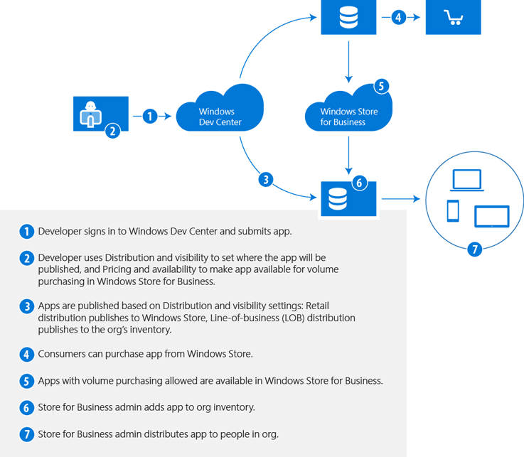

# Windows 10 Mobile security guide

**Applies to**
-   Windows 10 Mobile

This guide provides a detailed description of the most important security features in the Windows 10 Mobile operating system—identity access and control, data protection, malware resistance, and app platform security.

## Overview

Windows 10 Mobile is specifically designed for smartphones and small tablets. It uses the same security technologies as the Windows 10 operating system to help protect against known and emerging security threats across the spectrum of attack vectors. Several broad categories of security work went into Windows 10 Mobile:

-   **Identity and access control.** Microsoft has greatly enhanced identity and access control features to simplify and improve the security of user authentication. These features include Windows Hello and Microsoft Passport, which better protect user identities through easy-to-deploy and easy-to-use multifactor authentication (MFA). (Windows Hello requires either a specialized illuminated infrared \[IR\] camera for facial recognition and iris detection or a finger print reader that supports the Windows Biometric Framework.)
-   **Data protection.** Confidential data is better protected from compromise than ever before. Windows 10 Mobile uses several data-protection technologies and delivers them in a user-friendly and IT-manageable way.
-   **Malware resistance.**Windows 10 Mobile helps protect critical system resources and apps to reduce the threat of malware, including support for enterprise-grade secure hardware and Secure Boot.
-   **App platform security.** The Windows 10 Mobile enterprise-grade secure app platform provides multiple layers of security. For example, Windows Store checks all apps for malware to help prevent malware from reaching devices. 

In addition, AppContainer application isolation helps prevent any malicious app from compromising other apps.

This guide explains each of these technologies and how they help protect your Windows 10 Mobile devices.

## Identity and access control

A fundamental component of security is the notion that a user has a unique identity and that that identity is either allowed or denied access to resources. This notion is traditionally known as access control, which has three parts:
-   **Identification.** The user (subject) asserts a unique identity to the computer system for the purpose of accessing a resource (object), such as a file or an app.
-   **Authentication.** Authentication is the process of proving the asserted identity and verifying that the subject is indeed the subject.
-   **Authorization.** The system compares the authenticated subject’s access rights against the object’s permissions and either allows or denies the requested access.

The way an operating system implements these components makes a difference in preventing attackers from accessing corporate data. Only users who prove their identities and are authorized to access that data can access it. In security, however, there are varying degrees of identity proof and many different requirements for authorization limits. The access control flexibility most corporate environments need presents a challenge for any operating system. Table 1 lists typical Windows access control challenges and the solutions that Windows 10 Mobile offers.

Table 1. Windows 10 Mobile solutions for typical access control challenges
<table>
<colgroup>
<col width="50%" />
<col width="50%" />
</colgroup>
<thead>
<tr class="header">
<th align="left">Access control challenge</th>
<th align="left">Windows 10 Mobile solutions</th>
</tr>
</thead>
<tbody>
<tr class="odd">
<td align="left">
Organizations frequently use passwords to authenticate users and provide access to business applications or the corporate network, because more trustworthy authentication alternatives are too complex and costly to deploy.
</td>
<td align="left">
Windows Hello provides biometrics to identify the user and unlock the device that closely integrates with Microsoft Passport to identify, authenticate, and authorize users to access the corporate network or applications from their Windows 10 Mobile device with supporting biometric hardware.
</td>
</tr>
<tr class="even">
<td align="left">
When an organization uses smart cards, it must purchase a smart card reader, smart cards, and smart card management software. These solutions are complex and costly to implement; they also tend to delay mobile productivity.
</td>
<td align="left">
Windows Hello with Microsoft Passport enables a simple and cost-effective MFA deployment across the organization, enhancing the business’ security stance.
</td>
</tr>
<tr class="odd">
<td align="left">
Mobile device users must enter their password on a touch keyboard. Entering complex passwords in this way is error prone and less efficient than a keyboard.
</td>
<td align="left">
Windows Hello helps enable iris scan, fingerprint, and facial recognition-based authentication for devices that have biometric sensors. These biometric identification options are more convenient and more efficient than password-based logon.
</td>
</tr>
<tr class="even">
<td align="left">
Users dislike the need to enter long, complex passwords to log on to corporate services, especially passwords that must change frequently. This frustration often leads to password reuse, passwords written on notepads, and weak password composition.
</td>
<td align="left">
Microsoft Passport allows users to sign in once and gain access to corporate resources without having to re-enter complex passwords. Authentication credentials are bound to the device through a built-in Trusted Platform Module (TPM) and cannot be removed.
</td>
</tr>
</tbody>
</table>
 
The following sections describe these challenges and solutions in more detail.

### Microsoft Passport

Microsoft Passport provides strong MFA, fully integrated into Windows devices, to replace passwords. To authenticate, the user must have a Microsoft Azure Active Directory (Azure AD)–registered device and either a PIN or Windows Hello biometric gesture to unlock the device. Microsoft Passport is conceptually similar to a smart card but more flexible, as it doesn’t require a public key infrastructure or the implementation of additional hardware and supports biometric identification.

Microsoft Passport offers three significant advantages over the previous state of Windows authentication: it’s more flexible, it’s based on industry standards, and it more effectively mitigates risks.
### It's effective

Microsoft Passport eliminates the use of passwords for logon and so reduces the risk that an attacker will steal and reuse a user’s credentials. User key material, which includes the user’s private key, is available only on the device that generated it. The key material is protected with the TPM, which protects the key material from attackers who want to capture and reuse it. It is a Windows Hardware Certification Program requirement that every Windows 10 Mobile device include a TPM.

To compromise a Microsoft Passport credential that the TPM protects, an attacker must have access to the physical device, and then find a way to spoof the user’s biometrics identity or guess his or her PIN—and all of this must be done before TPM brute-force resistance capabilities lock the mobile device, the theft-protection mechanism kicks in, or the user or corporate administrator remotely wipes the device. This technology greatly reduces an attacker’s window of opportunity for compromising a user’s credentials.

### It's flexible

Microsoft Passport offers unprecedented flexibility along with enterprise-grade security.

Most importantly, Microsoft Passport works with biometrics or PINs and gives you options beyond long, complex passwords. Instead of users memorizing and retyping often-changed passwords, Microsoft Passport enables PIN- and biometrics-based identification through Windows Hello to identify users more securely.

The Windows 10 Mobile device that the user logs on to is an authentication factor, as well. The credentials used and the private key on the device are device specific and bound to the device’s TPM.

In the future, Microsoft Passport will also enable people to use Windows 10 Mobile devices as a remote credential when signing in to PCs running Windows 10. Users will use their PINs or biometrics to unlock their phones, and their phones will unlock their PCs. Phone sign-in with Microsoft Passport will make implementing MFA for scenarios where the user’s credentials must be physically separate from the PC the user is signing in to less costly and complex than other solutions. Phone sign-in will also make it easier for users and IT pros because users can use their phones to sign in to any corporate device instead of enrolling a user credential on each.

With Microsoft Passport, you gain flexibility in the data center, too. To deploy it for Windows 10 Mobile devices, you must set up Azure AD, but you don’t have to replace or remove your existing Active Directory environment. Using Azure AD Connect, organizations can synchronize these two directory services. Microsoft Passport builds on and adds to your existing infrastructure and allows you to federate with Azure AD.

Microsoft Passport is also supported on the desktop, giving organizations a uniform way to implement strong authentication on all devices. This flexibility makes it simpler for Microsoft Passport to supplement existing smart card or token deployments for on-premises Windows PC scenarios, adding MFA to mobile devices and users who don’t currently have it for extra protection of sensitive resources or systems that these mobile devices access.

### It's standardized

Both software vendors and enterprise customers have come to realize that proprietary identity and authentication systems are a dead end: the future lies with open, interoperable systems that allow secure authentication across a variety of devices, line-of-business (LOB) apps, and external applications and websites. To this end, a group of industry players formed the Fast Identity Online (FIDO) Alliance. The FIDO Alliance is a nonprofit organization that works to address the lack of interoperability among strong authentication devices as well as the problems users face in creating and remembering multiple user names and passwords. The FIDO Alliance plans to change the nature of authentication by developing specifications that define an open, scalable, interoperable set of mechanisms that supplant reliance on passwords to authenticate users of online services securely. This new standard can allow any business network, app, website, or cloud application to interface with a broad variety of existing and future FIDO-enabled devices and operating system platforms using a standardized set of interfaces and protocols.
In 2014, Microsoft joined the board of the FIDO Alliance. FIDO standards enable a universal framework that a global ecosystem delivers for a consistent and greatly improved user experience of strong password-less authentication. The FIDO 1.0 specifications, published in December 2014, provide for two types of authentications: password-less (known as UAF) and second factor (U2F). The FIDO Alliance is working on a set of 2.0 proposals that incorporate the best ideas from its U2F and UAF FIDO 1.0 standards and of course new ideas. Microsoft has contributed Microsoft Passport technology to the FIDO 2.0 specification workgroup for review and feedback and continues to work with the FIDO Alliance as the FIDO 2.0 specification moves forward. Interoperability of FIDO products is a hallmark of FIDO authentication. Microsoft believes that bringing a FIDO solution to market will help solve a critical need for enterprises and consumers alike.

### Windows Hello

Windows Hello is the new biometric framework for Windows 10. Because biometric identification is built directly into the operating system, it allows you to use your iris, face, or fingerprint to unlock your mobile device. Windows Hello unlocks Microsoft Passport credentials, which enable authentication to resources or relying parties such as software-as-a-service applications like Microsoft Office 365.
Windows Hello supports three biometric sensor options that are suitable for enterprise scenarios:

-   **Facial recognition** uses special IR cameras to reliably tell the difference between a photograph or scan and a living person. Several vendors are shipping external cameras that incorporate this technology, and major manufacturers are already shipping laptops with integrated facial-recognition technology. Both Surface Pro 4 and Surface Book support this technology.
-   **Fingerprint recognition** uses a sensor to scan the user’s fingerprint. Although fingerprint readers have been available for computers running the Windows operating system for years, the detection, anti-spoofing, and recognition algorithms in Windows 10 are more advanced than in previous Windows versions. Most existing fingerprint readers (whether external to or integrated into laptops or USB keyboards) that support the Windows Biometric Framework will work with Windows Hello.
-   **Iris scanning** uses cameras designed to scan the user’s iris, the colorful and highly detailed portion of the eye. Because the data must be accurate, iris scanning uses a combination of an IR light source and a high-quality camera. Microsoft Lumia 950 and 950 XL devices support this technology.
> **Note:**  Users must create an unlock PIN before they enroll a biometric gesture. The device uses this PIN as a fallback mechanism in situations where it cannot capture the biometric gesture.
 
All three of these biometric factors—the face, the finger, and the iris—are unique to an individual. To capture enough data to uniquely identify an individual, a biometric scanner might initially capture images in multiple conditions or with additional details. For example, an iris scanner will capture images of both eyes; or both with and without eyeglasses or contact lenses.

Spoofing biometric data is often a big concern in enterprise environments. Microsoft employs several anti-spoofing techniques in Windows 10 Mobile that verify the trustworthiness of the biometric device as well as guard against intentional collision with stored biometric measurements. These techniques help improve the false-acceptance rate (the rate at which spoofed biometric data is accepted as authentic) while maintaining the overall usability and manageability of MFA.

The biometric image collected at enrollment is converted into an algorithmic form that cannot be converted back into the original image. Only the algorithmic form is kept; the actual biometric image is removed from the device after conversion. Windows 10 Mobile devices both encrypt the algorithmic form of the biometric data and bind the encrypted data to the device, both of which help prevent someone from removing the data from the phone. As a result, the biometric information that Windows Hello uses is a local gesture and doesn’t roam among the user’s devices.

Windows Hello offers several major benefits. First, it helps to address the problems of credential theft and sharing because an attacker must obtain the mobile phone and impersonate the user’s biometric identity, which is more difficult than stealing a device unlock password. Second, the use of biometrics gives users an authenticator that’s always with them—there’s nothing to forget, lose, or leave behind. Instead of worrying about memorizing long, complex passwords, users can take advantage of a convenient, enterprise-grade secure method for logging on to their Windows 10 Mobile device. Finally, there’s nothing additional to deploy, because Microsoft built Windows Hello support directly into the operating system. All you need is a device that includes a supported biometric sensor.

The device that senses the biometric factors must report the data to Windows Hello quickly and accurately. For this reason, Microsoft determines which factors and devices are trustworthy and accurate prior to their inclusion in Windows Hello. For more information, see [Windows 10 specifications](http://go.microsoft.com/fwlink/p/?LinkId=722908).

## Data protection

Windows 10 Mobile continues to provide solutions that help protect information against unauthorized access and disclosure.

### Device encryption
Windows 10 Mobile uses device encryption, based on BitLocker technology, to encrypt all internal storage, including operating system and data storage partitions. The user can activate device encryption, or the IT department can activate and enforce encryption for company-managed devices through MDM tools. When device encryption is turned on, all data stored on the phone is encrypted automatically. A Windows 10 Mobile device with encryption turned on helps protect the confidentiality of data stored if the device is lost or stolen. The combination of Windows Hello lock and data encryption makes it extremely difficult for an unauthorized party to retrieve sensitive information from the device.

You can customize how device encryption works to meet your unique security requirements. Device encryption even enables you to define your own cipher suite. For example, you can specify the algorithm and key size that Windows 10 Mobile uses for data encryption, which Transport Layer Security (TLS) cipher suites are permitted, and whether Federal Information Processing Standard (FIPS) policy is enabled. Table 2 lists the policies you can change to customize device encryption on Windows 10 Mobile devices.

Table 2. Windows 10 cryptography policies
<table>
<colgroup>
<col width="33%" />
<col width="33%" />
<col width="33%" />
</colgroup>
<thead>
<tr class="header">
<th align="left">Area name</th>
<th align="left">Policy name</th>
<th align="left">Description</th>
</tr>
</thead>
<tbody>
<tr class="odd">
<td align="left">
Cryptography
</td>
<td align="left">
Allow FIPS Algorithm Policy
</td>
<td align="left">
Enable or disable the FIPS policy. A restart is needed to enforce this policy. The default value is disabled.
</td>
</tr>
<tr class="even">
<td align="left">
BitLocker
</td>
<td align="left">
Encryption Method
</td>
<td align="left">
Configures the BitLocker Drive Encryption Method and cipher strength. The default value is AES-CBC 128-bit. If the device cannot use the value specified, it will use another one.
</td>
</tr>
<tr class="odd">
<td align="left">
Cryptography
</td>
<td align="left">
TLS Cipher Suite
</td>
<td align="left">
This policy contains a list of the cryptographic cipher algorithms allowed for Secure Sockets Layer connections.
</td>
</tr>
</tbody>
</table>
 
For a complete list of policies available, see [Policy CSP](http://go.microsoft.com/fwlink/p/?LinkId=733963).

### Enterprise data protection

Enterprises have seen huge growth in the convergence of personal and corporate data storage. Personal data is frequently stored on corporate devices and vice versa. This situation increases the potential for compromise of sensitive corporate data.

One growing risk is authorized users’ accidental disclosure of sensitive data—a risk that is rapidly becoming the biggest source of confidential data leakage as organizations allow personal devices to access corporate resources. One example is common among organizations: an employee connects his or her personal phone to the company’s Microsoft Exchange Server instance for email. He or she uses the phone to work on email that includes attachments with sensitive data. When sending the email, the user accidentally copies a supplier. Content protection is only as strong as the weakest link, and in this example, the unintended sharing of sensitive data with unauthorized people might not have been prevented with standard data encryption.

In Windows 10 Mobile, enterprise data protection (EDP) helps separate personal and enterprise data and prevent data leakage. Key features include its ability to:

-   Automatically tag personal and corporate data.
-   Protect data while it’s at rest on local or removable storage.
-   Control which apps can access corporate data.
-   Control which apps can access a virtual private network (VPN) connection.
-   Prevent users from copying corporate data to public locations.

> **Note:**  EDP is currently being tested in select customer evaluation programs. For more information about EDP, see [Enterprise data protection overview](../whats-new/edp-whats-new-overview.md).
 
### Enlightenment

Third-party data loss protection solutions usually require developers to wrap their apps. In contrast, EDP puts the intelligence in Windows 10 Mobile so that it doesn’t require wrappers. As a result, most apps require nothing extra to work with EDP.

EDP can enforce policy without the need for an app to change. This means that an app that always handles business data (such as an LOB app) can be added to the allowed list and will always encrypt all data that it handles. However, if the app does not use common controls, cut and paste operations from this app to a non-enterprise app will silently fail. In addition, if the app needs to handle personal data, this data will also be encrypted.
Therefore, to improve the user experience, in some cases, developers should enlighten their apps by adding code to and compiling them to use the EDP application programming interfaces. Those cases include apps that:
-   Don’t use common controls for saving files.
-   Don’t use common controls for text boxes.
-   Work on personal and enterprise data simultaneously (for example, contact apps that display personal and enterprise data in a single view; a browser that displays personal and enterprise web pages on tabs within a single instance).

Figure 1 summarizes when an app might require enlightenment to work with EDP. Microsoft Word is a good example. Not only can Word access personal and enterprise data simultaneously, but it can also transmit enterprise data (for example, email attachments containing enterprise data).

In any case, most apps don’t require enlightenment for them to use EDP protection. Simply adding them to the EDP allow list is all you must do. Because unenlightened apps cannot automatically tag data as personal or enterprise, if they are in an EDP policy, they treat all data as enterprise data. An LOB app is a good example. Adding an LOB app to an EDP policy protects all data that the app handles. Another example is a legacy app that cannot be updated, which you can add to an EDP policy and use without even being aware that EDP exists.

Figure 1. When is enlightenment required?

### Data leakage control

To configure EDP in an MDM solution that supports it, add authorized apps to the EDP allow list. When a device running Windows 10 Mobile enrolls in the MDM solution, apps that this policy doesn’t authorize won’t have access to enterprise data.

EDP works seamlessly until users try to access enterprise data with or try to paste enterprise data into unauthorized apps or locations on the web. For example, copying enterprise data from an authorized app to another authorized app works as usual, but EDP blocks users from copying enterprise data from an authorized app to an unauthorized app. Likewise, EDP blocks users from using an unauthorized app to open a file that contains enterprise data.
In addition, users cannot copy and paste data from authorized apps to unauthorized apps or locations on the Web without triggering one of the EDP protection levels:
-   **Block.** EDP blocks users from completing the operation.
-   **Override.** EDP notifies users that the operation is inappropriate but allows them to override the policy, although it logs the operation in the audit log.
-   **Audit.** EDP does not block or notify users but logs the operation in the audit log.
-   **Off.** EDP does not block or notify users and does not log operations in the audit log.

### Data separation

As the name suggests, data separation separates personal from enterprise data. Most third-party solutions require an app wrapper, and from here, enterprise data goes in a container while personal data is outside the container. Often, people must use two different apps for the same purpose: one for personal data and another for enterprise data.

EDP provides the same data separation but neither uses containers nor requires a special version of an app to access business data, and then a second instance of it to access personal data. There are no containers, partitions, or special folders to physically separate personal and business data. Instead, Windows 10 Mobile is the access control broker, identifying enterprise data because it’s encrypted to the enterprise. Therefore, EDP provides data separation by virtue of encrypting enterprise data.

### Visual cues

In Windows 10 Mobile, visual cues indicate the status of EDP to users (see Figure 2):

-   **Start screen.** On the Start screen, apps that an EDP policy manages display a visual cue.
-   **Files.** In File Explorer, a visual cue indicates whether a file or folder contains enterprise data and is therefore encrypted.
For example, Erwin is an employee at Fabrikam. He opens Microsoft Edge from the Start screen and sees that the tile indicates that an EDP policy manages the browser. Erwin opens the Fabrikam sales website and downloads a spreadsheet. In File Explorer, Erwin sees that the file he downloaded has a visual cue which indicates that it’s encrypted and contains enterprise data. When Erwin tries to paste data from that spreadsheet into an app that no EDP policy manages (for example, his Twitter app), Erwin might see a message that allows him to override protection while logging the action, depending on the protection level configured in the EDP policy.

Figure 2. Visual cues in EDP

## Malware resistance

Just as software has automated so much of our lives, malware has automated attacks on our devices. Those attacks are relentless. Malware is constantly changing, and when it infects a device, it can be difficult to detect and remove.
The best way to fight malware is to prevent the infection from happening. Windows 10 Mobile provides strong malware resistance because it takes advantage of secured hardware and protects both the startup process and the core operating system architecture.

Table 3 lists specific malware threats and the mitigation that Windows 10 Mobile provides.

Table 3. Threats and Windows 10 Mobile mitigations

<table>
<colgroup>
<col width="50%" />
<col width="50%" />
</colgroup>
<thead>
<tr class="header">
<th align="left">Threat</th>
<th align="left">Windows 10 Mobile mitigation</th>
</tr>
</thead>
<tbody>
<tr class="odd">
<td align="left">
Firmware bootkits replace the firmware with malware.
</td>
<td align="left">
All certified devices include Unified Extensible Firmware (UEFI) with Secure Boot, which requires signed firmware for updates to UEFI and Option ROMs.
</td>
</tr>
<tr class="even">
<td align="left">
Bootkits start malware before Windows starts.
</td>
<td align="left">
UEFI with Secure Boot verifies Windows bootloader integrity to help ensure that no malicious operating system can start before Windows.
</td>
</tr>
<tr class="odd">
<td align="left">
System or driver rootkits (typically malicious software that hides from the operating system) start kernel- level malware while Windows is starting, before antimalware solutions can start.
</td>
<td align="left">
Windows Trusted Boot verifies Windows boot components, including Microsoft drivers. Measured Boot runs in parallel with Trusted Boot and can provide information to a remote server that verifies the boot state of the device to help ensure that Trusted Boot and other boot components successfully checked the system.
</td>
</tr>
<tr class="even">
<td align="left">
An app infects other apps or the operating system with malware.
</td>
<td align="left">
All Windows 10 Mobile apps run inside an AppContainer that isolates them from all other processes and sensitive operating system components. Apps cannot access any resources outside their AppContainer.
</td>
</tr>
<tr class="odd">
<td align="left">
An unauthorized app or malware attempts to start on the device.
</td>
<td align="left">
All Windows 10 Mobile apps must come from Windows Store or Windows Store for Business. Device Guard enforces administrative policies to select exactly which apps are allowed to run.
</td>
</tr>
<tr class="even">
<td align="left">
User-level malware exploits a vulnerability in the system or an application and owns the device.
</td>
<td align="left">
Improvements to address space layout randomization (ASLR), Data Execution Prevention (DEP), the heap architecture, and memory-management algorithms reduce the likelihood that vulnerabilities can enable successful exploits.

Protected Processes isolates non-trusted processes from each other and from sensitive operating system components.
</td>
</tr>
<tr class="odd">
<td align="left">
Users access a dangerous website without knowledge of the risk.
</td>
<td align="left">
The SmartScreen URL Reputation feature prevents users from going to a malicious website that may try to exploit the browser and take control of the device.
</td>
</tr>
<tr class="even">
<td align="left">
Malware exploits a vulnerability in a browser add-on.
</td>
<td align="left">
Microsoft Edge is an app built on the Universal Windows Platform (UWP) that does not run legacy binary extensions, including Microsoft ActiveX and browser helper objects frequently used for toolbars, which eliminates these risks.
</td>
</tr>
<tr class="odd">
<td align="left">
A website that includes malicious code exploits a vulnerability in the web browser to run malware on the client device.
</td>
<td align="left">
Microsoft Edge includes Enhanced Protected Mode, which uses AppContainer-based sandboxing to help protect the system against vulnerabilities that at attacker may discover in the extensions running in the browser (for example, Adobe Flash, Java) or the browser itself.
</td>
</tr>
</tbody>
</table>
 
> **Note:**  Windows 10 Mobile devices use a System on a Chip (SoC) design provided by SoC vendors such as Qualcomm. With this architecture, the SoC vendor and device manufacturers provide the pre-UEFI bootloaders and the UEFI environment. The UEFI environment implements the UEFI Secure Boot standard described in section 27 of the UEFI specification, which can be found at [http://www.uefi.org/specsandtesttools](http://go.microsoft.com/fwlink/p/?LinkId=722912). This standard describes the process by which all UEFI drivers and applications are validated against keys provisioned into a UEFI-based device before they are executed.
 
The following sections describe these improvements in more detail.

### Enterprise-grade secure hardware

Taking full advantage of Windows 10 Mobile security features requires advancements in hardware-based security. These advances include UEFI with Secure Boot, TPM, and biometric sensors (hardware dependent).

### UEFI with Secure Boot

When a Windows 10 Mobile device starts, it begins the process of loading the operating system by locating the bootloader in the device’s storage system. Without safeguards in place, the phone might simply hand control over to the bootloader without even determining whether it’s a trusted operating system or malware.

UEFI is a standards-based solution that offers a modern-day replacement for the BIOS. In fact, it provides the same functionality as BIOS while adding security features and other advanced capabilities. Like BIOS, UEFI initializes devices, but UEFI components with the Secure Boot feature (version 2.3.1 or later) also help ensure that only trusted firmware in Option ROMs, UEFI apps, and operating system bootloaders can start on the mobile phone.
UEFI can run internal integrity checks that verify the firmware’s digital signature before running it. Because only the mobile phone’s manufacturer has access to the digital certificate required to create a valid firmware signature, UEFI has protection against firmware-based malware that loads before Windows 10 Mobile and can successfully hide its malicious behavior from Windows 10 Mobile. Firmware-based malware of this nature is typically called a bootkit.
When a mobile device with UEFI and Secure Boot starts, the UEFI firmware verifies the bootloader’s digital signature to verify that no one has modified it after it was digitally signed. The firmware also verifies that a trusted authority issued the bootloader’s digital signature. This check helps to ensure that the system starts only after checking that the bootloader is both trusted and unmodified since signing.
All Windows 10 Mobile devices always have Secure Boot enabled. In addition, they trust only the Windows operating system signature.

Neither Windows 10 Mobile, apps, or even malware can change the UEFI configuration. For more information about UEFI with Secure Boot, read [Protecting the pre-OS environment with UEFI](http://go.microsoft.com/fwlink/p/?LinkId=722909).

### Trusted Platform Module

A Trusted Platform Module is a tamper-resistant cryptographic module that enhances the security and privacy of computing platforms. The TPM is incorporated as a component in a trusted computing platform like a PC, tablet, or mobile phone. A trusted computing platform is specially designed to work with the TPM to support privacy and security scenarios that software alone cannot achieve. It is a Windows 10 Mobile device hardware certification requirement to include a TPM in every Windows 10 Mobile device.

A proper implementation of a TPM as part of a trusted computing platform provides a hardware root of trust, meaning that the hardware behaves in a trusted way. For example, if you create a key in a TPM with the property that no one can export that key from the TPM, the key absolutely cannot leave the TPM. The close integration of a TPM with a platform increases the transparency of the boot process and supports device health scenarios by enabling reliable report of the software used to start a platform.

The following list describes key functionality that a TPM provides in Windows 10 Mobile:
-   **Manage cryptographic keys.** A TPM can create, store, and permit the use of keys in defined ways. Windows 10 Mobile uses the TPM to protect the encryption keys for BitLocker volumes, virtual smart cards, certificates, and various other keys.
-   **Safeguard and report integrity measurements.**Windows 10 Mobile uses the TPM to record and help protect integrity-related measurements of select hardware and Windows boot components for the Measured Boot feature. In this scenario, Measured Boot measures each component, from firmware up through the drivers, and then stores those measurements in the device’s TPM. From here, you can test the measurement log remotely so that a separate system verifies the boot state of the Windows 10 Mobile device.
-   **Prove a TPM is really a TPM.** Managing cryptographic keys and measuring integrity are so central to protecting privacy and security that a TPM must differentiate itself from malware that masquerades as a TPM.

Windows 10 Mobile supports TPM implementations that comply with the 2.0 standard. The TPM 2.0 standard includes several improvements that make it superior to the 1.2 standard, the most notable of which is cryptographic agility. TPM 1.2 is restricted to a fixed set of encryption and hash algorithms. At the time the TPM 1.2 standard appeared in the early 2000s, the security community considered these algorithms cryptographically strong. Since that time, advances in cryptographic algorithms and cryptanalysis attacks have increased expectations for stronger cryptography. TPM 2.0 supports additional algorithms that offer stronger cryptographic protection as well as the ability to plug in algorithms that certain geographies or industries may prefer. It also opens the possibility for inclusion of future algorithms without changing the TPM component itself.
Many people assume that original equipment manufacturers (OEMs) must implant a TPM in hardware on a motherboard as a discrete module, but TPM can also be effective when implemented in firmware. Windows 10 Mobile supports only firmware TPM that complies with the 2.0 standard. Windows does not differentiate between discrete and firmware-based solutions because both must meet the same implementation and security requirements; therefore, any Windows 10 feature that can take advantage of TPM can be used with Windows 10 Mobile.

> **Note:**  Microsoft requires TPM 2.0 on devices running any version of Windows 10 Mobile. For more information, see [Minimum hardware requirements](http://go.microsoft.com/fwlink/p/?LinkId=733964).
 
Several Windows 10 Mobile security features require TPM:
-   Virtual smart cards
-   Measured Boot
-   Health attestation (requires TPM 2.0 or later)
Still other features will use the TPM if it is available. For example, Microsoft Passport does not require TPM but uses it if it’s available. Organizations can configure policy to require TPM for Microsoft Passport.

### Biometrics

Windows 10 Mobile makes biometrics a core security feature. Microsoft has fully integrated biometrics into the Windows 10 Mobile security components, not just tacked it on top of the platform (as was the case in previous versions of Windows). This is a big change. Earlier biometric implementations were largely front-end methods that simplified authentication. Under the hood, the system used biometrics to access a password, which it then used for authentication behind the scenes. Biometrics may have provided convenience but not necessarily enterprise-grade authentication.
Microsoft has been evangelizing the importance of enterprise-grade biometric sensors to the OEMs that create Windows 10 Mobile devices. These facial-recognition and iris-scanning sensors are fully supported by MFA features such as Microsoft Passport and Windows Hello.
In the future, Microsoft expects OEMs to produce even more advanced enterprise-grade biometric sensors and to continue to integrate them into mobile devices. As a result, biometrics will become a commonplace authentication method as part of an MFA system.

### Enterprise-grade secure Windows startup

UEFI with Secure Boot uses hardware technologies to help protect users from bootkits. Secure Boot can validate the integrity of the devices, firmware, and bootloader. After the bootloader launches, users must rely on the operating system to protect the integrity of the remainder of the system.

### Trusted Boot

When UEFI with Secure Boot verifies that it trusts the bootloader and starts Windows 10 Mobile, the Windows Trusted Boot feature protects the rest of the startup process by verifying that all Windows startup components are trustworthy (for example, signed by a trusted source) and have integrity. The bootloader verifies the digital signature of the Windows kernel before loading it. The Windows kernel, in turn, verifies every other component of the Windows startup process, including the boot drivers, and startup files.

If someone has modified a file (for example, if malware has tampered with it or it has been corrupted), Trusted Boot will detect the problem and attempt to automatically repair the corrupted component. When repaired, Windows will start normally after only a brief delay.

### Measured Boot

The biggest challenge with rootkits and bootkits in earlier versions of Windows was that they could frequently be undetectable to the client. Because they often started before Windows defenses and the antimalware solution—and they had system-level privileges—rootkits and bootkits could completely disguise themselves while continuing to access system resources. Although UEFI with Secure Boot and Trusted Boot could prevent most rootkits and bootkits, intruders could still potentially exploit a few attack vectors (for example, if someone compromised the signature used to sign a boot component, such as a non-Microsoft driver, and used it to sign a malicious one).
Windows 10 Mobile implements the Measured Boot feature, which uses the TPM hardware component to record a series of measurements for critical startup-related components, including firmware, Windows boot components, and drivers. Because Measured Boot uses the hardware-based security capabilities of TPM, which isolates and protects the measurement data against malware attacks, the log data is well protected against even sophisticated attacks.
Measured Boot focuses on acquiring the measurement data and protecting it against tampering. You must couple it, however, with a service that can analyze the data to determine device health and provide a more complete security service. The next section introduces just such a service.

### Device health attestation

Device health attestation is new feature in Windows 10 Mobile that helps prevent low-level malware infections. Device health attestation uses a device’s TPM and firmware to measure the critical security properties of the device’s BIOS and Windows startup processes. These measurements are made in such a way that even on a system infected with kernel-level malware or a rootkit, an attacker is unlikely to spoof the properties.
You can integrate Device health attestation with Microsoft Intune or non-Microsoft MDM solutions and combine these hardware-measured security properties with other device properties to gain an overall view of the device’s health and compliance state. From there, you can use this integration in a variety of scenarios, from detecting jailbroken devices to monitoring device compliance, generating compliance reports, alerting users or administrators, initiating corrective action on the device, and managing conditional access to resources such as Office 365.

### Conditional Access

The example that follows shows how Windows 10 protective measures integrate and work with Intune and non-Microsoft MDM solutions. It demonstrates how the phone security architecture in Windows 10 Mobile helps you monitor and verify compliance and how the security and trust rooted in the device hardware protect corporate resources end to end.

When a user turns on a phone:
1.  The Secure Boot feature in Windows 10 Mobile helps protect the startup sequence, allows the device to boot into a defined and trusted configuration, and loads a factory-trusted boot loader.
2.  Windows 10 Mobile Trusted Boot takes control when the Secure Boot process is complete, verifying the digital signature of the Windows kernel and the components that are loaded and executed during the startup process.
3.  In parallel to steps 1 and 2, the phone’s TPM runs independently in a hardware-protected security zone (isolated from the boot execution path, which monitors boot activities). It creates a protected, tamper-evident audit trail, signed with a secret that only the TPM can access.
4.  Devices that a Device health attestation-enabled MDM solution manage send a copy of this audit trail to the Microsoft Health Attestation Service (HAS) in a protected, tamper-resistant, and tamper-evident communication channel.
5.  HAS reviews the audit trails, issues an encrypted and signed report, and forwards it to the device.
6.  From your Device health attestation-enabled MDM solution, you can review the report in a protected, tamper-resistant, and tamper-evident communication channel to assess whether the device is running in a compliant (healthy) state, allow access, or trigger corrective action aligned with the organization’s security needs and policies.
Because this solution can detect and prevent low-level malware that may be extremely difficult to detect any other way, Microsoft recommends that you consider implementing a Device health attestation-enabled MDM system like Intune that takes advantage of the Windows 10 Mobile cloud-based health attestation server feature to detect and block devices infected with advanced malware.

## App platform security

Applications built for Windows are designed to be secure and free of defects, but the reality is that human error can create vulnerabilities in code. When malicious users and software identify such vulnerabilities, they may attempt to manipulate data in memory in the hope that they can compromise the system and take control.

To mitigate these risks, Windows 10 Mobile includes a series of improvements to make it more difficult for malware to compromise the device. Windows 10 Mobile even enables organizations to choose which apps are allowed to run on mobile devices. In addition, it includes improvements that can dramatically reduce the likelihood that newly discovered vulnerabilities can be successful exploited. It takes detailed knowledge of operating system architecture and malware exploit techniques to fully appreciate the impact of these improvements, but the sections that follow explain them at a high level.

### Device Guard

Device Guard is a feature set that consists of both hardware and software system integrity-hardening features. These features revolutionize Windows operating system security by moving the entire operating system to a trust-nothing model.

All apps on Windows 10 Mobile must be digitally signed and come from Windows Store or a trusted enterprise store. Device Guard implements policies that further restrict this. By default, Device Guard supports all apps from Windows Store. You can create policies that define the apps that can and cannot run on the Windows 10 Mobile device. If the app doesn’t have a digital signature or is prevented by policy, or it does not come from a trusted store, it will not run on Windows 10 Mobile.

Advanced hardware features (described earlier in the [Enterprise-grade secure hardware](#secure-hardware) section) drive these security offerings. By integrating these hardware features further into the core operating system, Windows 10 Mobile can use them in new ways. To deliver this additional security, Device Guard requires UEFI with Secure Boot.

### AppContainer

The Windows 10 Mobile security model is based on the principle of least privilege and uses isolation to achieve it. Every app and even portions of the operating system itself run inside their own isolated sandbox called an AppContainer—a secured isolation boundary within which an app and its processes can run. Each AppContainer is defined and implemented through a security policy.

The security policy of a specific AppContainer defines the operating system capabilities that apps have access to from within the AppContainer. A capability is a Windows 10 Mobile device resource such as geographical location information, camera, microphone, networking, and sensors.

A set of default permissions are granted to all AppContainers, including access to a unique, isolated storage location. In addition, access to other capabilities can be declared within the app code itself. Access to additional capabilities and privileges cannot be requested at run time, as can be done with traditional desktop applications.

The AppContainer concept is advantageous for the following reasons:

-   **Attack surface reduction.** Apps can access only those capabilities that are declared in the application code and needed to perform their functions.
-   **User consent and control.** Capabilities that apps use are automatically published to the app details page in the Windows Store. App access to capabilities that may expose sensitive information automatically prompt the user to acknowledge and provide consent.
-   **App isolation.** Communication between Windows apps is tightly controlled. Apps are isolated from one another and can communicate only by using predefined communications channels and data types.

Apps receive the minimal privileges they need to perform their legitimate tasks. This means that even if a malicious attacker exploits an app, the potential damage is limited because the app cannot elevate its privileges and is contained within its AppContainer. Windows Store displays the permissions that the app requires along with the app’s age rating and publisher.

The combination of Device Guard and AppContainer help to prevent unauthorized apps from running. In the event malware slips into the app ecosystem, the AppContainer helps to constrain the app and limit potential damage. The Windows 10 Mobile trust-nothing model doesn’t assume that any component is perfect, however, potential vulnerabilities in apps, AppContainers, and Windows 10 Mobile itself could give an attacker a chance to compromise a system. For this reason, we need redundant vulnerability mitigations. The next several topics describe some of the redundant mitigations in Windows 10 Mobile.

### Address Space Layout Randomization
One of the most common techniques attackers use to gain access to a system is to find a vulnerability in a privileged process that is already running, guess or find a location in memory where important system code and data reside, and then overwrite that information with a malicious payload. In the early days of operating systems, any malware that could write directly to the system memory could do such a thing; the malware would simply overwrite system memory in well-known and predictable locations.

Address Space Layout Randomization (ASLR) makes that type of attack much more difficult because it randomizes how and where important data is stored in memory. With ASLR, it is more difficult for malware to find the specific location it needs to attack. Figure 3 illustrates how ASLR works, showing how the locations of different critical Windows components can change in memory between restarts.

Figure 3. ASLR at work

Microsoft has substantively improved the ASLR implementation in Windows 10 Mobile over previous versions, especially with 64-bit system and application processes that can take advantage of a vastly increased memory space, making it even more difficult for malware to predict where Windows 10 Mobile stores vital data. When used on systems that have TPMs, ASLR memory randomization will be increasingly unique across devices, making it even more difficult for a successful exploit that works on one system to work reliably on another. Microsoft also holistically applied ASLR across the entire system in Windows 10 Mobile rather than it working only on specific apps.

### Data Execution Prevention

Malware depends on its ability to put a malicious payload into memory with the hope that an unsuspecting user will execute it later. ASLR makes that much more difficult.

Extending that protection, it would be great if you could prevent malware from running if it wrote to an area that you have allocated solely for the storage of information. Data Execution Prevention (DEP) does exactly that, substantially reducing the range of memory that malicious code can use for its benefit. DEP uses the **No execute** bit on modern CPUs to mark blocks of memory as read only so that malware can’t use those blocks to execute malicious code. All Windows 10 and Windows 10 Mobile devices support DEP.

### Windows heap

The heap is a location in memory that Windows uses to store dynamic application data. Microsoft continues to improve on earlier Windows heap designs by further mitigating the risk of heap exploits that an attacker could use.
Windows 10 Mobile has several important improvements to the security of the heap over previous versions of Windows:

-   Internal data structures that the heap uses are better protected against memory corruption.
-   Heap memory allocations have randomized locations and sizes, making it more difficult for an attacker to predict the location of critical memory to overwrite. Specifically, Windows 10 Mobile adds a random offset to the address of a newly allocated heap, which makes the allocation much less predictable.
-   Windows 10 Mobile uses “guard pages” before and after blocks of memory as tripwires. If an attacker attempts to write past a block of memory (a common technique known as a buffer overflow), the attacker will have to overwrite a guard page. Any attempt to modify a guard page is considered a memory corruption, and Windows 10 Mobile responds by instantly terminating the app.

### Memory reservations

Microsoft reserves the lowest 64 KB of process memory for the operating system. Apps are no longer allowed to allocate that portion of the memory, which makes it more difficult for malware to overwrite critical system data structures in memory.

### Control Flow Guard

When Windows loads applications into memory, it allocates space to those applications based on the size of the code, requested memory, and other factors. When an application begins to execute code, it calls additional code located in other memory addresses. The relationships among the code locations are well known—they are written in the code itself—but until Windows 10 Mobile, the operating system didn’t enforce the flow among these locations, giving attackers the opportunity to change the flow to meet their needs. In other words, an application exploit takes advantage of this behavior by running code that the application may not typically run.
Windows 10 Mobile mitigates this kind of threat through the Control Flow Guard (CFG) feature. When a trusted application that its creator compiled to use CFG calls code, CFG verifies that the code location called is trusted for execution. If CFG doesn’t trust the location, it immediately terminates the application as a potential security risk.

You cannot configure CFG; rather, an application developer can take advantage of CFG by configuring it when he or she compiles the application. Consider asking application developers and software vendors to deliver trustworthy Windows applications compiled with CFG enabled. Of course, browsers are a key entry point for attacks; thus Microsoft Edge and other Windows features take full advantage of CFG.

### Protected processes

In general, preventing a computer security incident is more cost-effective than repairing the damage an incident can cause. For malware in particular, most security controls are designed to prevent an attack from being initially successful. The reasoning is that if malware cannot infect the system, the system is immune to malware.

Unfortunately, no device is immune to malware. Despite all the best preventative controls, malware can eventually find a way to infect any operating system or hardware platform. So, although prevention with a defense-in-depth strategy is important, it cannot be the only type of malware control.

The key security scenario is to assume that malware is running on a system but limit what it can do. Windows 10 Mobile has security controls and design features in place to reduce compromise from existing malware infections. Protected Processes is one such feature.

With Protected Processes, Windows 10 Mobile prevents untrusted processes from interacting or tampering with those that have been specially signed. Protected Processes defines levels of trust for processes: it prevents less trusted processes from interacting with and therefore attacking more trusted processes. Windows 10 Mobile uses Protected Processes more broadly across the operating system.

### Store for Business

Store for Business allows IT pros to find, acquire, distribute, and manage apps for their organization. The model provides flexible ways to distribute apps, depending on the size of your organization, and does not require additional infrastructure in some scenarios.

UWP apps are inherently more secure than typical applications because they are sandboxed, which restricts the app’s risk of compromise or tampering with in a way that would put the system, data, and other applications at risk. Windows Store can further reduce the likelihood that malware will infect devices by reviewing all applications that enter the Windows Store ecosystem before making them available. Store for Business extends this concept by enabling you to distribute custom LOB apps, and even some Windows Store apps, to Windows 10 Mobile devices through the same Windows Store infrastructure.

Regardless of how users acquire UWP apps, they can use them with increased confidence. UWP apps run in an AppContainer sandbox with limited privileges and capabilities. For example, the apps have no system-level access, have tightly controlled interactions with other apps, and have no access to data unless the user explicitly grants the application permission.

In addition, all UWP apps follow the security principle of least privilege. Apps receive only the minimum privileges they need to perform their legitimate tasks, so even if an attacker exploits an app, the damage the exploit can do is significantly limited and should be contained within the sandbox. Windows Store displays the exact capabilities the app requires (for example, access to the camera), along with the app’s age rating and publisher.

The Windows Store app-distribution process and the app sandboxing capabilities of Windows 10 Mobile can dramatically reduce the likelihood that users encounter malicious apps on the system.

For more information about Store for Business, see [Windows Store for Business overview](../whats-new/windows-store-for-business-overview.md).

### App management

An enterprise typically exerts some configuration and control over the apps installed on devices. In this way, the organization accomplishes several business goals, such managing software licenses, ensuring mandatory app deployment on required devices, and preventing the installation of unacceptable apps on corporate devices.

An important component in delivering on these goals is Store for Business, which builds on the Windows Store infrastructure that Microsoft hosts and enables you to deploy Windows Store apps across your Windows 10-based devices. Store for Business is both powerful and highly flexible. It allows you to extend and customize features without having to stand up new on-premises infrastructure. It supports and integrates with your existing MDM service but doesn’t require one. (Ask your MDM service vendor about integration with Store for Business.) You can configure Store for Business for a wide variety of scenarios, including online and offline licensing and different app-distribution options. For a more detailed description of the available Store for Business scenarios, see [Windows Store for Business overview](../whats-new/windows-store-for-business-overview.md).

A web-based portal for IT pros simplifies Windows 10 Mobile app deployment. The familiar look of Windows Store was used to design the Store for Business experience. It showcases apps relevant to business use, hand-selected and sorted by category. The store can use Azure AD accounts for all users, linking them to a single, unique organizational identity.

Another key benefit is licensing. Store for Business enables you to track and manage licenses for all UWP apps. You can easily determine which users have installed specific apps, track remaining licenses left, and acquire new licenses directly through the web interface. Those new licenses are added within Store for Business and do not require complex export and import processes. As long as your clients are online and have Internet connectivity, the licensing scenario with Store for Business is a great improvement over manual licensing tasks.

Store for Business allows you to find the right apps for your users, acquire them, manage app licenses, and distribute apps to individuals. The best way to understand Store for Business is to look at the steps involved in a common scenario: delivering apps to Windows 10 Mobile users without an MDM—specifically, deploying apps to Windows 10 Mobile users. In this scenario, you identify several apps that must be on each mobile device that are currently available for free in the Windows Store (for example, a VPN app for your Dell SonicWALL solution) and some internally developed LOB apps.

### The IT side

You begin the app deployment process by preparing the private store and the apps before your users receive their new Windows 10 Mobile devices.

First, you open [Windows Store for Business](http://go.microsoft.com/fwlink/p/?LinkId=722910) and use an Azure AD account to log in. This account is linked to the company’s unique organizational identity and must have an Azure AD tenant. In addition, the account must have Azure AD Enterprise Admin permissions if this is the first time you’re using Store for Business. You can delegate later access through permissions within Store for Business.
Next, you locate and acquire any apps you want to deploy to the mobile devices, adding the apps and licenses to the organization’s inventory.

Along with existing Windows Store apps, you can use Store for Business to manage custom LOB apps that are developed for your organization. First, you grant permission for a trusted app developer to submit the apps. You and the developer submit these apps through the [Windows Dev Center](http://go.microsoft.com/fwlink/p/?LinkId=722911), and they must be digitally signed with a trusted certificate. These apps are not published to the retail Windows Store catalog and are not visible to anyone outside the organization.

You can deliver the apps through a private store within Windows Store. The next step, then, is for you to mark the app to be available in the private store, which you do through the Store for Business web portal.

Alternatively, you can choose one of two other app-distribution options in Store for Business web portal:
-   Assign the app to people in your organization by selecting one or more Azure AD identities
-   Add the app to the organization’s private store, and allow all users to discover and install it.
For details about app distribution, see [Distribute apps using your private store](../manage/distribute-apps-from-your-private-store.md).

The IT process for preparing Store for Business for app deployment is shown in Figure 4.

Figure 4. The IT process for Store for Business

For details about the process of distributing apps through Store for Business, see [Find and acquire apps](../manage/find-and-acquire-apps-overview.md).

### The user side

After you have prepared Store for Business, the user side of the process takes over. This side of the process is designed to be user friendly, with the primary app deployment method—through Store for Business—streamlined and straightforward. This process doesn’t require an MDM system or any on-premises infrastructure. In fact, the user never sees the “for Business” label, just the familiar Windows Store.

1.  The user opens the Windows Store app on his or her Windows 10 Mobile device.

2.  The same Windows Store interface appears, with the addition of the private store you created. The private store appears as a new page, similar to Games and Music. The interface integrates the public Windows Store with the organization’s private store, which contains curated apps.

3.  The user simply selects and installs apps as usual.

If the user wants to make a private purchase of apps, music, movies, or TV shows with his or her Microsoft account, that’s an option, as well. The user pays for and owns his or her purchase, independent of the company. This flexibility enables hybrid scenarios for devices in many bring your own device environments.

### Microsoft Edge

Windows 10 Mobile includes critical improvements designed to thwart attacks and malware. The environment is now more resistant to malware thanks to significant improvements to SmartScreen Filters. Internet browsing is a safer experience thanks to Microsoft Edge, a completely new browser.

Windows 10 Mobile includes Microsoft Edge, an entirely new web browser that goes beyond browsing with features like Reading View. Microsoft Edge is more secure than previous Microsoft web browsers in several ways:
-   **Microsoft Edge does not support non-Microsoft binary extensions.** Microsoft Edge supports Flash content and PDF viewing by default through built-in extensions but includes no non-Microsoft binary extensions, such as ActiveX controls or Java.
-   **Microsoft Edge is designed as a UWP app.** It is inherently compartmentalized and runs in an AppContainer that sandboxes the browser from the system, data, and other apps.
-   **Microsoft Edge simplifies security configuration tasks.** Because Microsoft Edge uses a simplified application structure and a single sandbox configuration, fewer security settings are required. In addition, Microsoft established Microsoft Edge default settings that align with security best practices, making it more secure by design.

The web browser is a critical component of any security strategy, and for good reason: it is the user’s interface to the Internet, an environment teeming with malicious sites and nefarious content. Most users cannot perform at least part of their job without a browser, and many users are completely reliant on one. This reality has made the browser the number one pathway from which malicious hackers initiate their attacks.

## Related topics

[Windows 10 security overview](windows-10-security-guide.md)

[Windows 10 Mobile and MDM](../manage/windows-10-mobile-and-mdm.md)

[Windows 10 and Windows 10 Mobile](../index.md)

[Windows Store for Business](http://go.microsoft.com/fwlink/p/?LinkId=722910)

[Windows Store for Business overview](../whats-new/windows-store-for-business-overview.md)
