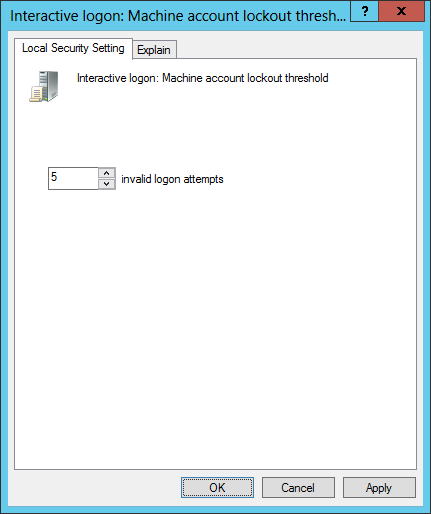
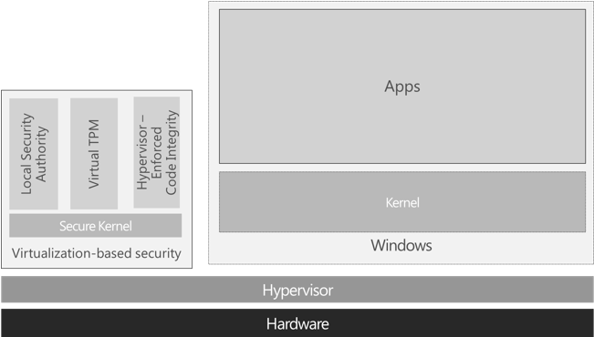
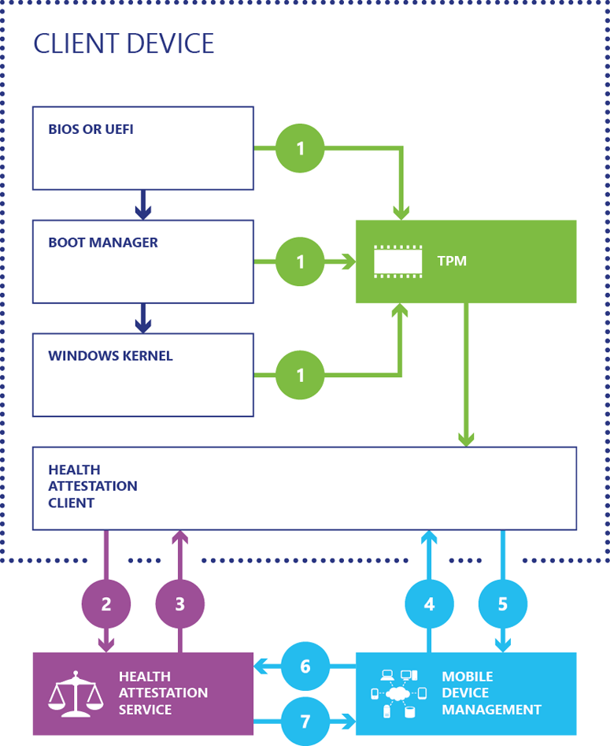
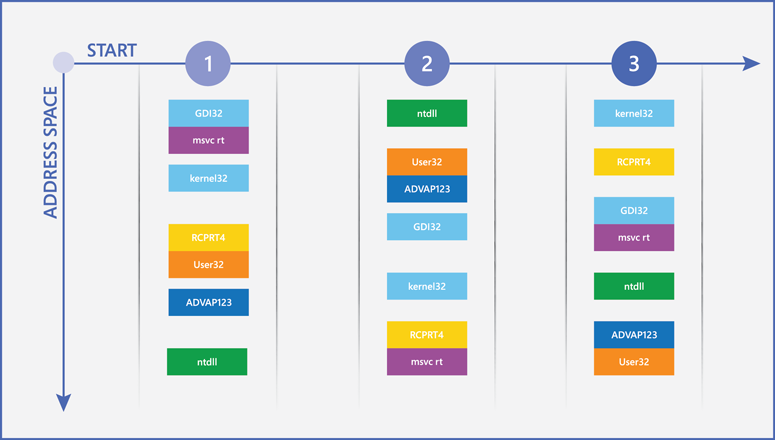
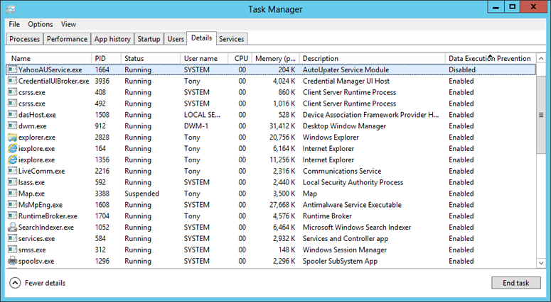
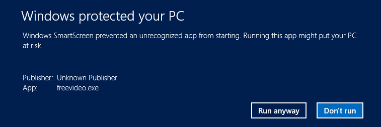
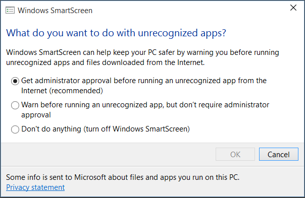
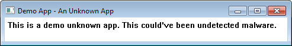
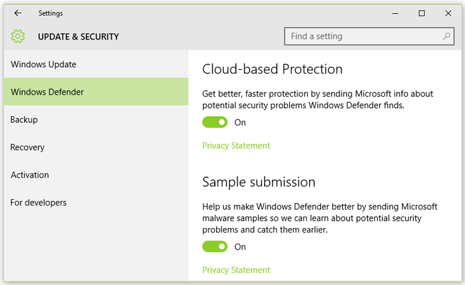
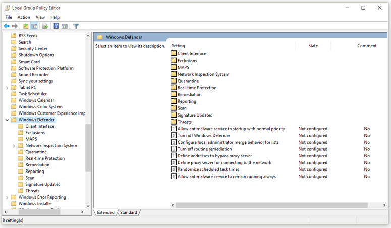

# Windows 10 security overview

**Applies to**
-   Windows 10

This guide provides a detailed description of the most important security improvements in the Windows 10 operating system, with links to more detailed articles about many of its security features. Wherever possible, specific recommendations are provided to help you implement and configure Windows 10 security features.

#### Introduction

Windows 10 is designed to protect against known and emerging security threats across the spectrum of attack vectors. Three broad categories of security work went into Windows 10:
-   [**Identity and access control**](#identity) features have been greatly expanded to both simplify and enhance the security of user authentication. These features include Windows Hello and Microsoft Passport, which better protect user identities through easy-to-deploy and easy-to-use multifactor authentication (MFA). Another new feature is Credential Guard, which uses virtualization-based security (VBS) to help protect the Windows authentication subsystems and users’ credentials.
-   [**Information protection**](#information) that guards information at rest, in use, and in transit. In addition to BitLocker and BitLocker To Go for protection of data at rest, Windows 10 includes file-level encryption with Enterprise Data Protection that performs data separation and containment and, when combined with Rights Management services, can keep data encrypted when it leaves the corporate network. Windows 10 can also help keep data secure by using virtual private networks (VPNs) and Internet Protocol Security.
-   [**Malware resistance**](#malware) includes architectural changes that can isolate critical system and security components from threats. Several new features in Windows 10 help reduce the threat of malware, including VBS, Device Guard, Microsoft Edge, and an entirely new version of Windows Defender. In addition, the many antimalware features from the Windows 8.1 operating system— including AppContainers for application sandboxing and numerous boot-protection features, such as Trusted Boot—have been carried forward and improved in Windows 10.

## Identity and access control

Traditionally, access control is a process that has three components:
-   **Identification** - when a user asserts a unique identity to the computer system for the purpose of gaining access to a resource, such as a file or a printer. In some definitions, the user is called the subject and the resource is the object.
-   **Authentication** - the process of proving the asserted identity and verification that the subject is indeed *the* subject.
-   **Authorization** - performed by the system to compare the authenticated subject’s access rights against the object’s permissions and either allow or deny the requested access.

The way these components are implemented makes the difference in stopping attackers from accessing secret data. Only a user who proves his or her identity – and is authorized to access that data – will access it. But in security, there are varying degrees of identity proof and many different requirements for authorization limits. The access control flexibility needed in most corporate environments presents a challenge for any operating system. Table 1 lists typical Windows access control challenges and the Windows 10 solutions.

Table 1. Windows 10 solutions to typical access control challenges
<table>
<colgroup>
<col width="50%" />
<col width="50%" />
</colgroup>
<thead>
<tr class="header">
<th align="left">Access control challenge</th>
<th align="left">Windows 10 solutions</th>
</tr>
</thead>
<tbody>
<tr class="odd">
<td align="left">
Organizations frequently use passwords because the alternative methods are too complex and costly to deploy.

Organizations that choose password alternatives such as smart cards must purchase and manage smart card readers, smart cards, and management software. These solutions delay productivity when the MFA component is lost or damaged. Consequently, MFA solutions like smart cards tend to be used only for VPN and select assets.
</td>
<td align="left">
Windows Hello on biometric-capable devices and Microsoft Passport enable simpler MFA.
</td>
</tr>
<tr class="even">
<td align="left">
Tablet users must type their password on a touchscreen, which is error prone and less efficient than a keyboard. Windows Hello enables secure facial recognition–based authentication.
</td>
<td align="left">
Windows Hello enables secure facial recognition–based authentication.
</td>
</tr>
<tr class="odd">
<td align="left">
IT must purchase and manage non-Microsoft tools to meet regulatory requirements for access control and auditing.
</td>
<td align="left">
Combined with the Windows Server 2012 operating system, Dynamic Access Control provides flexible access control and auditing designed to meet many government security and regulatory requirements.
</td>
</tr>
<tr class="even">
<td align="left">
Users dislike typing their passwords.
</td>
<td align="left">
Single sign-on (SSO) allows users to sign in once with their Microsoft Passport and get access to all corporate resources without the need to re-authenticate.

Windows Hello enables secure fingerprint- and facial recognition–based authentication and can be used to revalidate user presence when sensitive resources are accessed.
</td>
</tr>
<tr class="odd">
<td align="left">
Windows adds increasing delays between logon attempts and can lock out a user account when it detects brute-force attacks.
</td>
<td align="left">
When BitLocker is enabled on the system drive and brute-force protection is enabled, Windows can restart the PC after a specified number of incorrect password entries, lock access to the hard drive, and require the user to type the 48-character BitLocker recovery key to start the device and access the disk.
</td>
</tr>
</tbody>
</table>
 
The sections that follow describe these challenges and solutions in more detail.

### Microsoft Passport

Microsoft Passport provides strong two-factor authentication (2FA), fully integrated into Windows, and replaces passwords with the combination of an enrolled device and either a PIN or Windows Hello. Microsoft Passport is conceptually similar to smart cards but more flexible. Authentication is performed by using an asymmetric key pair instead of a string comparison (for example, password), and the user’s key material can be secured by using hardware.
Unlike smart cards, Microsoft Passport does not require the extra infrastructure components required for smart card deployment. In particular, you do not need public key infrastructure (PKI). If you already use PKI – for example, in secure email or VPN authentication – you can use the existing infrastructure with Microsoft Passport. Microsoft Passport combines the major advantages of smart card technology – deployment flexibility for virtual smart cards and robust security for physical smart cards – without any of their drawbacks.

Microsoft Passport offers three significant advantages over the current state of Windows authentication: It’s more flexible, it’s based on industry standards, and it effectively mitigates risks. The sections that follow look at each of these advantages in more detail.

#### It’s flexible

Microsoft Passport offers unprecedented flexibility. Although the format and use of passwords and smart cards is fixed, Microsoft Passport gives both administrators and users options to manage authentication. First and foremost, Microsoft Passport works with biometric sensors and PINs. Next, you can use your PC or even your phone as one of the factors to authenticate on your PC. Finally, your user credentials can come from your PKI infrastructure, or Windows can create the credential itself.

Microsoft Passport gives you options beyond long, complex passwords. Instead of requiring users to memorize and retype frequently-changed passwords, Microsoft Passport enables PIN- and biometrics-based authentication through Windows Hello to securely identify users.

With Microsoft Passport, you gain flexibility in the data center, too. To deploy it, you must add Windows Server 2016 domain controllers to your Active Directory environment, but you do not have to replace or remove your existing Active Directory servers: Microsoft Passport builds on and adds to your existing infrastructure. You can either add on premises servers or use Microsoft Azure Active Directory to deploy Microsoft Passport to your network. The choice of which users to enable for Microsoft Passport use is completely up to you – you choose which items to protect and which authentication factors you want to support. This flexibility makes it easy to use Microsoft Passport to supplement existing smart card or token deployments by adding 2FA to users who do not currently have it, or to deploy Microsoft Passport in scenarios that call for extra protection for sensitive resources or systems.

#### It’s standardized

Both software vendors and enterprise customers have come to realize that proprietary identity and authentication systems are a dead end: The future lies with open, interoperable systems that allow secure authentication across a variety of devices, line of business (LOB) apps, and external applications and websites. To this end, a group of industry players formed FIDO, the Fast IDentity Online Alliance. The FIDO Alliance is a nonprofit organization intended to address the lack of interoperability among strong authentication devices, as well as the problems users face when they need to create and remember multiple user names and passwords. The FIDO Alliance plans to change the nature of authentication by developing specifications that define an open, scalable, interoperable set of mechanisms that supplant reliance on passwords to securely authenticate users of online services. This new standard for security devices and browser plug ins will allow any website or cloud application to interface with a broad variety of existing and future FIDO-enabled devices that the user has for online security.

In 2014, Microsoft joined the board of the [FIDO Alliance](http://go.microsoft.com/fwlink/p/?LinkId=626934). FIDO standards enable a universal framework that a global ecosystem delivers for a consistent and greatly improved user experience of strong password-less authentication. The FIDO 1.0 specifications, published in December 2014, provide for two types of authentications: password-less (known as UAF) and second factor (U2F). The FIDO Alliance is working on a set of 2.0 proposals that incorporate the best ideas from its U2F and UAF FIDO 1.0 standards, and of course, on new ideas. Microsoft has contributed Microsoft Passport technology to the FIDO 2.0 specification workgroup for review and feedback and continues to work with the FIDO Alliance as the FIDO 2.0 specification moves forward. Interoperability of FIDO products is a hallmark of FIDO authentication. Microsoft believes that bringing a FIDO solution to market will help solve a critical need for enterprises and consumers alike.

#### It’s effective

Microsoft Passport effectively mitigates two major security risks. First, it eliminates the use of passwords for logon and so reduces the risk that a nefarious attacker will steal and reuse the user’s credentials. User key material is generated and available within the Trusted Platform Module (TPM) of the user device, which protects it from attackers who want to capture the key material and reuse it. Second, because Microsoft Passport uses asymmetrical key pairs, users credentials can’t be stolen in cases where the identity provider or websites the user accesses have been compromised.

To compromise a Microsoft Passport credential that TPM protects, an attacker must have access to the physical device, and then must find a way to spoof the user’s biometrics or guess his or her PIN—and all of this must be done before TPM anti-hammer capabilities lock the device. This sets the bar magnitudes of order higher than password phishing attacks.

### Windows Hello

Windows Hello is the name given to the new biometric sign-in option for Microsoft Passport. Because biometric authentication is built directly into the operating system, Windows Hello allows users to unlock their devices by using their face or fingerprint. From here, authentication to the devices and resources is enabled through a combination of the user’s unique biometric identifier and the device itself.

The user’s biometric data that is used for Windows Hello is considered a local gesture and consequently doesn’t roam among a user’s devices and is not centrally stored. The biometric image of the user the sensor takes is converted into an algorithmic form that cannot be converted back into the original image that the sensor took. Devices that have TPM 2.0 encrypt the biometric data in a form that makes it unreadable if the data is ever removed from the device. If multiple users share a device, each user will be able to enroll and use Windows Hello for his or her Windows profile.

Windows Hello supports two biometric sensor options that are suitable for enterprise scenarios:

-   **Facial recognition** uses special infrared cameras to reliably tell the difference between a photograph or scan and a living person. Several vendors are shipping external cameras that incorporate this technology, and major manufacturers are already shipping integrated devices with facial-recognition technology.
-   **Fingerprint recognition** uses a fingerprint sensor to scan the user’s fingerprint. Although fingerprint readers have been available for computers running Windows for years, the detection, antispoofing, and recognition algorithms in Windows 10 are more advanced than previous Windows versions. Most existing fingerprint readers (whether external or integrated into laptops or USB keyboards) can be used with Windows Hello.

Windows Hello offers several major benefits. First, it addresses the problems of credential theft and sharing, because an attacker must obtain the device and impersonate the user’s biometric identity, which is more difficult than stealing a password or PIN. Second, the use of biometrics gives users an authenticator that’s always with them – there’s nothing to forget, lose, or leave behind. Instead of worrying about memorizing long, complex passwords, users can take advantage of a convenient, secure method for logging in to all their Windows devices. Finally, there’s nothing additional to deploy or manage. Because Windows Hello support is built directly into the operating system, 
there are no additional drivers to deploy.

### Brute-force attack resistance

A brute-force attack is the process used to break into a device simply by guessing a user’s password, PIN, or even his or her biometric identity over and over until the attacker gets it right. Over the last several versions of Windows, Microsoft has added features that dramatically reduce the chances that such an attack would succeed.

The Windows 7 operating system and previous versions defended against brute-force attacks in a straightforward way: they slowed or prevented additional guesses after multiple mistakes. When users use a full password to log on, Windows forces users to wait several seconds between attempts if they type their password incorrectly multiple times. You can even choose to have Windows lock out an account for a period of time when it detects a brute-force attack.
Windows 8.1 and Windows 10 support an even more powerful – but optional – form of brute-force protection when the credentials are tied to TPM. If the operating system detects a brute-force attack against the Windows sign-in and BitLocker protects the system drive, Windows can automatically restart the device and put it in BitLocker recovery mode until someone enters a recovery key password. This password is a virtually unguessable 48-character recovery code that must be used before Windows will be able to start normally.

If you’re interested in learning how to configure brute-force protection, use a test Windows 10 PC on which BitLocker protection is enabled for the system drive, and then print the BitLocker recovery key to ensure that you have it available. Then, open the Local Group Policy Editor by running **gpedit.msc**, and go to Computer Configuration\\Windows Settings\\Security Settings\\Security Options. Open the policy **Interactive Login: Machine Account Lockout Threshold**, and set the value to **5**, as shown in Figure 1.

Figure 1. Set the number of invalid access attempts prior to lockout

Now, your PC is configured with brute-force protection. Restart your PC. When prompted to log on, mistype your password until the PC restarts. Now, try to guess the 48-character recovery key. You will be glad you printed it out beforehand.

## Information protection

When users travel, their organization’s confidential data goes with them. Wherever confidential data is stored, it must be protected against unauthorized access. Windows has a long history of providing at-rest data-protection solutions that guard against nefarious attackers, beginning with the Encrypting File System in the Windows 2000 operating system. More recently, BitLocker has provided encryption for full drives and portable drives; in Windows 10, BitLocker will even protect individual files, with data loss prevention capabilities. Windows consistently improves data protection by improving existing options and by providing new strategies.

Table 2 lists specific data-protection concerns and how they are addressed in Windows 10 and Windows 7.

Table 2. Data Protection in Windows 10 and Windows 7

<table>
<colgroup>
<col width="50%" />
<col width="50%" />
</colgroup>
<thead>
<tr class="header">
<th align="left">Windows 7</th>
<th align="left">Windows 10</th>
</tr>
</thead>
<tbody>
<tr class="odd">
<td align="left">
When BitLocker is used with a PIN to protect startup, PCs such as kiosks cannot be restarted remotely.
</td>
<td align="left">
Modern Windows devices are increasingly protected with device encryption out of the box and support SSO to seamlessly protect the BitLocker encryption keys from cold boot attacks.

Network Unlock allows PCs to start automatically when connected to the internal network.
</td>
</tr>
<tr class="even">
<td align="left">
Users must contact the IT department to change their BitLocker PIN or password.
</td>
<td align="left">
Modern Windows devices no longer require a PIN in the pre-boot environment to protect BitLocker encryption keys from cold boot attacks.

Users who have standard privileges can change their BitLocker PIN or password on legacy devices that require a PIN.
</td>
</tr>
<tr class="odd">
<td align="left">
When BitLocker is enabled, the provisioning process can take several hours.
</td>
<td align="left">
BitLocker pre-provisioning, encrypting hard drives, and Used Space Only encryption allow administrators to enable BitLocker quickly on new computers.
</td>
</tr>
<tr class="even">
<td align="left">
There is no support for using BitLocker with self-encrypting drives (SEDs).
</td>
<td align="left">
BitLocker supports offloading encryption to encrypted hard drives.
</td>
</tr>
<tr class="odd">
<td align="left">
Administrators have to use separate tools to manage encrypted hard drives.
</td>
<td align="left">
BitLocker supports encrypted hard drives with onboard encryption hardware built in, which allows administrators to use the familiar BitLocker administrative tools to manage them.
</td>
</tr>
<tr class="even">
<td align="left">
Encrypting a new flash drive can take more than 20 minutes.
</td>
<td align="left">
Used Space Only encryption in BitLocker To Go allows users to encrypt drives in seconds.
</td>
</tr>
<tr class="odd">
<td align="left">
BitLocker could require users to enter a recovery key when system configuration changes occur.
</td>
<td align="left">
BitLocker requires the user to enter a recovery key only when disk corruption occurs or when he or she loses the PIN or password.
</td>
</tr>
<tr class="even">
<td align="left">
Users need to enter a PIN to start the PC, and then their password to sign in to Windows.
</td>
<td align="left">
Modern Windows devices are increasingly protected with device encryption out of the box and support SSO to help protect the BitLocker encryption keys from cold boot attacks.
</td>
</tr>
</tbody>
</table>

The sections that follow describe these improvements in more detail.

### Prepare for drive and file encryption

The best type of security measures are transparent to the user during implementation and use. Every time there is a possible delay or difficulty because of a security feature, there is strong likelihood that users will try to bypass security. This situation is especially true for data protection, and that’s a scenario that organizations need to avoid.
Whether you’re planning to encrypt entire volumes, removable devices, or individual files, Windows 10 meets your needs by providing streamlined, usable solutions. In fact, you can take several steps in advance to prepare for data encryption and make the deployment quick and smooth.

#### TPM pre-provisioning

In Windows 7, preparing the TPM for use offered a couple of challenges:

* You can turn on the TPM in the BIOS, which requires someone to either go into the BIOS settings to turn it on or to install a driver to turn it on from within Windows.
* When you enable the TPM, it may require one or more restarts.

Basically, it was a big hassle. If IT staff were provisioning new PCs, they could handle all of this, but if you wanted to add BitLocker to devices that were already in users’ hands, those users would have struggled with the technical challenges and would either call IT for support or simply leave BitLocker disabled.

Microsoft includes instrumentation in Windows 10 that enables the operating system to fully manage the TPM. There is no need to go into the BIOS, and all scenarios that required a restart have been eliminated.

### Deploy hard drive encryption

BitLocker is capable of encrypting entire hard drives, including both system and data drives. BitLocker pre-provisioning can drastically reduce the time required to provision new PCs with BitLocker enabled. With Windows 10, administrators can turn on BitLocker and the TPM from within the Windows Preinstallation Environment before they install Windows or as part of an automated deployment task sequence without any user interaction. Combined with Used Disk Space Only encryption and a mostly empty drive (because Windows is not yet installed), it takes only a few seconds to enable BitLocker.
With earlier versions of Windows, administrators had to enable BitLocker after Windows had been installed. Although this process could be automated, BitLocker would need to encrypt the entire drive, a process that could take anywhere from several hours to more than a day depending on drive size and performance, which significantly delayed deployment. Microsoft has improved this process through multiple features in Windows 10.

#### Device encryption

Beginning in Windows 8.1, Windows automatically enables BitLocker device encryption on devices that support InstantGo. With Windows 10, Microsoft offers device encryption support on a much broader range of devices, including those that are InstantGo. Microsoft expects that most devices in the future will pass the testing requirements, which makes device encryption pervasive across modern Windows devices. Device encryption further protects the system by transparently implementing device-wide data encryption.

Unlike a standard BitLocker implementation, device encryption is enabled automatically so that the device is always protected. The following list outlines how this happens:

* When a clean installation of Windows 10 is completed and the out-of-box experience is finished, the computer is prepared for first use. As part of this preparation, device encryption is initialized on the operating system drive and fixed data drives on the computer with a clear key (this is the equivalent of standard BitLocker suspended state).
* If the device is not domain joined, a Microsoft account that has been granted administrative privileges on the device is required. When the administrator uses a Microsoft account to sign in, the clear key is removed, a recovery key is uploaded to the online Microsoft account, and a TPM protector is created. Should a device require the recovery key, the user will be guided to use an alternate device and navigate to a recovery key access URL to retrieve the recovery key by using his or her Microsoft account credentials.
* If the user uses a domain account to sign in, the clear key is not removed until the user joins the device to a domain and the recovery key is successfully backed up to Active Directory Domain Services (AD DS). You must enable the **Computer Configuration\\Administrative Templates\\Windows Components\\BitLocker Drive Encryption\\Operating System Drives** Group Policy setting, and select the **Do not enable BitLocker until recovery information is stored in AD DS for operating system drives** option. With this configuration, the recovery password is created automatically when the computer joins the domain, and then the recovery key is backed up to AD DS, the TPM protector is created, and the clear key is removed.
* Similar to signing in with a domain account, the clear key is removed when the user logs on to an Azure AD account on the device. As described in the bullet point above, the recovery password is created automatically when the user authenticates to Azure AD. Then, the recovery key is backed up to Azure AD, the TPM protector is created, and the clear key is removed.

Microsoft recommends that device encryption be enabled on any systems that support it, but the automatic device encryption process can be prevented by changing the following registry setting:
- **Subkey**: HKEY\_LOCAL\_MACHINE\\SYSTEM\\CurrentControlSet\\Control\\BitLocker
- **Value**: PreventDeviceEncryption equal to True (1)
- **Type**: REG\_DWORD

Administrators can manage domain-joined devices that have device encryption enabled through Microsoft BitLocker Administration and Monitoring (MBAM). In this case, device encryption automatically makes additional BitLocker options available. No conversion or encryption is required, and MBAM can manage the full BitLocker policy set if any configuration changes are required.

#### Used Disk Space Only encryption

BitLocker in earlier Windows versions could take a long time to encrypt a drive, because it encrypted every byte on the volume (including parts that did not have data). That is still the most secure way to encrypt a drive, especially if a drive has previously contained confidential data that has since been moved or deleted, in which case traces of the confidential data could remain on portions of the drive marked as unused.
But why encrypt a new drive when you can simply encrypt the data as it is being written? To reduce encryption time, BitLocker in Windows 10 lets users choose to encrypt just their data. Depending on the amount of data on the drive, this option can reduce encryption time by more than 99 percent.
Exercise caution when encrypting only used space on an existing volume on which confidential data may have already been stored in an unencrypted state, however, because those sectors can be recovered through disk-recovery tools until they are overwritten by new encrypted data. In contrast, encrypting only used space on a brand-new volume can significantly decrease deployment time without the security risk because all new data will be encrypted as it is written to the disk.

#### Encrypted hard drive support

SEDs have been available for years, but Microsoft couldn’t support their use with some earlier versions of Windows because the drives lacked important key management features. Microsoft worked with storage vendors to improve the hardware capabilities, and now BitLocker supports the next generation of SEDs, which are called encrypted hard drives.
Encrypted hard drives provide onboard cryptographic capabilities to encrypt data on drives, which improves both drive and system performance by offloading cryptographic calculations from the PC’s processor to the drive itself and rapidly encrypting the drive by using dedicated, purpose-built hardware. If you plan to use whole-drive encryption with Windows 10, Microsoft recommends that you investigate hard drive manufacturers and models to determine whether any of their encrypted hard drives meet your security and budget requirements.
For more information about encrypted hard drives, see [Encrypted Hard Drive](http://go.microsoft.com/fwlink/p/?LinkId=733880).

### Preboot information protection

An effective information protection implementation, like most security controls, considers usability as well as security. Users typically prefer a simple security experience. In fact, the more transparent a security solution becomes, the more likely users are to conform to it.
It is crucial that organizations protect information on their PCs regardless of the state of the computer or the intent of users. This protection should not be cumbersome to users. One undesirable and previously commonplace situation is when the user is prompted for input during preboot, and then again during Windows logon. Challenging users for input more than once should be avoided.
Windows 10 can enable a true SSO experience from the preboot environment on modern devices and in some cases even on older devices when robust information protection configurations are in place. The TPM in isolation is able to securely protect the BitLocker encryption key while it is at rest, and it can securely unlock the operating system drive. When the key is in use and thus in memory, a combination of hardware and Windows capabilities can secure the key and prevent unauthorized access through cold-boot attacks. Although other countermeasures like PIN-based unlock are available, they are not as user-friendly; depending on the devices’ configuration they may not offer additional security when it comes to key protection. For more information about how to configure BitLocker for SSO, see [BitLocker Countermeasures](bitlocker-countermeasures.md).

### Manage passwords and PINs

When BitLocker is enabled on a system drive and the PC has a TPM, you can choose to require that users type a PIN before BitLocker will unlock the drive. Such a PIN requirement can prevent an attacker who has physical access to a PC from even getting to the Windows logon, which makes it virtually impossible for the attacker to access or modify user data and system files.

Requiring a PIN at startup is a useful security feature because it acts as a second authentication factor (a second “something you know”). This configuration comes with some costs, however. One of the most significant is the need to change the PIN regularly. In enterprises that used BitLocker with Windows 7 and the Windows Vista operating system, users had to contact systems administrators to update their BitLocker PIN or password. This requirement not only increased management costs but made users less willing to change their BitLocker PIN or password on a regular basis.
Windows 10 users can update their BitLocker PINs and passwords themselves, without administrator credentials. Not only will this feature reduce support costs, but it could improve security, too, because it encourages users to change their PINs and passwords more often. In addition, InstantGo devices do not require a PIN for startup: They are designed to start infrequently and have other mitigations in place that further reduce the attack surface of the system.
For more information about how startup security works and the countermeasures that Windows 10 provides, see [Protect BitLocker from pre-boot attacks](protect-bitlocker-from-pre-boot-attacks.md).

### Configure Network Unlock

Some organizations have location-specific data security requirements. This is most common in environments where high-value data is stored on PCs. The network environment may provide crucial data protection and enforce mandatory authentication; therefore, policy states that those PCs should not leave the building or be disconnected from the corporate network. Safeguards like physical security locks and geofencing may help enforce this policy as reactive controls. Beyond these, a proactive security control that grants data access only when the PC is connected to the corporate network is necessary.

Network Unlock enables BitLocker-protected PCs to start automatically when connected to a wired corporate network on which Windows Deployment Services runs. Anytime the PC is not connected to the corporate network, a user must type a PIN to unlock the drive (if PIN-based unlock is enabled).
Network Unlock requires the following infrastructure:

* Client PCs that have Unified Extensible Firmware Interface (UEFI) firmware version 2.3.1 or later, which supports Dynamic Host Configuration Protocol (DHCP)
* A server running Windows Server 2012 with the Windows Deployment Services role
* A server with the DHCP server role installed

For more information about how to configure Network Unlock, see [BitLocker: How to enable Network Unlock](http://go.microsoft.com/fwlink/p/?LinkId=733905).

### Microsoft BitLocker Administration and Monitoring

Part of the Microsoft Desktop Optimization Pack, MBAM makes it easier to manage and support BitLocker and BitLocker To Go. MBAM 2.5 with Service Pack 1, the latest version, has the following key features:

* Enables administrators to automate the process of encrypting volumes on client computers across the enterprise.
* Enables security officers to quickly determine the compliance state of individual computers or even of the enterprise itself.
* Provides centralized reporting and hardware management with Microsoft System Center Configuration Manager.
* Reduces the workload on the help desk to assist end users with BitLocker recovery requests.
* Enables end users to recover encrypted devices independently by using the Self-Service Portal.
* Enables security officers to easily audit access to recovery key information.
* Empowers Windows Enterprise users to continue working anywhere with the assurance that their corporate data is protected.
* Enforces the BitLocker encryption policy options that you set for your enterprise.
* Integrates with existing management tools, such as System Center Configuration Manager.
* Offers an IT-customizable recovery user experience.
* Supports Windows 10.

For more information about MBAM, including how to obtain it, see [Microsoft BitLocker Administration and Monitoring](http://go.microsoft.com/fwlink/p/?LinkId=626935) on the MDOP TechCenter.

## Malware resistance

In movies, security threats always seem to be initiated by a nefarious hacker sitting in front of a monitor with green text scrolling across it. In the real world, the vast majority of security threats occur without any human interaction at all. Just as software has automated so much of our lives, malware has automated attacks on our PCs. Those attacks are relentless. Malware is constantly changing, and when it infects a PC, it can in some cases be extremely difficult to detect and remove.

Prevention is the best bet, and Windows 10 provides strong malware resistance because it takes advantage of secure hardware, which secures the startup process, the core operating system architecture, and the desktop.

Table 3 lists specific malware threats and the mitigation that Windows 10 provides.

Table 3. Threats and Windows 10 mitigations

<table>
<thead>
<tr class="header">
<th align="left">Threat</th>
<th align="left">Windows 10 mitigation</th>
</tr>
</thead>
<tbody><tr class="odd">
<td align="left">
"Man in the middle" attacks, when an attacker reroutes communications between two users through the attacker's computer without the knowledge of the two communicating users
</td>
<td align="left">
Client connections to the Active Directory Domain Services default SYSVOL and NETLOGON shares on domain controllers now require SMB signing and mutual authentication (such as Kerberos).
</td>
</tr>
<tr class="odd">
<td align="left">
Firmware bootkits replace the firmware with malware.
</td>
<td align="left">
All certified PCs include a UEFI with Secure Boot, which requires signed firmware for updates to UEFI and Option ROMs.
</td>
</tr>
<tr class="even">
<td align="left">
Bootkits start malware before Windows starts.
</td>
<td align="left">
UEFI Secure Boot verifies Windows bootloader integrity to ensure that no malicious operating system can start before Windows.
</td>
</tr>
<tr class="odd">
<td align="left">
System or driver rootkits start kernel-level malware while Windows is starting, before Windows Defender and antimalware solutions can start.
</td>
<td align="left">
Windows Trusted Boot verifies Windows boot components; Microsoft drivers; and the Early Launch Antimalware (ELAM) antimalware driver, which verifies non-Microsoft drivers.

Measured Boot runs in parallel with Trusted Boot and can provide information to a remote server that verifies the boot state of the device to help ensure Trusted Boot and other boot components successfully checked the system.
</td>
</tr>
<tr class="even">
<td align="left">
User-level malware exploits a vulnerability in the system or an application and owns the device.
</td>
<td align="left">
Improvements to address space layout randomization (ASLR), Data Execution Prevention (DEP), the heap architecture, and memory-management algorithms reduce the likelihood that vulnerabilities can enable successful exploits.

Protected Processes isolates nontrusted processes from each other and from sensitive operating system components.

VBS, built on top of Microsoft Hyper-V, protects sensitive Windows processes from the Windows operating system by isolating them from user mode processes and the Windows kernel.

Configurable code integrity enforces administrative policies to select exactly which applications are allowed to run in user mode. No other applications are permitted to run.
</td>
</tr>
<tr class="odd">
<td align="left">
Users download dangerous software (for example, a seemingly legitimate application with an embedded Trojan horse) and run it without knowledge of the risk.
</td>
<td align="left">
The SmartScreen Application Reputation feature is part of the core operating system; Microsoft Edge and Internet Explorer can use this feature either to warn users or to block users from downloading or running potentially malicious software.
</td>
</tr>
<tr class="even">
<td align="left">
Malware exploits a vulnerability in a browser add-on.
</td>
<td align="left">
Microsoft Edge is a Universal App that does not run older binary extensions, including Microsoft Active X and Browser Helper Objects (BHO) frequently used for toolbars, thus eliminating these risks.
</td>
</tr>
<tr class="odd">
<td align="left">
A website that includes malicious code exploits a vulnerability in Microsoft Edge and IE to run malware on the client PC.
</td>
<td align="left">
Both Microsoft Edge and IE include Enhanced Protected Mode, which uses AppContainer-based sandboxing to protect the system from vulnerabilities that may be discovered in the extensions running in the browser (for example, Adobe Flash, Java) or the browser itself.
</td>
</tr>
</tbody>
</table>
 
The sections that follow describe these improvements in more detail.

**SMB hardening improvements for SYSVOL and NETLOGON connections**

In Windows 10 and Windows Server 2016, client connections to the Active Directory Domain Services default SYSVOL and NETLOGON shares on domain controllers now require Server Message Block (SMB) signing and mutual authentication (such as Kerberos).
- **What value does this change add?**
This change reduces the likelihood of man-in-the-middle attacks.
- **What works differently?**
If SMB signing and mutual authentication are unavailable, a Windows 10 or Windows Server 2016 computer won’t process domain-based Group Policy and scripts.
>[!NOTE]
>The registry values for these settings aren’t present by default, but the hardening rules still apply until overridden by Group Policy or other registry values.

For more information on these security improvements, (also referred to as UNC hardening), see [Microsoft Knowledge Base article 3000483](http://go.microsoft.com/fwlink/p/?LinkId=789216) and [MS15-011 & MS15-014: Hardening Group Policy](http://go.microsoft.com/fwlink/p/?LinkId=789215).
 
#### Secure hardware

Although Windows 10 is designed to run on almost any hardware capable of running Windows 8, Windows 7, or Windows Vista, taking full advantage of Windows 10 security requires advancements in hardware-based security, including UEFI with Secure Boot, CPU virtualization features (for example, Intel VT-x), CPU memory-protection features (for example, Intel VT-d), TPM, and biometric sensors.

#### UEFI with Secure Boot

When a PC starts, it begins the process of loading the operating system by locating the bootloader on the PC’s hard drive. Without safeguards in place, the PC may simply hand control over to the bootloader without even determining whether it is a trusted operating system or malware.

UEFI is a standards-based solution that offers a modern-day replacement for the BIOS. In fact, it provides the same functionality as BIOS while adding security features and other advanced capabilities. Like BIOS, UEFI initializes devices, but UEFI components with the Secure Boot feature (version 2.3.1 or later) also ensure that only trusted firmware in Option ROMs, UEFI apps, and operating system bootloaders can start on the device.

UEFI can run internal integrity checks that verify the firmware’s digital signature before running it. Because only the PC’s hardware manufacturer has access to the digital certificate required to create a valid firmware signature, UEFI has protection from firmware bootkits. Thus, UEFI is the first link in the chain of trust.

UEFI with Secure Boot became a hardware requirement starting with Windows 8 devices. If a PC supports UEFI, it must be enabled by default. It is possible to disable the Secure Boot feature on many devices, but Microsoft strongly discourages doing so because it dramatically reduces the security of the startup process.

When a PC with UEFI and Secure Boot starts, the UEFI firmware verifies the bootloader’s digital signature to verify that it has not been modified after it was digitally signed. The firmware also verifies that a trusted authority issued the bootloader’s digital signature. This check helps to ensure that the system starts only after checking that the bootloader is both trusted and unmodified since signing.

All Windows 8 certified PCs must meet several requirements related to Secure Boot:

* They must have Secure Boot enabled by default.
* They must trust Microsoft’s certification authority (CA) and thus any bootloader Microsoft has signed.
* They must allow the user to add signatures and hashes to the UEFI database.
* They must allow the user to completely disable Secure Boot (although administrators can restrict this).

This behavior doesn’t limit the choice of operating system. In fact, users typically have three options for running non-Microsoft operating systems:

- **Use an operating system with a Microsoft-signed bootloader.** Microsoft offers a service to sign non-Microsoft bootloaders so that they can be used on the device. In this case, a signature from the Microsoft third-party UEFI 
CA is used to sign the non-Microsoft bootloader, and the signature itself is added to the UEFI database. Several non-Microsoft operating systems, including several varieties of Linux, have had their bootloaders signed by Microsoft so that they can take advantage of the Secure Boot capability. For more information about the Microsoft third-party UEFI signing policy, read [Microsoft UEFI CA Signing policy updates](http://go.microsoft.com/fwlink/p/?LinkId=626936) and [Pre-submission testing for UEFI submissions](http://go.microsoft.com/fwlink/p/?LinkId=626937).

   >[!NOTE] 
   >PCs configured to use Device Guard boot only a secured version of Windows and do not permit a third-party bootloader. For more information, see the [Device Guard](#device-guard) section of this document.
     
- **Configure UEFI to trust a non–Microsoft-signed bootloader or hashes.** Some Certified For Windows 8 or later PCs allow users to add noncertified bootloaders through a signature or hashes sent to the UEFI database, which allows them to run any operating system without Microsoft signing it.
- **Turn off Secure Boot.**Windows 8 certified PCs allow users to turn off Secure Boot so they can run unsigned operating systems. In this mode, the behavior is identical to PCs that have BIOS: The PC simply runs the bootloader without any verification. Microsoft strongly recommends that Secure Boot remain enabled whenever the device starts so that it can help prevent bootkit infections.

>[!NOTE]  
>With Windows 10, original equipment manufacturers (OEMs) have the ability to ship built-to-order PCs that lock down UEFI Secure Boot so that it cannot be disabled and allows only the operating system of the customer’s choice to start on the device.
     
Windows, apps, and even malware cannot change the UEFI configuration. Instead, users must be physically present to manually boot a PC into a UEFI shell, and then change UEFI firmware settings. For more information about UEFI Secure Boot, read [Protecting the pre-OS environment with UEFI](http://go.microsoft.com/fwlink/p/?LinkId=626938).

#### Virtualization-based security

One of the most powerful changes to Windows 10 is virtual-based security. Virtual-based security (VBS) takes advantage of advances in PC virtualization to change the game when it comes to protecting system components from compromise. VBS is able to isolate some of the most sensitive security components of Windows 10. These security components aren’t just isolated through application programming interface (API) restrictions or a middle-layer: They actually run in a different virtual environment and are isolated from the Windows 10 operating system itself.

VBS and the isolation it provides is accomplished through the novel use of the Hyper V hypervisor. In this case, instead of running other operating systems on top of the hypervisor as virtual guests, the hypervisor supports running the VBS environment in parallel with Windows and enforces a tightly limited set of interactions and access between the environments.

Think of the VBS environment as a miniature operating system: It has its own kernel and processes. Unlike Windows, however, the VBS environment runs a micro-kernel and only two processes called trustlets:

-   **Local Security Authority (LSA)** enforces Windows authentication and authorization policies. LSA is a well-known security component that has been part of Windows since 1993. Sensitive portions of LSA are isolated within the VBS environment and are protected by a new feature called Credential Guard.
-   **Hypervisor-enforced code integrity** verifies the integrity of kernel-mode code prior to execution. This is a part of the [Device Guard](#device-guard) feature described later in this document.
VBS provides two major improvements in Windows 10 security: a new trust boundary between key Windows system components and a secure execution environment within which they run. A trust boundary between key Windows system components is enabled though the VBS environment’s use of platform virtualization to isolate the VBS environment from the Windows operating system. Running the VBS environment and Windows operating system as guests on top of Hyper-V and the processor’s virtualization extensions inherently prevents the guests from interacting with each other outside the limited and highly structured communication channels between the trustlets within the VBS environment and Windows operating system.

VBS acts as a secure execution environment because the architecture inherently prevents processes that run within the Windows environment – even those that have full system privileges – from accessing the kernel, trustlets, or any allocated memory within the VBS environment. In addition, the VBS environment uses TPM 2.0 to protect any data that is persisted to disk. Similarly, a user who has access to the physical disk is unable to access the data in an unencrypted form.

The VBS architecture is illustrated in Figure 2.

Figure 2. The VBS architecture

Note that VBS requires a system that includes:

* Windows 10 Enterprise Edition
* A 64-bit processor
* UEFI with Secure Boot
* Second-Level Address Translation (SLAT) technologies (for example, Intel Extended Page Tables \[EPT\], AMD Rapid Virtualization Indexing \[RVI\])
* Virtualization extensions (for example, Intel VT-x, AMD RVI)
* I/O memory management unit (IOMMU) chipset virtualization (Intel VT-d or AMD-Vi)
* TPM 2.0

#### Trusted Platform Module

A TPM is a tamper-resistant cryptographic module designed to enhance the security and privacy of computing platforms. The TPM is incorporated as a component in a trusted computing platform like a personal computer, tablet, or phone. The computing platform is specially designed to work with the TPM to support privacy and security scenarios that cannot be achieved through software alone. A proper implementation of a TPM as part of a trusted computing platform provides a hardware root of trust, meaning that the hardware behaves in a trusted way. For example, a key created in a TPM with the property that it can never be exported from the TPM really means the key cannot leave the TPM. The close integration of a TPM with a platform increases the transparency of the boot process and supports device health scenarios by enabling reliable report of the software used to start a platform.
The functionality a TPM provides includes:

-   **Cryptographic key management.** Create, store, and permit the use of keys in defined ways.
-   **Safeguarding and reporting integrity measurements.** Software used to boot the platform can be recorded in the TPM and used to establish trust in the software running on the platform.
-   **Prove a TPM is really a TPM.** The TPM’s capabilities are so central to protecting privacy and security that a TPM needs to be able to differentiate itself from malware that masquerades as a TPM.

Microsoft combined this small list of TPM benefits with Windows 10 and other hardware security technologies to provide practical security and privacy benefits.

Among other functions, Windows 10 uses the TPM to protect the encryption keys for BitLocker volumes, virtual smart cards, certificates, and the many other keys that the TPM is used to generate. Windows 10 also uses the TPM to securely record and protect integrity-related measurements of select hardware and Windows boot components for the [Measured Boot](#measure-boot) feature described later in this document. In this scenario, Measured Boot measures each component, from firmware up through the drivers, and then stores those measurements in the PC’s TPM. From there, you can test the measurement log remotely so that a separate system verifies the boot state of the Windows 10 PC.

Windows 10 supports TPM implementations that comply with either the 1.2 or 2.0 standards. Several improvements have been made in the TPM 2.0 standard, the most notable of which is cryptographic agility. TPM 1.2 is restricted to a fixed set of encryption and hash algorithms. At the time the TPM 1.2 standard was created in the early 2000s, these algorithms were considered cryptographically strong. Since that time, advances in cryptographic algorithms and cryptanalysis attacks have increased expectations for stronger cryptography. TPM 2.0 supports additional algorithms that offer stronger cryptographic protection as well as the ability to plug in algorithms that may be preferred in certain geographies or industries. It also opens the possibility for inclusion of future algorithms without changing the TPM component itself.

TPM is usually assumed to be implanted in hardware on a motherboard as a discrete module, but TPM can also be effective when implemented in firmware. Windows 10 supports both discrete and firmware TPM that complies with the 2.0 standard (1.2 can only be discrete). Windows does not differentiate between discrete and firmware-based solutions because they must meet the same requirements; therefore, any Windows feature that can take advantage of TPM can use either implementation.

>[!NOTE] 
>Microsoft will not initially require new Windows 10 PCs to include TPM support. Microsoft will require systems to include a TPM 2.0 beginning one year from the launch of Windows 10, however, to give manufacturers enough time to incorporate this critical functionality and to give IT pros enough time to determine which benefits they will leverage.
 
Several Windows 10 security features require TPM:
* Virtual smart cards
* Measured Boot
* Health attestation (requires TPM 2.0 or later)
* InstantGo (requires TPM 2.0 or later)

Other Windows 10 security features like BitLocker may take advantage of TPM if it is available but do not require it to work. An example of this is Microsoft Passport.

All of these features are covered in this document.

#### Biometrics

You read in the [Windows Hello](#windows-hello) section of this document that Windows 10 has built-in support for biometric hardware. Windows has included some amount of built-in biometric support since the Windows XP operating system, so what’s different about this in Windows 10?

Windows 10 makes biometrics a core security feature. Biometrics is fully integrated into the Windows 10 security components, not just tacked on as an extra part of a larger scheme. This is a big change. Earlier biometric implementations were largely front-end methods to simplify authentication. Under the hood, biometrics was used to access a password, which was then used for authentication behind the scenes. Biometrics may have provided convenience but not necessarily enterprise-grade authentication.

Microsoft has evangelized the importance of enterprise-grade biometric sensors to the OEMs that create Windows PCs and peripherals. Many OEMs already ship systems that have integrated fingerprint sensors and are transitioning from swipe-based to touch-based sensors. Facial-recognition sensors were already available when Windows 10 launched and are becoming more commonplace as integrated system components.

In the future, Microsoft expects OEMs to produce even more enterprise-grade biometric sensors and to continue to integrate them into systems as well as provide separate peripherals. As a result, biometrics will become a commonplace authentication method as part of an MFA system.

#### Secure Windows startup

UEFI Secure Boot uses hardware technologies to help protect users from bootkits. Secure Boot can validate the integrity of the devices, firmware, and bootloader. After the bootloader launches, users must rely on the operating system to protect the integrity of the remainder of the system.

#### Trusted Boot

When UEFI Secure Boot verifies that the bootloader is trusted and starts Windows, the Windows Trusted Boot feature protects the rest of the startup process by verifying that all Windows startup components are trustworthy (for example, signed by a trusted source) and have integrity. The bootloader verifies the digital signature of the Windows kernel before loading it. The Windows kernel, in turn, verifies every other component of the Windows startup process, including the boot drivers, startup files, and ELAM component.

If a file has been modified (for example, if malware has tampered with it or it has been corrupted), Trusted Boot will detect the problem and automatically repair the corrupted component. When repaired, Windows will start normally after only a brief delay.

#### Early Launch Antimalware

Malware that targeted previous versions of Windows often attempted to start before the antimalware solution. To do this, some types of malware would update or replace a non-Microsoft–related driver that starts during the Windows startup process. The malicious driver would then use its system access privileges to modify critical parts of the system and disguise its presence so it could not be detected when the antimalware solution later started.

Early Launch Antimalware (ELAM) is part of the Trusted Boot feature set and is designed to enable the antimalware solution to start before all non-Microsoft drivers and apps. ELAM checks the integrity of non-Microsoft drivers to determine whether the drivers are trustworthy. Because Windows needs to start as fast as possible, ELAM cannot be a complicated process of checking the driver files against known malware signatures; doing so would delay startup too much. Instead, ELAM has the simple task of examining every boot driver and determining whether it is on the list of trusted drivers. If malware modifies a boot-related driver, ELAM will detect the change, and Windows will prevent the driver from starting, thus blocking driver-based rootkits. ELAM also allows the registered antimalware provider to scan drivers that are loaded after the boot process is complete.

The design is simple but effective. ELAM is a component of a full-featured antimalware solution, and it helps prevent malicious drivers and apps from starting before the rest of the antimalware solution starts later during the boot process. Indeed, ELAM runs only for a few seconds each time a PC starts. Windows Defender in Windows 10 supports ELAM, as does Microsoft System Center 2012 Endpoint Protection and several non-Microsoft antimalware apps.

If you want to learn how to configure ELAM, you can use Group Policy settings to configure how ELAM responds to potentially malicious boot drivers. In the Group Policy Management Editor, go to Computer Configuration\\Administrative Templates\\System\\Early Launch Antimalware, and enable the **Boot-Start Driver Initialization Policy** setting. Now, you can select which driver classifications ELAM loads. When you select the **Good Only** setting, it provides the highest level of security, but test it thoroughly to ensure that it does not prevent users with healthy PCs from starting.

#### Measured Boot

The biggest challenge with rootkits and bootkits in earlier versions of Windows is that they can frequently be undetectable to the client. Because they often start before Windows defenses and the antimalware solution and they have system-level privileges, rootkits and bootkits can completely disguise themselves while continuing to access system resources. Although UEFI Secure Boot and Trusted Boot can prevent most rootkits and bootkits, intruders could still potentially exploit a few attack vectors (for example, if UEFI with Secure Boot is disabled or if the signature used to sign a boot component, such as a non-Microsoft driver, has been compromised and is used to sign a malicious one).

Windows 10 implements the Measured Boot feature, which uses the TPM hardware component built into newer PCs to record a series of measurements for critical startup-related components, including firmware, Windows boot components, drivers, and even the ELAM driver. Because Measured Boot leverages the hardware-based security capabilities of TPM, which isolates and protects the measurement data from malware attacks, the log data is well protected against even sophisticated attacks.

Measured Boot focuses on acquiring the measurement data and protecting it from tampering. It must be coupled with a service that can analyze the data to determine device health and provide a more complete security service. The next section introduces just such a service.

#### Verify device compliance for conditional access to corporate resources

Measured Boot itself does not prevent malware from loading during the startup process – that is the job of Secure Boot, Device Guard, and ELAM. Instead, Measured Boot provides a TPM-protected audit log that allows a trusted remote health attestation service to evaluate the PC’s startup components, state, and overall configuration. If the health attestation service detects that the PC loaded an untrustworthy component and is therefore out of compliance, the service can block the PC’s access to specific network resources or the entire network. You can even couple a health attestation service with a management system to facilitate conditional access capabilities that can initiate the quarantine and remediation processes to fix an infected PC and return it to a compliant state.

Figure 3. Health Attestation in Windows 10

Figure 3 illustrates the following process for device compliance verification and conditional access implementation:

1.  The PC uses the TPM to record measurements of the bootloader, boot drivers, and ELAM driver. The TPM prevents anyone from tampering with these measurements, so even if malware is successfully loaded, it will not be able to modify the measurements. These measurements are signed with an Attestation Identity Key (AIK) that is stored in the TPM. Because the TPM hardware has signed the measurements, malware cannot modify them without being detected.

2.  Health Attestation is not enabled by default and requires an enrollment with a mobile device management (MDM) server in order to enable it. If it is enabled, the health attestation client will contact a remote server, called a health attestation server. Microsoft provides a cloud-based Windows Health Attestation service that can help evaluate the health of a device. The health attestation client sends the signed measurements, the device’s TPM boot log, and an AIK certificate (if present), which lets the health attestation server verify that the key used to sign the measurements was issued to a trusted TPM.

3.  The health attestation server analyzes the measurements and boot log and creates a statement of device health. This statement is encrypted to help ensure the confidentiality of the data.

4.  A management system, such as an MDM server, can request that an enrolled device present a statement of device health. Windows 10 supports both Microsoft and non-Microsoft MDM server requests for device health. To prevent theft of device health statements and reuse from other devices, an MDM server sends the enrolled device a “number used only once” (nonce) request along with this request for the device health statement.

5.  The enrolled device digitally signs the nonce with its AIK (which is stored in the TPM) and sends the MDM server the encrypted statement of device health, the digitally signed nonce, and a signed boot counter, which asserts that the device has not been restarted since it obtained the statement of health.

6.  The MDM server can send the same data to the health attestation server. The server decrypts the statement of health, asserts that the boot counter in the statement matches the boot counter that was sent to the MDM server, and compiles a list of health attributes.

7.  The health attestation server sends this list of health attributes back to the MDM server. The MDM server now enforces access and compliance policies if configured to do so.

For a list of data points that the health attestation server verifies, along with a description of the data, see the [HealthAttestation CSP article on MSDN](http://go.microsoft.com/fwlink/p/?LinkId=626940).

The management system’s implementation determines which attributes within the statement of device health are evaluated when assessing a device’s health. Broadly speaking, the management server receives information about how the device booted, what kind of policy is enforced on the device, and how data on the device is secured. Depending on the implementation, the management server may add checks that go beyond what the statement of device health provides—for example, Windows patch level and other device attributes.

Based on these data points, the management server can determine whether the client is healthy and grant it access to either a limited quarantine network or to the full network. Individual network resources, such as servers, can also grant or deny access based on whether the remote attestation client were able to retrieve a valid health certification from the remote attestation server.

Because this solution can detect and prevent low-level malware that may be extremely difficult to detect any other way, Microsoft recommends that you consider the implementation of a management system, like Microsoft Intune, or any management solutions that take advantage of the Windows 10 cloud-based Health Attestation Server feature to detect and block devices that have been infected with advanced malware from network resources.

### Secure the Windows core

Applications built for Windows are designed to be secure and free of defects, but the reality is that as long as human beings are writing code, vulnerabilities will continue to crop up. When identified, malicious users and software may attempt to exploit vulnerabilities by manipulating data in memory in the hope that they can bootstrap a successful exploit.

To mitigate these risks, Windows 10 includes core improvements to make it more difficult for malware to perform buffer overflow, heap spraying, and other low-level attacks and even which code is allowed to run on the PC. In addition, these improvements dramatically reduce the likelihood that newly discovered vulnerabilities result in a successful exploit. It takes detailed knowledge of operating system architecture and malware exploit techniques to fully appreciate the impact of these improvements, but the sections that follow explain them at a high level.

#### Device Guard

Today’s security threat landscape is more aggressive than ever before. Modern malicious attacks are focused on revenue generation, intellectual property theft, and targeted system degradation resulting in financial loss. Many of these nefarious attackers are sponsored by nation states that have ulterior motives and large cyber-terrorism budgets. These threats can enter a company through something as simple as an email and can permanently damage the organization’s reputation for securing employee and customer data and intellectual property, not to mention having a significant financial impact. The Windows 10 operating system introduces several new security features that help mitigate a large percentage of today’s known threats.

It is estimated that more than 300,000 new malware variants are discovered daily. Unfortunately, companies currently use an ancient method to discover this infectious software and prevent its use. In fact, current PCs trust everything that runs until antimalware signatures determine whether a threat exists; then, the antimalware software attempts to clean the PC, often after the malicious software’s effect has already occurred. This signature-based system focuses on reacting to an infection and then ensuring that that particular infection does not happen again. In this model, the system that drives malware detection relies on the discovery of malicious software; only then can a signature be provided to the client to remediate it, which implies that a computer has often already been infected. The time between detection of the malware and a client being issued a signature could mean the difference between losing data and staying safe.

In addition to antimalware solutions, “app control” or “whitelisting” technologies are available, including AppLocker. These perform single-instance or blanket allow or deny rules for running applications. In Windows 10, these types of solutions are most effective when deployed alongside the Windows 10 Device Guard feature.

Device Guard breaks the current model of detection first-block later and allows only trusted applications to run, period. This methodology is consistent with the successful prevention strategy for mobile phone security. With Device Guard, Microsoft has changed how the Windows operating system handles untrusted applications, which makes its defenses difficult for malware to penetrate. This new prevention versus detection model will provide Windows clients with the necessary security for modern threats and, when implemented, mitigates many of today’s threats from day one.

#### Device Guard overview

Device Guard is a feature set that consists of both hardware and software system integrity hardening features. These features revolutionize the Windows operating system’s security by taking advantage of new VBS options to protect the system core and the processes and drivers running in kernel mode—the trust-nothing model you see in mobile device operating systems. A key feature used with Device Guard is *configurable code integrity*, which allows your organization to choose exactly which software from trusted software publishers is allowed to run code on your client machines—exactly what has made mobile phone security on some platforms, such as Windows Mobile, so successful. Trusted applications are those signed directly (in other words, binaries) or indirectly by using a signed file that lists the hash values for application binaries that are considered trustworthy. In addition, Device Guard offers organizations a way to sign existing LOB applications so that they can trust their own code without the requirement that the application be rebuilt or packaged. Also, this same method of signing can provide organizations a way to trust non-Microsoft applications, including those that may not have been signed directly. Device Guard with configurable code integrity, Credential Guard, and AppLocker present the most complete security defense that any Microsoft product has ever been able to offer a Windows client.

Advanced hardware features such as CPU virtualization extensions, IOMMUs, and SLAT drive these new client security offerings. By integrating these hardware features further into the core operating system, Windows 10 can leverage them in new ways. For example, the same type 1 hypervisor technology that is used to run virtual machines in Hyper V isolates core Windows services into a virtualization-based, protected container. This is just one example of how 
Windows 10 integrates advanced hardware features deeper into the operating system to offer comprehensive modern security to its users.

To deliver this additional security, Device Guard has the following hardware and software requirements:
-   UEFI Secure Boot (optionally with a non-Microsoft UEFI CA removed from the UEFI database)
-   Virtualization support enabled by default in the system firmware (BIOS):
    -   Virtualization extensions (for example, Intel VT-x, AMD RVI)
    -   SLAT (for example, Intel EPT, AMD RVI)
    -   IOMMU (for example, Intel VT-d, AMD-Vi)
-   UEFI BIOS configured to prevent an unauthorized user from disabling Device Guard–dependent hardware security features (for example, Secure Boot)
-   Kernel mode drivers signed and compatible with hypervisor-enforced code integrity
-   Windows 10 Enterprise only
-   X64 version of Windows

Along with these new features, some components of Device Guard are existing tools or technologies that have been included in this strategic security offering to provide customers with the most secure Windows operating system possible. Device Guard is intended as a set of client security features to be used in conjunction with the other threat-resistance features available in the Windows operating system, some of which are mentioned in this guide.

#### Configurable code integrity

The Windows operating system consists of two operating modes: user mode and kernel mode. The base of the operating system runs within the kernel mode, which is where the Windows operating system directly interfaces with hardware resources. User mode is primarily responsible for running applications and brokering information to and from the kernel mode for hardware resource requests. For example, when an application running in user mode needs additional memory, the user mode process must request the resources from the kernel, not directly from RAM.

Code integrity is the component of the Windows operating system that verifies that the code Windows is running came from a trusted source and is tamper free. Like the operating system, Windows code integrity contains two primary components: kernel mode code integrity (KMCI) and user mode code integrity (UMCI). KMCI has been used in recent versions of the Windows operating system to protect the kernel mode from executing unsigned drivers. Although effective, drivers are not the only route that malware can take to penetrate the kernel mode space of the operating system. In Windows 10, however, Microsoft has raised the requirements for kernel mode code out of the box as well as provided enterprises with a way to set their own UMCI and KMCI policies. Starting with the Code Integrity service itself and continuing through the policies a Windows client uses to verify that an application should be allowed to run, Microsoft has made Windows 10 more secure than any previous Windows release. Historically, UMCI has been available only in Windows RT and on Windows Mobile devices, which has made it difficult to infect these devices with viruses and malware. These same successful UMCI policies are available in Windows 10Windows 10.

Historically, most malware has been unsigned. Simply by deploying code integrity policies, organizations will immediately protect themselves against unsigned malware, which is estimated to be responsible for the vast majority of current attacks. By using code integrity policies, an enterprise can also select exactly which binaries are allowed to run in both user mode and kernel mode based on the signer, binary hash, or both. When completely enforced, it makes user mode in Windows function like some mobile platforms, trusting and running only specific applications or specific signatures. This feature alone fundamentally changes security in an enterprise. This additional security is *not* limited to Windows apps and does *not* require an application rewrite to be compatible with your existing and possibly unsigned applications. You can run configurable code integrity independent of Device Guard, thus making it available to devices that don’t meet Device Guard hardware requirements.

#### Hardware security features and VBS

The core functionality and protection of Device Guard starts at the hardware level. Devices that have processors equipped with SLAT technologies and virtualization extensions, such as Intel VT x and AMD V, will be able to take advantage of a VBS environment that dramatically enhances Windows security by isolating critical Windows services from the operating system itself. This isolation is necessary, because you must assume that the operating system kernel will be compromised, and you need assurance that some processes will remain secure.

Device Guard leverages VBS to isolate its Hypervisor Code Integrity (HVCI) service, which enables Device Guard to help protect kernel mode processes and drivers from vulnerability exploits and zero days. HVCI uses the processor’s IOMMU functionality to force all software running in kernel mode to safely allocate memory. This means that after memory has been allocated, its state must be changed from writable to read only or execute only. By forcing memory into these states, it helps ensure that attacks are unable to inject malicious code into kernel mode processes and drivers through techniques such as buffer overruns or heap spraying. In the end, the VBS environment protects the Device Guard HVCI service from tampering even if the operating system’s kernel has been fully compromised, and HVCI protects kernel mode processes and drivers so that a compromise of this magnitude can't happen in the first place.

Another Windows 10 feature that employs VBS is Credential Guard. Credential Guard protects credentials by running the Windows authentication service known as LSA, and then storing the user’s derived credentials (for example, NTLM hashes; Kerberos tickets) within the same VBS environment that Device Guard uses to protect its HVCI service. By isolating the LSA service and the user’s derived credentials from both user mode and kernel mode, an attacker that has compromised the operating system core will still be unable to tamper with authentication or access derived credential data. Credential Guard prevents pass-the-hash and ticket types of attacks, which are central to the success of nearly every major network breach you’ve read about, which makes Credential Guard one of the most impactful and important features to deploy within your environment. For more information about how Credential Guard complements Device Guard, see the [Device Guard with Credential Guard](#dgwithcg) section.

#### Device Guard with AppLocker

Although AppLocker is not considered a new Device Guard feature, you can use it to complement configurable code integrity functionality when enforced code integrity cannot be fully implemented or its functionality does not cover every desired scenario. There are many scenarios in which you could use code integrity policies alongside AppLocker rules. As a best practice, enforce code integrity policies at the most restrictive level possible for your organization, and then use AppLocker to fine-tune the restrictions to an even lower level.

>[!NOTE]  
>One example in which Device Guard functionality needs AppLocker supplementation is when your organization would like to limit which universal applications from the Windows Store users can install on a device. Microsoft has already validated universal applications from the Windows Store as trustworthy to run, but an organization may not want to allow specific universal applications to run in its environment. You could use an AppLocker rule to enforce such a stance.

In another example, you could enable a configurable code integrity policy to allow users to run all the apps from a specific publisher. To do so, you would add the publisher’s signature to the policy. If your organization decides that only specific apps from that publisher should be allowed to run, you would add the signature for the publisher to the configurable code integrity policy, and then use AppLocker to determine which specific apps can run.
 
AppLocker and Device Guard can run side-by-side in your organization, which offers the best of both security features at the same time and provides the most comprehensive security to as many devices as possible. In addition to these features, Microsoft recommends that you continue to maintain an enterprise antivirus solution for a well-rounded enterprise security portfolio.

#### Device Guard with Credential Guard

Although Credential Guard isn’t a feature within Device Guard, many organizations will likely deploy Credential Guard alongside Device Guard for additional protection against derived credential theft. Similar to virtualization-based protection of kernel mode through the Device Guard HVCI service, Credential Guard leverages hypervisor technology to protect the Windows authentication service (the LSA) and users’ derived credentials. This mitigation is targeted at preventing the use of pass-the-hash and pass-the-ticket techniques.

Because Credential Guard uses VBS, it is decisive in its ability to prevent pass-the-hash and pass-the-ticket attacks from occurring on Windows 10 devices. Microsoft recognizes, however, that most organizations will have a blend of Windows versions running in their environments. Mitigations for devices not capable of running Credential Guard on both the client side and the server side are available to help with this scenario. Microsoft will be releasing details to TechNet regarding these additional mitigations in the near future.

#### Unified manageability through Device Guard

You can easily manage Device Guard features through the familiar enterprise and client-management tools that IT pros use every day. Use the following management tools to enable and manage Device Guard:
-   **Group Policy.**Windows 10 provides an administrative template that you can use to configure and deploy the configurable code integrity policies for your organization. This template also allows you to specify which hardware-based security features you would like to enable and deploy. You can manage these settings with your existing Group Policy objects, which makes it simple to implement Device Guard features. In addition to the code integrity and hardware-based security features, Group Policy can help you manage your catalog files.
-   **System Center Configuration Manager.** Use System Center Configuration Manager to simplify deployment and management of catalog files, code integrity policies, and hardware-based security features as well as to provide version control.
-   **MDM systems.** Organizations will be able to use Microsoft Intune and non-Microsoft MDM systems for deployment and management of code integrity policies and catalog files.
-   **Windows PowerShell.** You use Windows PowerShell primarily to create and service code integrity policies. These policies represent the most impactful component of Device Guard.
These options provide the same experience you’re used to for management of your existing enterprise management solutions.

#### Address Space Layout Randomization

One of the most common techniques used to gain access to a system is to find a vulnerability in a privileged process that is already running, guess or find a location in memory where important system code and data have been placed, and then overwrite that information with a malicious payload. In the early days of operating systems, any malware that could write directly to the system memory could do such a thing; the malware would simply overwrite system memory in well-known and predictable locations.
Address Space Layout Randomization (ASLR) makes that type of attack much more difficult because it randomizes how and where important data is stored in memory. With ASLR, it is more difficult for malware to find the specific location it needs to attack. Figure 4 illustrates how ASLR works by showing how the locations of different critical Windows components can change in memory between restarts.

Figure 4. ASLR at work

Although the ASLR implementation in Windows 7 was effective, it wasn’t applied holistically across the operating system, and the level of entropy (cryptographic randomization) wasn’t always at the highest possible level. To decrease the likelihood that sophisticated attacks such as heap spraying could succeed in the Windows 8 operating system, Microsoft applied ASLR holistically across the system and increased the level of entropy many times.
The ASLR implementation in Windows 8 and Windows 10 is greatly improved over Windows 7, especially with 64-bit system and application processes that can take advantage of a vastly increased memory space, which makes it even more difficult for malware to predict where Windows 10 stores vital data. When used on systems that have TPMs, ASLR memory randomization will be increasingly unique across devices, which makes it even more difficult for a successful exploit that works on one system to work reliably on another.

#### Data Execution Prevention

Malware depends on its ability to put a malicious payload into memory with the hope that it will be executed later, and ASLR will make that much more difficult. Wouldn’t it be great if you could prevent malware from running if it wrote to an area that has been allocated solely for the storage of information?

Data Execution Prevention (DEP) does exactly that, by substantially reducing the range of memory that malicious code can use for its benefit. DEP uses the No eXecute bit on modern CPUs to mark blocks of memory as read-only so that those blocks can’t be used to execute malicious code that may be inserted within through a vulnerability exploit.

Because of the importance of DEP, users cannot install Windows 10 on a computer that does not have DEP capability. Fortunately, most processors released since the mid-2000s support DEP.

If you want to see which apps use DEP, complete these steps:
1.  Open Task Manager: Press Ctrl+Alt+Esc or by searching the Start screen.
2.  Click **More Details** (if necessary), and then click the **Details** tab.
3.  Right-click any column heading, and then click **Select Columns**.
4.  In the **Select Columns** dialog box, select the last **Data Execution Prevention** check box.
5.  Click **OK**.

You can now see which processes have DEP enabled. Figure 5 shows the processes running on a Windows 10 PC with a single process that does not support DEP.

Figure 5. Processes on which DEP has been enabled in Windows 10

#### Windows Heap

The *heap* is a location in memory that Windows uses to store dynamic application data. Windows 10 continues to improve on earlier Windows heap designs by further mitigating the risk of heap exploits that could be used as part of an attack.

Windows 10 has several important improvements to the security of the heap over Windows 7:
-   Internal data structures that the heap uses are now better protected against memory corruption.
-   Heap memory allocations now have randomized locations and sizes, which makes it more difficult for an attacker to predict the location of critical memory to overwrite. Specifically, Windows 10 adds a random offset to the address of a newly allocated heap, which makes the allocation much less predictable.
-   Windows 10 uses “guard pages” before and after blocks of memory as tripwires. If an attacker attempts to write past a block of memory (a common technique known as a buffer overflow), the attacker will have to overwrite a guard page. Any attempt to modify a guard page is considered a memory corruption, and Windows 10 responds by instantly terminating the app.

Windows 10 resolves known heap attacks that could be used to compromise a PC running previous versions of Windows.

#### Memory reservations

The lowest 64 KB of process memory is reserved for the system. Apps are no longer allowed to allocate that portion of the memory, which makes it more difficult for malware to overwrite critical system data structures in memory.

#### Control Flow Guard

When applications are loaded into memory, they are allocated space based on the size of the code, requested memory, and other factors. When an application begins to execute code, it calls additional code located in other memory addresses. The relationships between the code locations are well known—they are written in the code itself—but previous to Windows 10, the flow between these locations was not enforced, which gives attackers the opportunity to change the flow to meet their needs. In other words, an application exploit takes advantage of this behavior by running code that the application may not typically run.

This kind of threat is mitigated in Windows 10 through the Control Flow Guard (CFG) feature. When a trusted application that was compiled to use CFG calls code, CFG verifies that the code location called is trusted for execution. If the location is not trusted, the application is immediately terminated as a potential security risk.

An administrator cannot configure CFG; rather, an application developer can take advantage of CFG by configuring it when the application is compiled. Administrators should consider asking application developers and software vendors to deliver trustworthy Windows applications compiled with CFG enabled. Of course, browsers are a key entry point for attacks; thus Microsoft Edge, IE, and other Windows features take full advantage of CFG.

#### Protected Processes

Benjamin Franklin once said that "an ounce of prevention is worth a pound of cure." His wisdom directly applies to PC security. Most security controls are designed to prevent the initial infection point. The reasoning is that if malware cannot infect the system, the system is immune to malware.

No computer is immune to malware, however. Despite all the best preventative controls, malware can eventually find a way to infect any operating system or hardware platform. So, although prevention with a defense-in-depth strategy is important, it cannot be the only type of malware control.

The key security scenario is to assume that malware is running on a system but limit what it can do. Windows 10 has security controls and design features in place to reduce compromise from existing malware infections. Protected Processes is one such feature.

With Protected Processes, Windows 10 prevents untrusted processes from interacting or tampering with those that have been specially signed. Protected Processes defines levels of trust for processes. Less trusted processes are prevented from interacting with and therefore attacking more trusted processes. Windows 10 uses Protected Processes more broadly across the operating system, and for the first time, you can put antimalware solutions into the protected process space, which helps make the system and antimalware solutions less susceptible to tampering by malware that does manage to get on the system.

### Secure the Windows desktop

Windows 10 includes critical improvements to the Windows core and the desktop environment, where attacks and malware most frequently enter. The desktop environment is now more resistant to malware thanks to significant improvements to Windows Defender and SmartScreen Filters. Internet browsing is a safer experience because of Microsoft Edge, a completely new browser. The Windows Store reduces the likelihood that malware will infect devices by ensuring that all applications that enter the Windows Store ecosystem have been thoroughly reviewed before being made available. Universal Windows apps are inherently more secure than typical applications because they are sandboxed. Sandboxing restricts the application’s risk of being compromised or tampered with in a way that would put the system, data, and other applications at risk.
The sections that follow describe Windows 10 improvements to application security in more detail.

### Microsoft Edge and Internet Explorer 11

Browser security is a critical component of any security strategy, and for good reason: The browser is the user’s interface to the Internet, an environment that is quite literally overwhelmed with malicious sites and content waiting to attack. Most users cannot perform at least part of their job without a browser, and many users are completely reliant on one. This reality has made the browser the number one pathway from which malicious hackers initiate their attacks.

All browsers enable some amount of extensibility to do things beyond the original scope of the browser. Two common examples of this are Flash and Java extensions that enable their respective applications to run inside a browser. 
Keeping Windows 10 secure for web browsing and applications, especially for these two content types, is a priority.

Microsoft includes an entirely new browser, Microsoft Edge, in Windows 10. Microsoft Edge is more secure in several ways, especially:
-   **Microsoft Edge does not support non-Microsoft binary extensions.** Microsoft Edge supports Flash content and PDF viewing by default through built-in extensions but no other binary extensions, including ActiveX controls and Java.
-   **Microsoft Edge runs 64-bit processes.** A 64-bit PC running an older version of Windows often runs in 32-bit compatibility mode to support older and less secure extensions. When Microsoft Edge runs on a 64-bit PC, it runs only 64-bit processes, which are much more secure when vulnerabilities are discovered and attempts are made to exploit them.
-   **Microsoft Edge is designed as a Universal Windows app.** It is inherently compartmentalized and runs in an AppContainer that sandboxes the browser from the system, data, and other apps. IE11 on Windows 10 can also take advantage of the same AppContainer technology through Enhanced Protect Mode. However, because it can run ActiveX and BHOs, the browser and sandbox are susceptible to a much broader range of attacks than Microsoft Edge.
-   **Microsoft Edge simplifies security configuration tasks.** Because Microsoft Edge uses a simplified application structure and a single sandbox configuration, there are fewer required security settings. In addition, Microsoft created Microsoft Edge default settings that align with security best practices, which makes it secure by default.

In addition to Microsoft Edge, Microsoft includes IE11 in Windows 10 primarily for backwards-compatibility with websites and binary extensions that do not work with Microsoft Edge. It should not be configured as the primary browser but rather as an optional or automatic switchover, as shown in Figure 6.

Figure 6. Configure Windows 10 to switch from Microsoft Edge to IE11 for backwards-compatibility.

Microsoft’s recommendation is to use Microsoft Edge as the primary web browser because it provides compatibility with the modern web and the best possible security. For sites that require IE11 compatibility, including those that require binary extensions and plug ins, enable Enterprise mode and use the Enterprise Mode Site List to define which sites have the dependency. When configured, when users use Microsoft Edge and it identifies a site that requires IE11, they will automatically be switched to IE11.

### The SmartScreen Filter

Recent versions of Windows have many effective techniques to prevent malware from installing itself without the user’s knowledge. To work around those restrictions, malware attacks often use social engineering techniques to trick users into running software. For example, malware known as a Trojan horse pretends to be something useful, such as a utility, but carries an additional, malicious payload.

Starting with Windows Internet Explorer 8, the SmartScreen Filter has helped protect users from both malicious applications and nefarious websites by using the SmartScreen Filter’s application and URL reputation services. The SmartScreen Filter in Internet Explorer would check URLs and newly downloaded apps against an online reputation service that Microsoft maintained. If the app or URL were not known to be safe, SmartScreen Filter would warn the user or even prevent the app or URL from loading, depending on how systems administrators had configured Group Policy settings.

For Windows 10, Microsoft further developed the SmartScreen Filter by integrating its app reputation abilities into the operating system itself, which allows the filter to protect users regardless of the web browser they are using or the path that the app uses to arrive on the device (for example, email, USB flash drive). The first time a user runs an app that originates from the Internet, even if the user copied it from another PC, the SmartScreen Filter checks the reputation of the application by using digital signatures and other factors against a service that Microsoft maintains. If the app lacks a reputation or is known to be malicious, the SmartScreen Filter warns the user or blocks execution entirely, depending on how the administrator has configured Group Policy (see Figure 7).

Figure 7. The SmartScreen Filter at work in Windows 10

By default, users have the option to bypass SmartScreen Filter protection so that it will not prevent a user from running a legitimate app. You can use Control Panel or Group Policy settings to disable the SmartScreen Filter or to completely prevent users from running apps that the SmartScreen Filter does not recognize. The Control Panel settings are shown in Figure 8.

Figure 8. The Windows SmartScreen configuration options in Control Panel

If you want to try the SmartScreen Filter, use Windows 7 to download this simulated (but not dangerous) malware file:[freevideo.exe](http://go.microsoft.com/fwlink/p/?LinkId=626943). Save it to your computer, and then run it from Windows Explorer. As shown in Figure 9, Windows runs the app without much warning. In Windows 7, you might receive a warning message about the app not having a certificate, but you can easily bypass it.

Figure 9. Windows 7 allows the app to run

Now, repeat the test on a computer running Windows 10 by copying the file to a Windows 10 PC or by downloading the file again and saving it to your local computer. Run the file directly from File Explorer, and the SmartScreen Filter will warn you before it allows it to run. Microsoft’s data shows that for a vast majority of users, that extra warning is enough to save them from a malware infection.

### Universal Windows apps

The good news is that the download and use of Universal Windows apps or even Windows Classic applications (Win32) from the Windows Store will dramatically reduce the likelihood that you encounter malware on your PC because all apps go through a careful screening process before being made available in the store. Apps that organizations build and distribute through sideloading processes will need to be reviewed internally to ensure that they meet organizational security requirements.

Regardless of how users acquire Universal Windows apps, they can use them with increased confidence. Unlike Windows Classic applications, which can run with elevated privileges and have potentially sweeping access to the system and data, Universal Windows apps run in an AppContainer sandbox with limited privileges and capabilities. For example, Universal Windows apps have no system-level access, have tightly controlled interactions with other apps, and have no access to data unless the user explicitly grants the application permission.

In addition, all Universal Windows apps follow the security principle of least privilege. Apps receive only the minimum privileges they need to perform their legitimate tasks, so even if an attacker exploits an app, the damage the exploit can do is severely limited and should be contained within the sandbox. The Windows Store displays the exact capabilities the app requires (for example, access to the camera), along with the app’s age rating and publisher.

In the end, the Windows Store app distribution process and the app sandboxing capabilities of Windows 10 will dramatically reduce the likelihood that users encounter malicious apps on the system.

### Windows Defender

Antimalware software, also generically called virus scanners, antivirus, and a host of other names, has been around for a long time. Microsoft shipped its first program in this category, Microsoft Anti-Virus, in 1993 for MS DOS 6.0. At the time, the approach of running a standalone MS DOS program to locate and remove viruses was sufficient.

Times change and technology progresses, and antimalware software has also evolved. It is crucial to have multilayered defense with interoperability when you manage modern threats. Windows Defender uses the operating system extensively to achieve interoperability across the varying layers of defense. It is important to have an effective antimalware solution in place as an important obstacle between malware and enterprise assets, and it complements features like Device Guard. For example, an antimalware solution could help detect malicious behavior in memory or even within trusted applications, an area that Device Guard is not designed to address.
Windows Defender has evolved to meet the growing complexity of IT and the challenges that come with this complexity. Windows included Windows Defender, a robust inbox antimalware solution, starting with Windows 8. Now, with Windows 10, Microsoft has significantly improved Windows Defender.

Windows Defender in Windows 10 uses a four-pronged approach to improve antimalware: rich local context, extensive global sensors, tamper proofing, and the empowerment of IT security professionals. This section explains each prong.

**Rich, local context** improves how malware is identified. Windows 10 informs Windows Defender not only about content like files and processes but also where the content came from, where it has been stored, and more. The information about source and history enables Windows Defender to apply different levels of scrutiny to different content.

For example, an application downloaded from the Internet would be more heavily scrutinized than an application installed from a trusted server. Windows 10 persists the history of the Internet-sourced application at the operating system level so that the app cannot erase its own tracks. The history is tracked and stored by the Persisted Store, a new feature in Windows 10 that securely manages the rich local context and prevents unauthorized modification or deletion. The rich local context improvements also help prevent malware from using tactics such as obfuscation as a means to evade detection.

Local context also extends to how antimalware software exposes interfaces. Windows Defender implements the Antimalware Scan Interface (AMSI), a generic public interface standard that allows applications and services to request Windows Defender to scan and analyze obfuscated code before execution. AMSI is available for any application and antimalware solution to implement. In Windows 10, AMSI is accessible through Windows PowerShell, the Windows Script Host, JavaScript, and Microsoft JScript.

In Windows 10, Microsoft implemented a new technology that allows Windows Defender to work closely with User Account Control (UAC) requests. When the UAC system is triggered, it requests a scan from Windows Defender before it prompts for elevation. Windows Defender scans the file or process and determines whether it's malicious. If it’s malicious, the user will see a message that explains that Windows Defender blocked the file or process from executing; if it's not malicious, then UAC will run and display the usual elevation request prompt.

**Extensive global sensors** help keep Windows Defender current and aware of even the newest malware. This is accomplished in two ways: by collecting the rich local context data from end points and by centrally analyzing that data. The goal is to identify new, emerging malware and block it in the first critical hours of its lifetime to limit exposure to the broader PC ecosystem.

With Windows Defender in Windows 8, Microsoft first introduced Windows Defender Cloud Protection, which helps to better react in the quickly evolving malware landscape. The goal is to block malware the "first time it’s seen" in the first critical hours of a malware attack.

To help preserve the privacy of customers, Microsoft allows customers to opt in or out of the system. To participate, you simply opt into the program. To opt in for Windows 10, click **Settings**, click **Update & Security**, and then click **Windows Defender**. The opt-in choices are shown in Figure 10.

Figure 10. Windows Defender opt-in settings in Windows 10

Of course, system administrators have centralized control of all Windows Defender settings through Group Policy. The Windows Defender configuration settings are shown under Computer Configuration/Windows Components/Windows Defender, as shown in Figure 11.

Figure 11. Windows Defender settings in Group Policy – the sample submission options are listed under MAPS

**Tamper proofing** is the safeguarding of Windows Defender itself against malware attacks. Malware creators assume that antimalware software is implemented on most PCs. Many malware creators choose to overcome that obstacle by designing malware that modifies the antimalware software in some way, such as disabling real-time scanning or by hiding specific processes. Some malware goes as far as completely disabling the antimalware software while making it appear fully functional to the user.

Windows Defender is designed to resist tampering; it uses several security technologies available in Windows 10, the primary of which is Protected Processes, which prevents untrusted processes from attempting to tamper with Windows Defender components, its registry keys, and so on. Tamper proofing in Windows Defender is also the indirect result of system-wide security components, including UEFI with Secure Boot and ELAM. These components help provide a more secure environment in which Windows Defender can launch in before it begins to defend itself.

**Empowerment of IT security professionals** means that Windows Defender gives IT pros the tools and configuration options necessary to make it an enterprise-class antimalware solution. It has numerous enterprise-level features 
that put it on par with the top products in this category:

* Integration with centralized management software, including Microsoft Intune, System Center Configuration Manager, and Microsoft System Center Operations Manager. Unlike Windows 8.1, no additional client is necessary, because Windows Defender is now integrated into Windows and only a management layer needs to be added.
* Windows Defender supports the Open Mobile Alliance Device Management standard for centralized management by many non-Microsoft device management solutions.
* It includes integrated classic command-line and Windows PowerShell cmdlet support.
* Support for Windows Management Instrumentation reporting and application management is built in.
* Full integration with Group Policy offers complete IT configuration management.

In addition, Windows Defender now integrates the Windows Defender Offline Tool, which formerly required the creation of a bootable, standalone version of Windows Defender into the Windows Recovery Environment. This simplifies the process of remediating low-level malware infections, which may prove difficult to detect and remove with the antimalware solution running on the Windows desktop. You can update signatures for this environment automatically from within the Windows Defender Offline experience.

Beyond Windows Defender, Windows 10 provides deep operating system access for antimalware products. Non-Microsoft antimalware vendors can take advantage of Microsoft’s new APIs and interfaces to gain unprecedented access to Windows 10 resources for malware detection and removal. Non-Microsoft antimalware solutions can implement ELAM drivers, which scan Windows 10 while it’s in its initial startup process. The broad set of new low-level interfaces lets non-Microsoft antimalware solutions perform advanced malware detection in a way that enables them to retain application compatibility even when Microsoft makes significant changes to Windows internals, such as are often made between major operating system versions.

This access presents a security challenge, however: How does Windows 10 grant antimalware software generous access while ensuring that malware doesn’t take advantage of the very same access? Microsoft has been hard at work with several non-Microsoft software vendors to meet this challenge. If a third party wants this level of access, it must meet certain criteria and vetting requirements, and then Microsoft must digitally sign its software. This allows Microsoft to verify the authenticity of the software vendors and prevent nefarious individuals from creating their own self-signed fake malware scanners.

To be clear, Microsoft is not restricting the antimalware vendors or their innovations. Nor is Microsoft changing software distribution channels. When Microsoft has signed the antimalware application, you can deploy and install it through any means. Microsoft is basically ensuring that these software developers are authentic, industry-recognized entities before signing their antimalware software and, in doing so, granting extended privileges to it.
Another security threat that customers face particularly in consumer and bring your own device (BYOD) scenarios is a disabled or outdated antimalware product. A BYOD computer that has an installed but ineffective antimalware product can be more dangerous than no product at all, because it gives the illusion of security. Windows Defender in Windows 10 mitigates this threat by helping ensure that either Windows Defender or the customer’s preferred non-Microsoft solution is running and in a healthy state.

Whenever non-Microsoft real-time protection is in an inoperable state (for example, disabled, expired) for 24 hours, Windows Defender automatically turns on to ensure that the device is protected. Windows attempts to help the user remediate the issue with the non-Microsoft antimalware solution by notifying him or her as early as 5 days before the software expires. If the solution expires, Windows enables Windows Defender and continues to remind the user to renew the non-Microsoft solution. When the user updates or reactivates the solution, Windows Defender is automatically disabled. In the end, the goal is to make sure that an operable antimalware solution is running at all times.

#### Conclusion

Windows 10 is the culmination of many years of effort from Microsoft, and its impact from a security perspective will be significant. Many of us still remember the years of Windows XP, when the attacks on the Windows operating system, applications, and data increased in volume and matured into serious threats. With the existing platforms and security solutions that you’ve likely deployed, you’re better defended than ever. But as attackers have become more advanced, there is no doubt that they have exceeded your ability to defend your organization and users. Evidence of this fact can be found in the news virtually every day as yet another major organization falls victim. Microsoft specifically designed Windows 10 to address these modern threats and tactics from the most advanced adversaries. It can truly change the game for your organization, and it can restore your advantage against those would like to make you their next victim.

## Related topics

[Windows 10 Specifications](http://go.microsoft.com/fwlink/p/?LinkId=625077 )

[HealthAttestation CSP](http://go.microsoft.com/fwlink/p/?LinkId=626940 )

[Making Windows 10 More Personal and More Secure with Windows Hello](http://go.microsoft.com/fwlink/p/?LinkId=626945)

[Protect BitLocker from pre-boot attacks](protect-bitlocker-from-pre-boot-attacks.md)
