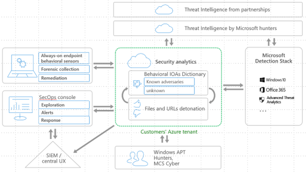
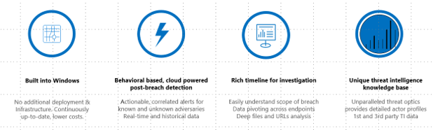

# Windows Defender Advanced Threat Protection

**Applies to:**

- Windows 10 Insider Preview

[Some information relates to pre-released product which may be substantially modified before it's commercially released. Microsoft makes no warranties, express or implied, with respect to the information provided here.]

Windows Defender Advanced Threat Protection (Windows Defender ATP) is a security service, built into Windows 10 that enables enterprise customers detect, investigate, and respond to advanced threats on their networks.

Windows Defender ATP uses the following combination of technology built into Windows 10 and Microsoft's robust cloud service:

-   **Endpoint behavioral sensors**: Embedded in Windows 10, these sensors
    collect and process behavioral signals from the operating system
    (for example, process, registry, file, and network communications)
    and sends this telemetry to your private, isolated, cloud instance of Windows Defender ATP.

-   **Cloud security analytics**: Leveraging big-data, machine-learning, and
    unique Microsoft optics across the Windows ecosystem (such as the
    [Microsoft Malicious Software Removal Tool](https://www.microsoft.com/en-au/download/malicious-software-removal-tool-details.aspx),
    enterprise cloud products (such as Office 365), and online assets
    (such as Bing and SmartScreen URL reputation), behavioral signals
    are translated into insights, detections, and recommended responses
    to advanced threats.

-   **Threat intelligence**: Generated by Microsoft hunters, security teams,
    and augmented by threat intelligence provided by partners, threat
    intelligence enables Windows Defender ATP to identify attacker
    tools, techniques, and procedures, and generate alerts when these
    are observed in collected telemetry.

The following diagram shows these Windows Defender ATP service
components:

Endpoint investigation capabilities in this service let you drill down
into security alerts and understand the scope and nature of a potential
breach. You can submit files for deep analysis and receive the results
without leaving the [Windows Defender ATP portal](https://securitycenter.windows.com).

Windows Defender ATP works with existing Windows security technologies
on endpoints, such as Windows Defender, AppLocker, and Device Guard. It
can also work side-by-side with third-party security solutions and
antimalware products.

Windows Defender ATP leverages Microsoft technology and expertise to
detect sophisticated cyber-attacks, providing:

- Behavior-based, cloud-powered, advanced attack detection

    Finds the attacks that made it past all other defenses (post breach detection),provides actionable, correlated alerts for known and unknown adversaries trying to hide their activities on endpoints.

- Rich timeline for forensic investigation and mitigation

    Easily investigate the scope of breach or suspected behaviors on any machine through a rich machine timeline. File, URLs, and network connection inventory across the network. Gain additional insight using deep collection and analysis (“detonation”) for any file or URLs.

- Built in threat intel knowledge base

    Unparalleled threat optics provides actor details and intent context for every threat intel-based detection – combining first and third-party intelligence sources.

## In this section

Topic | Description
:---|:---
[Minimum requirements](minimum-requirements-windows-defender-advanced-threat-protection.md) | This overview topic for IT professionals provides information on the minimum requirements to use Windows Defender ATP such as network and data storage configuration, and endpoint hardware ans software requirements, and deployment channels.
[Onboard endpoints and set up access](onboard-configure-windows-defender-advanced-threat-protection.md) | You'll need to onboard and configure the Windows Defender ATP service and the endpoints in your network before you can use the service. Learn about how you can assign users to the Windows Defender ATP service in Azure Active Directory (AAD) and using a configuration package to configure endpoints.
[Data storage and privacy](data-storage-privacy-windows-defender-advanced-threat-protection.md)| Learn about how Windows Defender ATP collects and handles information and where data is stored.
[Portal overview](portal-overview-windows-defender-advanced-threat-protection.md) | Understand the main features of the service and how it leverages Microsoft technology to protect enterprise endpoints from sophisticated cyber attacks.
[Use the Windows Defender Advanced Threat Protection portal](use-windows-defender-advanced-threat-protection.md) | Learn about the capabilities of Windows Defender ATP to help you investigate alerts that might be indicators of possible breaches in your enterprise.
[Windows Defender Advanced Threat Protection settings](settings-windows-defender-advanced-threat-protection.md) | Learn about setting the time zone and configuring the suppression rules to configure the service to your requirements.  
[Troubleshoot Windows Defender Advanced Threat Protection](troubleshoot-windows-defender-advanced-threat-protection.md) | This topic contains information to help IT Pros find workarounds for the known issues and troubleshoot issues in Windows Defender ATP.
