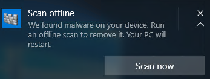
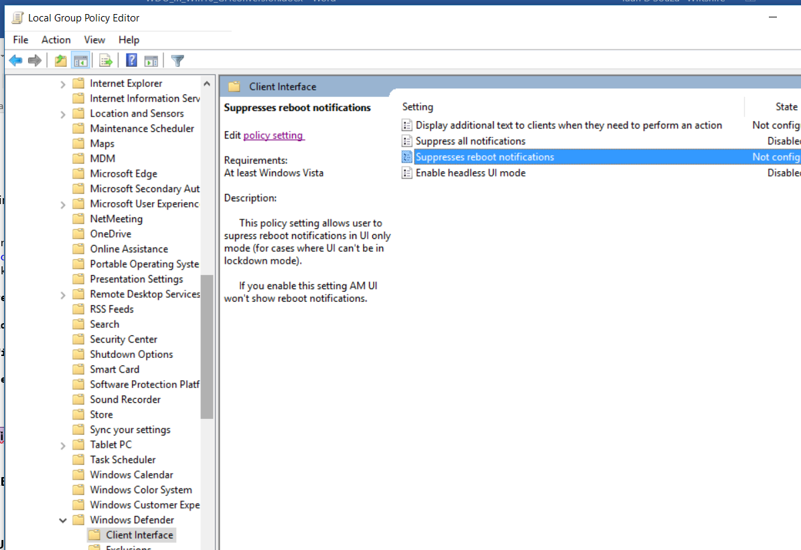
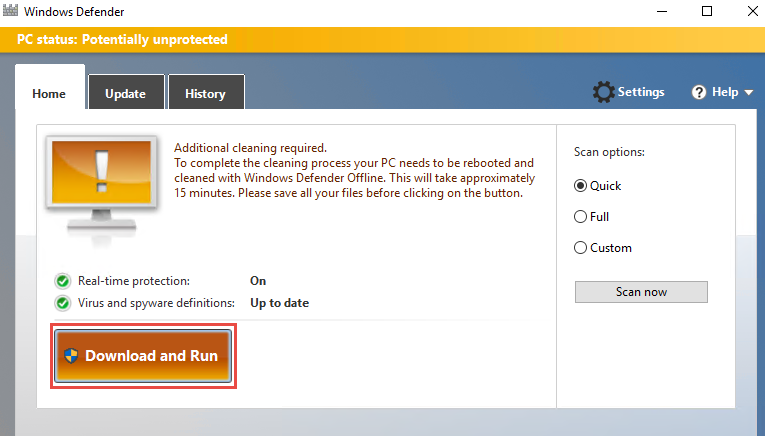
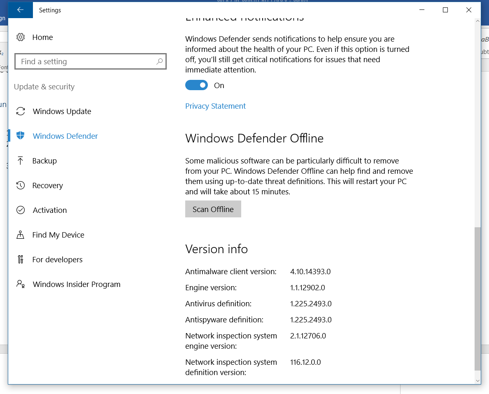
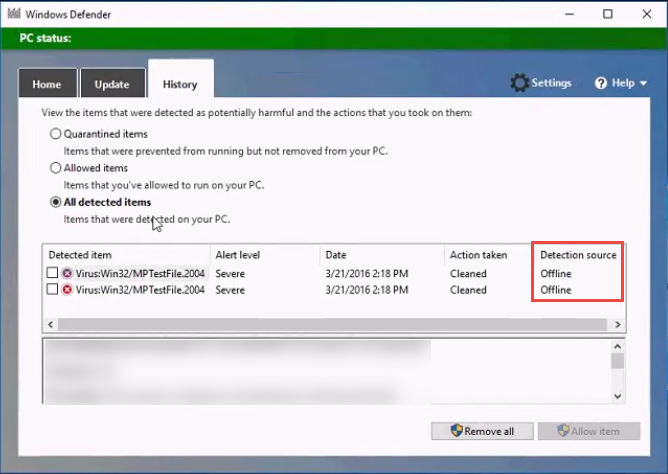

# Windows Defender Offline in Windows 10

**Applies to:**
- Windows 10, version 1607

Windows Defender Offline is an antimalware scanning tool that lets you boot and run a scan from a trusted environment. The scan runs from outside the normal Windows kernel so it can target malware that attempts to bypass the Windows shell, such as viruses and rootkits that infect or overwrite the master boot record (MBR).

Read more in [What is Windows Defender Offline?](http://windows.microsoft.com/en-US/windows/what-is-windows-defender-offline) 

In Windows 10, Windows Defender Offline can be run with one click directly from the Windows Defender client. In previous versions of Windows, a user had to install Windows Defender Offline to bootable media, restart the endpoint, and load the bootable media.

## Pre-requisites and requirements

Windows Defender Offline in Windows 10 has the same hardware requirements as Windows 10. See the Windows [Minimum hardware requirements](https://msdn.microsoft.com/library/windows/hardware/dn915086(v=vs.85).aspx) and [Hardware component guidelines](https://msdn.microsoft.com/library/windows/hardware/dn915049(v=vs.85).aspx) for more details.

> **Note:**&nbsp;&nbsp;Windows Defender Offline is not supported on machines with ARM processors, or on Windows Server Stock Keeping Units.

To run Windows Defender Offline from the endpoint, the user must be logged in with administrator privileges.
 
## Windows Defender Offline updates

Windows Defender Offline uses the most up-to-date signature definitions available; it's updated through the same update session as Windows Defender - usually though Microsoft Update or through the [Microsoft Malware Protection Center](https://www.microsoft.com/security/portal/definitions/adl.aspx). The Windows Defender Offline image is the same platform connected through the hardwired network, so it can update itself from the wired network.

You can still download Windows Defender Offline and create bootable media to run on any PCs that are not connected to the internet. <span style="background-color:yellow">{{This still true?}}</span>

## Usage scenarios

In most instances, will prompt you or the endpoint user to run Windows Defender Offline. You might also choose to run Windows Defender Offline if:

-	You have reason to suspect there is malware on the endpoint but that is not being detected by Windows Defender.

-	You want to perform the most complete scan available to ensure the endpoint is not infected.

-	Windows Defender reports that it has successfully cleaned or remediated a threat, however the threat returns.

If Windows Defender determines that Windows Defender Offline needs to run, it will prompt the user on the endpoint. <span style="background-color:yellow">{{Is this also revealed on SCCM or to the admin? How is that managed?}}</span>

The prompt can occur via a notification, similar to the following:



The user will also be notified within the Windows Defender client:


## Manage notifications

You can suppress Windows Defender Offline notifications with Group Policy.

**Suppress notifications with the Group Policy Management Console**

1. On your GP management machine, open the [Group Policy Management Console](https://technet.microsoft.com/en-us/library/cc731212.aspx), right-click the GPO you want to configure, and click **Edit**.

1. In the **Group Policy Management Editor** go to **Computer configuration**.

1. Click **Policies** then **Administrative templates**.

1. Expand the tree through **Windows components > Windows Defender > Client Interface**.

1. Double-click the **Suppresses reboot notifications** setting and set the option to **Enabled**.

<span style="background-color:yellow">{{Is this the correct setting in GPMC? I can't find a WDO suppress GP setting – this is the only one but it matches the description in the .adm template section. Which makes me wonder if the name of the setting in the template is correct or outdated? See the image below}}</span>

**Suppress notifications with the ADM template**

1.	Download the windowsdefender.adm Group Policy from the [Group Policy ADM files](https://www.microsoft.com/en-us/download/details.aspx?id=18664) on the Microsoft Download Center if it is not already deployed in Windows and visible in the Group Policy Object Editor or Group Policy Management Console.

2.	Add the windowsdefender.adm Group Policy template as described in the [Add or remove an Administrative Template (.adm file)](https://technet.microsoft.com/en-us/library/cc739134(v=ws.10).aspx) topic.

3.	Use the following Group Policy setting: <span style="background-color:yellow">{{ Is this template distributed by default in Windows? Or does an admin need to download it from somewhere? Can they get it from here https://www.microsoft.com/en-us/download/details.aspx?id=18664}}</span>

-	Setting name: **SuppressWdoNotification**

-	Group Policy location: **Computer Configuration\Administrative Templates\Windows Components\Windows Defender\Client Interface**

-	Registry path and value name: **HKEY_LOCAL_MACHINE\SOFTWARE\Policies\Microsoft\Windows Defender\UXConfiguration**

- Description: **Suppresses WDO notification in UI only (for cases where UI cannot be in lockdown mode).**
 


For information about managing ADMX files and using a central store for Administrative Templates files, see the [Managing Group Policy ADMX Files Step-by-Step Guide](http://go.microsoft.com/fwlink/?LinkId=75124). For Group Policy planning information, see the [Group Policy Planning and Deployment Guide](http://go.microsoft.com/fwlink/?LinkId=182208).	

## Run a scan 

Windows Defender Offline uses up-to-date threat definitions to scan your PC for malware that might be hidden. 

> **Note:**&nbsp;&nbsp;Before you use Windows Defender Offline, make sure you save any files and shut down running programs. The Windows Defender Offline scan takes about 15 minutes to run. It will restart your PC when the scan is complete. 

You can set up a Windows Defender Offline scan with the following:

-	Windows Defender

-	Windows Update and Security settings

-	Windows Management Instrumentation (WMI)

-	PowerShell

-	Group Policy

> **Note:**&nbsp;&nbsp;The scan is performed outside of the usual Windows operating environment. The user interface will appear different to a normal scan performed by Windows Defender. After the scan is completed, the endpoint will be restarted and Windows will load normally.

**Run Windows Defender Offline from Windows Defender**

1.	Open the **Start** menu, type **windows defender**, and press **Enter** to open the Windows Defender client. 

1.	On the **Home** tab click **Download and Run**.

    

1.	Follow the prompts to continue with the scan. You might be warned that you'll be signed out of Windows and that the endpoint will restart.

**Run Windows Defender Offline from Windows Settings**

1.	Open the **Start** menu and click or type **Settings**.

1.	Click **Update & Security** and then **Windows Defender**. Scroll to the bottom of the settings page until you see the **Windows Defender Offline** section.

1.	Click **Scan offline**. 

    

1.	Follow the prompts to continue with the scan. You might be warned that you'll be signed out of Windows and that the endpoint will restart.

**Use Windows Management Instrumentation to configure and run Windows Defender Offline**

Use the `MSFT_MpWDOScan` class (part of the Windows Defender WMI provider) to run a Windows Defender Offline scan.
 
The following WMI script snippet will immediately run a Windows Defender Offline scan, which will cause the endpoint to restart, run the offline scan, and then restart and boot into Windows.

```WMI
wmic /namespace:\\root\Microsoft\Windows\Defender path MSFT_MpWDOScan call Start 
```

See the following topics for configuration parameters and options:

-	[Windows Defender WMIv2 APIs](https://msdn.microsoft.com/en-us/library/windows/desktop/dn439477(v=vs.85).aspx) 

-	[MSFT_MpWDOScan class article](https://msdn.microsoft.com/library/windows/desktop/mt622458(v=vs.85).aspx)

You can also use WMI to enable and disable certain features in WDO. For example, you can use `Set-MpPreference` to change the `UILockdown` setting to disable and enable notifications. 

See the following topics for configuration parameters and options:

-	[Windows Defender WMIv2 APIs](https://msdn.microsoft.com/en-us/library/windows/desktop/dn439477(v=vs.85).aspx)

-	[Windows Defender MSFT_MpPreference class](https://msdn.microsoft.com/en-us/library/windows/desktop/dn455323(v=vs.85).aspx)

To run WDO remotely, xxx. <span style="background-color:yellow">{{How do we do this? Still in pipeline?}}</span>

**Run Windows Defender Offline using PowerShell**

Use the PowerShell parameter `Start-MpWDOScan` to run a Windows Defender Offline scan. 

See the [Use PowerShell cmdlets to configure and run Windows Defender](https://technet.microsoft.com/en-us/itpro/windows/keep-secure/use-powershell-cmdlets-windows-defender-for-windows-10) topic for more details on available cmdlets and options.

## Review scan results

Windows Defender Offline scan results will be listed in the main Windows Defender user interface after performing the scan. 

1.	Open the **Start** menu, type **windows defender**, and press **Enter** to open the Windows Defender client. 

1.	Go to the **History** tab.

1.	Select **All detected items**.

1.	Click **View details**.

Any detected items will display. Items that are detected by Windows Defender Offline will be listed as **Offline** in the **Detection source**:



