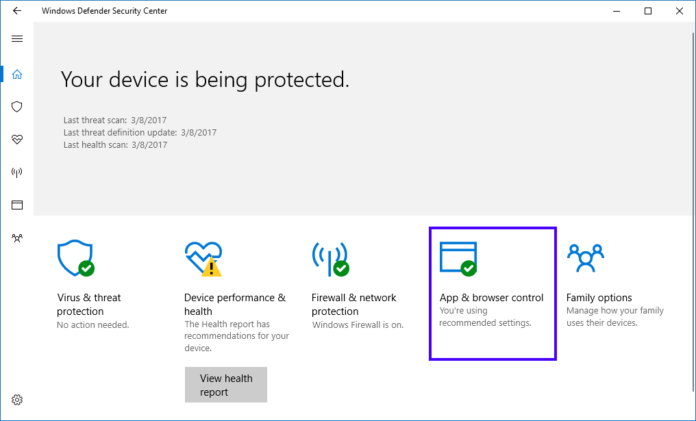
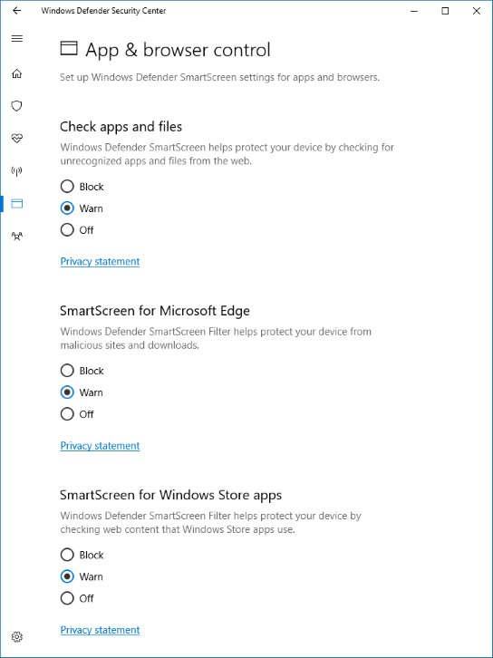

# Use Windows Defender Security Center to set Windows Defender SmartScreen for individual devices

**Applies to:**
- Windows 10, version 1703
- Windows 10 Mobile

Starting with Windows 10, version 1703 your employees can use Windows Defender Security Center to set up Windows Defender SmartScreen for an individual device, unless you've used Group Policy or Microsoft Intune to prevent it.

>[!NOTE]
>If any of the following settings are managed through Group Policy or mobile device management (MDM) settings, it appears as unavailable to the employee.

**To use Windows Defender Security Center to set up Windows Defender SmartScreen on a device**
1. Open the Windows Defender Security Center app, and then click **App & browser control**.

    

2. In the **App & browser control** screen, choose from the following options:

    - In the **Check apps and files** area:
    
        - **Block.** Stops employees from downloading and running unrecognized apps and files from the web.

        - **Warn.** Warns employees that the apps and files being downloaded from the web are potentially dangerous, but allows the action to continue.

        - **Off.** Turns off SmartScreen, so an employee isn't alerted or stopped from downloading potentially malicious apps and files.

    - In the **SmartScreen for Microsoft Edge** area:
    
        - **Block.** Stops employees from downloading and running unrecognized apps and files from the web, while using Microsoft Edge.
        
        - **Warn.** Warns employees that sites and downloads are potentially dangerous, but allows the action to continue while running in Microsoft Edge.
        
        - **Off.** Turns off SmartScreen, so an employee isn't alerted or stopped from downloading potentially malicious apps and files.    

    - In the **SmartScreen from Windows Store apps** area:
    
        - **Block.** Stops employees from visiting potentially malicious sites or from downloading and running unrecognized apps and files used by Windows Store apps.
        
        - **Warn.** Warns employees that the sites and downloads used by Windows Store apps are potentially dangerous, but allows the action to continue.
        
        - **Off.** Turns off SmartScreen, so an employee isn't alerted or stopped from visiting sites or from downloading potentially malicious apps and files.

        

## Related topics
- [Keep Windows 10 secure](https://technet.microsoft.com/itpro/windows/keep-secure/index)
- [Security technologies in Windows 10](https://technet.microsoft.com/itpro/windows/keep-secure/security-technologies)

>[!NOTE]
>Help to make this topic better by providing us with edits, additions, and feedback. For info about how to contribute to this topic, see [Contributing to TechNet content](https://github.com/Microsoft/windows-itpro-docs/blob/master/CONTRIBUTING.md).