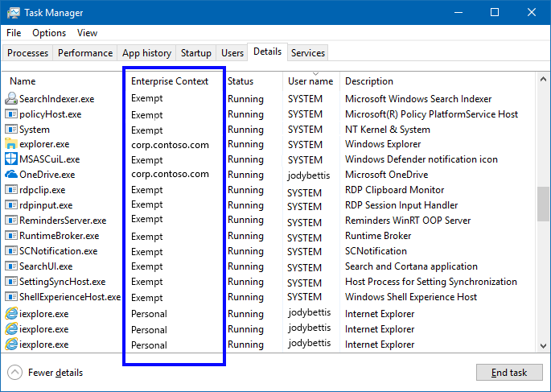

# Determine the Windows Information Protection (WIP) Enterprise Context for an app
**Applies to:**

-   Windows 10, version 1607
-   Windows 10 Mobile

>Learn more about what features and functionality are supported in each Windows edition at [Compare Windows 10 Editions](https://www.microsoft.com/en-us/WindowsForBusiness/Compare).

Check the context of your apps while running in Windows Information Protection (WIP) to make sure that your organization's policies are applied and running correctly.

Using Task Manager you can now see a specific app's context, including:

- **Work.** Shows the employee's work domain (such as, corp.contoso.com). This app can freely touch and open work data and resources.

- **Personal.** Shows the text, *Personal*. This app can't touch any work data or resources.

- **Exempt.** Shows the text, *Exempt*. WIP policies don't apply to these apps (such as, system components).

    >[!IMPORTANT]
    >Enlightened apps can change between Work and Personal, depending on the data being touched. For example, Microsoft Word 2016 shows as **Personal** when an employee opens a personal letter, but changes to **Work** when that same employee opens the company financials.

## Viewing the Enterprise Context column in Task Manager

1. Verify that you have an active WIP policy deployed and turned on in your organization.

2. Open the Task Manager (taskmgr.exe), click the **Details** tab, right-click in the column heading area, and click **Select columns**.

    The **Select columns** box appears.

    

3. Scroll down and check the **Enterprise Context** option, and then click **OK** to close the box.

    The **Enterprise Context** column should now be available in Task Manager.

    

