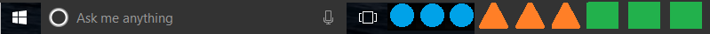
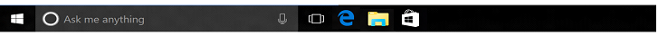
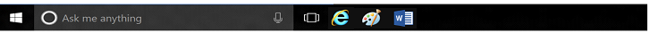
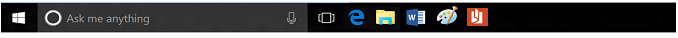
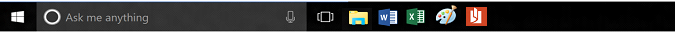

#Configure Windows 10 taskbar

Starting in Windows 10, version 1607, administrators can pin additional apps to the taskbar and remove default pinned apps from the taskbar by adding a `<TaskbarLayout>` section to a layout modification XML file. This method never removes user-pinned apps from the taskbar.


You can specify different taskbar configurations based on device locale and region, or operating system edition. There is no limit on the number of apps that you can pin. You specify apps using the [Application User Model ID (AUMID)](http://go.microsoft.com/fwlink/p/?LinkId=614867), Desktop Application ID, or Desktop Application Link Path. 

If you specify an app to be pinned that is not installed on the computer, it won't appear on the taskbar.

The order of apps in the xml file dictates order of apps on taskbar from left to right, to the right of any existing apps pinned by user.

**Note**  
In operating systems configured to use a right-to-left language, the taskbar order will be reversed.

The following example shows how apps will be pinned - Windows default apps to the left (blue), apps pinned by the user in the center (orange), and apps that you pin using XML to the right (green).




## Configure taskbar (general)

To configure the taskbar:
1. Create the XML file.
   * If you are also [customizing the Start layout](customize-and-export-start-layout.md), use Export-StartLayout to create the XML, and then add the `<CustomTaskbarLayoutCollection>` section from the following sample to the file.
   * If you are only configuring the taskbar, use the following sample to create LayoutModification.xml.
2. Edit and save the XML file. You can use [AUMID](http://go.microsoft.com/fwlink/p/?LinkId=614867), Desktop Application ID, or Desktop Application Link Path to identify the apps to pin to the taskbar.
   * Use `<taskbar:UWA>` and [AUMID](http://go.microsoft.com/fwlink/p/?LinkId=614867) to pin Universal Windows Platform apps.
   * Use `<taskbar:DesktopApp>` and Desktop Application ID or Desktop Application Link Path to pin desktop applications. 
3. Apply LayoutModification.xml to devices using [Group Policy](customize-windows-10-start-screens-by-using-group-policy.md) or a [provisioning package created in Windows Imaging and Configuration Designer (Windows ICD)](customize-windows-10-start-screens-by-using-provisioning-packages-and-icd.md).

### Sample taskbar configuration XML

```xml
<?xml version="1.0" encoding="utf-8"?>
<LayoutModificationTemplate
    xmlns="http://schemas.microsoft.com/Start/2014/LayoutModification"
    xmlns:defaultlayout="http://schemas.microsoft.com/Start/2014/FullDefaultLayout"
    xmlns:start="http://schemas.microsoft.com/Start/2014/StartLayout"
    xmlns:taskbar="http://schemas.microsoft.com/Start/2014/TaskbarLayout"
    Version="1">

  <CustomTaskbarLayoutCollection>
    <defaultlayout:TaskbarLayout>
      <taskbar:TaskbarPinList>
        <taskbar:UWA AppUserModelID="Microsoft.MicrosoftEdge_8wekyb3d8bbwe!MicrosoftEdge" />
        <taskbar:DesktopApp DesktopApplicationID="Microsoft.Windows.Explorer" />
      </taskbar:TaskbarPinList>
    </defaultlayout:TaskbarLayout>
 </CustomTaskbarLayoutCollection>
</LayoutModificationTemplate>
```
### Sample taskbar configuration added to Start layout XML

```xml
<LayoutModificationTemplate Version="1" xmlns="http://schemas.microsoft.com/Start/2014/LayoutModification">
  <DefaultLayoutOverride>
    <StartLayoutCollection>
      <defaultlayout:StartLayout GroupCellWidth="6" xmlns:defaultlayout="http://schemas.microsoft.com/Start/2014/FullDefaultLayout">
        <start:Group Name="Life at a glance" xmlns:start="http://schemas.microsoft.com/Start/2014/StartLayout">
          <start:Tile Size="2x2" Column="0" Row="0" AppUserModelID="Microsoft.MicrosoftEdge_8wekyb3d8bbwe!MicrosoftEdge" />
          <start:Tile Size="2x2" Column="4" Row="0" AppUserModelID="Microsoft.Windows.Cortana_cw5n1h2txyewy!CortanaUI" />
          <start:Tile Size="2x2" Column="2" Row="0" AppUserModelID="Microsoft.BingWeather_8wekyb3d8bbwe!App" />
        </start:Group>        
      </defaultlayout:StartLayout>
    </StartLayoutCollection>
    <CustomTaskbarLayoutCollection>
      <defaultlayout:TaskbarLayout>
        <taskbar:TaskbarPinList>
          <taskbar:UWA AppUserModelID="Microsoft.MicrosoftEdge_8wekyb3d8bbwe!MicrosoftEdge" />
          <taskbar:DesktopApp DesktopApplicationID="Microsoft.Windows.Explorer" />
        </taskbar:TaskbarPinList>
      </defaultlayout:TaskbarLayout>
    </CustomTaskbarLayoutCollection>
  </DefaultLayoutOverride>
</LayoutModificationTemplate>
```

##Keep default apps and add your own

The `<CustomTaskbarLayoutCollection>` section will append listed apps to the taskbar by default. The following sample keeps the default apps pinned and adds pins for Paint, Microsoft Reader, and a command prompt.

```xml
<?xml version="1.0" encoding="utf-8"?>
<LayoutModificationTemplate
    xmlns="http://schemas.microsoft.com/Start/2014/LayoutModification"
    xmlns:defaultlayout="http://schemas.microsoft.com/Start/2014/FullDefaultLayout"
    xmlns:start="http://schemas.microsoft.com/Start/2014/StartLayout"
    xmlns:taskbar="http://schemas.microsoft.com/Start/2014/TaskbarLayout"
    Version="1">
  <CustomTaskbarLayoutCollection>
    <defaultlayout:TaskbarLayout>
      <taskbar:TaskbarPinList>
        <taskbar:DesktopApp DesktopApplicationLinkPath="%ALLUSERSPROFILE%\Microsoft\Windows\Start Menu\Programs\Accessories\Paint.lnk" />
        <taskbar:UWA AppUserModelID="Microsoft.Reader_8wekyb3d8bbwe!Microsoft.Reader" />
        <taskbar:DesktopApp DesktopApplicationLinkPath="%appdata%\Microsoft\Windows\Start Menu\Programs\System Tools\Command Prompt.lnk" />
      </taskbar:TaskbarPinList>
    </defaultlayout:TaskbarLayout>
  </CustomTaskbarLayoutCollection>
</LayoutModificationTemplate>
```
**Before:**



**After:**
 
 

##Remove default apps and add your own

By adding `PinListPlacement="Replace"` to `<CustomTaskbarLayoutCollection>`, you remove all default pinned apps; only the apps that you specify will be pinned to the taskbar.

If you only want to remove some of the default pinned apps, you would use this method to remove all default pinned apps and then include the default app that you want to keep in your list of pinned apps.

```xml
<?xml version="1.0" encoding="utf-8"?>
<LayoutModificationTemplate
    xmlns="http://schemas.microsoft.com/Start/2014/LayoutModification"
    xmlns:defaultlayout="http://schemas.microsoft.com/Start/2014/FullDefaultLayout"
    xmlns:start="http://schemas.microsoft.com/Start/2014/StartLayout"
    xmlns:taskbar="http://schemas.microsoft.com/Start/2014/TaskbarLayout"
    Version="1">
  <CustomTaskbarLayoutCollection PinListPlacement="Replace">
    <defaultlayout:TaskbarLayout>
      <taskbar:TaskbarPinList>
        <taskbar:UWA AppUserModelID="Microsoft.InternetExplorer.Default" />
        <taskbar:DesktopApp DesktopApplicationLinkPath="%ALLUSERSPROFILE%\Microsoft\Windows\Start Menu\Programs\Accessories\Paint.lnk" />
        <taskbar:UWA AppUserModelID="Microsoft.Office.Word_8wekyb3d8bbwe!microsoft.word" />
      </taskbar:TaskbarPinList>
    </defaultlayout:TaskbarLayout>
  </CustomTaskbarLayoutCollection>
</LayoutModificationTemplate>

```
**Before:**


**After:**



## Configure taskbar (by region)

The following example shows you how to configure taskbars by region. When you specify one or more regions in `<taskbar:TaskbarPinList>`, the pinned apps in that section are only pinned on computers that are configured for that region. When specifying taskbar configuration by region, the taskbar will concatenate pinlists together so long as the target computer meets the region requirements. If no region is specified for a `<TaskbarPinList>` node, it will apply to every region.

```xml
<?xml version="1.0" encoding="utf-8"?>
<LayoutModificationTemplate
    xmlns="http://schemas.microsoft.com/Start/2014/LayoutModification"
    xmlns:defaultlayout="http://schemas.microsoft.com/Start/2014/FullDefaultLayout"
    xmlns:start="http://schemas.microsoft.com/Start/2014/StartLayout"
    Version="1">

   <CustomTaskbarLayoutCollection>
    <defaultlayout:TaskbarLayout>
      <taskbar:TaskbarPinList region="US|UK">
        <taskbar:UWA AppUserModelID="Microsoft.MicrosoftEdge_8wekyb3d8bbwe!MicrosoftEdge" />
     </taskbar:TaskbarPinList>
    <taskbar:TaskbarPinList>
      <taskbar:DesktopApp DesktopApplicationID="Microsoft.Windows.Explorer" />
      <taskbar:UWA AppUserModelID="Microsoft.Office.Word_8wekyb3d8bbwe!microsoft.word" />
    </taskbar:TaskbarPinList>
    <taskbar:TaskbarPinList region="DE|FR">
      <taskbar:UWA AppUserModelID="Microsoft.Office.Excel_8wekyb3d8bbwe!microsoft.excel" />
    </taskbar:TaskbarPinList>
    <taskbar:TaskbarPinList>
      <taskbar:DesktopApp DesktopApplicationLinkPath="%ALLUSERSPROFILE%\Microsoft\Windows\Start Menu\Programs\Accessories\Paint.lnk"/>
      <taskbar:UWA AppUserModelID="Microsoft.Reader_8wekyb3d8bbwe!Microsoft.Reader" />
    </taskbar:TaskbarPinList>
  </defaultlayout:TaskbarLayout>
 </CustomTaskbarLayoutCollection>
</LayoutModificationTemplate>
```

When the preceding example XML for region is applied, the resulting tasbkar for computers in the US or UK:



The resulting taskbar for computers in Germany or France:



The resulting tasbkar for computers in any other region:


**Note**  
[Look up region codes (use the ISO Short column)](http://go.microsoft.com/fwlink/p/?LinkId=786445)

## Configure taskbar (by Windows 10 edition)

The following example shows you how to configure taskbars by edition, so that you can apply one configuration to Windows 10 Enterprise and a different configuration to Windows 10 Education. 

```xml
<?xml version="1.0" encoding="utf-8"?>
<LayoutModificationTemplate
    xmlns="http://schemas.microsoft.com/Start/2014/LayoutModification"
    xmlns:defaultlayout="http://schemas.microsoft.com/Start/2014/FullDefaultLayout"
    xmlns:start="http://schemas.microsoft.com/Start/2014/StartLayout"
    xmlns:taskbar="http://schemas.microsoft.com/Start/2014/TaskbarLayout"
    Version="1">
  <CustomTaskbarLayoutCollection>
    <defaultlayout:TaskbarLayout SKU="PPI">
      <taskbar:TaskbarPinList>
        <taskbar:DesktopApp DesktopApplicationLinkPath="%APPDATA%\Microsoft\Windows\Start Menu\Programs\Accessories\Internet Explorer.lnk" />
        <taskbar:DesktopApp DesktopApplicationLinkPath="%APPDATA%\Microsoft\Windows\Start Menu\Programs\Accessories\Notepad.lnk" />
        <taskbar:UWA AppUserModelID="Microsoft.Windows.Photos_8wekyb3d8bbwe!App" />
      </taskbar:TaskbarPinList>
    </defaultlayout:TaskbarLayout>
    <defaultlayout:TaskbarLayout SKU="Server|ServerSolution">
      <taskbar:TaskbarPinList>
        <taskbar:UWA AppUserModelID="Microsoft.Windows.Photos_8wekyb3d8bbwe!App" />
        <taskbar:DesktopApp DesktopApplicationID="Microsoft.Office.lync.exe.15" />
        <taskbar:DesktopApp DesktopApplicationID="Microsoft.Office.OUTLOOK.EXE.15" />
      </taskbar:TaskbarPinList>
    </defaultlayout:TaskbarLayout>
  </CustomTaskbarLayoutCollection>
</LayoutModificationTemplate>

```


## Layout Modification Template schema definition

```xml
<?xml version="1.0" encoding="utf-8"?>
<xsd:schema xmlns:xsd="http://www.w3.org/2001/XMLSchema"
            xmlns:local="http://schemas.microsoft.com/Start/2014/TaskbarLayout"
            targetNamespace="http://schemas.microsoft.com/Start/2014/TaskbarLayout"
            elementFormDefault="qualified">

  <xsd:complexType name="ct_PinnedUWA">
    <xsd:attribute name="AppUserModelID" type="xsd:string" />
  </xsd:complexType>

  <xsd:complexType name="ct_PinnedDesktopApp">
    <xsd:attribute name="DesktopApplicationID" type="xsd:string" />
    <xsd:attribute name="DesktopApplicationLinkPath" type="xsd:string" />
  </xsd:complexType>

  <xsd:complexType name="ct_TaskbarPinList">
    <xsd:sequence>
      <xsd:choice minOccurs="1" maxOccurs="unbounded">
        <xsd:element name="UWA" type="local:ct_PinnedUWA" />
        <xsd:element name="DesktopApp" type="local:ct_PinnedDesktopApp" />
      </xsd:choice>
    </xsd:sequence>
    <xsd:attribute name="Region" type="xsd:string" use="optional" />
  </xsd:complexType>

  <xsd:simpleType name="st_TaskbarPinListPlacement">
    <xsd:restriction base="xsd:string">
      <xsd:enumeration value="Append" />
      <xsd:enumeration value="Replace" />
    </xsd:restriction>
  </xsd:simpleType>

  <xsd:attributeGroup name="ag_SelectionAttributes">
    <xsd:attribute name="SKU" type="xsd:string" use="optional"/>
    <xsd:attribute name="Region" type="xsd:string" use="optional"/>
  </xsd:attributeGroup>

  <xsd:complexType name="ct_TaskbarLayout">
    <xsd:sequence>
      <xsd:element name="TaskbarPinList" type="local:ct_TaskbarPinList" minOccurs="1" maxOccurs="1" />
    </xsd:sequence>
    <xsd:attributeGroup ref="local:ag_SelectionAttributes"/>
  </xsd:complexType>

</xsd:schema>
```

## Related topics

[Customize and export Start layout](customize-and-export-start-layout.md)

[Customize Windows 10 Start with Group Policy](customize-windows-10-start-screens-by-using-group-policy.md)

[Customize Windows 10 Start with mobile device management (MDM)](customize-windows-10-start-screens-by-using-mobile-device-management.md)

[Customize Windows 10 Start with ICD and provisioning packages](customize-windows-10-start-screens-by-using-provisioning-packages-and-icd.md)

[Changes to Group Policy settings for Windows 10 Start](changes-to-start-policies-in-windows-10.md)