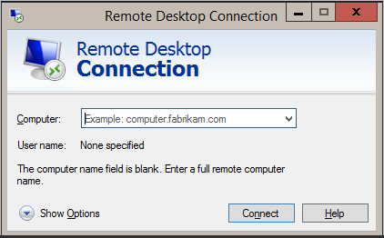

# Connect to remote Azure Active Directory-joined PC

**Applies to**

-   Windows 10

From its release, Windows 10 has supported remote connections to PCs that are joined to Active Directory. Starting in Windows 10, version 1607, you can also connect to a remote PC that is joined to Azure Active Directory (Azure AD).

## Set up

- Both PCs (local and remote) must be running Windows 10, version 1607. Remote connection to an Azure AD-joined PC that is running earlier versions of Windows 10 is not supported.
- Ensure [Remote Credential Guard](../keep-secure/remote-credential-guard.md), a new feature in Windows 10, version 1607, is turned off on the client PC.
- On the PC that you want to connect to:
  1. Open system properties for the remote PC. 
  2. Enable **Allow remote connections to this computer** and select **Allow connections only from computers running Remote Desktop with Network Level Authentication**. 

   

  3. If the user who joined the PC to Azure AD is the only one who is going to connect remotely, no additional configuration is needed. To allow additional users, click **Select Users**.
  4. Enter **Authenticated Users**, then click **Check Names**. If the **Name Not Found** window opens, click **Locations** and select this PC.

 
## Supported configurations
 
In organizations that have integrated Active Directory and Azure AD, you can connect from a domain-joined PC to an Azure AD-joined PC using:

- Password
- Smartcards
- Windows Hello for Business, if the domain is managed by System Center Configuration Manager

In organizations that have integrated Active Directory and Azure AD, you can connect from an Azure AD-joined PC to an AD-joined PC when the Azure AD-joined PC is on the corporate network using:

- Password
- Smartcards
- Windows Hello for Business, if the organization has a mobile device management (MDM) subscription. 

In organizations that have integrated Active Directory and Azure AD, you can connect from an Azure AD-joined PC to another Azure AD-joined PC using:

- Password
- Smartcards
- Windows Hello for Business, with or without an MDM subscription. 

 
In organizations using only Azure AD, you can connect from an Azure AD-joined PC to another Azure AD-joined PC using:

- Password
- Windows Hello for Business, with or without an MDM subscription. 

## Related topics

[How to use Remote Desktop](http://windows.microsoft.com/en-us/windows-10/how-to-use-remote-desktop)

[Remote Desktop Connection: frequently asked questions](http://windows.microsoft.com/en-us/windows/remote-desktop-connection-faq#1TC=windows-8) (Windows 8.1 documentation, still applicable to Windows 10)

 

 

