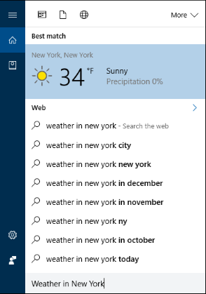
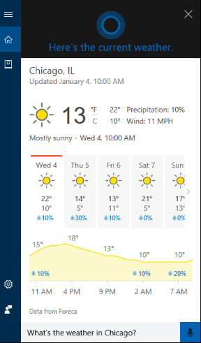

# Test scenario 2 - Perform a quick search with Cortana at work

-   Windows 10, Windows Insider Program 
-   Windows 10 Mobile, Windows Insider Program

>[!IMPORTANT]
>The data created as part of these scenarios will be uploaded to Microsoft’s Cloud to help Cortana learn and help your employees. This is the same info that Cortana uses in the consumer offering.Test Scenario 2: Perform a quick search with Cortana

This scenario helps you perform a quick search using Cortana, both typing and through voice commands.

**To search using Cortana**
1. Click on the **Cortana** icon in the taskbar, and then click in the **Search** bar.

2. Type *Weather in New York*.

    You should see the weather in New York, New York at the top of the search results.

        
 
**To create a reminder for a specific location by using voice commands**
1. Click on the **Cortana** icon in the taskbar, and then click the **Microphone** icon (to the right of the **Search** box).

2.	Say *What's the weather in Chicago?* Cortana tells you and shows you the current weather in Chicago.

    