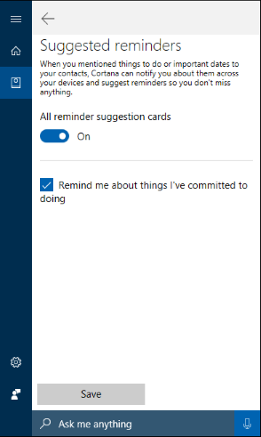

# Test scenario 6 - Use Cortana to automatically create suggested reminders from email

-   Windows 10, Windows Insider Program 
-   Windows 10 Mobile, Windows Insider Program

>[!IMPORTANT]
>Some information relates to prereleased product which may be substantially modified before it's commercially released. Microsoft makes no warranties, express or implied, with respect to the information provided here.

>[!IMPORTANT]
>The data created as part of these scenarios will be uploaded to Microsoft’s Cloud to help Cortana learn and help your employees. This is the same info that Cortana uses in the consumer offering.

Cortana can automatically create a suggested reminder, based on commitments made in email. For example, Cortana recognizes that if an employee includes the text, I’ll get this to you by the end of the week, he or she is making a commitment to provide something by a specific date. Cortana can now automatically create a suggested reminder, letting the employee decide whether to keep it or to cancel it.

## Use Cortana to set suggested reminders based on email commitments

1. Click on the **Cortana** search box in the taskbar, click the **Notebook** icon, and then click **Permissions**.

2. Make sure the **Contacts, email, calendar, and communication history** option is turned on.

    

3. Click the **Notebook** icon again, click the **Suggested reminders** option, and then click the **Remind me about things I’ve committed to doing** box, and then click **Save**.

    

4. Create and send an email to yourself (so you can see the suggested reminder), including the text, _I’ll finish this project by end of day today_.

5.	After you get the email, click on the Cortana **Home** icon, and scroll to today’s events.

    From here, you can view the email where you made the promise, set aside time on your calendar, officially set the reminder, or mark the reminder as completed.

        

