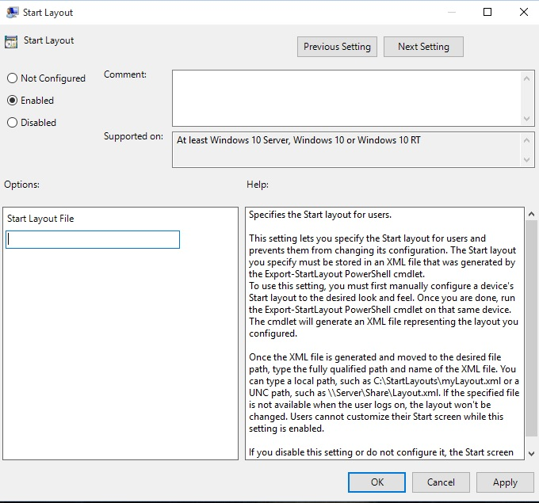

# Customize Windows 10 Start with Group Policy

**Applies to**

-   Windows 10

**Looking for consumer information?**

-   [Customize the Start menu](http://go.microsoft.com/fwlink/p/?LinkId=623630)

**In this article**

-   [Operating system requirements](#operating-system-requirements)
-   [How Start layout control works](#bkmk-howstartscreencontrolworks)
-   [Use Group Policy to apply a customized Start layout in a domain](#bkmk-domaingpodeployment)
-   [Use Group Policy to apply a customized Start layout on the local computer](#bkmk-localgpimport)
-   [Update a customized Start layout](#bkmk-updatestartscreenlayout)
-   [Related topics](#related-topics)

In Windows 10 Enterprise and Windows 10 Education, you can use a Group Policy Object (GPO) to deploy a customized Start layout to users in a domain. No reimaging is required, and the Start layout can be updated simply by overwriting the .xml file that contains the layout. This enables you to customize Start layouts for different departments or organizations, with minimal management overhead.

This topic describes how to update Group Policy settings to display a customized Start layout when the users sign in. By creating a domain-based GPO with these settings, you can deploy a customized Start layout to users in a domain.

**Warning**  
When a full Start layout is applied with this method, the users cannot pin, unpin, or uninstall apps from Start. Users can view and open all apps in the **All Apps** view, but they cannot pin any apps to Start. When a partial Start layout is applied, the contents of the specified tile groups cannot be changed, but users can move those groups, and can also create and customize their own groups.

 

**Before you begin**: [Customize and export Start layout](customize-and-export-start-layout.md)

## Operating system requirements

Start layout control using Group Policy is supported in Windows 10 Enterprise and Windows 10 Education. Start layout control is not supported in Windows 10 Pro.

The GPO can be configured from any computer on which the necessary ADMX and ADML files (StartMenu.admx and StartMenu.adml) for Windows 10 are installed. In Group Policy, ADMX files are used to define Registry-based policy settings in the Administrative Templates category. To find out how to create a central store for Administrative Templates files, see [article 929841](http://go.microsoft.com/fwlink/p/?LinkId=691687) in the Microsoft Knowledge Base.

## How Start layout control works

Two features enable Start layout control:

-   The [Export-StartLayout](http://go.microsoft.com/fwlink/p/?LinkID=620879) cmdlet in Windows PowerShell exports a description of the current Start layout in .xml file format. **Start layout** can only be applied to a device using the same architecture (32-bit or 64-bit) as the device on which **Start layout** was created.

    **Note**  
    To import the layout of Start to a mounted Windows image, use the [Import-StartLayout](http://go.microsoft.com/fwlink/p/?LinkId=623707) cmdlet.

     

-   In Group Policy, you use the **Start Layout** settings for the **Start Menu and Taskbar** administrative template to set a Start layout from an .xml file when the policy is applied.

**Note**  
To learn how customize Start to include your line-of-business apps when you deploy Windows 10, see [Customize the Windows 10 Start layout]( http://go.microsoft.com/fwlink/p/?LinkId=620863).

 

## Use Group Policy to apply a customized Start layout in a domain

To apply the Start layout to users in a domain, use the Group Policy Management Console (GPMC) to configure a domain-based Group Policy Object (GPO) that sets **Start Layout** policy settings in the **Start Menu and Taskbar** administrative template for users in a domain.

The GPO applies the Start layout at the next user sign-in. Each time the user signs in, the timestamp of the .xml file with the Start layout is checked and if a newer version of the file is available, the settings in the latest version of the file are applied.

The GPO can be configured from any computer on which the necessary ADMX and ADML files (StartMenu.admx and StartMenu.adml) for Windows 10 are installed.

The .xml file with the Start layout must be located on shared network storage that is available to the users’ computers when they sign in and the users must have Read-only access to the file. If the file is not available at sign-in, Start is not customized during the session, and the user can make changes to Start.

For information about deploying GPOs in a domain, see [Working with Group Policy Objects](http://go.microsoft.com/fwlink/p/?LinkId=620889).

## Use Group Policy to apply a customized Start layout on the local computer

You can use the Local Group Policy Editor to provide a customized Start layout for any user who signs in on the local computer. To display the customized Start layout for any user who signs in, configure **Start Layout** policy settings for the **Start Menu and Taskbar** administrative template. You can use the **Start Menu and Taskbar** administrative template in **User Configuration** or **Computer Configuration**.

**Note**  
This procedure applies the policy settings on the local computer only. For information about deploying the Start layout to users in a domain, see [Use Group Policy to deploy a customized Start layout in a domain](#bkmk-domaingpodeployment), later in this topic.

This procedure creates a Local Group Policy that applies to all users on the computer. To configure Local Group Policy that applies to a specific user or group on the computer, see [Step-by-Step Guide to Managing Multiple Local Group Policy Objects](http://go.microsoft.com/fwlink/p/?LinkId=620881). The guide was written for Windows Vista and the procedures still apply to Windows 10.

 

This procedure adds the customized Start layout to the user configuration, which overrides any Start layout settings in the local computer configuration when a user signs in on the computer.

**To configure Start Layout policy settings in Local Group Policy Editor**

1.  On the test computer, press the Windows key, type **gpedit**, and then select **Edit group policy (Control panel)**.

2.  Go to **User Configuration** or **Computer Configuration** &gt; **Administrative Templates** &gt;**Start Menu and Taskbar**.

    

3.  Right-click **Start Layout** in the right pane, and click **Edit**.

    This opens the **Start Layout** policy settings.

    

4.  Enter the following settings, and then click **OK**:

    1.  Select **Enabled**.

    2.  Under **Options**, specify the path to the .xml file that contains the Start layout. For example, type **C:\\Users\\Test01\\StartScreenMarketing.xml**.

    3.  Optionally, enter a comment to identify the Start layout.

    **Important**  
    If you disable Start Layout policy settings that have been in effect and then re-enable the policy, users will not be able to make changes to Start, however the layout in the .xml file will not be reapplied unless the file has been updated. In Windows PowerShell, you can update the timestamp on a file by running the following command:

    `(ls <path>).LastWriteTime = Get-Date`

     

## Update a customized Start layout

After you use Group Policy to apply a customized Start layout on a computer or in a domain, you can update the layout simply by replacing the .xml file that is specified in the Start Layout policy settings with a file with a newer timestamp.

## Related topics

[Manage Windows 10 Start layout options](windows-10-start-layout-options-and-policies.md)

[Customize and export Start layout](customize-and-export-start-layout.md)

[Customize Windows 10 Start with ICD and provisioning packages](customize-windows-10-start-screens-by-using-provisioning-packages-and-icd.md)

[Customize Windows 10 Start with mobile device management (MDM)](customize-windows-10-start-screens-by-using-mobile-device-management--mdm-.md)

 

 

