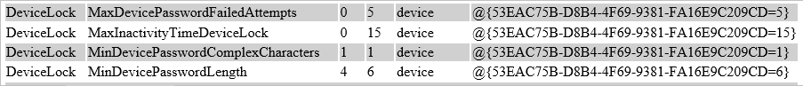

# Diagnostics for devices managed by MDM 

**Applies to**

-   Windows 10
-   Windows 10 Mobile

(which SKUs?)

(this isn't really MDM-managed only, is it? It can be done locally/email?)

Two new diagnostic tools for Windows 10, version 1607, help IT administrators diagnose and resolve issues with remote devices enrolled in mobile device management (MDM): the [Device Policy State Log](#device-policy-state-log) and [UDiag](#udiag). Windows 10 for desktop editions and Windows 10 Mobile make it simple for users to export log files that you can then analyze with these tools.

## Export management log files

Go to **Settings > Accounts > Work access > Export your management log files**.

- On desktop devices, the file is saved to C:/Users/Public/Public Documents/MDMDiagnostics/MDMDiagReport.xml
- On phones, the file is saved to *phone*/Documents/MDMDiagnostics/MDMDiagReport.xml

The MDMDiagReport.xml can be used with [Device Policy State Log](#device-policy-state-log) and [UDiag](#udiag) to help you resolve issues.

## Device Policy State Log

The Device Policy State Log collects information on the state of policies applied to the device to help you determine which sources are applying policies or configurations to the device. Help desk personnel can use this log to diagnose and resolve issues with a remote device. 

After you obtain the management log file from the user's device, run the mdmReportGenerator.ps1 script on log to create report. (download mdmReportGenerator.ps1 and mdmDiagnoseHelpers.psm1) This PowerShell script asks you to enter the name of the management log file and a name for the report that it will create, as shown in the following example:

The script produces the report in html format. There are two sections to the report, Configuration and Policy Information. 

 The configuration section lists the GUID of the sources that are applying configurations to the device.  

 

The policy information section displays information about the specific policies that are being enforced and on the device.  For each policy, you will see the Area grouping, the Policy name, its default and current value, and the configuration source. You can compare the configuration source GUID in the policy information section to the GUIDs in the configuration section to identify the source of the policy.

## UDiag

The UDiag tool applies rules to Event Tracing for Windows (ETW) files to help determine the root cause of an issue. 

(download UDiag)

To analyze MDMDiagReport.xml using UDiag
1. Open UDiag, and select Device Management.
2. Select your source for the log files ("cab of logs" or "directory of logs")

Investigating log content, identifying patterns, and adding a root cause analysis to the database (Advanced users/providers) 

1. While at the 'Root Causes List' panel, click the 'Diagnose' button at the bottom. 
2. You will then be brought to the Diagnosis panel where you can investigate and tag root causes from the content
  - Evidence Groups: When a set of logs are loaded into UDiag, the contents are processed (e.g. ETW) and organized into evidence groups. 
  - Decision Tree View: This view shows the loaded decision tree for the current topic/topic area. When a decision node is selected, a user can modify the regular expression and add/edit/delete an RCA for that node. Any RCA matches found in the current log set will have an 'RCA' label that is either Red or Yellow.
  - Evidence View: Selecting an evidence group loads its content into this evidence view. Use this view to investigate issues and determine root causes. Drag and drop lines from the Evidence View into the Decision Tree View, to build your root cause analysis pattern. ([Learn more about techniques for root cause analysis.](https://technet.microsoft.com/en-us/library/cc543298.aspx))

 	

	Can admin pull logs without user action? [DK] Yes via the diagnostic log CSP

	

	"Run PowerShell script to process the file" – is that the user doing it? How can this workflow work in an enterprise where employees aren't computer-savvy? [DK] This is intended to be done by the help desk guy.  

	Where did (user|admin) get mdmReportGenerator.ps1?  [DK] Publishing on DLC later this summer

	In Viewing the report, how does the admin make sense of the source GUIDs? [DK] Correlates the value in the table with the entries at the top of the page. 

	UDiag – where does admin get this? [DK] Publishing on DLC later this summer

	Can admins create custom rule sets? [DK] Right now, no.  but open to feedback on this.

	

Link to [Diagnose MDM failures in Windows 10](https://msdn.microsoft.com/en-us/library/windows/hardware/mt632120%28v=vs.85%29.aspx)

[Diagnostics capability for devices managed by any MDM provider.](https://microsoft.sharepoint.com/teams/osg_core_ens/mgmt/OSMan Wiki/MDM Diagnostics - Generating and Processing Log files.aspx)

[Redstone spec](https://microsoft.sharepoint.com/teams/specstore/_layouts/15/WopiFrame.aspx?sourcedoc=%7b7E8742A2-03A1-451C-BA07-F2573B044CBF%7d&file=DM%20-%20MDM%20Diagnostics-RS.docx&action=default&DefaultItemOpen=1)

## Related topics

[DiagnosticLog CSP](https://msdn.microsoft.com/en-us/library/windows/hardware/mt219118.aspx)

[Diagnose MDM failures in Windows 10](https://msdn.microsoft.com/en-us/library/windows/hardware/mt632120.aspx)