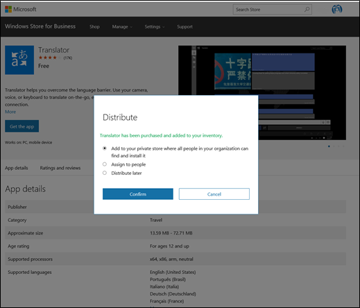

# Distribute apps using your private store

**Applies to**

-   Windows 10
-   Windows 10 Mobile
** Question: Does this really apply for Windows 10 Mobile? If so, please revise article **

The private store is a feature in Windows Store for Business that organizations receive during the sign up process. When admins add apps to the private store, all employees in the organization can view and download the apps. Your private store is available as a tab in the Windows Store, and is usually named for your company or organization. Only apps with online licenses can be added to the private store.

You can make an app available in your private store when you acquire the app, or you can do it later from your inventory. Once the app is in your private store, employees can claim and install the app.

**To acquire an app and make it available in your private store**

1.  Sign in to the [Store for Business](https://businessstore.microsoft.com).

2.  Click an app, choose the license type, and then click **Get the app** to acquire the app for your organization.

    

Windows Store for Business add the app to your **Inventory**. Click **Manage**, **Inventory** for app distribution options. 

**To make an app in Inventory available in your private store**

1.  Sign in to the [Store for Business](https://businessstore.microsoft.com).

2.  Click **Manage**, and then choose **Inventory**.

    

3.  Click **Refine**, and then choose **Online**. Store for Business will update the list of apps on the **Inventory** page.

4.  From an app in **Inventory**, click the ellipses under **Action**, and then choose **Add to private store**.

    

The value under **Private store** for the app will change to pending. It will take approximately twelve hours before the app is available in the private store.

Employees can claim apps that admins added to the private store by doing the following.

**To claim an app from the private store**

1.  Sign in to your computer with your Azure Active Directory (AD) credentials, and start the Windows Store app.

2.  Click the **private store** tab.

3.  Click the app you want to install, and then click **Install**.

## Related topics

[Manage access to private store](manage-access-to-private-store.md)

[Configure access to Windows Store](stop-employees-from-using-the-windows-store.md)

 

 

