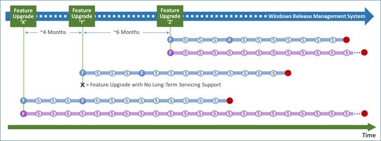
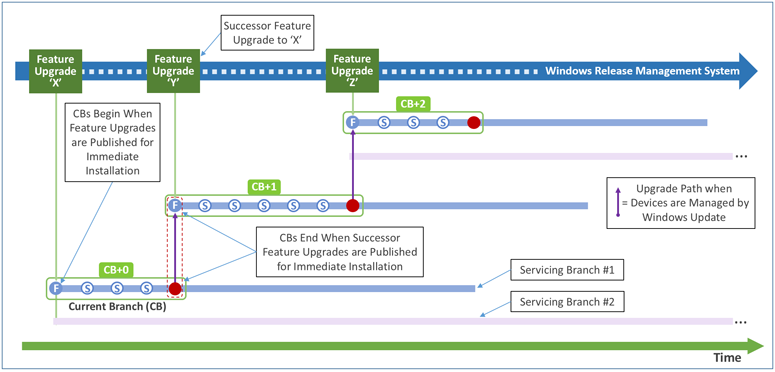

# Windows 10 servicing options

**Applies to**
-   Windows 10
-   Windows 10 IoT Core (IoT Core)

This article provides detailed information about new servicing options available in Windows 10 and IoT Core. It also provides information on how enterprises can make better use of Windows Update, and what the new servicing options mean for support lifecycles. Before reading this article, you should understand the new Windows 10 servicing model. For an overview of this servicing model, see: [Windows 10 servicing overview](../plan/windows-10-servicing-options.md). 

For Windows 10 current version numbers by servicing option see: [Windows 10 release information](https://technet.microsoft.com/en-us/windows/mt679505.aspx).
 
## Key terminology

The following terms are used When discussing the new Windows 10 servicing model:

<table border="1" cellpadding="2">
    <tr>
        <td BGCOLOR="#a0e4fa">**Term**</td>
        <td BGCOLOR="#a0e4fa">**Description**</td>
    </tr>
    <tr>
        <td>Upgrade</td>
        <td>A new Windows 10 release that contains additional features and capabilities, released two to three times per year.</td>
    </tr>
    <tr>
        <td>Update</td>
        <td>Packages of security fixes, reliability fixes, and other bug fixes that are released periodically, typically once a month on Update Tuesday (sometimes referred to as Patch Tuesday). With Windows 10, these are cumulative in nature.</td>
    </tr>
    <tr>
        <td>Branch</td>
        <td>The windows servicing branch is one of four choices: Windows Insider, Current Branch, Current Branch for Business, or Long-Term Servicing Branch. Branches are determined by the frequency with which the computer is configured to receive feature updates.</td>
    </tr>
    <tr>
        <td>Ring</td>
        <td>A ring is a groups of PCs that are all on the same branch and have the same update settings. Rings can be used internally by organizations to better control the upgrade rollout process.</td>
    </tr>
</table>

## Windows 10 servicing

The following table provides an overview of the planning implications of the three Windows 10 servicing options so that IT administrators can be well-grounded conceptually before they start a Windows 10 deployment project.

Table 1. Windows 10 servicing options

| Servicing option                  | Availability of new feature upgrades for installation     | Minimum length of servicing lifetime | Key benefits                                                                              | Supported editions                                                                         |
|-----------------------------------|-----------------------------------------------------------|--------------------------------------|-------------------------------------------------------------------------------------------|--------------------------------------------------------------------------------------------|
| Current Branch (CB)               | Immediately after first published by Microsoft            | Approximately 4 months               | Makes new features available to users as soon as possible                                 | Home, Pro, Education, Enterprise, IoT Core, Windows 10 IoT Core Pro (IoT Core Pro) |
| Current Branch for Business (CBB) | Approximately 4 months after first published by Microsoft | Approximately 8 months               | Provides additional time to test new feature upgrades before deployment                   | Pro, Education, Enterprise, IoT Core Pro                                |
| Long-Term Servicing Branch (LTSB) | Immediately after published by Microsoft                  | 10 Years                             | Enables long-term deployment of selected Windows 10 releases in low-change configurations | Enterprise LTSB                                                                            |
 
## Streamlined product development and release cycles

**Product cycles and builds**

The Windows engineering team adds new features and functionality to Windows through *product cycles* comprised of development, testing, and release phases. Each day during a product cycle, the team compiles the source code for Windows and assembles the output into a *build* that users can install on their devices. The first recipients of builds are Microsoft employees who begin what Microsoft calls *selfhost* testing.

**Testing and release prior to Windows 10**

Prior to Windows 10, Microsoft issued and extensively tested many builds internally before selecting one for testing outside Microsoft. After repeating the external test cycle several times against builds of progressively better quality, the engineering team selected a build to enter the release phase. At the end of this phase, the team published the build as a new version of Windows – an event referred to as the *Release to Manufacturing* (RTM) milestone. In total, product cycles took between one and three years to complete, with testing and release processes taking up as much as half of the total investment in time.

**A different approach for Windows 10**

In today’s environment, where user expectations frequently are set by device-centric experiences, complete product cycles need to be measured in months, not years. Additionally, new releases must be made available on a continual basis, and must be deployable with minimal impact on users. Microsoft designed Windows 10 to meet these requirements by implementing a new approach to innovation development and delivery called *Windows as a Service* (WaaS).
The key to enabling significantly shorter product cycles while maintaining high quality levels is an innovative community-centric approach to testing that Microsoft has implemented for Windows 10. The community, known as Windows Insiders, is comprised of millions of users around the world. When Windows Insiders opt in to the community, they test many builds over the course of a product cycle, and provide feedback to Microsoft through an iterative methodology called *flighting*.
Builds distributed as *flights* provide the Windows engineering team with significant data regarding how well builds are performing in actual use. Flighting with Windows Insiders also enables Microsoft to test builds in much more diverse hardware, application, and networking environments than in the past, and to identify issues far more quickly. As a result, Microsoft believes that community-focused flighting will enable both a faster pace of innovation delivery, and better public release quality than ever.

**Windows 10 release types and cadences**

Although Microsoft releases flight builds to Windows Insiders, Microsoft will publish two types of Windows 10 releases broadly to the public on an ongoing basis:
-   **Feature upgrades** that install the latest new features, experiences, and capabilities on devices that are already running Windows 10. Because feature upgrades contain an entire copy of Windows, they are also what customers use to install Windows 10 on existing devices running Windows 7 or Windows 8.1, and on new devices where no operating system is installed.
-   **Servicing updates** that focus on the installation of security fixes and other important updates.
Microsoft expects to publish an average of two to three new feature upgrades per year, and to publish servicing updates as needed for any feature upgrades that are still in support. Microsoft will continue publishing servicing updates on Update Tuesday (sometimes referred to as Patch Tuesday). Additionally, Microsoft may publish additional servicing updates for Windows 10 outside the Update Tuesday process when required to address customer needs.

**The cumulative nature of all Windows 10 releases**
It is important to note that, in order to improve release quality and simplify deployments, all new releases that Microsoft publishes for Windows 10 will be *cumulative*. This means new feature upgrades and servicing updates will contain the *payloads* of all previous releases (in an optimized form to reduce storage and networking requirements), and installing the release on a device will bring it completely up to date. Also, unlike earlier versions of Windows, you cannot install a subset of the contents of a Windows 10 servicing update. For example, if a servicing update contains fixes for three security vulnerabilities and one reliability issue, deploying the update will result in the installation of all four fixes.  

## New Windows 10 delivery and installation alternatives

As with earlier releases of Windows, Windows 10 includes support for the deployment of new releases using Windows Update, Windows Server Update Services, System Center Configuration Manager, and third-party configuration management tools. Because of the importance of the Windows as a Service (WaaS) approach to delivering innovations to businesses, and the proven ability of Windows Update to deploy releases quickly and seamlessly to consumers and small businesses, several of the largest investments in Windows 10 focus on enabling broader use of Windows Update within enterprises.

**Windows Update use by consumers and small businesses**

Since Microsoft introduced the first generation of Windows Update with Windows 95, Windows Update has evolved to become the standard way for consumers and small businesses to help keep devices running Windows secure and running reliably. Almost one billion Windows devices communicate with the Windows Update service on a regular basis. The process of downloading and installing updates has evolved to be less and less obtrusive to users. More recently, Microsoft also has used Windows Update to deliver larger, feature-centric updates, such as the upgrade from Windows 8 to Windows 8.1, and is using Windows Update to upgrade devices running Windows 7 and Windows 8.1 to Windows 10.

**Windows Update use within enterprises**

Although Windows Update greatly simplifies and accelerates update deployment, enterprises are not using Windows Update as broadly as consumers and small businesses. This is largely because Windows Update maintains control over which updates are installed and the timing of installation. This makes it difficult for IT administrators to test updates before deployment in their specific environment.

**The role of Windows Server Update Services**

To help address the concerns of IT administrators, Microsoft released Windows Server Update Services in 2005. Windows Server Update Services enables IT administrators to obtain the updates that Windows Update determines are applicable to the devices in their enterprise, perform additional testing and evaluation on the updates, and select the updates they want to install. Windows Server Update Services also provides IT administrators with an all or nothing way to specify when they want an approved update to be installed. Because IT administrators ultimately select and install most updates identified by Windows Update, the role of Windows Server Update Services in many enterprises is to provide IT administrators with the additional time they need to gain confidence in the quality of updates prior to deployment.

**New Windows Update capabilities in Windows 10**

To enable enterprises to manage more of their devices using Windows Update directly, Windows 10 provides IT administrators with a way to configure devices so that Windows Update will defer new feature upgrade installations until approximately four months after Microsoft first publishes them. The additional time can be used to perform testing or enable releases to gain additional time in market prior to deployment.
At the end of each approximately four month period, Microsoft executes a set of processes that require no action from enterprise IT administrators. First, Microsoft creates new installation media for the feature upgrade by combining the original installation media with all the servicing updates published by Microsoft since the original media’s release. This reduces the time it can take to install a feature upgrade on a device. Second, Microsoft *republishes* the new media to Windows Update with *targeting* instructions that state (in effect) “install this media on devices that are configured for deferred installation of new feature upgrades.” At this point, devices configured to defer installation will begin receiving and installing the feature upgrade automatically.

**The role of Windows Update for Business**

Although Windows 10 will enable IT administrators to defer installation of new feature upgrades using Windows Update, enterprises may also want additional control over how and when Windows Update installs releases. With this need in mind, Microsoft [announced Windows Update for Business](https://go.microsoft.com/fwlink/p/?LinkId=624798) in May of 2015. Microsoft designed Windows Update for Business to provide IT administrators with additional Windows Update-centric management capabilities, such as the ability to deploy updates to groups of devices and to define maintenance windows for installing releases. This article will be updated with additional information about the role of Windows Update for Business in servicing Windows 10 devices as it becomes available.

## Windows 10 servicing branches

Historically, because of the length of time between releases of new Windows versions, and the relatively low number of enterprise devices that were upgraded to newer versions of Windows during their deployment lifetimes, most IT administrators defined servicing as installing the updates that Microsoft published every month. Looking forward, because Microsoft will be publishing new feature upgrades on a continual basis, *servicing* will also include (on some portion of an enterprise's devices) installing new feature upgrades as they become available.
In fact, when planning to deploy Windows 10 on a device, one of the most important questions for IT administrators to ask is, “What should happen to this device when Microsoft publishes a new feature upgrade?” This is because Microsoft designed Windows 10 to provide businesses with multiple servicing options, centered on enabling different rates of feature upgrade adoption. In particular, IT administrators can configure Windows 10 devices to:
-   Receive feature upgrades immediately after Microsoft makes them available publicly, so that users gain access to new features, experiences, and functionality as soon as possible. For more information, see [Immediate feature upgrade installation with Current Branch (CB) servicing](#immediate-upgrade-cb).
-   Defer receiving feature upgrades for a period of approximately four months after Microsoft makes them available publicly, to provide IT administrators with time to perform pre-deployment testing and provide feature upgrades releases with additional time-in-market to mature. For more information, see [Deferred feature upgrade installation with Current Branch for Business (CBB) servicing](#deferred-upgrade-cbb).
-   Receive only servicing updates for the duration of their Windows 10 deployment in order to reduce the number of non-essential changes made to the device. For more information, see [Install servicing updates only by using Long-Term Servicing Branch (LTSB) servicing](#install-updates-ltsb).
The breakout of a company’s devices by the categories above is likely to vary significantly by industry and other factors. What is most important is that companies can decide what works best for them and can choose different options for different devices.

## Current Branch versus Current Branch for Business

When the development of a new Windows 10 feature upgrade is complete, it is initially offered to Current Branch computers; those computers configured for Current Branch for Business will receive the feature upgrade (with additional fixes) at a later date, generally at least four months later. An additional deferral of at least eight months is available to organizations that use tools to control the update process. During this time, monthly security updates will continue to be made available to machines not yet upgraded.

The process to configure a PC for Current Branch for Business is simple. The **Defer upgrades** setting needs to be configured, either manually (through the Settings app), by using Group Policy, or by using mobile device management (MDM).

Figure 1. Configure the **Defer upgrades** setting

Most organizations today leverage Windows Server Update Services (WSUS) or System Center Configuration Manager to update their PCs. With Windows 10, this does not need to change; all updates are controlled through approvals or automatic deployment rules configured in those products, so new upgrades will not be deployed until the organization chooses. The **Defer upgrades** setting can function as an additional validation check, so that Current Branch for Business machines that are targeted with a new upgrade prior to the end of the initial four-month deferral period will decline to install it; they can install the upgrade any time within the eight-month window after that initial four-month deferral period.

For computers configured to receive updates from Windows Update directly, the **Defer upgrades** setting directly controls when the PC will be upgraded. Computers that are not configured to defer upgrades will be upgraded at the time of the initial Current Branch release; computers that are configured to defer upgrades will be upgraded four months later.

With Windows 10 it is now possible to manage updates for PCs and tablets that have a higher degree of mobility and are not joined to a domain. For these PCs, you can leverage mobile device management (MDM) services or Windows Update for Business to provide the same type of control provided today with WSUS or Configuration Manager.

For PCs enrolled in a mobile device management (MDM) service, Windows 10 provides new update approval mechanisms that could be leveraged to delay the installation of a new feature upgrade or any other update. Windows Update for Business will eventually provide these and other capabilities to manage upgrades and updates; more details on these capabilities will be provided when they are available later in 2015.

With the release of each Current Branch feature update, new ISO images will be made available. You can use these images to upgrade existing machines or to create new custom images. These feature upgrades will also be published with WSUS to enable simple deployment to devices already running Windows 10.

Unlike previous versions of Windows, the servicing lifetime of Current Branch or Current Branch for Business is finite. You must install new feature upgrades on machines running these branches in order to continue receiving monthly security updates. This requires new ways of thinking about software deployment. It is best to align your deployment schedule with the Current Branch release schedule:

-   Begin your evaluation process with the Windows Insider Program releases.
-   Perform initial pilot deployments by using the Current Branch.
-   Expand to broad deployment after the Current Branch for Business is available.
-   Complete deployments by using that release in advance of the availability of the next Current Branch.

Figure 2. Deployment timeline

Some organizations may require more than 12 months to deploy Windows 10 to all of their existing PCs. To address this, it may be necessary to deploy multiple Windows 10 releases, switching to these new releases during the deployment project. Notice how the timelines can overlap, with the evaluation of one release happening during the pilot and deployment of the previous release:

Figure 3. Overlapping releases

As a result of these overlapping timelines, organizations can choose which release to deploy. Note though that by continuing for longer with one release, that gives you less time to deploy the subsequent release (to both existing Windows 10 PCs as well as newly-migrated ones), so staying with one release for the full lifetime of that release can be detrimental overall.

## Long-Term Servicing Branch

For specialized devices, Windows 10 Enterprise Long Term Servicing Branch (LTSB) ISO images will be made available. These are expected to be on a variable schedule, less often than CB and CBB releases. Once released, these will be supported with security and reliability fixes for an extended period; no new features will be added over its servicing lifetime. Note that LTSB images will not contain most in-box Universal Windows Apps (for example, Microsoft Edge, Cortana, the Windows Store, the Mail and Calendar apps) because the apps or the services that they use will be frequently updated with new functionality and therefore cannot be supported on PCs running the LTSB OS.

These LTSB images can be used to upgrade existing machines or to create new custom images.

Note that Windows 10 Enterprise LTSB installations fully support the Universal Windows Platform, with the ability to run line-of-business apps created using the Windows SDK, Visual Studio, and related tools capable of creating Universal Windows apps. For apps from other ISVs (including those published in the Windows Store), contact the ISV to confirm if they will provide long-term support for their specific apps.

As mentioned previously, there are few, if any, scenarios where an organization would use the Long-Term Servicing Branch for every PC – or even for a majority of them.

## Windows Insider Program

During the development of a new Windows 10 feature update, preview releases will be made available to Windows Insider Program participants. This enables those participants to try out new features, check application compatibility, and provide feedback during the development process.

To obtain Windows Insider Program builds, the Windows Insider Program participants must opt in through the Settings app, and specify their Microsoft account.

Occasionally (typically as features are made available to those in the Windows Insider Program “slow” ring), new ISO images will be released to enable deployment validation, testing, and image creation.

## Switching between branches

During the life of a particular PC, it may be necessary or desirable to switch between the available branches. Depending on the branch you are using, the exact mechanism for doing this can be different; some will be simple, others more involved.

<table>
<colgroup>
<col width="33%" />
<col width="33%" />
<col width="33%" />
</colgroup>
<thead>
<tr class="header">
<th align="left">For a PC that uses…</th>
<th align="left">Changing to…</th>
<th align="left">You need to:</th>
</tr>
</thead>
<tbody>
<tr class="odd">
<td align="left">Windows Insider Program</td>
<td align="left">Current Branch</td>
<td align="left">Wait for the final Current Branch release.</td>
</tr>
<tr class="even">
<td align="left"></td>
<td align="left">Current Branch for Business</td>
<td align="left">Not directly possible, because Windows Insider Program machines are automatically upgraded to the Current Branch release at the end of the development cycle.</td>
</tr>
<tr class="odd">
<td align="left"></td>
<td align="left">Long-Term Servicing Branch</td>
<td align="left">Not directly possible (requires wipe-and-load).</td>
</tr>
<tr class="even">
<td align="left">Current Branch</td>
<td align="left">Insider</td>
<td align="left">Use the Settings app to enroll the device in the Windows Insider Program.</td>
</tr>
<tr class="odd">
<td align="left"></td>
<td align="left">Current Branch for Business</td>
<td align="left">Select the <strong>Defer upgrade</strong> setting, or move the PC to a target group or flight that will not receive the next upgrade until it is business ready. Note that this change will not have any immediate impact; it only prevents the installation of the next Current Branch release.</td>
</tr>
<tr class="even">
<td align="left"></td>
<td align="left">Long-Term Servicing Branch</td>
<td align="left">Not directly possible (requires wipe-and-load).</td>
</tr>
<tr class="odd">
<td align="left">Current Branch for Business</td>
<td align="left">Insider</td>
<td align="left">Use the Settings app to enroll the device in the Windows Insider Program.</td>
</tr>
<tr class="even">
<td align="left"></td>
<td align="left">Current Branch</td>
<td align="left">Disable the <strong>Defer upgrade</strong> setting, or move the PC to a target group or flight that will receive the latest Current Branch release.</td>
</tr>
<tr class="odd">
<td align="left"></td>
<td align="left">Long-Term Servicing Branch</td>
<td align="left">Not directly possible (requires wipe-and-load).</td>
</tr>
<tr class="even">
<td align="left">Long-Term Servicing Branch</td>
<td align="left">Insider</td>
<td align="left">Use media to upgrade to the latest Windows Insider Program build.</td>
</tr>
<tr class="odd">
<td align="left"></td>
<td align="left">Current Branch</td>
<td align="left">Use media to upgrade to a later Current Branch build. (Note that the Current Branch build must be a later build.)</td>
</tr>
<tr class="even">
<td align="left"></td>
<td align="left">Current Branch for Business</td>
<td align="left">Use media to upgrade to a later Current Branch for Business build (Current Branch build plus fixes). Note that it must be a later build.</td>
</tr>
</tbody>
</table>

## Plan for Windows 10 deployment

The remainder of this article focuses on the description of the three options outlined above, and their planning implications, in more detail. In practice, IT administrators have to focus on two areas when planning a Windows 10 device deployment:
-   **When should new feature upgrades be deployed?** Should the device install new feature upgrades when they are published by Microsoft? If so, should installation occur immediately or on a deferred basis?
-   **How will releases be installed on devices?** Will Windows Update or Windows Server Update Services be used to install new releases, or will installation be performed using a configuration management system such as 
Configuration Manager?

The content that follows will provide IT administrators with the context needed to understand why these areas are pivotal, and the choices available to them.

**How Microsoft releases Windows 10 feature upgrades**

>Some figures in this article show multiple feature upgrades of Windows being released by Microsoft over time. Be aware that these figures were created with dates that were chosen for illustrative clarity, not for release roadmap accuracy, and should not be used for planning purposes.

When it is time to release a build as a new feature upgrade for Windows 10, Microsoft performs several processes in sequence. The first process involves creating either one or two servicing branches in a source code management system. These branches (shown in Figure 4) are required to produce feature upgrade installation media and servicing update packages that can be deployed on different Windows 10 editions, running in different configurations.

Figure 4. Feature upgrades and servicing branches

In all cases, Microsoft creates a servicing branch (referred to in Figure 4 as Servicing Branch \#1) that is used to produce releases for approximately one year (although the lifetime of the branch will ultimately depend on when Microsoft publishes subsequent feature upgrade releases). If Microsoft has selected the feature upgrade to receive long-term servicing-only support, Microsoft also creates a second servicing branch (referred to in Figure 4 as Servicing Branch \#2) that is used to produce servicing update releases for up to 10 years.

As shown in Figure 5, when Microsoft publishes a new feature upgrade, Servicing Branch \#1 is used to produce the various forms of media needed by OEMs, businesses, and consumers to install Windows 10 Home, Pro, Education, and Enterprise editions. Microsoft also produces the files needed by Windows Update to distribute and install the feature upgrade, along with *targeting* information that instructs Windows Update to only install the files on devices configured for *immediate* installation of feature upgrades.

Figure 5. Producing feature upgrades from servicing branches

Approximately four months after publishing the feature upgrade, Microsoft uses Servicing Branch \#1 again to *republish* updated installation media for Windows 10 Pro, Education, and Enterprise editions. The updated media contains the exact same feature upgrade as contained in the original media except Microsoft also includes all the servicing updates that were published since the feature upgrade was first made available. This enables the feature upgrade to be installed on a device more quickly, and in a way that is potentially less obtrusive to users.

Concurrently, Microsoft also changes the way the feature upgrade is published in the Windows Update service. In particular, the files used by Windows Update to distribute and install the feature upgrade are refreshed with the updated versions, and the targeting instructions are changed so that the updated feature upgrade will now be installed on devices configured for *deferred* installation of feature upgrades.

**How Microsoft publishes the Windows 10 Enterprise LTSB Edition**

If Microsoft has selected the feature upgrade to receive long-term servicing support, Servicing Branch \#2 is used to publish the media needed to install the Windows 10 Enterprise LTSB edition. The time between releases of feature upgrades with long-term servicing support will vary between one and three years, and is strongly influenced by input from customers regarding the readiness of the release for long-term enterprise deployment. Figure 5 shows the Windows 10 Enterprise LTSB edition being published at the same time as the other Windows 10 editions, which mirrors the way editions were actually published for Windows 10 in July of 2015. It is important to note that this media is never published to Windows Update for deployment. Installations of the Enterprise LTSB edition on devices must be performed another way.

**How Microsoft releases Windows 10 servicing updates**

As shown in Figure 6, servicing branches are also used by Microsoft to produce servicing updates containing fixes for security vulnerabilities and other important issues. Servicing updates are published in a way that determines the Windows 10 editions on which they can be installed. For example, servicing updates produced from a given servicing branch can only be installed on devices running a Windows 10 edition produced from the same servicing branch. In addition, because Windows 10 Home does not support deferred installation of feature upgrades, servicing updates produced from Servicing Branch \#1 are targeted at devices running Windows 10 Home only until Microsoft publishes feature upgrades for deferred installation.

Figure 6. Producing servicing updates from servicing branches

**Release installation alternatives**

When IT administrators select Windows Update and/or Windows Server Update Services to deploy feature upgrades and servicing updates, Windows 10 and Windows Update will determine and deploy the correct releases for each of the three servicing options at the appropriate times. If there are multiple feature upgrades receiving long-term servicing support at the same time, Windows Update will select updates for each device that are appropriate for the feature upgrades they are running.

When IT administrators manage deployments of feature upgrades and servicing updates directly with configuration management products such as Configuration Manager, they are responsible for the timing of installation of both feature upgrades and servicing updates. It is important to note that until IT administrators install a new servicing update, devices may remain exposed to security vulnerabilities. Therefore, when managing deployments directly, IT administrators should deploy new servicing updates as soon as possible.

## Servicing options and servicing branch designations

Servicing options have several different attributes that affect deployment planning decisions. For example, each servicing option:
-   Is supported on a selected set of Windows 10 editions (and no Windows 10 edition supports all three servicing options).
-   Has a policy that determines the periods of time during which Microsoft will produce servicing updates for a given feature upgrade.
-   Has a policy that determines when devices being managed by Windows Update or Windows Server Update Services will install new feature upgrades when they become available from Microsoft.

Because the servicing lifetime of a feature upgrade typically ends when the servicing lifetime of the subsequent feature upgrade begins, the length of servicing lifetimes will also vary. To simplify referring to these ranges, 
Microsoft created *servicing branch designations* for each of the three time range/servicing branch combinations. The designations are Current Branch (CB), Current Branch for Business (CBB), and Long-Term Servicing Branch (LTSB).
Because there is a one-to-one mapping between servicing options and servicing branch designations, Microsoft occasionally refers to servicing options using servicing branch-centric terminology. The following sections describe servicing options and servicing branch designations, including terminology, servicing lifetime policies, upgrade behavior, and edition support, in more detail.

**Service lifetime and feature upgrade installation paths**

Although Microsoft is currently planning to release approximately two to three feature upgrades per year, the actual frequency and timing of releases will vary. Because the servicing lifetimes of feature upgrades typically end when the servicing lifetimes of other, subsequent feature upgrades begin, the lengths of servicing lifetimes will also vary.

Figure 7. Example release cadence across multiple feature upgrades

To show the variability of servicing lifetimes, and show the paths that feature upgrade installations will take when Windows Update and Windows Server Update Services are used for deployments, Figure 4 contains three feature upgrade releases (labeled *X*, *Y*, and *Z*) and their associated servicing branches. The time period between publishing X and Y is four months, and the time period between publishing Y and Z is six months. X and Z have long-term servicing support, and Y has shorter-term servicing support only.

The same underlying figure will be used in subsequent figures to show all three servicing options in detail. It is important to note that Figure 7 is provided for illustration of servicing concepts only and should not be used for actual Windows 10 release planning.

To simplify the servicing lifetime and feature upgrade behavior explanations that follow, this document refers to branch designations for a specific feature upgrade as the +0 versions, the designations for the feature upgrade after the +0 version as the +1 (or successor) versions, and the designation for the feature upgrade after the +1 version as the +2 (or second successor) versions.

### 

**Immediate feature upgrade installation with Current Branch (CB) servicing**
As shown in Figure 8, the Current Branch (CB) designation refers to Servicing Branch \#1 during the period that starts when Microsoft publishes a feature upgrade targeted for devices configured for *immediate* installation and ends when Microsoft publishes the *successor* feature upgrade targeted for devices configured for *immediate* installation.

Figure 8. Immediate installation with Current Branch Servicing

The role of Servicing Branch \#1 during the CB period is to produce feature upgrades and servicing updates for Windows 10 devices configured for *immediate* installation of new feature upgrades. Microsoft refers to devices configured this way as being *serviced from CBs*. The Windows 10 editions that support servicing from CBs are Home, Pro, Education, and Enterprise. The Current Branch designation is intended to reflect the fact that devices serviced using this approach will be kept as current as possible with respect to the latest Windows 10 feature upgrade release.
Windows 10 Home supports Windows Update for release deployment. Windows 10 editions (Pro, Education, and Enterprise) support Windows Update, Windows Server Update Services, Configuration Manager, and other configuration management systems:
-   When IT administrators use Windows Update to manage deployments, devices will receive new feature upgrades and servicing updates as soon as they are published by Microsoft in the Windows Update service, targeted to devices configured for *immediate* feature upgrade installation.
-   When devices are being managed by using Windows Server Update Services, the same workflows are executed as with Windows Update except IT administrators must approve releases before installations begin.
-   When using configuration management systems such as Configuration Manager to manage deployments, IT administrators can obtain installation media from Microsoft and deploy new feature upgrades immediately by using standard change control processes. IT administrators who use configuration management systems should also make sure to obtain and deploy all servicing updates published by Microsoft as soon as possible.
It is important to note that devices serviced from CBs must install two to three feature upgrades per year to remain current and continue to receive servicing updates.

### 

**Deferred feature upgrade installation with Current Branch for Business (CBB) servicing**
As shown in Figure 9, the Current Branch for Business (CBB) designation refers to Servicing Branch \#1 during the period that starts when Microsoft republishes a feature upgrade targeted for devices configured for *deferred* installation and ends when Microsoft republishes the *second successor* feature upgrade targeted for devices configured for *deferred* installation.

Figure 9. Deferred installation with Current Branch for Business Servicing

The role of Servicing Branch \#1 during the CBB period is to produce feature upgrades and servicing updates for Windows 10 devices configured for *deferred* installation of new feature upgrades. Microsoft refers to devices configured this way as being *serviced from CBBs*. The Windows 10 editions that support servicing from CBBs are Pro, Education, and Enterprise. The Current Branch for Business designation is intended to reflect the fact that many businesses require IT administrators to test feature upgrades prior to deployment, and servicing devices from CBBs is a pragmatic solution for businesses with testing constraints to remain as current as possible.
Windows 10 (Pro, Education, and Enterprise editions) support release deployment by using Windows Update, Windows Server Update Services, Configuration Manager, and other configuration management systems:
-   When IT administrators use Windows Update to manage deployments, devices will receive new feature upgrades and servicing updates as soon as they are published by Microsoft in the Windows Update service, targeted to devices configured for *deferred* feature upgrade installation. It is important to note that, even when devices are configured to defer installations, all servicing updates that are applicable to the feature upgrade that is running on a device will be installed immediately after being published by Microsoft in the Windows Update service.
-   When devices are being managed through Windows Server Update Services, the same workflows are executed as with Windows Update except IT administrators must approve releases before installations begin.
-   When using configuration management systems such as Configuration Manager to manage deployments, IT administrators can obtain media published for deferred installation from Microsoft and deploy new feature upgrades by using standard change control processes. When deferring feature upgrade installations, IT administrators should still deploy all applicable servicing updates as soon as they become available from Microsoft.
Microsoft designed Windows 10 servicing lifetime policies so that CBBs will receive servicing updates for approximately twice as many months as CBs. This enables two CBBs to receive servicing support at the same time, which provides businesses with more flexibility when deploying new feature upgrades. That said, it is important to note that Microsoft will not produce servicing updates for a feature upgrade after its corresponding CBB reaches the end of its servicing lifetime. This means that feature upgrade deployments cannot be extended indefinitely and IT administrators should ensure that they deploy newer feature upgrades onto devices before CBBs end.

### 

**Install servicing updates only by using Long-Term Servicing Branch (LTSB) servicing**

As shown in Figure 10, the Long-Term Servicing Branch (LTSB) designation refers to Servicing Branch \#2 from beginning to end. LTSBs begin when a feature upgrade with long-term support is published by Microsoft and end after 10 years. It is important to note that only the Windows 10 Enterprise LTSB edition supports long-term servicing, and there are important differences between this edition and other Windows 10 editions regarding upgradability and feature set (described below in the [Considerations when configuring devices for servicing updates only](#servicing-only) section).

Figure 10. Servicing updates only using LTSB Servicing

The role of LTSBs is to produce servicing updates for devices running Windows 10 configured to install servicing updates only. Devices configured this way are referred to as being *serviced from LTSBs*. The Long-Term Servicing Branch designation is intended to reflect the fact that this servicing option is intended for scenarios where changes to software running on devices must be limited to essential updates (such as those for security vulnerabilities and other important issues) for the duration of deployments.
Windows 10 Enterprise LTSB supports release deployment by using Windows Update, Windows Server Update Services, Configuration Manager, and other configuration management systems:
-   When IT administrators use Windows Update to manage deployments, Windows Update will install only servicing updates, and do so as soon as they are published by Microsoft in the Windows Update service. Windows Update does not install feature upgrades on devices configured for long-term servicing.
-   When devices are being managed using Windows Server Update Services, the same workflows are executed as with Windows Update except IT administrators must approve releases before installations begin.
-   When using configuration management systems such as System Center Configuration Manager to manage deployments, IT administrators should make sure to obtain and deploy all servicing updates published by Microsoft as soon as possible.

**Note**  
It is important to note again that not all feature upgrades will have an LTSB. The initial release of Windows 10, published in July 2015, has an LTSB and Microsoft expects to designate one additional feature upgrade in the next 12 months for long-term support. After that, Microsoft expects to publish feature upgrades with long-term servicing support approximately every two to three years. Microsoft will provide additional information in advance of publishing new feature upgrades so that IT administrators can make informed deployment planning decisions.
 
### 

**Considerations when configuring devices for servicing updates only**
Before deciding to configure a device for LTSB-based servicing, IT administrators should carefully consider the implications of changing to a different servicing option later, and the effect of using Windows 10 Enterprise LTSB on the availability of *in-box* applications.

Regarding edition changes, it is possible to reconfigure a device running Windows 10 Enterprise LTSB to run Windows 10 Enterprise while preserving the data and applications already on the device. Reconfiguring a device running Windows 10 Enterprise LTSB to run other editions of Windows 10 may require IT administrators to restore data and/or reinstall applications on the device after the other edition has been installed.
Regarding in-box applications, Windows 10 Enterprise LTSB does not include all the universal apps that are included with other Windows 10 editions. This is because the universal apps included with Windows 10 will be continually upgraded by Microsoft, and new releases of in-box universal apps are unlikely to remain compatible with a feature upgrade of Windows 10 Enterprise LTSB for the duration of its servicing lifetime. Examples of apps that Windows 10 Enterprise LTSB does not include are Microsoft Edge, Windows Store Client, Cortana (limited search capabilities remain available), Outlook Mail, Outlook Calendar, OneNote, Weather, News, Sports, Money, Photos, Camera, Music, and Clock.

Windows 10 Enterprise LTSB does include Internet Explorer 11, and is compatible with Windows 32 versions of Microsoft Office. IT administrators can also install universal apps on devices when apps are compatible with the feature upgrades running on the device. They should do so with care, however, as servicing updates targeted for devices running Windows 10 Enterprise LTSB will not include security or non-security fixes for universal apps. Additionally, Microsoft will not provide servicing updates for specific releases of apps on any Windows 10 edition after the feature upgrade of Windows 10 with which the apps were included reaches the end of its servicing lifetime.

**Servicing option summary**

Table 2. Servicing option summary
<table>
<tr>
<th rowspan="2">Comparison</th>
<th colspan="3">Windows 10 servicing options</th>
</tr>
<tr>
<th>Current Branch (CB)</th>
<th>Current Branch for Business (CBB)</th>
<th>Long-Term Servicing Branch (LTSB)</th>
</tr>
<tr>
<td><b>Availability of new feature upgrades for installation</b></td>
<td>Immediate</td>
<td>Deferred by ~4 months</td>
<td>Not applicable</td>
</tr>
<tr>
<td><b>Supported editions</b></td>
<td>Windows 10 Home, Windows 10 Pro, Windows 10 Education, Windows 10 Enterprise,  
IoT Core, IoT Core Pro</td>
<td>Windows 10 Pro, 
Windows 10 Education,
Windows 10 Enterprise,  
IoT Core Pro</td>
<td>Windows 10 Enterprise LTSB</td>
</tr>
<tr>
<td><b>Minimum length of servicing lifetime</b></td>
<td>Approximately 4 Months</td>
<td>Approximately 8 months</td>
<td>10 years</td>
</tr>
<tr>
<td><b>Ongoing installation of new feature upgrades required to receive servicing updates</b></td>
<td>Yes</td>
<td>Yes</td>
<td>No</td>
</tr>
<tr>
<td><b>Supports Windows Update for release deployment</b></td>
<td>Yes</td>
<td>Yes</td>
<td>Yes</td>
</tr>
<tr>
<td><b>Supports Windows Server Update Services for release deployment</b></td>
<td>Yes
(excludes Home)
</td>
<td>Yes</td>
<td>Yes</td>
</tr>
<tr>
<td><b>Supports Configuration Manager/configuration management systems for release deployment</b></td>
<td>Yes
(excludes Home)
</td>
<td>Yes</td>
<td>Yes</td>
</tr>
<tr>
<td><b>First party browsers included</b></td>
<td>Microsoft Edge,
Internet Explorer 11</td>
<td>Microsoft Edge,
IE11</td>
<td>IE11</td>
</tr>
<tr>
<td><b>Notable Windows
system apps removed
</b></td>
<td>None</td>
<td>None</td>
<td>Microsoft Edge, Windows Store Client, Cortana (limited search available)</td>
</tr>
<tr>
<td><b>Notable Windows
universal apps removed
</b></td>
<td>None</td>
<td>None</td>
<td>Outlook Mail/Calendar, OneNote, Weather, News, Sports, Money, Photos, Camera, Music, Clock</td>
</tr>
</table>
 
## Related topics

[Plan for Windows 10 deployment](../plan/index.md)

[Deploy Windows 10](https://go.microsoft.com/fwlink/p/?LinkId=624776)

[Manage and update Windows 10](https://go.microsoft.com/fwlink/p/?LinkId=624796)
 
 
