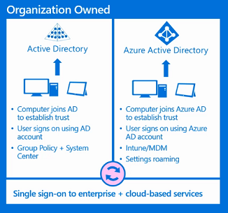
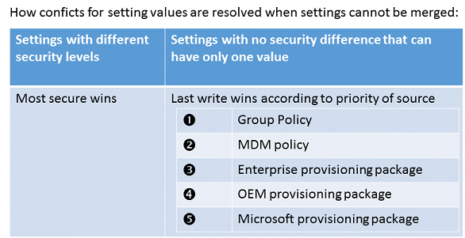

# Manage corporate devices

**Applies to**

-   Windows 10
-   Windows 10 Mobile

**In this article**

-   [Identity and management options](#identity-and-management-options)
-   [How setting conflicts are resolved](#how-setting-conflicts-are-resolved)
-   [MDM enrollment](#mdm-enrollment)
-   [Learn more](#learn-more)
-   [Related topics](#related-topics)

You can use the same management tools to manage all device types running Windows 10 : desktops, laptops, tablets, and phones. And your current management tools, such as Group Policy, Windows Management Instrumentation (WMI), Windows PowerShell scripts, Orchestrator runbooks, System Center tools, and so on, will continue to work for Windows 10 on desktop editions.

There are several options for managing Windows 10 on corporate-owned devices in an enterprise.

## Identity and management options

Your employees using devices that are owned by the organization can connect to Active Directory or Azure Active Directory (Azure AD). Windows 10 does not require a personal Microsoft account on devices joined to Azure AD or an on-premises Active Directory domain.

### Active Directory join

You can join a device running Windows 10 to an on-premises Active Directory domain after the first-run experience (sometimes called out-of-box experience or OOBE). You can add devices running Windows 10 to your existing Active Directory infrastructure and manage them just as you've always been used to managing PCs running Windows.

Desktop devices running Windows 10 that are joined to an Active Directory domain can be managed using Group Policy and System Center 2012 R2 Configuration Manager. The following table shows the management support for Windows 10 in Configuration Manager.

<table>
<colgroup>
<col width="50%" />
<col width="50%" />
</colgroup>
<thead>
<tr class="header">
<th align="left">Product version</th>
<th align="left">Windows 10 support</th>
</tr>
</thead>
<tbody>
<tr class="odd">
<td align="left">
[Microsoft System Center Configuration Manager Technical Preview](http://go.microsoft.com/fwlink/p/?LinkId=613622)
</td>
<td align="left">
Client deployment, upgrade, and management with new and existing features
</td>
</tr>
<tr class="even">
<td align="left">
Configuration Manager and Configuration Manager SP1
</td>
<td align="left">
Deployment, upgrade, and management with existing features
</td>
</tr>
<tr class="odd">
<td align="left">
Configuration Manager 2007
</td>
<td align="left">
Management with existing features
</td>
</tr>
</tbody>
</table>

 

### Azure AD join

Devices joined to Azure AD can be managed using Microsoft Intune or other mobile device management (MDM) solutions. MDM infrastructure for Windows 10 is consistent across device types. Configuration capabilities may vary based on device platform.

For flexibility in identity and management, you can combine Active Directory and Azure AD. Learn about [integrating Active Directory and Azure Active Directory for a hybrid identity solution](http://go.microsoft.com/fwlink/p/?LinkId=613209).

## How setting conflicts are resolved

A device or user might receive policies from multiple sources, such as MDM, Exchange, or provisioning packages. In any policy conflict, the most secure policy value is applied. Policy settings take precedence over settings applied in a provisioning package.

**Note**  
Provisioning packages can be applied either during device setup or after setup for runtime configuration. For more information about runtime provisioning packages, see [Configure devices without MDM](configure-devices-without-mdm.md).

 

When setting values that do not have a security implication conflict, last write wins. When settings are configured from both a provisioning package and another configuration source, the non-provisioning package configuration source has higher priority.

## MDM enrollment

Devices running Windows 10 include a built-in agent that can be used by MDM servers to enroll and manage devices. MDM servers do not need to create a separate agent or client to install on devices running Windows 10.

For more information about the MDM protocols, see [Mobile device management](http://go.microsoft.com/fwlink/p/?LinkID=533172).

## Learn more

[Windows 10, Azure AD and Microsoft Intune: Automatic MDM Enrollment](http://go.microsoft.com/fwlink/p/?LinkId=623321)

[Microsoft Intune End User Enrollment Guide](http://go.microsoft.com/fwlink/p/?LinkID=617169)

[Azure AD Join on Windows 10 devices](http://go.microsoft.com/fwlink/p/?LinkId=616791)

[Azure AD support for Windows 10](http://go.microsoft.com/fwlink/p/?LinkID=615765)

[Windows 10 and Azure Active Directory: Embracing the Cloud](http://go.microsoft.com/fwlink/p/?LinkId=615768)

[How to manage Windows 10 devices using Intune](http://go.microsoft.com/fwlink/p/?LinkId=613620)

[Using Intune alone and with Configuration Manager](http://go.microsoft.com/fwlink/p/?LinkId=613207)

Microsoft Virtual Academy course: [System Center 2012 R2 Configuration Manager & Windows Intune](http://go.microsoft.com/fwlink/p/?LinkId=613208)

## Related topics

[New policies for Windows 10](new-policies-for-windows-10.md)

[Changes to Group Policy settings for Start in Windows 10](changes-to-start-policies-in-windows-10.md)

[Windows 10 Mobile and MDM](windows-10-mobile-and-mdm.md)

 

 

