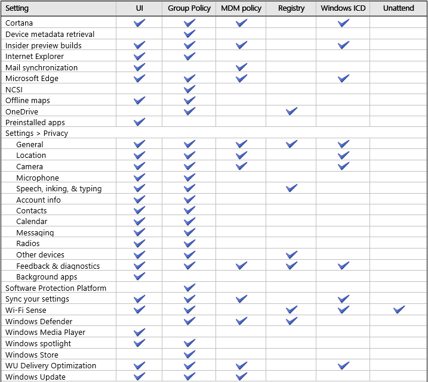

# Configure telemetry and other settings in your organization

**Applies to**

-   Windows 10

Learn about the telemetry that Microsoft gathers, the network connections that Windows components make to Microsoft, and also the privacy settings that affect data that is shared with either Microsoft or apps and how they can be managed by an IT Pro.

If you want to minimize connections from Windows to Microsoft services, or configure particular privacy settings, this article covers the settings that you could consider. You can configure telemetry at the lowest level for your edition of Windows, and also evaluate which other connections Windows makes to Microsoft services you want to turn off in your environment from the list in this article.

**Note**  Telemetry is a term that means different things to different people and organizations. For the purpose of this article, we discuss telemetry as system data that is uploaded by the Connected User Experience and Telemetry component. The telemetry data is used to keep Windows devices secure, and to help Microsoft improve the quality of Windows and Microsoft services. We discuss separately the network connections that Windows features and components make directly to Microsoft Services. It is used to provide a service to the user as part of Windows.

 

Some of the network connections discussed in this article can be managed in Windows 10 Mobile, Windows 10 Mobile Enterprise, and Windows 10, Version 1507. However, you must use Windows 10 Enterprise, Version 1511 or Windows 10 Education, Version 1511 to manage them all.

In Windows 10 Enterprise, Version 1511 or Windows 10 Education, Version 1511, you can configure telemetry at the Security level, turn off Windows Defender telemetry and MSRT reporting, and turn off all other connections to Microsoft services as described in this article to prevent Windows from sending any data to Microsoft. We strongly recommend against this, as this data helps us deliver a secure, reliable, and more delightful personalized experience.

We are always working on improving Windows 10 for our customers. We invite IT pros to join the [Windows Insider Program](http://insider.windows.com) to give us feedback on what we can do to make Windows 10 work better for your organization.

Here's what's covered in this article:

-   [Info management settings](#BKMK_OtherSettings)

    -   [Cortana](#BKMK_Cortana)

        -   [Cortana Group Policies](#BKMK_Cortana_GP)

        -   [Cortana MDM policies](#BKMK_Cortana_MDM)

        -   [Cortana Windows Provisioning](#BKMK_Cortana_Prov)

    -   [Device metadata retrieval](#BKMK_DevInst)

    -   [Insider Preview builds](#BKMK_PreviewBuilds)

    -   [Internet Explorer](#BKMK_IE)

        -   [Internet Explorer Group Policies](#BKMK_IE_GP)

        -   [ActiveX control blocking](#BKMK_IE_ActiveX)

    -   [Mail synchronization](#BKMK_MailSync)

    -   [Microsoft Edge](#BKMK_Edge)

        -   [Microsoft Edge Group Policies](#BKMK_EdgeGP)

        -   [Microsoft Edge MDM policies](#BKMK_Edge_MDM)

        -   [Microsoft Edge Windows Provisioning](#BKMK_Edge_Prov)

    -   [Network Connection Status Indicator](#BKMK_NCSI)

    -   [Offline maps](#BKMK_OfflineMaps)

    -   [OneDrive](#BKMK_OneDrive)

    -   [Preinstalled apps](#BKMK_PreinstalledApps)

    -   [Settings &gt; Privacy](#BKMK_SettingsSection)

        -   [General](#BKMK_General)

        -   [Location](#BKMK_Priv_Location)

        -   [Camera](#BKMK_Priv_Camera)

        -   [Microphone](#BKMK_Priv_Microphone)

        -   [Speech, inking, & typing](#BKMK_Priv_Speech)

        -   [Account info](#BKMK_Priv_Accounts)

        -   [Contacts](#BKMK_Priv_Contacts)

        -   [Calendar](#BKMK_Priv_Calendar)

        -   [Call history](#BKMK_Priv_CallHistory)

        -   [Email](#BKMK_Priv_Email)

        -   [Messaging](#BKMK_Priv_Messaging)

        -   [Radios](#BKMK_Priv_Radios)

        -   [Other devices](#BKMK_Priv_Other_Devices)

        -   [Feedback & diagnostics](#BKMK_Priv_Feedback)

        -   [Background apps](#BKMK_Priv_Background)

    -   [Software Protection Platform](#BKMK_SPP)

    -   [Sync your settings](#BKMK_SyncSettings)

    -   [Teredo](#BKMK_Teredo)

    -   [Wi-Fi Sense](#BKMK_WiFiSense)

    -   [Windows Defender](#BKMK_Defender)

    -   [Windows Media Player](#BKMK_WMP)

    -   [Windows spotlight](#BKMK_Spotlight)

    -   [Windows Store](#BKMK_WindowsStore)

    -   [Windows Update Delivery Optimization](#BKMK_Updates)

        -   [Settings &gt; Update & security](#BKMK_WUDO_UI)

        -   [Delivery Optimization Group Policies](#BKMK_WUDO_GP)

        -   [Delivery Optimization MDM policies](#BKMK_WUDO_MDM)

        -   [Delivery Optimization Windows Provisioning](#BKMK_WUDO_Prov)

    -   [Windows Update](#BKMK_WU)

-   [Manage your telemetry settings](#BKMK_UTC)

-   [How telemetry works](#BKMK_MoreUTC)

## What's new in Windows 10, Version 1511

Here's a list of changes that were made to this article for Windows 10, Version 1511:

-   Added the following new sections:

    -   [Mail synchronization](#BKMK_MailSync)

    -   [Offline maps](#BKMK_OfflineMaps)

    -   [Windows spotlight](#BKMK_Spotlight)

    -   [Windows Store](#BKMK_WindowsStore)

-   Added the following Group Policies:

    -   Open a new tab with an empty tab

    -   Configure corporate Home pages

    -   Let Windows apps access location

    -   Let Windows apps access the camera

    -   Let Windows apps access the microphone

    -   Let Windows apps access account information

    -   Let Windows apps access contacts

    -   Let Windows apps access the calendar

    -   Let Windows apps access messaging

    -   Let Windows apps control radios

    -   Let Windows apps access trusted devices

    -   Do not show feedback notifications

    -   Turn off Automatic Download and Update of Map Data

    -   Force a specific default lock screen image

-   Added the AllowLinguisticDataCollection MDM policy.

-   Added steps in the [Cortana](#BKMK_Cortana) section on how to disable outbound traffic using Windows Firewall.

-   Added steps in the [Live tiles](#BKMK_LiveTiles) section on how to remove the Money and Sports apps.

-   Changed the Windows Update section to apply system-wide settings, and not just per user.

## Info management settings

This section lists the components that make network connections to Microsoft services automatically. You can configure these settings to control the data that is sent to Microsoft. To prevent Windows from sending any data to Microsoft, configure telemetry at the Security level, turn off Windows Defender telemetry and MSRT reporting, and turn off all of these connections. We strongly recommend against this, as this data helps us deliver a secure, reliable, and more delightful personalized experience.

The settings in this section assume you are using Windows 10, Version 1511 (currently available in the Current Branch and Current Branch for Business). They will also be included in the next update for the Long Term Servicing Branch.

-   [Cortana](#BKMK_Cortana)

-   [Device metadata retrieval](#BKMK_DevInst)

-   [Insider Preview builds](#BKMK_PreviewBuilds)

-   [Internet Explorer](#BKMK_IE)

-   [Mail synchronization](#BKMK_MailSync)

-   [Microsoft Edge](#BKMK_Edge)

-   [Network Connection Status Indicator](#BKMK_NCSI)

-   [Offline maps](#BKMK_OfflineMaps)

-   [OneDrive](#BKMK_OneDrive)

-   [Preinstalled apps](#BKMK_PreinstalledApps)

-   [Settings &gt; Privacy](#BKMK_SettingsSection)

-   [Software Protection Platform](#BKMK_SPP)

-   [Sync your settings](#BKMK_SyncSettings)

-   [Teredo](#BKMK_Teredo)

-   [Wi-Fi Sense](#BKMK_WiFiSense)

-   [Windows Defender](#BKMK_Defender)

-   [Windows Media Player](#BKMK_WMP)

-   [Windows spotlight](#BKMK_Spotlight)

-   [Windows Store](#BKMK_WindowsStore)

-   [Windows Update](#BKMK_WU)

-   [Windows Update Delivery Optimization](#BKMK_Updates)

See the following table for a summary of the management settings. For more info, see its corresponding section.

### Cortana

Use either Group Policy or MDM policies to manage settings for Cortana. For more info, see [Cortana, Search, and privacy: FAQ]( http://go.microsoft.com/fwlink/p/?LinkId=730683).

### Cortana Group Policies

Find the Cortana Group Policy objects under **Computer Configuration** &gt; **Administrative Templates** &gt; **Windows Components** &gt; **Search**.

<table>
<colgroup>
<col width="50%" />
<col width="50%" />
</colgroup>
<thead>
<tr class="header">
<th align="left">Policy</th>
<th align="left">Description</th>
</tr>
</thead>
<tbody>
<tr class="odd">
<td align="left">
Allow Cortana
</td>
<td align="left">
Choose whether to let Cortana install and run on the device.

Default: Enabled
</td>
</tr>
<tr class="even">
<td align="left">
Allow search and Cortana to use location
</td>
<td align="left">
Choose whether Cortana and Search can provide location-aware search results.

Default: Enabled
</td>
</tr>
<tr class="odd">
<td align="left">
Do not allow web search
</td>
<td align="left">
Choose whether to search the web from Windows Desktop Search.

Default: Disabled
</td>
</tr>
<tr class="even">
<td align="left">
Don't search the web or display web results in Search
</td>
<td align="left">
Choose whether to search the web from Cortana.

Default: Disabled
</td>
</tr>
<tr class="odd">
<td align="left">
Set what information is shared in Search
</td>
<td align="left">
Control what information is shared with Bing in Search.
</td>
</tr>
</tbody>
</table>

 

When you enable the **Don't search the web or display web results in Search** Group Policy, you can control the behavior of whether Cortana searches the web to display web results. However, this policy only covers whether or not web search is performed. There could still be a small amount of network traffic to Bing.com to evaluate if certain Cortana components are up-to-date or not. In order to turn off that network activity completely, you can create a Windows Firewall rule to prevent outbound traffic.

1.  Expand **Computer Configuration** &gt; **Windows Settings** &gt; **Security Settings** &gt; **Windows Firewall with Advanced Security** &gt; **Windows Firewall with Advanced Security - &lt;LDAP name&gt;**, and then click **Outbound Rules**.

2.  Right-click **Outbound Rules**, and then click **New Rule**. The **New Outbound Rule Wizard** starts.

3.  On the **Rule Type** page, click **Program**, and then click **Next**.

4.  On the **Program** page, click **This program path**, type **%windir%\\systemapps\\Microsoft.Windows.Cortana\_cw5n1h2txyewy\\SearchUI.exe**, and then click **Next**.

5.  On the **Action** page, click **Block the connection**, and then click **Next**.

6.  On the **Profile** page, ensure that the **Domain**, **Private**, and **Public** check boxes are selected, and then click **Next**.

7.  On the **Name** page, type a name for the rule, such as **Cortana firewall configuration**, and then click **Finish.**

8.  Right-click the new rule, click **Properties**, and then click **Protocols and Ports**.

9.  Configure the **Protocols and Ports** page with the following info, and then click **OK**.

    -   For **Protocol type**, choose **TCP**.

    -   For **Local port**, choose **All Ports**.

    -   For **Remote port**, choose **All ports**.

**Note**  
If your organization tests network traffic, you should not use Fiddler to test Windows Firewall settings. You should use a network traffic analyzer, such as WireShark or Message Analyzer.

 

### Cortana MDM policies

The following Cortana MDM policies are available in the [Policy CSP](http://msdn.microsoft.com/library/windows/hardware/dn904962.aspx).

<table>
<colgroup>
<col width="50%" />
<col width="50%" />
</colgroup>
<thead>
<tr class="header">
<th align="left">Policy</th>
<th align="left">Description</th>
</tr>
</thead>
<tbody>
<tr class="odd">
<td align="left">
Experience/AllowCortana
</td>
<td align="left">
Choose whether to let Cortana install and run on the device.

Default: Allowed
</td>
</tr>
<tr class="even">
<td align="left">
Search/AllowSearchToUseLocation
</td>
<td align="left">
Choose whether Cortana and Search can provide location-aware search results.

Default: Allowed
</td>
</tr>
</tbody>
</table>

 

### Windows Provisioning

To use Windows Imaging and Configuration Designer (ICD) to create a provisioning package with the settings for these policies, go to **Runtime settings** &gt; **Policies** to find **Experience** &gt; **AllowCortana** and **Search** &gt; **AllowSearchToUseLocation**.

### Device metadata retrieval

To prevent Windows from retrieving device metadata from the Internet, apply the Group Policy: **Computer Configuration** &gt; **Administrative Templates** &gt; **System** &gt; **Device Installation** &gt; **Prevent device metadata retrieval from the Internet**.

### Insider Preview builds

To turn off Insider Preview builds if you're running a released version of Windows 10. If you're running a preview version of Windows 10, you must roll back to a released version before you can turn off Insider Preview builds.

-   Turn off the feature in the UI: **Settings** &gt; **Update & security** &gt; **Windows Update** &gt; **Advanced options** &gt; **Stop Insider builds**.

    -or-

-   Apply the Group Policy: **Computer Configuration** &gt; **Administrative Templates** &gt; **Windows Components** &gt; **Data Collection and Preview Builds** &gt; **Toggle user control over Insider builds**.

    -or-

-   Apply the System/AllowBuildPreview MDM policy from the [Policy CSP](http://msdn.microsoft.com/library/windows/hardware/dn904962.aspx) where:

    -   **0**. Users cannot make their devices available for downloading and installing preview software.

    -   **1**. Users can make their devices available for downloading and installing preview software.

    -   **2**. (default) Not configured. Users can make their devices available for download and installing preview software.

    -or-

-   Create a provisioning package: **Runtime settings** &gt; **Policies** &gt; **System** &gt; **AllowBuildPreview**, where:

    -   **0**. Users cannot make their devices available for downloading and installing preview software.

    -   **1**. Users can make their devices available for downloading and installing preview software.

    -   **2**. (default) Not configured. Users can make their devices available for download and installing preview software.

### Internet Explorer

Use Group Policy to manage settings for Internet Explorer.

### Internet Explorer Group Policies

Find the Internet Explorer Group Policy objects under **Computer Configuration** &gt; **Administrative Templates** &gt; **Windows Components** &gt; **Internet Explorer**.

<table>
<colgroup>
<col width="50%" />
<col width="50%" />
</colgroup>
<thead>
<tr class="header">
<th align="left">Policy</th>
<th align="left">Description</th>
</tr>
</thead>
<tbody>
<tr class="odd">
<td align="left">
Turn on Suggested Sites
</td>
<td align="left">
Choose whether an employee can configure Suggested Sites.

Default: Enabled

You can also turn this off in the UI by clearing the <strong>Internet Options</strong> &gt; <strong>Advanced</strong> &gt; <strong>Enable Suggested Sites</strong> check box.
</td>
</tr>
<tr class="even">
<td align="left">
Allow Microsoft services to provide enhanced suggestions as the user types in the Address Bar
</td>
<td align="left">
Choose whether an employee can configure enhanced suggestions, which are presented to the employee as they type in the address bar.

Default: Enabled
</td>
</tr>
<tr class="odd">
<td align="left">
Turn off the auto-complete feature for web addresses
</td>
<td align="left">
Choose whether auto-complete suggests possible matches when employees are typing web address in the address bar.

Default: Disabled

You can also turn this off in the UI by clearing the <strong>Internet Options</strong> &gt; <strong>Advanced</strong> &gt; <strong>Use inline AutoComplete in the Internet Explorer Address Bar and Open Dialog</strong> check box.
</td>
</tr>
<tr class="even">
<td align="left">
Disable Periodic Check for Internet Explorer software updates
</td>
<td align="left">
Choose whether Internet Explorer periodically checks for a new version.

Default: Enabled
</td>
</tr>
<tr class="odd">
<td align="left">
Turn off browser geolocation
</td>
<td align="left">
Choose whether websites can request location data from Internet Explorer.

Default: Disabled
</td>
</tr>
</tbody>
</table>

 

### ActiveX control blocking

ActiveX control blocking periodically downloads a new list of out-of-date ActiveX controls that should be blocked. You can turn this off by changing the REG\_DWORD registry setting **HKEY\_CURRENT\_USER\\Software\\Microsoft\\Internet Explorer\\VersionManager\\DownloadVersionList** to 0 (zero).

For more info, see [Out-of-date ActiveX control blocking](http://technet.microsoft.com/library/dn761713.aspx).

### Mail synchronization

To turn off mail synchronization for Microsoft Accounts that are configured on a device:

-   In **Settings** &gt; **Accounts** &gt; **Your email and accounts**, remove any connected Microsoft Accounts.

    -or-

-   Remove any Microsoft Accounts from the Mail app.

    -or-

-   Apply the Accounts/AllowMicrosoftAccountConnection MDM policy from the [Policy CSP](http://msdn.microsoft.com/library/windows/hardware/dn904962.aspx) where 0 is not allowed and 1 is allowed. This does not apply to Microsoft Accounts that have already been configured on the device.

To turn off the Windows Mail app:

-   Apply the Group Policy: **Computer Configuration** &gt; **Administrative Templates** &gt; **Windows Components** &gt; **Windows Mail** &gt; **Turn off Windows Mail application**

### Microsoft Edge

Use either Group Policy or MDM policies to manage settings for Microsoft Edge. For more info, see [Microsoft Edge and privacy: FAQ](http://go.microsoft.com/fwlink/p/?LinkId=730682).

### Microsoft Edge Group Policies

Find the Microsoft Edge Group Policy objects under **Computer Configuration** &gt; **Administrative Templates** &gt; **Windows Components** &gt; **Microsoft Edge**.

**Note**  
The Microsoft Edge Group Policy names were changed in Windows 10, Version 1511. The table below reflects those changes.

 

<table>
<colgroup>
<col width="50%" />
<col width="50%" />
</colgroup>
<thead>
<tr class="header">
<th align="left">Policy</th>
<th align="left">Description</th>
</tr>
</thead>
<tbody>
<tr class="odd">
<td align="left">
Turn off autofill
</td>
<td align="left">
Choose whether employees can use autofill on websites.

Default: Enabled
</td>
</tr>
<tr class="even">
<td align="left">
Allow employees to send Do Not Track headers
</td>
<td align="left">
Choose whether employees can send Do Not Track headers.

Default: Disabled
</td>
</tr>
<tr class="odd">
<td align="left">
Turn off password manager
</td>
<td align="left">
Choose whether employees can save passwords locally on their devices.

Default: Enabled
</td>
</tr>
<tr class="even">
<td align="left">
Turn off address bar search suggestions
</td>
<td align="left">
Choose whether the address bar shows search suggestions.

Default: Enabled
</td>
</tr>
<tr class="odd">
<td align="left">
Turn off the SmartScreen Filter
</td>
<td align="left">
Choose whether SmartScreen is turned on or off.

Default: Enabled
</td>
</tr>
<tr class="even">
<td align="left">
Open a new tab with an empty tab
</td>
<td align="left">
Choose whether a new tab page appears.

Default: Enabled
</td>
</tr>
<tr class="odd">
<td align="left">
Configure corporate Home pages
</td>
<td align="left">
Choose the corporate Home page for domain-joined devices.

Set this to <strong>about:blank</strong>
</td>
</tr>
</tbody>
</table>

 

### Microsoft Edge MDM policies

The following Microsoft Edge MDM policies are available in the [Policy CSP](http://msdn.microsoft.com/library/windows/hardware/dn904962.aspx).

<table>
<colgroup>
<col width="50%" />
<col width="50%" />
</colgroup>
<thead>
<tr class="header">
<th align="left">Policy</th>
<th align="left">Description</th>
</tr>
</thead>
<tbody>
<tr class="odd">
<td align="left">
Browser/AllowAutoFill
</td>
<td align="left">
Choose whether employees can use autofill on websites.

Default: Allowed
</td>
</tr>
<tr class="even">
<td align="left">
Browser/AllowDoNotTrack
</td>
<td align="left">
Choose whether employees can send Do Not Track headers.

Default: Not allowed
</td>
</tr>
<tr class="odd">
<td align="left">
Browser/AllowPasswordManager
</td>
<td align="left">
Choose whether employees can save passwords locally on their devices.

Default: Allowed
</td>
</tr>
<tr class="even">
<td align="left">
Browser/AllowSearchSuggestionsinAddressBar
</td>
<td align="left">
Choose whether the address bar shows search suggestions.

Default: Allowed
</td>
</tr>
<tr class="odd">
<td align="left">
Browser/AllowSmartScreen
</td>
<td align="left">
Choose whether SmartScreen is turned on or off.

Default: Allowed
</td>
</tr>
</tbody>
</table>

 

### Windows Provisioning

Use Windows ICD to create a provisioning package with the settings for these policies, go to **Runtime settings** &gt; **Policies**.

For a complete list of the Microsoft Edge policies, see [Available policies for Microsoft Edge](http://technet.microsoft.com/library/mt270204.aspx).

### Network Connection Status Indicator

Network Connection Status Indicator (NCSI) detects Internet connectivity and corporate network connectivity status. NCSI sends a DNS request and HTTP query to http://www.msftncsi.com to determine if the device can communicate with the Internet. For more info about NCIS, see [The Network Connection Status Icon](http://blogs.technet.com/b/networking/archive/2012/12/20/the-network-connection-status-icon.aspx).

You can turn off NCSI through Group Policy:

-   Enable the Group Policy: **Computer Configuration** &gt; **Administrative Templates** &gt; **System** &gt; **Internet Communication Management** &gt; **Internet Communication Settings** &gt; **Turn off Windows Network Connectivity Status Indicator active tests**

### Offline maps

You can turn off the ability to download and update offline maps.

-   In the UI: **Settings** &gt; **System** &gt; **Offline maps** &gt; **Automatically update maps**

    -or-

-   Apply the Group Policy: **Computer Configuration** &gt; **Administrative Templates** &gt; **Windows Components** &gt; **Maps** &gt; **Turn off Automatic Download and Update of Map Data**

### OneDrive

To turn off OneDrive in your organization:

-   Apply the Group Policy: **Computer Configuration** &gt; **Administrative Templates** &gt; **Windows Components** &gt; **OneDrive** &gt; **Prevent the usage of OneDrive for file storage**

### Preinstalled apps

Some preinstalled apps get content before they are opened to ensure a great experience. You can remove these using the steps in this section.

To remove the News app:

-   Right-click the app in Start, and then click **Uninstall**.

    -or-

-   Remove the app for new user accounts. From an elevated command prompt, run the following Windows PowerShell command: **Get-AppxProvisionedPackage -Online | Where-Object {$\_.PackageName -Like "Microsoft.BingNews"} | ForEach-Object { Remove-AppxProvisionedPackage -Online -PackageName $\_.PackageName}**

    -and-

    Remove the app for the current user. From an elevated command prompt, run the following Windows PowerShell command: **Get-AppxPackage Microsoft.BingNews | Remove-AppxPackage**

To remove the Weather app:

-   Remove the app for new user accounts. From an elevated command prompt, run the following Windows PowerShell command: **Get-AppxProvisionedPackage -Online | Where-Object {$\_.PackageName -Like "Microsoft.BingWeather"} | ForEach-Object { Remove-AppxProvisionedPackage -Online -PackageName $\_.PackageName}**

    -and-

    Remove the app for the current user. From an elevated command prompt, run the following Windows PowerShell command: **Get-AppxPackage Microsoft.BingWeather | Remove-AppxPackage**

To remove the Money app:

-   Right-click the app in Start, and then click **Uninstall**.

    -or-

-   Remove the app for new user accounts. From an elevated command prompt, run the following Windows PowerShell command: **Get-AppxProvisionedPackage -Online | Where-Object {$\_.PackageName -Like "Microsoft.BingFinance"} | ForEach-Object { Remove-AppxProvisionedPackage -Online -PackageName $\_.PackageName}**

    -and-

    Remove the app for the current user. From an elevated command prompt, run the following Windows PowerShell command: **Get-AppxPackage Microsoft.BingFinance | Remove-AppxPackage**

To remove the Sports app:

-   Right-click the app in Start, and then click **Uninstall**.

    -or-

-   Remove the app for new user accounts. From an elevated command prompt, run the following Windows PowerShell command: **Get-AppxProvisionedPackage -Online | Where-Object {$\_.PackageName -Like "Microsoft.BingSports"} | ForEach-Object { Remove-AppxProvisionedPackage -Online -PackageName $\_.PackageName}**

    -and-

    Remove the app for the current user. From an elevated command prompt, run the following Windows PowerShell command: **Get-AppxPackage Microsoft.BingSports | Remove-AppxPackage**

To remove the Twitter app:

-   Right-click the app in Start, and then click **Uninstall**.

    -or-

-   Remove the app for new user accounts. From an elevated command prompt, run the following Windows PowerShell command: **Get-AppxProvisionedPackage -Online | Where-Object {$\_.PackageName -Like "\*.Twitter"} | ForEach-Object { Remove-AppxProvisionedPackage -Online -PackageName $\_.PackageName}**

    -and-

    Remove the app for the current user. From an elevated command prompt, run the following Windows PowerShell command: **Get-AppxPackage \*.Twitter | Remove-AppxPackage**

To remove the XBOX app:

-   Remove the app for new user accounts. From an elevated command prompt, run the following Windows PowerShell command: **Get-AppxProvisionedPackage -Online | Where-Object {$\_.PackageName -Like "Microsoft.XboxApp"} | ForEach-Object { Remove-AppxProvisionedPackage -Online -PackageName $\_.PackageName}**

    -and-

    Remove the app for the current user. From an elevated command prompt, run the following Windows PowerShell command: **Get-AppxPackage Microsoft.XboxApp | Remove-AppxPackage**

To remove the Sway app:

-   Right-click the app in Start, and then click **Uninstall**.

    -or-

-   Remove the app for new user accounts. From an elevated command prompt, run the following Windows PowerShell command: **Get-AppxProvisionedPackage -Online | Where-Object {$\_.PackageName -Like "Microsoft.Office.Sway"} | ForEach-Object { Remove-AppxProvisionedPackage -Online -PackageName $\_.PackageName}**

    -and-

    Remove the app for the current user. From an elevated command prompt, run the following Windows PowerShell command: **Get-AppxPackage Microsoft.Office.Sway | Remove-AppxPackage**

To remove the OneNote app:

-   Remove the app for new user accounts. From an elevated command prompt, run the following Windows PowerShell command: **Get-AppxProvisionedPackage -Online | Where-Object {$\_.PackageName -Like "Microsoft.Office.OneNote"} | ForEach-Object { Remove-AppxProvisionedPackage -Online -PackageName $\_.PackageName}**

    -and-

    Remove the app for the current user. From an elevated command prompt, run the following Windows PowerShell command: **Get-AppxPackage Microsoft.Office.OneNote | Remove-AppxPackage**

To remove the Get Office app:

-   Right-click the app in Start, and then click **Uninstall**.

    -or-

-   Remove the app for new user accounts. From an elevated command prompt, run the following Windows PowerShell command: **Get-AppxProvisionedPackage -Online | Where-Object {$\_.PackageName -Like "Microsoft.MicrosoftOfficeHub"} | ForEach-Object { Remove-AppxProvisionedPackage -Online -PackageName $\_.PackageName}**

    -and-

    Remove the app for the current user. From an elevated command prompt, run the following Windows PowerShell command: **Get-AppxPackage Microsoft.MicrosoftOfficeHub | Remove-AppxPackage**

To remove the Get Skype app:

-   Right-click the Sports app in Start, and then click **Uninstall**.

    -or-

-   Remove the app for new user accounts. From an elevated command prompt, run the following Windows PowerShell command: **Get-AppxProvisionedPackage -Online | Where-Object {$\_.PackageName -Like "Microsoft.SkypeApp"} | ForEach-Object { Remove-AppxProvisionedPackage -Online -PackageName $\_.PackageName}**

    -and-

    Remove the app for the current user. From an elevated command prompt, run the following Windows PowerShell command: **Get-AppxPackage Microsoft.SkypeApp | Remove-AppxPackage**

### Settings &gt; Privacy

Use Settings &gt; Privacy to configure some settings that may be important to your organization. Except for the Feedback & Diagnostics page, these settings must be configured for every user account that signs into the PC.

-   [General](#BKMK_General)

-   [Location](#BKMK_Priv_Location)

-   [Camera](#BKMK_Priv_Camera)

-   [Microphone](#BKMK_Priv_Microphone)

-   [Speech, inking, & typing](#BKMK_Priv_Speech)

-   [Account info](#BKMK_Priv_Accounts)

-   [Contacts](#BKMK_Priv_Contacts)

-   [Calendar](#BKMK_Priv_Calendar)

-   [Call history](#BKMK_Priv_CallHistory)

-   [Email](#BKMK_Priv_Email)

-   [Messaging](#BKMK_Priv_Messaging)

-   [Radios](#BKMK_Priv_Radios)

-   [Other devices](#BKMK_Priv_Other_Devices)

-   [Feedback & diagnostics](#BKMK_Priv_Feedback)

-   [Background apps](#BKMK_Priv_Background)

### General

**General** includes options that don't fall into other areas.

To turn off **Let apps use my advertising ID for experiences across apps (turning this off will reset your ID)**:

**Note**  
When you turn this feature off in the UI, it turns off the advertising ID, not just resets it.

 

-   Turn off the feature in the UI.

    -or-

-   Apply the Group Policy: **Computer Configuration** &gt; **Administrative Templates** &gt; **System** &gt; **User Profiles** &gt; **Turn off the advertising ID**.

    -or-

-   Create a REG\_DWORD registry setting called **Enabled** in **HKEY\_CURRENT\_USER\\SOFTWARE\\Microsoft\\Windows\\CurrentVersion\\AdvertisingInfo**, with a value of 0 (zero).

To turn off **Turn on SmartScreen Filter to check web content (URLs) that Windows Store apps use**:

-   Turn off the feature in the UI.

    -or-

-   Apply the Group Policy: **Computer Configuration** &gt; **Administrative Templates** &gt; **Windows Components** &gt; **Microsoft Edge** &gt; **Turn off the SmartScreen Filter**.

    Apply the Group Policy: **Computer Configuration** &gt; **Administrative Templates** &gt; **Windows Components** &gt; **File Explorer** &gt; **Configure Windows SmartScreen**.

    -or-

-   Apply the Browser/AllowSmartScreen MDM policy from the [Policy CSP](http://msdn.microsoft.com/library/windows/hardware/dn904962.aspx) where 0 is turned off and 1 is turned on.

    -or-

-   Create a provisioning package, using:

    -   For Internet Explorer: **Runtime settings** &gt; **Policies** &gt; **Browser** &gt; **AllowSmartScreen**

    -   For Microsoft Edge: **Runtime settings** &gt; **Policies** &gt; **MicrosoftEdge** &gt; **AllowSmartScreen**

    -or-

-   Create a REG\_DWORD registry setting called **Enabled** in **HKEY\_CURRENT\_USER\\SOFTWARE\\Microsoft\\Windows\\CurrentVersion\\AppHost\\EnableWebContentEvaluation**, with a value of 0 (zero).

To turn off **Send Microsoft info about how I write to help us improve typing and writing in the future**:

**Note**  
If the telemetry level is set to either [Basic](#BKMK_UTC_Basic) or [Security](#BKMK_UTC_Security), this is turned off automatically.

 

-   Turn off the feature in the UI.

    -or-

-   Apply the TextInput/AllowLinguisticDataCollection MDM policy from the [Policy CSP](http://msdn.microsoft.com/library/windows/hardware/dn904962.aspx) where:

    -   **0**. Not allowed

    -   **1**. Allowed (default)

To turn off **Let websites provide locally relevant content by accessing my language list**:

-   Turn off the feature in the UI.

    -or-

-   Create a new REG\_DWORD registry setting called **HttpAcceptLanguageOptOut** in **HKEY\_CURRENT\_USER\\Control Panel\\International\\User Profile**, with a value of 1.

### Location

In the **Location** area, you choose whether devices have access to location-specific sensors and which apps have access to the device's location.

To turn off **Location for this device**:

-   Click the **Change** button in the UI.

    -or-

-   Apply the Group Policy: **Computer Configuration** &gt; **Administrative Templates** &gt; **Windows Components** &gt; **Location and Sensors** &gt; **Turn off location**.

    -or-

-   Apply the System/AllowLocation MDM policy from the [Policy CSP](http://msdn.microsoft.com/library/windows/hardware/dn904962.aspx), where:

    -   **0**. Turned off and the employee can't turn it back on.

    -   **1**. Turned on, but lets the employee choose whether to use it. (default)

    -   **2**. Turned on and the employee can't turn it off.

    **Note**  
    You can also set this MDM policy in System Center Configuration Manager using the [WMI Bridge Provider](http://msdn.microsoft.com/library/dn905224.aspx).

     

    -or-

-   Create a provisioning package, using **Runtime settings** &gt; **Policies** &gt; **System** &gt; **AllowLocation**, where

    -   **No**. Turns off location service.

    -   **Yes**. Turns on location service. (default)

To turn off **Location**:

-   Turn off the feature in the UI.

-   Apply the Group Policy: **Computer Configuration** &gt; **Administrative Templates** &gt; **Windows Components** &gt; **App Privacy** &gt; **Let Windows apps access location**

    -   Set the **Select a setting** box to **Force Deny**.

    -or-

To turn off **Location history**:

-   Erase the history using the **Clear** button in the UI.

To turn off **Choose apps that can use your location**:

-   Turn off each app using the UI.

### Camera

In the **Camera** area, you can choose which apps can access a device's camera.

To turn off **Let apps use my camera**:

-   Turn off the feature in the UI.

    -or-

-   Apply the Group Policy: **Computer Configuration** &gt; **Administrative Templates** &gt; **Windows Components** &gt; **App Privacy** &gt; **Let Windows apps access the camera**

    -   Set the **Select a setting** box to **Force Deny**.

    -or-

-   Apply the Camera/AllowCamera MDM policy from the [Policy CSP](http://msdn.microsoft.com/library/windows/hardware/dn904962.aspx), where:

    -   **0**. Apps can't use the camera.

    -   **1**. Apps can use the camera.

    **Note**  
    You can also set this MDM policy in System Center Configuration Manager using the [WMI Bridge Provider](http://msdn.microsoft.com/library/dn905224.aspx).

     

    -or-

-   Create a provisioning package with use Windows ICD, using **Runtime settings** &gt; **Policies** &gt; **Camera** &gt; **AllowCamera**, where:

    -   **0**. Apps can't use the camera.

    -   **1**. Apps can use the camera.

To turn off **Choose apps that can use your camera**:

-   Turn off the feature in the UI for each app.

### Microphone

In the **Microphone** area, you can choose which apps can access a device's microphone.

To turn off **Let apps use my microphone**:

-   Turn off the feature in the UI.

    -or-

-   Apply the Group Policy: **Computer Configuration** &gt; **Administrative Templates** &gt; **Windows Components** &gt; **App Privacy** &gt; **Let Windows apps access the microphone**

    -   Set the **Select a setting** box to **Force Deny**.

To turn off **Choose apps that can use your microphone**:

-   Turn off the feature in the UI for each app.

### Speech, inking, & typing

In the **Speech, Inking, & Typing** area, you can let Windows and Cortana better understand your employee's voice and written input by sampling their voice and writing, and by comparing verbal and written input to contact names and calendar entrees.

**Note**  
For more info on how to disable Cortana in your enterprise, see [Cortana](#BKMK_Cortana) in this article.

 

To turn off the functionality:

-   Click the **Stop getting to know me** button, and then click **Turn off**.

    -or-

-   Enable the Group Policy: **Computer Configuration** &gt; **Administrative Templates** &gt; **Control Panel** &gt; **Regional and Language Options** &gt; **Handwriting personalization** &gt; **Turn off automatic learning**

    -or-

-   Create a REG\_DWORD registry setting called **AcceptedPrivacyPolicy** in **HKEY\_CURRENT\_USER\\SOFTWARE\\Microsoft\\Personalization\\Settings**, with a value of 0 (zero).

    -and-

    Create a REG\_DWORD registry setting called **HarvestContacts** in **HKEY\_CURRENT\_USER\\SOFTWARE\\Microsoft\\InputPersonalization\\TrainedDataStore**, with a value of 0 (zero).

### Account info

In the **Account Info** area, you can choose which apps can access your name, picture, and other account info.

To turn off **Let apps access my name, picture, and other account info**:

-   Turn off the feature in the UI.

    -or-

-   Apply the Group Policy: **Computer Configuration** &gt; **Administrative Templates** &gt; **Windows Components** &gt; **App Privacy** &gt; **Let Windows apps access account information**

    -   Set the **Select a setting** box to **Force Deny**.

To turn off **Choose the apps that can access your account info**:

-   Turn off the feature in the UI for each app.

### Contacts

In the **Contacts** area, you can choose which apps can access an employee's contacts list.

To turn off **Choose apps that can access contacts**:

-   Turn off the feature in the UI for each app.

    -or-

-   Apply the Group Policy: **Computer Configuration** &gt; **Administrative Templates** &gt; **Windows Components** &gt; **App Privacy** &gt; **Let Windows apps access contacts**

    -   Set the **Select a setting** box to **Force Deny**.

### Calendar

In the **Calendar** area, you can choose which apps have access to an employee's calendar.

To turn off **Let apps access my calendar**:

-   Turn off the feature in the UI.

    -or-

-   Apply the Group Policy: **Computer Configuration** &gt; **Administrative Templates** &gt; **Windows Components** &gt; **App Privacy** &gt; **Let Windows apps access the calendar**

    -   Set the **Select a setting** box to **Force Deny**.

To turn off **Choose apps that can access calendar**:

-   Turn off the feature in the UI for each app.

### Call history

In the **Call history** area, you can choose which apps have access to an employee's call history.

To turn off **Let apps access my call history**:

-   Turn off the feature in the UI.

    -or-

-   Apply the Group Policy: **Computer Configuration** &gt; **Administrative Templates** &gt; **Windows Components** &gt; **App Privacy** &gt; **Let Windows apps access call history**

    -   Set the **Select a setting** box to **Force Deny**.

### Email

In the **Email** area, you can choose which apps have can access and send email.

To turn off **Let apps access and send email**:

-   Turn off the feature in the UI.

    -or-

-   Apply the Group Policy: **Computer Configuration** &gt; **Administrative Templates** &gt; **Windows Components** &gt; **App Privacy** &gt; **Let Windows apps access email**

    -   Set the **Select a setting** box to **Force Deny**.

### Messaging

In the **Messaging** area, you can choose which apps can read or send messages.

To turn off **Let apps read or send messages (text or MMS)**:

-   Turn off the feature in the UI.

    -or-

-   Apply the Group Policy: **Computer Configuration** &gt; **Administrative Templates** &gt; **Windows Components** &gt; **App Privacy** &gt; **Let Windows apps access messaging**

    -   Set the **Select a setting** box to **Force Deny**.

To turn off **Choose apps that can read or send messages**:

-   Turn off the feature in the UI for each app.

### Radios

In the **Radios** area, you can choose which apps can turn a device's radio on or off.

To turn off **Let apps control radios**:

-   Turn off the feature in the UI.

    -or-

-   Apply the Group Policy: **Computer Configuration** &gt; **Administrative Templates** &gt; **Windows Components** &gt; **App Privacy** &gt; **Let Windows apps control radios**

    -   Set the **Select a setting** box to **Force Deny**.

To turn off **Choose apps that can control radios**:

-   Turn off the feature in the UI for each app.

### Other devices

In the **Other Devices** area, you can choose whether devices that aren't paired to PCs, such as an Xbox One, can share and sync info.

To turn off **Let apps automatically share and sync info with wireless devices that don't explicitly pair with your PC, tablet, or phone**:

-   Turn off the feature in the UI.

To turn off **Let your apps use your trusted devices (hardware you've already connected, or comes with your PC, tablet, or phone)**:

-   Turn off the feature in the UI.

    -or-

-   Apply the Group Policy: **Computer Configuration** &gt; **Administrative Templates** &gt; **Windows Components** &gt; **App Privacy** &gt; **Let Windows apps access trusted devices**

    -   Set the **Select a setting** box to **Force Deny**.

### Feedback & diagnostics

In the **Feedback & Diagnostics** area, you can choose how often you're asked for feedback and how much diagnostic and usage information is sent to Microsoft.

To change how frequently **Windows should ask for my feedback**:

**Note**  
Feedback frequency only applies to user-generated feedback, not diagnostic and usage data sent from the device.

 

-   To change from **Automatically (Recommended)**, use the drop-down list in the UI.

    -or-

-   Enable the Group Policy: **Computer Configuration** &gt; **Administrative Templates** &gt; **Windows Components** &gt; **Data Collection and Preview Builds** &gt; **Do not show feedback notifications**

    -or-

-   Create the registry keys (REG\_DWORD type):

    -   HKEY\_CURRENT\_USER\\Software\\Microsoft\\Siuf\\Rules\\PeriodInNanoSeconds

    -   HKEY\_CURRENT\_USER\\Software\\Microsoft\\Siuf\\Rules\\NumberOfSIUFInPeriod

    Based on these settings:

    | Setting       | PeriodInNanoSeconds         | NumberOfSIUFInPeriod        |
    |---------------|-----------------------------|-----------------------------|
    | Automatically | Delete the registry setting | Delete the registry setting |
    | Never         | 0                           | 0                           |
    | Always        | 100000000                   | Delete the registry setting |
    | Once a day    | 864000000000                | 1                           |
    | Once a week   | 6048000000000               | 1                           |

     

To change the level of diagnostic and usage data sent when you **Send your device data to Microsoft**:

-   To change from [Enhanced](#BKMK_UTC_Enhanced), use the drop-down list in the UI. The other levels are **Basic** and **Full**. For more info about these levels, see [How telemetry works](#BKMK_MoreUTC).

    **Note**  
    You can't use the UI to change the telemetry level to [Security](#BKMK_UTC_Security).

     

    -or-

-   Apply the Group Policy: **Computer Configuration\\Administrative Templates\\Windows Components\\Data Collection And Preview Builds\\Allow Telemetry**

    -or-

-   Apply the System/AllowTelemetry MDM policy from the [Policy CSP](http://msdn.microsoft.com/library/windows/hardware/dn904962.aspx), where:

    -   **0**. Maps to the [Security](#BKMK_UTC_Security) level.

    -   **1**. Maps to the [Basic](#BKMK_UTC_Basic) level.

    -   **2**. Maps to the [Enhanced](#BKMK_UTC_Enhanced) level.

    -   **3**. Maps to the [Full](#BKMK_UTC_Full) level.

    -or-

-   Create a provisioning package, using **Runtime settings** &gt; **Policies** &gt; **System** &gt; **AllowTelemetry**, where:

    -   **0**. Maps to the [Security](#BKMK_UTC_Security) level.

    -   **1**. Maps to the [Basic](#BKMK_UTC_Basic) level.

    -   **2**. Maps to the [Enhanced](#BKMK_UTC_Enhanced) level.

    -   **3**. Maps to the [Full](#BKMK_UTC_Full) level.

### Background apps

In the **Background Apps** area, you can choose which apps can run in the background.

To turn off **Let apps run in the background**:

-   Turn off the feature in the UI for each app.

### Software Protection Platform

Enterprise customers can manage their Windows activation status with volume licensing using an on-premise Key Management Server. You can opt out of sending KMS client activation data to Microsoft automatically by applying the following Group Policy:

**Computer Configuration** &gt; **Administrative Templates** &gt; **Windows Components** &gt; **Software Protection Platform** &gt; **Turn off KMS Client Online AVS Activation**

The Windows activation status will be valid for a rolling period of 180 days with weekly activation status checks to the KMS.

### Sync your settings

You can control if your settings are synchronized:

-   In the UI: **Settings** &gt; **Accounts** &gt; **Sync your settings**

    -or-

-   Apply the Group Policy: **Computer Configuration** &gt; **Administrative Templates** &gt; **Windows Components** &gt; **Sync your settings** &gt; **Do not sync**

    -or-

-   Apply the Experience/AllowSyncMySettings MDM policy from the [Policy CSP](http://msdn.microsoft.com/library/windows/hardware/dn904962.aspx) where 0 is not allowed and 1 is allowed.

    -or-

-   Create a provisioning package, using **Runtime settings** &gt; **Policies** &gt; **Experience** &gt; **AllowSyncMySettings**, where

    -   **No**. Settings are not synchronized.

    -   **Yes**. Settings are synchronized. (default)

To turn off Messaging cloud sync:

-   Create a REG\_DWORD registry setting called **CloudServiceSyncEnabled** in **HKEY\_CURRENT\_USER\\SOFTWARE\\Microsoft\\Messaging**, with a value of 0 (zero).

### Teredo

You can disable Teredo by using the netsh.exe command. For more info on Teredo, see [Internet Protocol Version 6, Teredo, and Related Technologies](http://technet.microsoft.com/library/cc722030.aspx).

-   From an elevated command prompt, run **netsh interface teredo set state disabled**

### Wi-Fi Sense

Wi-Fi Sense automatically connects devices to known hotspots and to the wireless networks the person’s contacts have shared with them.

To turn off **Connect to suggested open hotspots** and **Connect to networks shared by my contacts**:

-   Turn off the feature in the UI.

    -or-

-   Disable the Group Policy: **Computer Configuration** &gt; **Administrative Templates** &gt; **Network** &gt; **WLAN Service** &gt; **WLAN Settings** &gt; **Allow Windows to automatically connect to suggested open hotspots, to networks shared by contacts, and to hotspots offering paid services**.

    -or-

-   Create a new REG\_DWORD registry setting called **AutoConnectAllowedOEM** in **HKEY\_LOCAL\_MACHINE\\SOFTWARE\\Microsoft\\WcmSvc\\wifinetworkmanager\\config**, with a value of 0 (zero).

    -or-

-   Change the Windows Provisioning setting, WiFISenseAllowed, to 0 (zero). For more info, see the Windows Provisioning Settings reference doc, [WiFiSenseAllowed](http://go.microsoft.com/fwlink/p/?LinkId=620909).

    -or-

-   Use the Unattended settings to set the value of WiFiSenseAllowed to 0 (zero). For more info, see the Unattended Windows Setup reference doc, [WiFiSenseAllowed.](http://go.microsoft.com/fwlink/p/?LinkId=620910)

When turned off, the Wi-Fi Sense settings still appear on the Wi-Fi Settings screen, but they’re non-functional and they can’t be controlled by the employee.

### Windows Defender

You can opt of the Microsoft Antimalware Protection Service.

-   Disable the Group Policy: **Computer Configuration** &gt; **Administrative Templates** &gt; **Windows Components** &gt; **Windows Defender** &gt; **MAPS** &gt; **Join Microsoft MAPS**

    -or-

-   Apply the Defender/AllowClouldProtection MDM policy from the [Defender CSP](http://msdn.microsoft.com/library/windows/hardware/dn904962.aspx).

    -or-

-   Use the registry to set the REG\_DWORD value **HKEY\_LOCAL\_MACHINE\\Software\\Policies\\Microsoft\\Windows Defender\\Spynet\\SpyNetReporting** to 0 (zero).

You can stop sending file samples back to Microsoft.

-   Set the Group Policy **Computer Configuration** &gt; **Administrative Templates** &gt; **Windows Components** &gt; **Windows Defender** &gt; **MAPS** &gt; **Send file samples when further analysis is required** to **Always Prompt** or **Never Send**.

    -or-

-   Apply the Defender/SubmitSamplesConsent MDM policy from the [Defender CSP](http://msdn.microsoft.com/library/windows/hardware/dn904962.aspx), where:

    -   **0**. Always prompt.

    -   **1**. (default) Send safe samples automatically.

    -   **2**. Never send.

    -   **3**. Send all samples automatically.

    -or-

-   Use the registry to set the REG\_DWORD value **HKEY\_LOCAL\_MACHINE\\Software\\Policies\\Microsoft\\Windows Defender\\Spynet\\SubmitSamplesConsent** to 0 (zero) to always prompt or 2 to never send.

You can also use the registry to turn off Malicious Software Reporting Tool telemetry by setting the REG\_DWORD value **HKEY\_LOCAL\_MACHINE\\Software\\Policies\\Microsoft\\MRT\\DontReportInfectionInformation** to 1.

### Windows Media Player

To remove Windows Media Player:

-   From the **Programs and Features** control panel, click **Turn Windows features on or off**, under **Media Features**, clear the **Windows Media Player** check box, and then click **OK**.

    -or-

-   Run the following DISM command from an elevated command prompt: **dism /online /Disable-Feature /FeatureName:WindowsMediaPlayer**

### Windows spotlight

Windows spotlight provides different background images and text on the lock screen. You can control it by using the user interface or through Group Policy.

-   Configure the following in **Settings**:

    -   **Personalization** &gt; **Lock screen** &gt; **Background** &gt; **Windows spotlight**, select a different background, and turn off **Show me tips, tricks, and more on the lock screen**.

    -   **Personalization** &gt; **Start** &gt; **Occasionally show suggestions in Start**.

    -   **System** &gt; **Notifications & actions** &gt; **Show me tips about Windows**.

    -or-

-   Apply the Group Policies:

    -   **Computer Configuration** &gt; **Administrative Templates** &gt; **Control Panel** &gt; **Personalization** &gt; **Force a specific default lock screen image**.
        -   Add a location in the **Path to local lock screen image** box.

        -   Set the **Turn off fun facts, tips, tricks, and more on lock screen** check box.

        **Note**  This will only take effect if the policy is applied before the first logon. If you cannot apply the **Force a specific default lock screen image** policy before the first logon to the device, you can apply this policy: **Computer Configuration** &gt; **Administrative Templates** &gt; **Control Panel** &gt; **Personalization** &gt; **Do not display the lock screen**.

         

    -   **Computer Configuration** &gt; **Administrative Templates** &gt; **Windows Components** &gt; **Cloud Content** &gt; **Do not show Windows Tips**.

    -   **Computer Configuration** &gt; **Administrative Templates** &gt; **Windows Components** &gt; **Cloud Content** &gt; **Turn off Microsoft consumer experiences**.

For more info, see [Windows spotlight on the lock screen](../whats-new/windows-spotlight.md).

### Windows Store

You can turn off the ability to launch apps from the Windows Store that were preinstalled or downloaded. This will also turn off automatic app updates, and the Windows Store will be disabled.

-   Apply the Group Policy: **Computer Configuration** &gt; **Administrative Templates** &gt; **Windows Components** &gt; **Store** &gt; **Disable all apps from Windows Store**.

### Windows Update Delivery Optimization

Windows Update Delivery Optimization lets you get Windows updates and Windows Store apps from sources in addition to Microsoft, which not only helps when you have a limited or unreliable Internet connection, but can also help you reduce the amount of bandwidth needed to keep all of your organization’s PCs up-to-date. If you have Delivery Optimization turned on, PCs on your network may send and receive updates and apps to other PCs on your local network, if you choose, or to PCs on the Internet.

By default, PCs running Windows 10 Enterprise and Windows 10 Education will only use Delivery Optimization to get and receive updates for PCs and apps on your local network.

Use the UI, Group Policy, MDM policies, or Windows Provisioning to set up Delivery Optimization.

### Settings &gt; Update & security

You can set up Delivery Optimization from the **Settings** UI.

-   Go to **Settings** &gt; **Update & security** &gt; **Windows Update** &gt; **Advanced options** &gt; **Choose how updates are delivered**.

### Delivery Optimization Group Policies

You can find the Delivery Optimization Group Policy objects under **Computer Configuration** &gt; **Administrative Templates** &gt; **Windows Components** &gt; **Delivery Optimization**.

<table>
<colgroup>
<col width="50%" />
<col width="50%" />
</colgroup>
<thead>
<tr class="header">
<th align="left">Policy</th>
<th align="left">Description</th>
</tr>
</thead>
<tbody>
<tr class="odd">
<td align="left">
Download Mode
</td>
<td align="left">
Lets you choose where Delivery Optimization gets or sends updates and apps, including

<ul>
<li>
<strong>None</strong>. Turns off Delivery Optimization.
</li>
<li>
<strong>Group</strong>. Gets or sends updates and apps to PCs on the same local network domain.
</li>
<li>
<strong>Internet</strong>. Gets or sends updates and apps to PCs on the Internet.
</li>
<li>
<strong>LAN</strong>. Gets or sends updates and apps to PCs on the same NAT only.
</li>
</ul></td>
</tr>
<tr class="even">
<td align="left">
Group ID
</td>
<td align="left">
Lets you provide a Group ID that limits which PCs can share apps and updates.

<strong>Note</strong>  

This ID must be a GUID.

 

</td>
</tr>
<tr class="odd">
<td align="left">
Max Cache Age
</td>
<td align="left">
Lets you specify the maximum time (in seconds) that a file is held in the Delivery Optimization cache.

The default value is 259200 seconds (3 days).
</td>
</tr>
<tr class="even">
<td align="left">
Max Cache Size
</td>
<td align="left">
Lets you specify the maximum cache size as a percentage of disk size.

The default value is 20, which represents 20% of the disk.
</td>
</tr>
<tr class="odd">
<td align="left">
Max Upload Bandwidth
</td>
<td align="left">
Lets you specify the maximum upload bandwidth (in KB/second) that a device uses across all concurrent upload activity.

The default value is 0, which means unlimited possible bandwidth.
</td>
</tr>
</tbody>
</table>

 

### Delivery Optimization MDM policies

The following Delivery Optimization MDM policies are available in the [Policy CSP](http://msdn.microsoft.com/library/windows/hardware/dn904962.aspx).

<table>
<colgroup>
<col width="50%" />
<col width="50%" />
</colgroup>
<thead>
<tr class="header">
<th align="left">Policy</th>
<th align="left">Description</th>
</tr>
</thead>
<tbody>
<tr class="odd">
<td align="left">
DeliveryOptimization/DODownloadMode
</td>
<td align="left">
Lets you configure where Delivery Optimization gets or sends updates and apps, including:

<ul>
<li>
<strong>0</strong>. Turns off Delivery Optimization.
</li>
<li>
<strong>1</strong>. Gets or sends updates and apps to PCs on the same NAT only.
</li>
<li>
<strong>2</strong>. Gets or sends updates and apps to PCs on the same local network domain.
</li>
<li>
<strong>3</strong>. Gets or sends updates and apps to PCs on the Internet.
</li>
</ul></td>
</tr>
<tr class="even">
<td align="left">
DeliveryOptimization/DOGroupID
</td>
<td align="left">
Lets you provide a Group ID that limits which PCs can share apps and updates.

<strong>Note</strong>  

This ID must be a GUID.

 

</td>
</tr>
<tr class="odd">
<td align="left">
DeliveryOptimization/DOMaxCacheAge
</td>
<td align="left">
Lets you specify the maximum time (in seconds) that a file is held in the Delivery Optimization cache.

The default value is 259200 seconds (3 days).
</td>
</tr>
<tr class="even">
<td align="left">
DeliveryOptimization/DOMaxCacheSize
</td>
<td align="left">
Lets you specify the maximum cache size as a percentage of disk size.

The default value is 20, which represents 20% of the disk.
</td>
</tr>
<tr class="odd">
<td align="left">
DeliveryOptimization/DOMaxUploadBandwidth
</td>
<td align="left">
Lets you specify the maximum upload bandwidth (in KB/second) that a device uses across all concurrent upload activity.

The default value is 0, which means unlimited possible bandwidth.
</td>
</tr>
</tbody>
</table>

 

### Windows Provisioning

If you don't have an MDM server in your enterprise, you can use Windows Provisioning to configure the Delivery Optimization policies

Use Windows ICD, included with the [Windows Assessment and Deployment Kit (Windows ADK)](http://go.microsoft.com/fwlink/p/?LinkId=526803), to create a provisioning package for Delivery Optimization.

1.  Open Windows ICD, and then click **New provisioning package**.

2.  In the **Name** box, type a name for the provisioning package, and then click **Next.**

3.  Click the **Common to all Windows editions** option, click **Next**, and then click **Finish**.

4.  Go to **Runtime settings** &gt; **Policies** &gt; **DeliveryOptimization** to configure the policies.

For more info about Delivery Optimization in general, see [Windows Update Delivery Optimization: FAQ](http://go.microsoft.com/fwlink/p/?LinkId=730684).

### Windows Update

You can turn off Windows Update by setting the following registry entries:

-   Add a REG\_DWORD value called **DoNotConnectToWindowsUpdateInternetLocations** to **HKEY\_LOCAL\_MACHINE\\Software\\Policies\\Microsoft\\Windows\\WindowsUpdate** and set the value to 1.

    -and-

-   Add a REG\_DWORD value called **DisableWindowsUpdateAccess** to **HKEY\_LOCAL\_MACHINE\\Software\\Policies\\Microsoft\\Windows\\WindowsUpdate** and set the value to 1.

You can turn off automatic updates by doing one of the following. This is not recommended.

-   Add a REG\_DWORD value called **AutoDownload** to **HKEY\_LOCAL\_MACHINE\\Software\\Microsoft\\Windows\\CurrentVersion\\WindowsStore\\WindowsUpdate** and set the value to 5.

    -or-

-   Apply the Update/AllowAutoUpdate MDM policy from the [Policy CSP](http://msdn.microsoft.com/library/windows/hardware/dn904962.aspx), where:

    -   **0**. Notify the user before downloading the update.

    -   **1**. Auto install the update and then notify the user to schedule a device restart.

    -   **2** (default). Auto install and restart.

    -   **3**. Auto install and restart at a specified time.

    -   **4**. Auto install and restart without end-user control.

    -   **5**. Turn off automatic updates.

To learn more, see [Device update management](http://msdn.microsoft.com/library/windows/hardware/dn957432.aspx) and [Configure Automatic Updates by using Group Policy](http://technet.microsoft.com/library/cc720539.aspx).

## Manage your telemetry settings

You can manage your telemetry settings using the management tools you’re already using, such as Group Policy, MDM, or Windows Provisioning. You can also manually change your settings using Registry Editor. Setting your telemetry levels through a management policy overrides any device-level settings.

You can set your organization’s devices to use 1 of 4 telemetry levels:

-   [Security](#BKMK_UTC_Security) (only available on Windows 10 Enterprise, Windows 10 Education, and Windows 10 IoT Core (IoT Core) editions)

-   [Basic](#BKMK_UTC_Basic)

-   [Enhanced](#BKMK_UTC_Enhanced)

-   [Full](#BKMK_UTC_Full)

For more info about these telemetry levels, see [Telemetry levels](#BKMK_TelemetryLevels). In Windows 10 Enterprise, Windows 10 Education, and IoT Core, the default telemetry level is [Enhanced](#BKMK_UTC_Enhanced).

**Important**  
These telemetry levels only apply to Windows components and apps that use the Connected User Experience and Telemetry component. Non-Windows components, such as Microsoft Office or other 3rd-party apps, may communicate with their cloud services outside of these telemetry levels. App publishers must let people know about how they use their telemetry, ways to opt in or opt out, and they must separately document their privacy policies.

 

### Use Group Policy to set the telemetry level

Use a Group Policy object to set your organization’s telemetry level.

1.  From the Group Policy Management Console, go to **Computer Configuration** &gt; **Administrative Templates** &gt; **Windows Components** &gt; **Data Collection and Preview Builds**.

2.  Double-click **Allow Telemetry**.

3.  In the **Options** box, select the level that you want to configure, and then click **OK**.

### Use MDM to set the telemetry level

Use the [Policy Configuration Service Provider (CSP)](http://msdn.microsoft.com/library/windows/hardware/dn904962.aspx) to apply the System/AllowTelemetry MDM policy, using one of these telemetry values:

-   **0**. Maps to the [Security](#BKMK_UTC_Security) level.

-   **1**. Maps to the [Basic](#BKMK_UTC_Basic) level.

-   **2**. Maps to the [Enhanced](#BKMK_UTC_Enhanced) level.

-   **3**. Maps to the [Full](#BKMK_UTC_Full) level.

### Use Windows Provisioning to set the telemetry level

Use Windows Provisioning and the Windows Imaging and Configuration Designer (Windows ICD) tool – part of the [Windows Assessment and Deployment Kit (Windows ADK) toolkit](http://go.microsoft.com/fwlink/p/?LinkId=526803) - to create a provisioning package and runtime setting that sets your organization’s telemetry level.

After you create the provisioning package, you can email it to your employees, put it on a network share, or integrate the package directly into a custom image using Windows ICD.

**To use Windows ICD to integrate your package into a custom image**

1.  Open Windows ICD, and then click **New provisioning package**.

2.  In the **Name** box, type a name for the provisioning package, and then click **Next**.

3.  Click **Common to all Windows editions** &gt; **Next** &gt; **Finish**.

4.  Go to **Runtime settings** &gt; **Policies** &gt; **System** &gt; **AllowTelemetry** to configure the policies. You can set it to one of the following:

    -   **Disabled \[Enterprise SKU Only\]**. Maps to the [Security](#BKMK_UTC_Security) level.

    -   **Basic**. Maps to the [Basic](#BKMK_UTC_Basic) level.

    -   **Full**. Maps to the [Enhanced](#BKMK_UTC_Enhanced) level

    -   **Diagnostic**. Maps to the [Full](#BKMK_UTC_Full) level.

5.  After you've added all of your settings to the provisioning package, click **Export** &gt; **Provisioning package**.

6.  On the **Describe the provisioning package** step, in the **Owner** box, click **IT Admin** &gt; **Next**.

7.  On the **Select security details for the provisioning package** step, if you want to protect the package with a password, select the **Encrypt package** check box. If you'd like to sign the package with a certificate, select the **Sign package** check box and select the certificate to use. Click **Next**.

8.  On the **Select where to save the provisioning package** step, if you want to save it somewhere other than the Windows ICD project folder, choose a new location, and then click **Next**.

9.  On the **Build the provisioning package** step, click **Build**.

### Use Registry Editor to set the telemetry level

Use Registry Editor to manually set the registry level on each device in your organization, or write a script to edit the registry.

If a management policy already exists (from Group Policy, MDM, or Windows Provisioning), it will override this registry setting.

1.  Open Registry Editor, and go to **HKEY\_LOCAL\_MACHINE\\Software\\Microsoft\\Windows\\CurrentVersion\\Policies\\DataCollection**.

2.  Right-click **DataCollection**, click **New**, and then click **DWORD (32-bit) Value**.

3.  Type **AllowTelemetry**, and then press ENTER.

4.  Double-click **AllowTelemetry** and set the value to one of the following levels, and the click **OK**.

    -   **0**. This setting maps to the [Security](#BKMK_UTC_Security) level.

    -   **1**. This setting maps to the [Basic](#BKMK_UTC_Basic) level.

    -   **2**. This setting maps to the [Enhanced](#BKMK_UTC_Enhanced) level

    -   **3**. This setting maps to the [Full](#BKMK_UTC_Full) level.

5.  Click **File** &gt; **Export**, and then save the file as a .reg file, such as **C:\\AllowTelemetry.reg**. You can run this file from a script on each device in your organization.

### Additional telemetry controls

There are a few more settings that you can turn off that may send telemetry information:

-   To turn off Windows Update telemetry, you have two choices. Either turn off Windows Update, or set your devices to be managed by an on premises update server, such as [Windows Server Update Services (WSUS)](http://technet.microsoft.com/library/hh852345.aspx) or [System Center Configuration Manager](http://www.microsoft.com/server-cloud/products/system-center-2012-r2-configuration-manager/).

-   Turn off **Windows Defender Cloud-based Protection** and **Automatic sample submission** in **Settings** &gt; **Update & security** &gt; **Windows Defender**.

-   Manage the Malicious Software Removal Tool in your organization. For more info, see Microsoft KB article [891716](http://support.microsoft.com/kb/891716).

-   Turn off Linguistic Data Collection in **Settings** &gt; **Privacy**. At telemetry levels Enhanced and Full, Microsoft uses Linguistic Data Collection info to improve language model features such as autocomplete, spellcheck, suggestions, input pattern recognition, and dictionary. For more info, see the **Get to know me** setting in the [Speech, inking, & typing](#BKMK_Priv_Speech) section of this article and the **Send Microsoft info about how I write to help us improve typing and writing in the future** setting in the [General](#BKMK_Priv_General) section of this article.

    **Note**  
    Microsoft doesn't intentionally gather sensitive information, such as credit card numbers, usernames and passwords, email addresses, or other similarly sensitive information for Linguistic Data Collection. We guard against such events by using technologies to identify and remove sensitive information before linguistic data is sent from the user's device. If we determine that sensitive information has been inadvertently received, we delete the information.

     

## How telemetry works

Windows uses telemetry information to analyze and fix software problems. It also helps Microsoft improve its software and provide updates that enhance the security and reliability of devices within your organization.

### Telemetry levels

This section explains the different telemetry levels in Windows 10. These levels are available on all desktop and mobile editions of Windows 10, with the exception of the Security level which is limited to Windows 10 Enterprise, Windows 10 Education, Windows 10 Mobile Enterprise, and IoT Core.

-   **Security**. Information that’s required to help keep Windows secure, including info about theConnected User Experience and Telemetry component settings, the Malicious Software Removal Tool, and Windows Defender. This level is available only on Windows 10 Enterprise, Windows 10 Education, Windows 10 Mobile Enterprise, and IoT Core.

-   **Basic**. Basic device info, including: quality-related info, app compat, and info from the Security level.

-   **Enhanced** Additional insights, including: how Windows and Windows apps are used, how they perform, advanced reliability info, and info from both the Basic and the Security levels.

-   **Full**. All info necessary to identify and help to fix problems, plus info from the Security, Basic, and Enhanced levels.

As a diagram:

### Security level

The Security level gathers only telemetry info that’s required to keep Windows devices secure. This level is only available on Windows 10 Enterprise, Windows 10 Education, Windows 10 Mobile Enterprise, and IoT Core editions.

**Note**  
If your organization relies on Windows Update for updates, you shouldn’t use the Security level. Because no Windows Update information is gathered at this level, Microsoft can’t tell whether an update successfully installed.

You can continue to use Windows Server Update Services and System Center Configuration Manager while using the Security level.

 

Security level info includes:

-   **Connected User Experience and Telemetry component settings**. If data has been gathered and is queued to be sent, the Connected User Experience and Telemetry component downloads its settings file from Microsoft’s servers. The data collected by the client for this request includes OS information, device id (used to identify what specific device is requesting settings) and device class (for example, whether the device is server or desktop).

-   **Malicious Software Removal Tool (MSRT)** The MSRT infection report contains information, including device info and IP address.

    **Note**  
    You can turn off the MSRT infection report. No MSRT information is included if MSRT is not used. If Windows Update is turned off, MSRT will not be offered to users.

     

-   **Windows Defender**. Windows Defender requires some information to function, including: anti-malware signatures, diagnostic information, User Account Control settings, Unified Extensible Firmware Interface (UEFI) settings, and IP address.

    **Note**  
    This reporting can be turned off and no information is included if a customer is using third party antimalware software, or if Windows Defender is turned off.

    Microsoft recommends that Windows Update, Windows Defender, and MSRT remain enabled unless the enterprise uses alternative solutions such as Windows Server Update Services, System Center Configuration Manager, or a third party antimalware solution. Windows Update, Windows Defender, and MSRT provide core Windows functionality such as driver and OS updates, including security updates; moreover, Window Defender requires updated anti-malware signatures in order to provide security functionality.

     

No user content, such as user files or communications, is gathered at the Security telemetry level, and we take steps to avoid gathering any information that directly identifies a company or user, such as name, email address, or account ID. However, in rare circumstances, MSRT information may unintentionally contain personal information. For instance, some malware may create entries in a computer’s registry that include information such as a username, causing it to be gathered. MSRT reporting is optional and can be turned off at any time.

To set the telemetry level to Security, use a management policy (Group Policy or MDM) or by manually changing the setting in the registry. For more info, see the [Manage your telemetry settings](#BKMK_UTC) section of this article.

### Basic level

The Basic level gathers a limited set of info that’s critical for understanding the device and its configuration. This level also includes the Security level info. This level helps to identify problems that can occur on a particular device hardware or software configuration. For example, it can help determine if crashes are more frequent on devices with a specific amount of memory or that are running a particular driver version.

Basic level info includes:

-   **Basic device info**. Helps provide an understanding about the various types of devices in the Windows 10 ecosystem, including:

    -   Device attributes, such as camera resolution and display type

    -   Internet Explorer version

    -   Battery attributes, such as capacity and type

    -   Networking attributes, such as mobile operator network and IMEI number

    -   Processor and memory attributes, such as number of cores, speed, and firmware

    -   Operating system attributes, such as Windows edition and IsVirtualDevice

    -   Storage attributes, such as number of drives and memory size

-   **Connected User Experience and Telemetry component quality metrics**. Helps provide an understanding about how the Connected User Experience and Telemetry component is functioning, including uploaded events, dropped events, and the last upload time.

-   **Quality-related information**. Helps Microsoft develop a basic understanding of how a device and its operating system are performing. Some examples are the amount of time a connected standby device was able to fullsleep, the number of crashes or hangs, and application state change details, such as how much processor time and memory were used, and the total uptime for an app.

-   **App compat info**. Helps provide understanding about which apps are installed on a device and to help identify potential compatibility problems.

    -   **General app info and app info for Internet Explorer add-ons**. Includes a list of apps and Internet Explorer add-ons that are installed on a device and whether these apps will work after an upgrade. This app info includes the app name, publisher, version, and basic details about which files have been blocked from usage.

    -   **System info**. Helps provide understanding about whether a device meets the minimum requirements to upgrade to the next version of the operating system. System information includes the amount of memory, as well as info about the processor and BIOS.

    -   **Accessory device info**. Includes a list of accessory devices, such as printers or external storage devices, that are connected to Windows PCs and whether these devices will function after upgrading to a new version of the operating system.

    -   **Driver info**. Includes specific driver usage that’s meant to help figure out whether apps and devices will function after upgrading to a new version of the operating system. This info can help to determine blocking issues and then help Microsoft and our partners apply fixes and improvements.

-   **Store**. Provides info about how the Windows Store performs, including app downloads, installations, and updates. It also includes Windows Store launches, page views, suspend and resumes, and obtaining licenses.

### Enhanced level

The Enhanced level gathers info about how Windows and apps are used and how they perform. This level also includes info from both the Basic and Security levels. This level helps to improve experiences by analyzing user interaction with the operating system and apps. Info from this level can be abstracted into patterns and trends that can help Microsoft determine future improvements.

Enhanced level info includes:

-   **Operating system events**. Helps to gain insights into different areas of the operating system, including networking, Hyper-V, Cortana, and other components.

-   **Operating system app events**. A set of events resulting from Microsoft apps that were downloaded from the Store or pre-installed with Windows, including Photos, Mail, and Microsoft Edge.

-   **Device-specific events**. Contains info about events that are specific to certain devices, such as Surface Hub and Microsoft HoloLens. For example, Microsoft HoloLens sends Holographic Processing Unit (HPU)-related events.

If the Connected User Experience and Telemetry component detects a problem that requires gathering more detailed instrumentation, then the Connected User Experience and Telemetry component will only gather info about the events associated with the specific issue, for no more than 2 weeks. Also, if the operating system or an app crashes or hangs, Microsoft will gather the memory contents of the faulting process only at the time of the crash or hang.

### Full level

The Full level gathers info necessary to identify and to help fix problems, following the approval process described below. This level also includes info from the Basic, Enhanced, and Security levels.

Additionally, at this level, devices opted in to the Windows Insider Program will send events that can show Microsoft how pre-release binaries and features are performing. All devices in the Windows Insider Program are automatically set to this level.

If a device experiences problems that are difficult to identify or repeat using Microsoft’s internal testing, additional info becomes necessary. This info can include any user content that might have triggered the problem and is gathered from a small sample of devices that have both opted into the Full telemetry level and have exhibited the problem.

However, before more info is gathered, Microsoft’s privacy governance team, including privacy and other subject matter experts, must approve the diagnostics request made by a Microsoft engineer. If the request is approved, Microsoft engineers can use the following capabilities to get the information:

-   Ability to run a limited, pre-approved list of Microsoft certified diagnostic tools, such as msinfo32.exe, powercfg.exe, and dxdiag.exe.

-   Ability to get registry keys.

-   Ability to gather user content, such as documents, if they might have been the trigger for the issue.

### How is telemetry information handled by Microsoft?

### Collection

Information gathered by the Connected User Experience and Telemetry component complies with Microsoft’s security and privacy policies, as well as international laws and regulations. Only those who can demonstrate a valid business need can access the telemetry info.

### Data Transfer

All telemetry info is encrypted during transfer from the device to the Microsoft Data Management Service. Data is uploaded on a schedule that is sensitive to event priority, battery use, and network cost. Real-time events, such as gaming achievements, are always sent immediately. Normal events are not uploaded on metered networks. On a free network, normal events can be uploaded every 4 hours if on battery, or every 15 minutes if on A/C power. Diagnostic and crash data are only uploaded on A/C power and free networks.

### Microsoft Data Management Service

The Microsoft Data Management Service routes information to internal cloud storage, where it's compiled into business reports for analysis and research. Sensitive info is stored in a separate data store that’s locked down to a small subset of Microsoft employees in the Windows Devices Group. The privacy governance team permits access only to people with a valid business justification. The Connected User Experiences and Telemetry component connects to the Microsoft Data Management service at v10.vortex-win.data.microsoft.com. The Connected User Experience and Telemetry component connects to settings-win.data.microsoft.com to collect its settings.

### Usage

Information is used by teams within Microsoft to provide, improve, and personalize experiences, and for security, health, quality, and performance analysis.

An example of personalization is to create individually tailored in-product messages.

Microsoft doesn’t share organization-specific customer information with third parties, except at the customer’s direction or for the limited purposes described in the privacy statement. However, we do share business reports with partners that include aggregated, anonymous telemetry information. Decisions to share info are made by an internal team that includes privacy, legal, and data management professionals.

### Retention

Microsoft believes in and practices information minimization, so we only gather the info we need, and we only store it for as long as it’s needed to provide a service or for analysis. Much of the info about how Windows and apps are functioning is deleted within 30 days. Other info may be retained longer, particularly if there is a regulatory requirement to do so. Info is typically gathered at a fractional sampling rate, which for some client services, can be as low as 1%.

 

 

