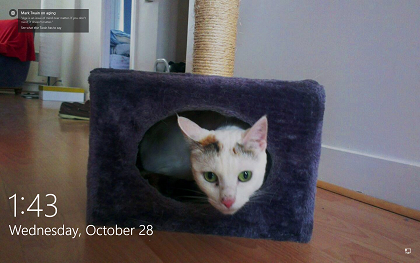

# Manage user experiences in Windows 10, version 1607

**Applies to**

-   Windows 10

> [Some information relates to pre-released product which may be substantially modified before it's commercially released. Microsoft makes no warranties, express or implied, with respect to the information provided here. ]

Windows 10 is available in several editions, providing choice and convenience to organizations based on their requirements.  Windows 10 Enterprise, available through Volume Licensing, is for organizations that require deep and granular manageability, control, and security capabilities.  Windows 10 Pro was designed for organizations who do not require or need the level of functionality in the enterprise edition, but still would like to purchase Windows 10 through volume licensing in bulk. For organizations that do not want to buy in bulk or do not have dedicated IT staff, we will offer [Windows 10 Enterprise E3 as an online service subscription](https://blogs.windows.com/windowsexperience/2016/07/12/announcing-new-subscription-options-for-windows-10-and-surface-for-businesses/) in the Cloud Solution Provider (CSP) program. Additionally, the same enterprise capabilities that come with Windows 10 Enterprise are available to schools and universities through [Windows 10 Education](https://technet.microsoft.com/en-us/edu/windows/index).

Windows 10 provides organizations with various options to manage an employee’s user experience so they can ensure a consistent and predictable experience for employees. Based on specific business requirements, IT pros can use Group Policy or mobile device management (MDM) to:

- Provide a default user experience based on their organizational standards.
- Configure a device for a specific, controlled scenario such as a kiosk that displays a single application or shared PC which would automatically reset when the employee signs off.
- Restrict access to services such as Cortana or the Windows Store.

The following table describes the user experience features that are manageable in Windows 10, version 1607 (also known as the Anniversary Update): 

| Feature | Windows 10 Pro | Windows 10 Education | Windows 10 Enterprise | placeholder |
| --- | --- | --- | --- | --- |
| **Windows Spotlight on the lock screen**\*   Photo on the lock screen with hot spots showing Microsoft messages  For instance, an image of a person of action, with a hotspot indicating how the user can take advantage of action center to quickly take actions, linking to an online help topic.  | - On by default (commercial content only if the device is joined to Active Directory or Azure Active Directory)  - Can restrict to Microsoft content only - Can allow non-Microsoft content - Cannot disable | - Off by default - Can restrict to Microsoft content only - Can allow non-Microsoft content - Can disable | - On by default (commercial content only)  - Can restrict to Microsoft content only - Can allow non-Microsoft content - Can disable | - Off by default - Can restrict to Microsoft content only - Can allow non-Microsoft content - Can disable | 
| **Facts, tips, and more on lock screen**\* Hot spot only on top of a user-chosen picture  For instance, a famous quote from Mark Twain and a link to a page with additional quotes. |- On by default (commercial content only if the device is joined to Active Directory or Azure Active Directory)  - Can restrict to Microsoft content only - Can allow non-Microsoft content - Cannot disable | - Off by default - Can restrict to Microsoft content only - Can allow non-Microsoft content - Can disable | - On by default (commercial content only)  - Can restrict to Microsoft content only - Can allow non-Microsoft content - Can disable | - Off by default - Can restrict to Microsoft content only - Can allow non-Microsoft content - Can disable | 
| **Start menu app suggestions**\* Suggestions for apps to download in the Start menu  For instance, an app suggestion for the free Sway app to help users create engaging presentations.| - On by default (commercial content only if the device is joined to Active Directory or Azure Active Directory)  - Can restrict to Microsoft content only - Can allow non-Microsoft content - Cannot disable | - Off by default - Can disable | - On by default (commercial content only)  - Can restrict to Microsoft content only - Can allow non-Microsoft content - Can disable | - Off by default - Can restrict to Microsoft content only - Can allow non-Microsoft content - Can disable | 
| **Additional apps on Start**\* Pre-installed apps or links to apps in the Start menu, such as Wunderlist or a link to install Skype  For instance, users may find a few new pre-installed apps on their device: a popular free task-tracking app such as Wunderlist, or a free app to learn new languages such as Duolingo, or utilities like the Weather Channel app. | - On by default (commercial content only if the device is joined to Active Directory or Azure Active Directory)  - Can restrict to Microsoft content only - Can allow non-Microsoft content - Cannot disable | - Off by default - Can disable | - On by default (commercial content only)  - Can restrict to Microsoft content only - Can allow non-Microsoft content - Can disable | - Off by default - Can restrict to Microsoft content only - Can allow non-Microsoft content - Can disable | 
| **Microsoft account notifications**\* Toasts that notify you of anything related to your Microsoft account, such as credit cards expiring, as well as family safety  For instance, if the user’s subscription to a Microsoft service like Xbox Live is expiring, or parental control notifications. | - On by default (commercial content only if the device is joined to Active Directory or Azure Active Directory)  - Can restrict to Microsoft content only - Can allow non-Microsoft content - Cannot disable | - Off by default - Can disable | - On by default  - Can disable | - Off by default - Can restrict to Microsoft content only - Can allow non-Microsoft content - Can disable | 
| **Windows tips**\* Tips that pop up to help navigate Windows  For instance, a tooltip to illustrate how users can pin apps that they frequently use to their taskbar for quicker access, or a contextual app suggestion. | - On by default (commercial content only if the device is joined to Active Directory or Azure Active Directory)  - Can restrict to Microsoft content only - Can allow non-Microsoft content - Cannot disable | - Off by default - Can disable | - On by default (commercial content only)  - Can restrict to Microsoft content only - Can allow non-Microsoft content - Can disable | - Off by default - Can restrict to Microsoft content only - Can allow non-Microsoft content - Can disable | 
| **Windows Store** | - On by default  - Cannot disable using Group Policy or MDM| - On by default - Can disable | - On by default - Can disable  | - Off by default - Can restrict to Microsoft content only - Can allow non-Microsoft content - Can disable | 
| **Cortana** | - On by default  - Can disable, except for the **Don't search the web or display web results** settings| - Off by default - Cannot enable | - On by default - Can disable  | - Off by default - Can restrict to Microsoft content only - Can allow non-Microsoft content - Can disable | 

\*For Windows 10 Enterprise PCs, or Windows 10 Pro PCs that are joined to Active Directory or Azure Active Directory, the content shown by ehse features is limited to utilities and productivity apps, tips, and help content for using Windows 10. These devices will not see consumer-oriented contnet like game.

>**Note:** When these features are not managed, users can turn them on or off individually using **Settings**.

## Related topics

- [Manage Windows 10 Start layout](windows-10-start-layout-options-and-policies.md)
- [Cortana integration in your business or enterprise](manage-cortana-in-enterprise.md)
- [Windows spotlight on the lock screen](../whats-new/windows-spotlight.md)

 

 

