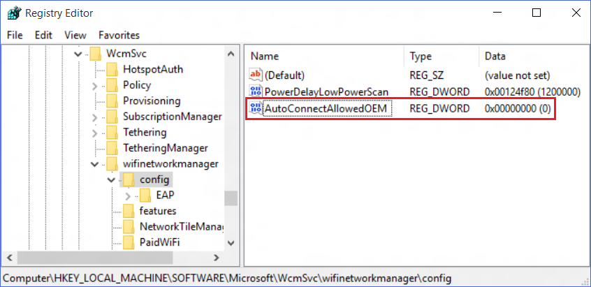
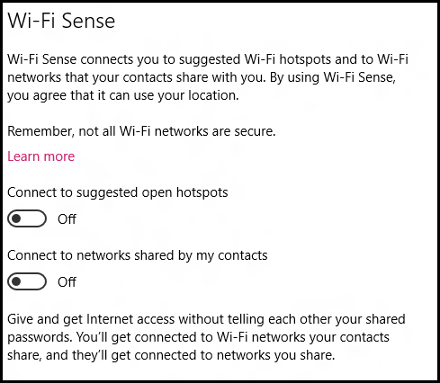

# Manage Wi-Fi Sense in your company

**Applies to:**

-   Windows 10
-   Windows 10 Mobile

Wi-Fi Sense automatically connects you to Wi-Fi, so you can get online quickly in more places. It can connect you to open Wi-Fi hotspots it knows about through crowdsourcing, or to Wi-Fi networks your contacts have shared with you by using Wi-Fi Sense.

The initial settings for Wi-Fi Sense are determined by the options you chose when you first set up your PC with Windows 10.

**Note**  
Wi-Fi Sense isn’t available in all countries or regions.

 

## How does Wi-Fi Sense work?

Wi-Fi Sense connects your employees to the available Wi-Fi networks, including:

-   **Open Wi-Fi networks.** Wi-Fi Sense uses crowdsourcing to find the networks that other Windows users are connected to. Typically, these are the open (no password required) Wi-Fi hotspots you see when you’re out and about.

-   **Shared Wi-Fi networks.** Wi-Fi Sense uses the Wi-Fi networks that your employee shares with Facebook friends, Outlook.com contacts, or Skype contacts. Sharing doesn’t happen automatically; an employee must connect to a network, enter the network password, and then choose the **Share network with my contacts** box before the network is shared.

**Important**  
Wi-Fi Sense lets your employees share your network access with their contacts, without telling their contacts the actual network password. Should the contact want to share your network with another contact, he or she would have to share the network directly, by providing the password and clicking to share the network.

Employees can't share network info with their contacts for any company network using the IEEE 802.1X protocol.

 

## How to manage Wi-Fi Sense in your company

In a company environment, you will most likely deploy Windows 10 to your employees' PCs using your preferred deployment method and then manage their settings globally. With that in mind, you have a few options for managing how your employees will use Wi-Fi Sense.

**Important**  
Turning off Wi-Fi Sense also turns off all related features, including: connecting automatically to open hotspots, connecting automatically to networks shared by contacts, and sharing networks with contacts.

 

### Using Group Policy (available starting with Windows 10, version 1511)

You can manage your Wi-Fi Sense settings by using Group Policy and your Group Policy editor.

**To set up Wi-Fi Sense using Group Policy**

1.  Open your Group Policy editor and go to the **Computer Configuration\\Administrative Templates\\Network\\WLAN Service\\WLAN Settings\\Allow Windows to automatically connect to suggested open hotspots, to networks shared by contacts, and to hotspots offering paid services** setting.

    

2.  Turn Wi-Fi Sense on (enabled) or off (disabled), based on your company's environment.

### Using the Registry Editor

You can manage your Wi-Fi Sense settings by using registry keys and the Registry Editor.

**To set up Wi-Fi Sense using the Registry Editor**

1.  Open your Registry Editor and go to **HKEY\_LOCAL\_MACHINE\\SOFTWARE\\Microsoft\\WcmSvc\\wifinetworkmanager\\config\\**.

2.  Create and set a new **DWORD (32-bit) Value** named, **AutoConnectAllowedOEM**, with a **Value data** of **0 (zero)**.

    Setting this value to **0** turns off Wi-Fi Sense and all Wi-Fi sense features. When turned off, the Wi-Fi Sense settings still appear on the **Wi-Fi Settings** screen, but can't be controlled by the employee and all of the Wi-Fi Sense features are turned off. For more info, see [How to configure Wi-Fi Sense on Windows 10 in an enterprise](http://go.microsoft.com/fwlink/p/?LinkId=620959).

    

### Using the Windows Provisioning settings

You can manage your Wi-Fi Sense settings by changing the Windows provisioning setting, **WiFISenseAllowed**.

**To set up Wi-Fi Sense using **WiFISenseAllowed****

-   Change the Windows Provisioning setting, **WiFISenseAllowed**, to **0**.

    Setting this value to **0** turns off Wi-Fi Sense and all Wi-Fi sense features. When turned off, the Wi-Fi Sense settings still appear on the **Wi-Fi Settings** screen, but can't be controlled by the employee and all of the Wi-Fi Sense features are turned off. For more info, see the Windows Provisioning settings reference topic, [WiFiSenseAllowed](http://go.microsoft.com/fwlink/p/?LinkId=620909).

### Using Unattended Windows Setup settings

If your company still uses Unattend, you can manage your Wi-Fi Sense settings by changing the Unattended Windows Setup setting, **WiFiSenseAllowed**.

**To set up Wi-Fi Sense using **WiFISenseAllowed****

-   Change the Unattended Windows Setup setting, **WiFISenseAllowed**, to **0**.

    Setting this value to **0** turns off Wi-Fi Sense and all Wi-Fi sense features. When turned off, the Wi-Fi Sense settings still appear on the **Wi-Fi Settings** screen, but can't be controlled by the employee and all of the Wi-Fi Sense features are turned off. For more info, see the Unattended Windows Setup Reference topic, [WiFiSenseAllowed](http://go.microsoft.com/fwlink/p/?LinkId=620910).

### How employees can change their own Wi-Fi Sense settings

If you don’t turn off the ability for your employees to use Wi-Fi Sense, they can turn the settings on locally by selecting **Settings &gt; Network & Internet &gt; Wi-Fi &gt; Manage Wi-Fi settings**, and then changing one or both of these settings under **Wi-Fi Sense**:

-   • Connect to suggested open hotspots

-   • Connect to networks shared by my contacts

    

## Important considerations

Whether to allow your employees to share your password-protected Wi-Fi networks with their contacts to give them Internet access is completely up to you. However, if you decide to allow it, you should consider the following important info.

### Network considerations

-   Wi-Fi Sense is designed to block contacts given Internet access through your password-protected network from reaching your intranet sites and other devices or files on the shared network.

-   Network info can only be shared with contacts using Wi-Fi Sense on PCs running Windows 10 or phones running Windows 10 Mobile. Wi-Fi Sense won’t work with any other operating system.

### Security considerations

-   Your employees must be connected using a Microsoft account to use Wi-Fi Sense.

-   Your employees can’t pick individual contacts to share with. Instead, they must pick a group of contacts, such as their Skype contacts. In this case, all of the employee’s Skype contacts will be able to access the shared network.

-   Wi-Fi Sense is designed to block contacts from seeing the Wi-Fi network password. For networks you choose to share access to, the password is sent over an encrypted connection, stored in an encrypted file on a Microsoft server, and then sent over an HTTPS connection to the contacts' PC or phone if they use Wi-Fi Sense.

-   Access is only shared with your employee’s contacts. Wi-Fi Sense doesn't share networks with the contact's contacts. Should the contact want to share your network with another contact, he or she would have to share the network directly, by providing the password and clicking to share the network.

### Sharing considerations

-   Employees can't share network info with their contacts for any company network using the IEEE 802.1X protocol.

-   Your employees can pick which Wi-Fi networks they want to share. The first time the employee connects to a password-protected Wi-Fi network, they’re presented with an option to share the network and to pick the contacts that should be given the info.

## Related topics

[Wi-Fi Sense FAQ](http://go.microsoft.com/fwlink/p/?LinkId=620911)

[How to configure Wi-Fi Sense on Windows 10 in an enterprise](http://go.microsoft.com/fwlink/p/?LinkId=620959)

 

 

