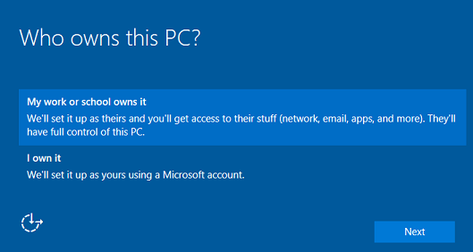

# Set up a shared or guest PC with Windows 10


**Applies to**

-   Windows 10

Windows 10, version 1607, introduces *shared PC mode*, which optimizes Windows 10 for shared use scenarios, such as touchdown spaces in an enterprise  and temporary customer use in retail. You can apply shared PC mode to Windows 10 Pro, Pro Education, Education, and Enterprise.

> [!NOTE]
> If you're interested in using Windows 10 for shared PCs in a school, see [Use Set up School PCs app](https://technet.microsoft.com/edu/windows/use-set-up-school-pcs-app) which provides a simple way to configure PCs with shared PC mode plus additional settings specific for education.

##Shared PC mode concepts
A Windows 10 PC in shared PC mode is designed to be management- and maintenance-free with high reliability. In shared PC mode, only one user can be signed in at a time. When the PC is locked, the currently signed in user can always be signed out at the lock screen. Users who sign-in are signed in as standard users, not admin users.

###Account models
It is intended that shared PCs are joined to an Active Directory or Azure Active Directory domain by a user with the necessary rights to perform a domain join as part of a setup process. This enables any user that is part of the directory to sign-in to the PC as a standard user. The user who originally joined the PC to the domain will have administrative rights when they sign in. If using Azure Active Directory Premium, any domain user can also be configured to sign in with administrative rights. Additionally, shared PC mode can be configured to enable a **Start without an account** option on the sign-in screen, which doesn't require any user credentials or authentication and creates a new local account.

###Account management
When the account management service is turned on in shared PC mode, accounts are automatically deleted. Account deletion applies to Active Directory, Azure Active Directory, and local accounts that are created by the **Start without an account** option. Account management is performed both at sign-off time (to make sure there is enough disk space for the next user) as well as during system maintenance time periods. Shared PC mode can be configured to delete accounts immediately at sign-out or when disk space is low.

###Maintenance and sleep
Shared PC mode is configured to take advantage of maintenance time periods which run while the PC is not in use. Therefore, sleep is strongly recommended so that the PC can wake up when it is not is use to perform maintenance, clean up accounts, and run Windows Update. The recommended settings can be set by choosing **SetPowerPolicies** in the list of shared PC options. Additionally, on devices without Advanced Configuration and Power Interface (ACPI) wake alarms, shared PC mode will always override real-time clock (RTC) wake alarms to be allowed to wake the PC from sleep (by default, RTC wake alarms are off). This ensures that the widest variety of hardware will take advantage of maintenance periods.

While shared PC mode does not configure Windows Update itself, it is strongly recommended to configure Windows Update to automatically install updates and reboot (if necessary) during maintenance hours. This will help ensure the PC is always up to date and not interrupting users with updates. Use one of the following methods to configure Windows Update:

- Group Policy: Set **Computer Configuration > Administrative Templates > Windows Components > Windows Update > Configure Automatic Updates** to `4` and check **Install during automatic maintenance**.
- MDM: Set **Update/AllowAutoUpdate** to `4`. 
- Provisioning: In Windows Imaging and Configuration Designer (ICD), set **Policies/Update/AllowAutoUpdate** to `4`. 

[Learn more about the AllowAutoUpdate settings](https://msdn.microsoft.com/library/windows/hardware/dn904962.aspx#Update_AllowAutoUpdate)

###App behavior

Apps can take advantage of shared PC mode by changing their app behavior to align with temporary use scenarios. For example, an app might only download content on demand on a device in shared PC mode, or might skip first run experiences. For information on how an app can query for shared PC mode, see [SharedModeSettings class](https://msdn.microsoft.com/en-us/library/windows/apps/windows.system.profile.sharedmodesettings.aspx).

###Customization
Shared PC mode exposes a set of customizations to tailor the behavior to your requirements. These customizations are the options that you'll set either using MDM or a provisioning package as explained in [Configuring shared PC mode on Windows](#configuring-shared-pc-mode-on-windows). The options are listed in the following table.

| Setting | Value |
|:---|:---|
| EnableSharedPCMode | Set as **True**. If this is not set to **True**, shared PC mode is not turned on and none of the other settings apply. Some of the remaining settings in **SharedPC** are optional, but we strongly recommend that you also set `EnableAccountManager` to **True**.  |
| AccountManagement: AccountModel | This option controls how users can sign-in on the PC. Choosing domain-joined will enable any user in the domain to sign-in. Specifying the guest option will add the **Start without an account** option to the sign-in screen and enable anonymous guest access to the PC. <br/>  - **Only guest** allows anyone to use the PC as a local standard (non-admin) account.<br/>  - **Domain-joined only** allows users to sign in with an Active Directory or Azure AD account.<br/>-   **Domain-joined and guest** allows users to sign in with an Active Directory, Azure AD, or local standard account.   |
| AccountManagement: DeletionPolicy | - **Delete immediately** will delete the account on sign-out. <br/>- **Delete at disk space threshold** will start deleting accounts when available disk space falls below the threshold you set for **DiskLevelDeletion**, and it will stop deleting accounts when the available disk space reaches the threshold you set for **DiskLevelCaching**. Accounts are deleted in order of oldest accessed to most recently accessed. <br/><br/>Example: The caching number is 50 and the deletion number is 25. Accounts will be cached while the free disk space is above 25%. When the free disk space is less than 25% (the deletion number) at a maintenance period, accounts will be deleted (oldest last used first) until the free disk space is above 50% (the caching number). Accounts will be deleted immediately at sign off of an account if free space is under the deletion threshold and disk space is very low, regardless if the PC is actively in use or not.  |
| AccountManagement: DiskLevelCaching | If you set **DeletionPolicy** to **Delete at disk space threshold**, set the percent of total disk space to be used as the disk space threshold for account caching.   |
| AccountManagement: DiskLevelDeletion | If you set **DeletionPolicy** to **Delete at disk space threshold**, set the percent of total disk space to be used as the disk space threshold for account deletion.   |
| AccountManagement: EnableAccountManager | Set as **True** to enable automatic account management. If this is not set to true, no automatic account management will be done. |
| Customization: MaintenanceStartTime | By default, the maintenance start time (which is when automatic maintenance tasks run, such as Windows Update) is midnight. You can adjust the start time in this setting by entering a new start time in minutes from midnight. For example, if you want maintenance to begin at 2 AM, enter `120` as the value.   |
| Customization: SetEduPolicies | Set to **True** for PCs that will be used in a school. When **SetEduPolicies** is **True**, the following additional settings are applied:<br/>- Local storage locations are restricted. Users can only save files to the cloud. <br/>- Custom Start and taskbar layouts are set.\* <br/>- A custom sign-in screen background image is set.\* <br/>- Additional educational policies are applied (see full list below).<br/><br/>\*Only applies to Windows 10 Pro Education, Enterprise, and Education  |
| Customization: SetPowerPolicies |  When set as **True**:<br/>- Prevents users from changing power settings<br/>- Turns off hibernate<br/>- Overrides all power state transitions to sleep (e.g. lid close)  |
| Customization: SignInOnResume | This setting specifies if the user is required to sign in with a password when the PC wakes from sleep.     |
| Customization: SleepTimeout | Specifies all timeouts for when the PC should sleep. Enter the amount of idle time in seconds. If you don't set sleep timeout, the default of 1 hour applies.     |


##Configuring shared PC mode on Windows
You can configure Windows to be in shared PC mode in a couple different ways:
- Mobile device management (MDM): Shared PC mode is enabled by the [SharedPC configuration service provider (CSP)](https://msdn.microsoft.com/library/windows/hardware/mt723294.aspx). Your MDM policy can contain any of the options listed in the [Customization](#customization) section. The following image shows a Microsoft Intune policy with the shared PC options added as OMA-URI settings. [Learn more about Windows 10 policy settings in Microsoft Intune.](https://docs.microsoft.com/intune/deploy-use/windows-10-policy-settings-in-microsoft-intune)

 

- A provisioning package created with the Windows Imaging and Configuration Designer (ICD): You can apply a provisioning package when you initially set up the PC (also known as the out-of-box-experience or OOBE), or you can apply the provisioning package to a Windows 10 PC that is already in use. The provisioning package is created in Windows Imaging and Configuration Designer (ICD). Shared PC mode is enabled by the [SharedPC configuration service provider (CSP)](https://msdn.microsoft.com/library/windows/hardware/mt723294.aspx), exposed in ICD as SharedPC.


### Create a provisioning package for shared use

Use the Windows ICD tool included in the Windows Assessment and Deployment Kit (ADK) for Windows 10 to create a provisioning package that configures a device for shared PC mode. [Install the ADK and select **Configuration Designer**.](https://developer.microsoft.com/windows/hardware/windows-assessment-deployment-kit)

1.  Open Windows ICD (by default, %windir%\\Program Files (x86)\\Windows Kits\\10\\Assessment and Deployment Kit\\Imaging and Configuration Designer\\x86\\ICD.exe). 

2. On the **Start page**, select **Advanced provisioning**.

3. Enter a name and (optionally) a description for the project, and click **Next**.

4. Select **All Windows desktop editions**, and click **Next**.

5. Click **Finish**. Your project opens in Windows ICD.

6. Go to **Runtime settings** > **SharedPC**. [Select the desired settings for shared PC mode.](#customization)

7. On the **File** menu, select **Save.**
8.  On the **Export** menu, select **Provisioning package**.
9.  Change **Owner** to **IT Admin**, which will set the precedence of this provisioning package higher than provisioning packages applied to this device from other sources, and then select **Next.**
10. Set a value for **Package Version**.
    > [!TIP]
    > You can make changes to existing packages and change the version number to update previously applied packages.
  
11. (*Optional*) In the **Provisioning package security** window, you can choose to encrypt the package and enable package signing.
    -   **Enable package encryption** - If you select this option, an auto-generated password will be shown on the screen.
    -   **Enable package signing** - If you select this option, you must select a valid certificate to use for signing the package. You can specify the certificate by clicking **Select...** and choosing the certificate you want to use to sign the package.
       > [!IMPORTANT]  
       > We recommend that you include a trusted provisioning certificate in your provisioning package. When the package is applied to a device, the certificate is added to the system store and any package signed with that certificate thereafter can be applied silently.
        
12. Click **Next** to specify the output location where you want the provisioning package to go once it's built. By default, Windows ICD uses the project folder as the output location.
    Optionally, you can click **Browse** to change the default output location.
13. Click **Next**.
14. Click **Build** to start building the package. The project information is displayed in the build page and the progress bar indicates the build status.
    If you need to cancel the build, click **Cancel**. This cancels the current build process, closes the wizard, and takes you back to the **Customizations Page**.
15. If your build fails, an error message will show up that includes a link to the project folder. You can scan the logs to determine what caused the error. Once you fix the issue, try building the package again.
    If your build is successful, the name of the provisioning package, output directory, and project directory will be shown.
    -   If you choose, you can build the provisioning package again and pick a different path for the output package. To do this, click **Back** to change the output package name and path, and then click **Next** to start another build.
    -   If you are done, click **Finish** to close the wizard and go back to the **Customizations Page**.
16. Select the **output location** link to go to the location of the package. You can provide that .ppkg to others through any of the following methods:

    -   Shared network folder

    -   SharePoint site

    -   Removable media (USB/SD) (select this option to apply to a PC during initial setup)
    

### Apply the provisioning package

You can apply the provisioning package to a PC during initial setup or to a PC that has already been set up.

**During initial setup**
1. Start with a computer on the first-run setup screen. If the PC has gone past this screen, reset the PC to start over. To reset the PC, go to **Settings** > **Update & security** > **Recovery** > **Reset this PC**.

    

2. Insert the USB drive and press the Windows key five times. Windows Setup will recognize the drive and ask if you want to set up the device. If there is only one provisioning package on the USB drive, you don't need to press the Windows key five times, Windows will automatically ask you if you want to set up the device. Select **Set up**.

    

3. The next screen asks you to select a provisioning source. Select **Removable Media** and tap **Next**.

    
    
4. Select the provisioning package (\*.ppkg) that you want to apply, and tap **Next**.

    

5. Select **Yes, add it**.

    
    
6. Read and accept the Microsoft Software License Terms.  

    
    
7. Select **Use Express settings**.

    

8. If the PC doesn't use a volume license, you'll see the **Who owns this PC?** screen. Select **My work or school owns it** and tap **Next**.

    

9. On the **Choose how you'll connect** screen, select **Join Azure AD** or **Join a domain** and tap **Next**.

    

10. Sign in with  your domain, Azure AD,  or Office 365 account and password. When you see the progress ring, you can remove the USB drive.

    

    
**After setup**

On a desktop computer, navigate to **Settings** &gt; **Accounts** &gt; **Work access** &gt; **Add or remove a management package** &gt; **Add a package**, and selects the package to install. 


> [!NOTE]
> If you apply the setup file to a computer that has already been set up, existing accounts and data might be lost.

## Guidance for accounts on shared PCs

* We recommend no local admin accounts on the PC to improve the reliability and security of the PC.
* When a PC is set up in shared PC mode, accounts will be cached automatically until disk space is low. Then, accounts will be deleted to reclaim disk space. This account managment happens automatically. Both Azure AD and Active Directory domain accounts are managed in this way. Any accounts created through **Start without an account** will also be deleted automatically at sign out.
* On a Windows PC joined to Azure Active Directory:
    * By default, the account that joined the PC to Azure AD will have an admin account on that PC. Global administrators for the Azure AD domain will also have admin accounts on the PC.
    * With Azure AD Premium, you can specify which accounts have admin accounts on a PC using the **Additional administrators on Azure AD Joined devices** setting on the Azure portal.
* Local accounts that already exist on a PC won’t be deleted when turning on shared PC mode. New local accounts that are created using **Settings > Accounts > Other people > Add someone else to this PC** after shared PC mode is turned on won't be deleted. However, any new local accounts created by the **Start without an account** selection on the sign-in screen (if enabled) will automatically be deleted at sign-out.
* If admin accounts are necessary on the PC
    * Ensure the PC is joined to a domain that enables accounts to be signed on as admin, or
    * Create admin accounts before setting up shared PC mode, or 
    * Create exempt accounts before signing out when turning shared pc mode on.
* The account management service supports accounts that are exempt from deletion.
    * An account can be marked exempt from deletion by adding the account SID to the `HKEY_LOCAL_MACHINE\SOFTARE\Microsoft\Windows\CurrentVersion\SharedPC\Exemptions\` registry key.
    * To add the account SID to the registry key using PowerShell:<br/>
        ```
        $adminName = "LocalAdmin"
        $adminPass = 'Pa$$word123'
        iex "net user /add $adminName $adminPass"
        $user = New-Object System.Security.Principal.NTAccount($adminName) 
        $sid = $user.Translate([System.Security.Principal.SecurityIdentifier]) 
        $sid = $sid.Value;
        New-Item -Path "HKLM:\Software\Microsoft\Windows\CurrentVersion\SharedPC\Exemptions\$sid" -Force
        ``` 


## Policies set by shared PC mode
Shared PC mode sets local group policies to configure the device. Some of these are configurable using the shared pc mode options.

> [!IMPORTANT]
> It is not recommended to set additional policies on PCs configured for **Shared PC Mode**.	The shared PC mode has been optimized to be fast and reliable over time with minimal to no manual maintenance required.

<table border="1"> 

<tr><th><p>Policy name</p></th><th><p>Value</p></th><th><p>When set?</p></th></tr> </thead>
<tbody>
<tr><td colspan="3"><p><strong>Admin Templates</strong> > <strong>Control Panel</strong> > <strong>Personalization</strong></p></td></tr> 
<tr><td><p>Prevent enabling lock screen slide show</p></td><td><p>Enabled</p></td><td><p>Always</p></td></tr> 
<tr><td><p>Prevent changing lock screen and logon image</p></td><td><p>Enabled</p></td><td><p>Always</p></td></tr> 
<tr><td colspan="3"><p><strong>Admin Templates</strong> > <strong>System</strong> > <strong>Power Management</strong> > <strong>Button Settings</strong></p></td></tr> 
<tr><td><p>Select the Power button action (plugged in)</p></td><td><p>Sleep</p></td><td><p>SetPowerPolicies=True</p></td></tr> 
<tr><td><p>Select the Power button action (on battery)</p></td><td><p>Sleep</p></td><td><p>SetPowerPolicies=True</p></td></tr> 
<tr><td><p>Select the Sleep button action (plugged in)</p></td><td><p>Sleep</p></td><td><p>SetPowerPolicies=True</p></td></tr> 
<tr><td><p>Select the lid switch action (plugged in)</p></td><td><p>Sleep</p></td><td><p>SetPowerPolicies=True</p></td></tr> 
<tr><td><p>Select the lid switch action (on battery)</p></td><td><p>Sleep</p></td><td><p>SetPowerPolicies=True</p></td></tr> 
<tr><td colspan="3"><p><strong>Admin Templates</strong> > <strong>System</strong> > <strong>Power Management</strong> > <strong>Sleep Settings</strong></p></td></tr> 
<tr><td><p>Require a password when a computer wakes (plugged in)</p></td><td><p>Enabled</p></td><td><p>SignInOnResume=True</p></td></tr> 
<tr><td><p>Require a password when a computer wakes (on battery)</p></td><td><p>Enabled</p></td><td><p>SignInOnResume=True</p></td></tr>
<tr><td><p>Specify the system sleep timeout (plugged in)</p></td><td><p>*SleepTimeout*</p></td><td><p>SetPowerPolicies=True</p></td></tr> 
<tr><td><p>Specify the system sleep timeout (on battery)</p></td><td><p>*SleepTimeout*</p></td><td><p>SetPowerPolicies=True</p></td></tr> 
<tr> <td> <p>Turn off hybrid sleep (plugged in)</p></td> <td> <p>Enabled</p></td><td><p>SetPowerPolicies=True</p></td></tr> 
<tr> <td> <p>Turn off hybrid sleep (on battery)</p></td> <td> <p>Enabled</p></td><td><p>SetPowerPolicies=True</p></td></tr> 
<tr> <td> <p>Specify the unattended sleep timeout (plugged in)</p></td> <td> <p>*SleepTimeout*</p> </td><td><p>SetPowerPolicies=True</p></td></tr> 
<tr> <td> <p>Specify the unattended sleep timeout (on battery)</p></td> <td> <p>*SleepTimeout*</p> </td><td><p>SetPowerPolicies=True</p></td></tr> 
<tr> <td> <p>Allow standby states (S1-S3) when sleeping (plugged in)</p></td> <td> <p>Enabled</p></td><td><p>SetPowerPolicies=True</p></td></tr> 
<tr> <td> <p>Allow standby states (S1-S3) when sleeping (on battery)</p></td> <td> <p>Enabled</p></td> <td><p>SetPowerPolicies=True</p></td></tr> 
<tr> <td> <p>Specify the system hibernate timeout (plugged in)</p></td> <td> <p>Enabled, 0</p></td><td><p>SetPowerPolicies=True</p></td></tr> 
<tr> <td> <p>Specify the system hibernate timeout (on battery)</p></td> <td> <p>Enabled, 0</p></td><td><p>SetPowerPolicies=True</p></td></tr> 
<tr> <td colspan="3"> <p><strong>Admin Templates</strong>><strong>System</strong>><strong>Power Management</strong>><strong>Video and Display Settings</strong></p></td></tr> 
<tr> <td> <p>Turn off the display (plugged in)</p></td> <td> <p>*SleepTimeout*</p> </td></td><td><p>SetPowerPolicies=True</p></td></tr>
 <tr> <td> <p>Turn off the display (on battery</p></td> <td> <p>*SleepTimeout*</p> </td></td><td><p>SetPowerPolicies=True</p></td></tr> 
<tr> <td colspan="3"> <p><strong>Admin Templates</strong>><strong>System</strong>><strong>Logon</strong></p></td></tr> 
<tr> <td> <p>Show first sign-in animation</p></td> <td> <p>Disabled</p></td><td><p>Always</p></td></tr> 
<tr> <td> <p>Hide entry points for Fast User Switching</p></td> <td> <p>Enabled</p></td><td><p>Always</p></td></tr> 
<tr> <td> <p>Turn on convenience PIN sign-in</p></td> <td> <p>Disabled</p></td><td><p>Always</p></td></tr> 
<tr> <td> <p>Turn off picture password sign-in</p></td> <td> <p>Enabled</p></td><td><p>Always</p></td></tr> 
<tr> <td> <p>Turn off app notification on the lock screen</p></td> <td> <p>Enabled</p></td><td><p>Always</p></td></tr> 
<tr> <td> <p>Allow users to select when a password is required when resuming from connected standby</p></td> <td> <p>Disabled</p></td><td><p>SignInOnResume=True</p></td>
</tr> 
<tr> <td> <p>Block user from showing account details on sign-in</p></td> <td> <p>Enabled</p></td><td><p>Always</p></td></tr> 
<tr> <td colspan="3"> <p><strong>Admin Templates</strong>><strong>System</strong>><strong>User Profiles</strong></p></td></tr> 
<tr> <td> <p>Turn off the advertising ID</p></td> <td> <p>Enabled</p></td><td><p>SetEduPolicies=True</p></td></tr> 
<tr> <td colspan="3"> <p><strong>Admin Templates</strong>><strong>Windows Components </strong></p></td></tr> 
<tr> <td> <p>Do not show Windows Tips </p>*Only on Pro, Enterprise, Pro Education, and Education* </td> <td> <p>Enabled</p></td><td><p>SetEduPolicies=True</p></td></tr> 
<tr> <td> <p>Turn off Microsoft consumer experiences </p>*Only on Pro, Enterprise, Pro Education, and Education* </td> <td> <p>Enabled</p></td><td><p>SetEduPolicies=True</p></td></tr> 
<tr> <td> <p>Microsoft Passport for Work</p></td> <td> <p>Disabled</p></td><td><p>Always</p></td></tr> 
<tr> <td> <p>Prevent the usage of OneDrive for file storage</p></td> <td> <p>Enabled</p></td><td><p>Always</p></td></tr> 
<tr> <td colspan="3"> <p><strong>Admin Templates</strong>><strong>Windows Components</strong>><strong>Biometrics</strong></p></td></tr> 
<tr> <td> <p>Allow the use of biometrics</p></td> <td> <p>Disabled</p></td><td><p>Always</p></td></tr> 
<tr> <td> <p>Allow users to log on using biometrics</p></td> <td> <p>Disabled</p></td><td><p>Always</p></td></tr> 
<tr> <td> <p>Allow domain users to log on using biometrics</p></td> <td> <p>Disabled</p></td><td><p>Always</p></td></tr> 
<tr> <td colspan="3"> <p><strong>Admin Templates</strong>><strong>Windows Components</strong>><strong>Data Collection and Preview Builds</strong></p></td></tr> 
<tr> <td> <p>Toggle user control over Insider builds</p></td> <td> <p>Disabled</p></td><td><p>Always</p></td></tr> 
<tr> <td> <p>Disable pre-release features or settings</p></td> <td> <p>Disabled</p></td><td><p>Always</p></td></tr> 
<tr> <td> <p>Do not show feedback notifications</p></td> <td> <p>Enabled</p></td><td><p>Always</p></td></tr> 
<tr> <td colspan="3"> <p><strong>Admin Templates</strong>><strong>Windows Components</strong>><strong>File Explorer</strong></p></td></tr> 
<tr> <td> <p>Show lock in the user tile menu</p></td> <td> <p>Disabled</p></td><td><p>Always</p></td></tr> 
<tr> <td colspan="3"> <p><strong>Admin Templates</strong>><strong>Windows Components</strong>><strong>Maintenance Scheduler</strong></p></td></tr> 
<tr> <td> <p>Automatic Maintenance Activation Boundary</p></td> <td> <p>*MaintenanceStartTime*</p></td><td><p>Always</p></td></tr> 
<tr> <td> <p>Automatic Maintenance Random Delay</p></td> <td> <p>Enabled, 2 hours</p></td><td><p>Always</p></td></tr> 
<tr> <td> <p>Automatic Maintenance WakeUp Policy</p></td> <td> <p>Enabled</p></td><td><p>Always</p></td></tr> 
<tr> <td colspan="3"> <p><strong>Admin Templates</strong>><strong>Windows Components</strong>><strong>Microsoft Edge</strong></p></td></tr> 
<tr> <td> <p>Open a new tab with an empty tab</p></td> <td> <p>Disabled</p></td><td><p>SetEduPolicies=True</p></td></tr> 
<tr> <td> <p>Configure corporate home pages</p></td> <td> <p>Enabled, about:blank</p></td><td><p>SetEduPolicies=True</p></td></tr> 
<tr> <td colspan="3"> <p><strong>Admin Templates</strong>><strong>Windows Components</strong>><strong>Search</strong></p></td></tr> 
<tr> <td> <p>Allow Cortana</p> </td> <td> <p>Disabled</p> </td><td><p>SetEduPolicies=True</p></td></tr> 
<tr> <td colspan="3"> <p><strong>Windows Settings</strong>><strong>Security Settings</strong>><strong>Local Policies</strong>><strong>Security Options</strong></p></td> 
</tr>
<tr> <td> <p>Interactive logon: Do not display last user name</p> </td> <td> <p>Enabled, Disabled when account model is only guest</p> </td><td><p>Always</p></td></tr>
<tr> <td> <p>Interactive logon: Sign-in last interactive user automatically after a system-initiated restart</p> </td> <td> <p>Disabled</p> </td> <td><p>Always</p></td> 
</tr> 
<tr> <td> <p>Shutdown: Allow system to be shut down without having to log on</p> </td> <td> <p>Disabled</p> </td><td><p>Always</p></td></tr> 
<tr> <td> <p>User Account Control: Behavior of the elevation prompt for standard users</p> </td> <td> <p>Auto deny</p> </td><td><p>Always</p></td></tr> 
</tbody>
</table> </br></br>


## Related topics

[Set up a device for anyone to use (kiosk)](set-up-a-device-for-anyone-to-use.md)


 

 


