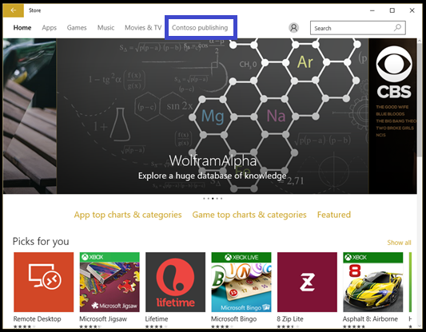
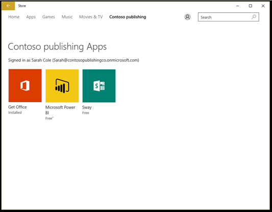

# Troubleshoot Windows Store for Business

**Applies to**

-   Windows 10
-   Windows 10 Mobile

Troubleshooting topics for Windows Store for Business.

## Can't find apps in private store

The private store for your organization is a page in the Windows Store app that contains apps that are private to your organization. After your organization acquires an app, your Store for Business admin can add it to your organization's private store. Your private store usually has a name that is close to the name of your organization or company. If you can't see your private store, there are a couple of things to check:

-   **No apps in the private store** - The private store page is only available in the Windows Store app if there are apps added to your private store. You won't see your private store page with no apps listed on it. If your Store for Business admin has added an app to the private store, and the private store page is still not available, they can check the private store status for the app on the **Inventory** page. If the status is **Add in progress**, wait and check back.

-   **Signed in with the wrong account** - If you have multiple accounts that you use in your organization, you might be signed in with the wrong account. Or, you might not be signed in. Use this procedure to sign in with your organization account.

**To sign in with organization account in Windows Store app**

1.  Click the people icon in Windows Store app, and click **Sign in**.

    

2.  Click **Add account**, and then click **Work or school account**.

    

3.  Type the email account and password, and click **Sign in**.

    

4.  You should see the private store for your organization. In our example, the page is named **Contoso publishing**.

    

    Click the private store to see apps in your private store.

    

 

 

