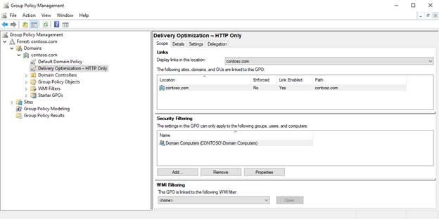

# Configure Delivery Optimization for Windows 10 updates

**Applies to**

- Windows 10

Delivery Optimization is a self-organizing distributed cache solution for businesses looking to reduce bandwidth consumption for operating system updates, operating system upgrades, and applications by allowing clients to download those elements from alternate sources (such as other peers on the network) in addition to the traditional Internet-based Windows Update servers. You can use Delivery Optimization in conjunction with stand-alone Windows Update, Windows Server Update Services (WSUS), and Windows Update for Business. This functionality is similar to BranchCache in other systems, such as System Center Configuration Manager. 

>[!NOTE]
>WSUS can also use [BranchCache](waas-branchcache.md) for content sharing and caching. If Delivery Optimization is enabled on devices that use BranchCache, Delivery Optimization will be used instead. 

By default in Windows 10 Enterprise and Education, Delivery Optimization allows peer-to-peer sharing on the organization's own network only, but you can configure it differently in Group Policy and mobile device management (MDM) solutions such as Microsoft Intune.

## Delivery Optimization options

You can use Group Policy or an MDM solution like Intune to configure Delivery Optimization. 

- Group Policy: Computer Configuration\Policies\Administrative Templates\Windows Components\Delivery Optimization
- MDM: .Vendor/MSFT/Policy/Config/DeliveryOptimization

Several Delivery Optimization features are configurable.

### Download mode (DODownloadMode)

Download mode dictates which download sources clients are allowed to use when downloading Windows updates in addition to Windows Update servers.  The following table shows the available download mode options and what they do.

| Download mode option | Functionality when set |
| --- | --- |
| HTTP Only (0) | This setting disables peer content sharing but still allows Delivery Optimization to download content from Windows Update servers or WSUS servers. |
| LAN (1 – Default) | This default operating mode for Delivery Optimization enables peer sharing on the same network. | 
| Group (2) | When group mode is set, the group is automatically selected based on the device’s Active Directory Domain Services (AD DS) site (Windows 10, version 1607) or the domain the device is authenticated to (Windows 10, version 1511). In group mode, peering occurs across internal subnets, between devices that belong to the same group, including devices in remote offices. You can use the GroupID option to create your own custom group independently of domains and AD DS sites. Group download mode is the recommended option for most organizations looking to achieve the best bandwidth optimization with Delivery Optimization. |
| Internet (3) | Enable Internet peer sources for Delivery Optimization. |
| Simple (99) | Simple mode disables the use of Delivery Optimization cloud services completely (for offline environments). Delivery Optimization switches to this mode automatically when the Delivery Optimization cloud services are unavailable or unreachable. |
|Bypass (100) |	Bypass Delivery Optimization and use BITS, instead. For example, select this mode so that clients can use BranchCache. |

>[!NOTE]
>Group mode is a best effort optimization and should not be relied on for an authentication of identity of devices participating in the group.

### Group ID (DOGroupID)

By default, peer sharing on clients using the group download mode is limited to the same domain in Windows 10, version 1511, and the same domain and AD DS site in Windows 10, version 1607. By using the Group ID setting, you can optionally create a custom group that contains devices that should participate in Delivery Optimization but do not fall within those domain or AD DS site boundaries, including devices in another domain. Using Group ID, you can further restrict the default group (for example create a sub-group representing an office building), or extend the group beyond the domain, allowing devices in multiple domains in your organization to peer. This setting requires the custom group to be specified as a GUID on each device that participates in the custom group. 

>[!NOTE]
>This configuration is optional and not required for most implementations of Delivery Optimization.
    
### Max Cache Age (DOMaxCacheAge)

In environments configured for Delivery Optimization, you may want to set an expiration on cached updates and Windows application installation files. If so, this setting defines the maximum number of seconds each file can be held in the Delivery Optimization cache on each Windows 10 client computer. The default Max Cache Age value is 259,200 seconds (3 days). Alternatively, organizations may choose to set this value to “0” which means “unlimited” to avoid peers re-downloading content. When “Unlimited” value is set, Delivery Optimization will hold the files in the cache longer and will clean up the cache as needed (for example when the cache size exceeded the maximum space allowed).

### Max Cache Size (DOMaxCacheSize)

This setting limits the maximum amount of space the Delivery Optimization cache can use as a percentage of the available drive space, from 1 to 100. For example, if you set this value to 10 on a Windows 10 client computer that has 100 GB of available drive space, then Delivery Optimization will use up to 10 GB of that space. Delivery Optimization will constantly assess the available drive space and automatically clear the cache to keep the maximum cache size under the set percentage. The default value for this setting is 20.

### Absolute Max Cache Size (DOAbsoluteMaxCacheSize)

This setting specifies the maximum number of gigabytes the Delivery Optimization cache can use. This is different from the **DOMaxCacheSize** setting, which is a percentage of available disk space. Also, if you configure this policy, it will override the **DOMaxCacheSize** setting. The default value for this setting is 10 GB.

### Maximum Download Bandwidth (DOMaxDownloadBandwidth)

This setting specifies the maximum download bandwidth that can be used across all concurrent Delivery Optimization downloads in kilobytes per second (KB/s). A default value of 0 means that Delivery Optimization will dynamically adjust and optimize the maximum bandwidth used.

### Percentage of Maximum Download Bandwidth (DOPercentageMaxDownloadBandwidth)

This setting specifies the maximum download bandwidth that Delivery Optimization can use across all concurrent download activities as a percentage of available download bandwidth. The default value 0 means that Delivery Optimization dynamically adjusts to use the available bandwidth for downloads.

### Max Upload Bandwidth (DOMaxUploadBandwidth)

This setting allows you to limit the amount of upload bandwidth individual clients can use for Delivery Optimization. Consider this setting when clients are providing content to requesting peers on the network. This option is set in kilobytes per second (KB/s). The default setting is 0, or “unlimited” which means Delivery Optimization dynamically optimizes for minimal usage of upload bandwidth; however it does not cap the upload bandwidth rate at a set rate.

### Minimum Background QoS (DOMinBackgroundQoS)

This value specifies the minimum download speed guarantee that a client attempts to achieve and will fulfill by downloading more bytes from Windows Update servers or WSUS. Simply put, the lower this value is, the more content will be sourced using peers on the network rather than Windows Update. The higher this value, the more content is received from Windows Update servers or WSUS, versus peers on the local network.

### Modify Cache Drive (DOModifyCacheDrive)

This setting allows for an alternate Delivery Optimization cache location on the clients. By default, the cache is stored on the operating system drive through the %SYSTEMDRIVE% environment variable. You can set the value to an environment variable (e.g., %SYSTEMDRIVE%), a drive letter (e.g., D:), or a folder path (e.g., D:\DOCache).

### Monthly Upload Data Cap (DOMonthlyUploadDataCap)

This setting specifies the total amount of data in gigabytes that a Delivery Optimization client can upload to Internet peers per month. A value of 0 means that an unlimited amount of data can be uploaded. The default value for this setting is 20 GB.

## Delivery Optimization configuration examples

Delivery Optimization can be configured in various ways, leveraging the policies described in the previous section.  The following samples describe some common scenarios that organizations may want to set up, given specific scenarios in use for their organization.

### Use Delivery Optimzation with group download mode

Delivery Optimization by default will consider all PCs in an organizations as peers for sharing content, even those that might be located across a slower WAN link.  Group download mode is designed to help with this by limiting the PCs that can be used. In Windows 10, version 1511, group download mode considers PCs in the same domain and with the same configured Group ID to be eligible peers. In Windows 10, version 1607, the default behavior also adds the PC's AD DS site into the grouping determination.

**To use Group Policy to configure Delivery Optimization for group download mode**

1.	Open Group Policy Management Console (GPMC).

2.	Expand Forest\Domains\\*Your_Domain*.

3.	Right-click *Your_Domain*, and then click **Create a GPO in this domain, and Link it here**.

4.	In the **New GPO** dialog box, in the **Name** box, type **Delivery Optimization – Group**.

5.	Right-click the **Delivery Optimization – Group** GPO, and then click **Edit**.

6.	In the Group Policy Management Editor, go to Computer Configuration\Policies\Administrative Templates\Windows Components\Delivery Optimization.

7.	Right-click the **Download Mode** setting, and then click **Edit**.

8.	Enable the policy, and then select the **Group** download mode.

9.	Right-click the **GroupID** setting, and then click **Edit**. Enable the policy, and then specify a unique GUID for each group of PCs. (This is not required for Windows 10, version 1607, since the AD site code will be used to group devices automatically.)

10.	Click **OK**, and then close the Group Policy Management Editor.

11.	In GPMC, select the **Delivery Optimization – Group** policy.

12.	On the **Scope** tab, under **Security Filtering**, configure the policy to be targeted to an approprite computer group.

**To use Intune to configure Delivery Optimization for group download mode**

1. Sign in to [https://manage.microsoft.com](https://manage.microsoft.com) with your Intune administrator credentials.

2. Click the **Policy** workspace. In the middle pane, click **Configuration Policies**, and then click **Add** in the details pane.
    
3. In the Create a New Policy Wizard, select **Windows\Custom Configuration (Windows 10 Desktop and Mobile and later)**, and then click **Create Policy**.

4. Name the policy **Windows Update for Business - CBB1**. Then, in the **OMA-URI Settings** section, click **Add**.

5. In **Setting name**, type **Set Delivery Optimization to Group**, and then select **Integer** from the **Data type** list.

6. In the **OMA-URI** box, type **.Vendor/MSFT/Policy/Config/DeliveryOptimization/DODownloadMode**.

7. In the **Value** box, type **2**, and then click **OK**.

    >[!NOTE]
    >The OMA-URI settings are case sensitive, so be sure to review [Policy CSP](https://msdn.microsoft.com/library/windows/hardware/dn904962.aspx) for the proper syntax.

8. Click **Save Policy**.

9. In the **Deploy Policy: Windows Update for Business – CBB1** dialog box, click **Yes**.

    >[!NOTE]
    >If this dialog box doesn't appear, select the policy, and then click **Manage Deployment**.
    
10. In the **Manage Deployment** dialog box, select the **All Computers** group, click **Add**, and then click **OK**.

### Use WSUS and BranchCache with Windows 10, version 1511

In Windows 10, version 1511, Delivery Optimization is enabled by default and is used for peer-to-peer sharing of updates.  For organizations that wish to instead leverage BranchCache for the caching of updates being delivered from a WSUS server, Delivery Optimization can be configured to leverage the **HTTP only** download mode, which results in Background Intelligent Transfer Service (BITS) being used to transfer the content; BITS will then use BranchCache when peers are available on the same subnet, and use the WSUS server directly when no peers are available.

**To use Group Policy to configure HTTP only download mode**

1.	Open Group Policy Management Console (GPMC).

2.	Expand Forest\Domains\\*Your_Domain*.

3.	Right-click *Your_Domain*, and then click **Create a GPO in this domain, and Link it here**.

4.	In the **New GPO** dialog box, in the **Name** box, type **Delivery Optimization – HTTP Only**.

5.	Right-click the **Delivery Optimization – HTTP Only** GPO, and then click **Edit**.

6.	In the Group Policy Management Editor, go to Computer Configuration\Policies\Administrative Templates\Windows Components\Delivery Optimization.

7.	Right-click the **Download Mode** setting, and then click **Edit**.

8.	Enable the policy, and then select the **HTTP only** download mode.

9.	Click **OK**, and then close the Group Policy Management Editor.

10.	In GPMC, select the **Delivery Optimization – HTTP Only** policy.

11.	On the **Scope** tab, under **Security Filtering**, select the default **AUTHENTICATED USERS** security group, and then click **Remove**. Then, click **Add**, browse to the **Domain Computers** group, and then click **OK**.

    

    >[!NOTE]
    >This example uses the Domain Computers group, but you can deploy this policy setting to any computer group.

### Use WSUS and BranchCache with Windows 10, version 1607

In Windows 10, version 1607, Delivery Optimization is enabled by default and is used for peer-to-peer sharing of updates. For organizations that wish to instead leverage BranchCache for the caching of updates being delivered from a WSUS server, Delivery Optimization can be configured to leverage the **Bypass** download mode (new in Windows 10, version 1607), which results in BITS being used to transfer the content; BITS will then use BranchCache when peers are available on the same subnet, and use the WSUS server directly when no peers are available.

**To use Group Policy to enable the Bypass download mode**

1.	Open Group Policy Management Console (GPMC).

2.	Expand Forest\Domains\\*Your_Domain*.

3.	Right-click *Your_Domain*, and then click **Create a GPO in this domain, and Link it here**.

4.	In the **New GPO** dialog box, in the **Name** box, type **Delivery Optimization – Bypass**.

5.	Right-click the **Delivery Optimization – Bypass** GPO, and then click **Edit**.

6.	In the Group Policy Management Editor, go to Computer Configuration\Policies\Administrative Templates\Windows Components\Delivery Optimization.

7.	Right-click the **Download Mode** setting, and then click **Edit**.

8.	Enable the policy, and then select the **Bypass** download mode. (Note that this download mode is only present in the Windows 10, version 1607, Group Policy ADMX files.)

9.	Click **OK**, and then close the Group Policy Management Editor.

10.	In GPMC, select the **Delivery Optimization – Bypass** policy.

11.	On the **Scope** tab, under **Security Filtering**, select the default **AUTHENTICATED USERS** security group, and then click **Remove**. Then, click **Add**, select the **Domain Computers** group, and then click **OK**.

    >[!NOTE]
    >This example uses the Domain Computers group, but you can deploy this policy setting to any computer group.
    
### Set “preferred” cache devices for Delivery Optimization

In some cases, IT pros may have an interest in identifying specific devices that will be “preferred” as sources to other devices—for example, devices that have hard-wired connections, large drives that you can use as caches, or a high-end hardware profile. These preferred devices will act as a “master” for the update content related to that devices’s configuration (Delivery Optimization only caches content relative to the client downloading the content).

To specify which devices are preferred, you can set the **Max Cache Age** configuration with a value of **Unlimited** (0). As a result, these devices will be used more often as sources for other devices downloading the same files.

On devices that are not preferred, you can choose to set the following policy to prioritize data coming from local peers instead of the Internet:

-  Set **DOBackgroundQoS** with a low value, for example `65536` which is the equivalent of 64 KB/s.

## Learn more

[Windows 10, Delivery Optimization, and WSUS](https://blogs.technet.microsoft.com/mniehaus/2016/08/16/windows-10-delivery-optimization-and-wsus-take-2/)

## Related topics

- [Update Windows 10 in the enterprise](waas-update-windows-10.md)
- [Overview of Windows as a service](waas-overview.md)
- [Prepare servicing strategy for Windows 10 updates](waas-servicing-strategy-windows-10-updates.md)
- [Build deployment rings for Windows 10 updates](waas-deployment-rings-windows-10-updates.md)
- [Assign devices to servicing branches for Windows 10 updates](waas-servicing-branches-windows-10-updates.md)
- [Optimize update delivery for Windows 10 updates](waas-optimize-windows-10-updates.md)
- [Configure BranchCache for Windows 10 updates](waas-branchcache.md)
- [Manage updates for Windows 10 Mobile Enterprise](waas-mobile-updates.md) 
- [Manage updates using Windows Update for Business](waas-manage-updates-wufb.md)
- [Configure Windows Update for Business](waas-configure-wufb.md)
- [Integrate Windows Update for Business with management solutions](waas-integrate-wufb.md)
- [Walkthrough: use Group Policy to configure Windows Update for Business](waas-wufb-group-policy.md)
- [Walkthrough: use Intune to configure Windows Update for Business](waas-wufb-intune.md)
- [Manage Windows 10 updates using Windows Server Update Services](waas-manage-updates-wsus.md)
- [Manage Windows 10 updates using System Center Configuration Manager](waas-manage-updates-configuration-manager.md)
