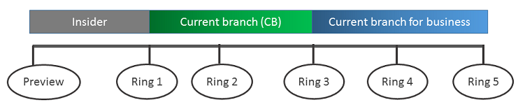

# Build deployment rings for Windows 10 updates

**Applies to**

- Windows 10
- Windows 10 Mobile

For Windows as a service, maintenance is ongoing and iterative. Deploying previous versions of Windows required organizations to build sets of users to roll out the changes in phases. Typically, these users ranged (in order) from the most adaptable and least risky to the least adaptable or riskiest. With Windows 10, a similar methodology exists, but construction of the groups is a little different. 

Deployment rings in Windows 10 are similar to the deployment groups most organizations constructed for previous major revision upgrades. They are simply a method by which to separate machines into a deployment timeline. With Windows 10, you construct deployment rings a bit differently in each servicing tool, but the concepts remain the same. Each deployment ring should reduce the risk of issues derived from the deployment of the feature updates by gradually deploying the update to entire departments. As previously mentioned, consider including a portion of each department’s employees in several deployment rings. 

Defining deployment rings is generally a one-time event (or at least infrequent), but IT should revisit these groups to ensure that the sequencing is still correct. Also, there are times in which client computers could move between different deployment rings when necessary.

Table 1 provides an example of the deployment rings you might use. 

**Table 1**

| Deployment ring | Servicing branch | Total weeks after Current Branch (CB) or Current Brandh for Business (CBB) release |
| --- | --- | --- |
| Preview | Windows Insider | Pre-CB |
| Ring 1 Pilot IT | CB | CB + 0 weeks |
| Ring 2 Pilot business users | CB | CB + 2 weeks |
| Ring 3 Broad IT | CBB | CBB + 0 weeks |
| Ring 4 Broad business users | CBB | CBB + 4 weeks |
| Ring 5 Broad business users #2 | CBB | CBB + 8 weeks |

>[!NOTE]
>In this example, there are no rings made up of the long-term servicing branch (LTSB). The LTSB servicing branch does not receive feature updates. 
>
>Windows Insider is in the deployment ring list for informational purposes only. Windows Insider PCs must be enrolled manually on each device and serviced based on the Windows Insider level chosen in the **Settings** app on that particular PC. Feature update servicing for Windows Insiderdevices is done completely through Windows Update; no servicing tools can manage Windows Insider feature updates.

As Table 1 shows, each combination of servicing branch and deployment group is tied to a specific deployment ring. As you can see, the associated groups of devices are combined with a servicing branch to specify which deployment ring those devices and their users fall into. The naming convention used to identify the rings is completely customizable as long as the name clearly identifies the sequence. Deployment rings represent a sequential deployment timeline, regardless of the servicing branch they contain. Deployment rings will likely rarely change for an organization, but they should be periodically assessed to ensure that the deployment cadence still makes sense. 

## Steps to manage updates for Windows 10

<table><tbody>
<tr><td style="border: 0px;width: 24px"></td><td align="left" style="border: 0px">[Learn about updates and servicing branches](waas-overview.md)</td></tr>
<tr><td style="border: 0px;width: 24px"></td><td align="left" style="border: 0px">[Prepare servicing strategy for Windows 10 updates](waas-servicing-strategy-windows-10-updates.md)</td></tr>
<tr><td style="border: 0px;width: 24px"></td><td align="left" style="border: 0px">Build deployment rings for Windows 10 updates
(this topic)</td></tr>
<tr><td style="border: 0px;width: 24px"></td><td align="left" style="border: 0px">[Assign devices to servicing branches for Windows 10 updates](waas-servicing-branches-windows-10-updates.md)</td></tr>
<tr><td style="border: 0px;width: 24px"></td><td align="left" style="border: 0px">[Optimize update delivery for Windows 10 updates](waas-optimize-windows-10-updates.md)</td></tr>
<tr><td style="border: 0px;width: 24px"></td><td align="left" style="border: 0px">[Manage updates using Windows Update for Business](waas-manage-updates-wufb.md) 
or [Manage Windows 10 updates using Windows Server Update Services](waas-manage-updates-wsus.md) 
or [Manage Windows 10 updates using System Center Configuration Manager](waas-manage-updates-configuration-manager.md)</td></tr>
</tbody></table>
 

## Related topics

- [Update Windows 10 in the enterprise](waas-update-windows-10.md)
- [Manage updates for Windows 10 Mobile Enterprise](waas-mobile-updates.md) 
- [Configure Delivery Optimization for Windows 10 updates](waas-delivery-optimization.md)
- [Configure BranchCache for Windows 10 updates](waas-branchcache.md)
- [Configure Windows Update for Business](waas-configure-wufb.md)
- [Integrate Windows Update for Business with management solutions](waas-integrate-wufb.md)
- [Walkthrough: use Group Policy to configure Windows Update for Business](waas-wufb-group-policy.md)
- [Walkthrough: use Intune to configure Windows Update for Business](waas-wufb-intune.md)

