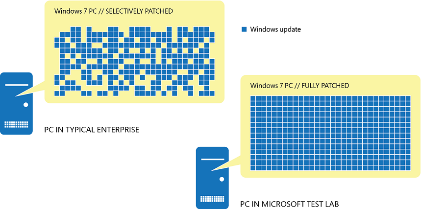
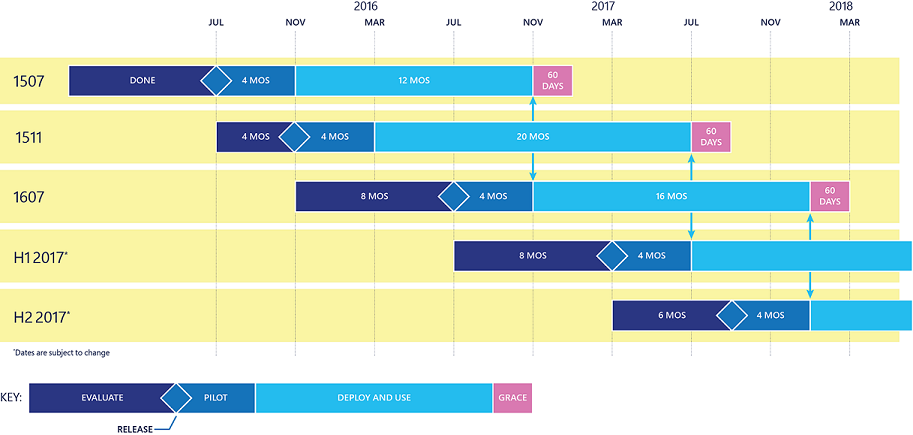

# Overview of Windows as a service

**Applies to**

- Windows 10
- Windows 10 Mobile

The Windows 10 operating system introduces an all-new way to build, deploy, and service Windows: Windows as a service. Microsoft has reimagined each Windows component—build, deploy, and service—to simplify the lives of IT pros and maintain a consistent Windows 10 experience for its customers. These improvements focus on maximizing customer involvement in Windows development, simplifying the deployment and servicing of Windows client computers, and equalizing the number of resources needed to deploy and maintain Windows. 

The build component of Windows as a service refers to the way Microsoft provides rapid innovation to its customers and engages them every step of the way in testing and feedback. The level of visibility customers have into the ongoing development of Windows 10 is unprecedented, given the release cycle of previous Windows builds. Anyone can sign up to be part of the new rapid-release cycle for Windows, helping Microsoft address customer issues, feedback, and concerns faster than before.
Going forward, it will be simpler than ever to deploy Windows. Windows as a service provides a new way to think about strategically deploying new functionality to Windows, including application and device compatibility testing and phased rollouts of the updates themselves. This new strategy significantly reduces the need for the traditionally large migration projects that have plagued organizations looking to upgrade Windows. 

Microsoft has always had a multifaceted approach to Windows servicing, traditionally including Windows updates, operating system upgrades, and service packs, but this approach led to complexity because each servicing component was sourced from different locations and often required multiple delivery methods. In Windows 10, Microsoft has streamlined servicing to make operating system updates simpler to test, manage, and deploy.

## Building

Prior to Windows 10, Microsoft released new versions of Windows every few years. This traditional deployment schedule imposed a training burden on users because the feature revisions were often significant. That schedule also meant waiting long periods without new features—a scenario that doesn’t work in today’s rapidly changing world, a world in which new security, management, and deployment capabilities are necessary to address challenges. Windows as a service will deliver smaller feature updates approximately twice per year to help address these issues.

In the past, when Microsoft developed new versions of Windows, it typically released technical previews and evaluation copies near the release-to-market date. With Windows 10, each feature update will be available to the [Windows Insider community](https://insider.windows.com/) as soon as possible—during the development cycle (approximately weekly)—so that interested parties can see exactly what Microsoft is developing and start their testing as soon as possible. This concept of rapid releases is called *flighting*. 

This new level of visibility throughout the operating system’s development cycle is unprecedented: Microsoft expects feedback throughout the development process so that it can make adjustments as quickly as possible rather than waiting until after release. In addition to the builds it frequently makes available to Windows Insiders, Microsoft has an aggressive internal testing base that consists of daily build testing by the engineering teams and internal self-hosted builds that a broader set of internal Microsoft employees consume. For more information about the Windows Insider Program and how to sign up, see the section [Windows Insider](#windows-insider).

## Deploying

Ongoing deployment of Windows 10 feature updates will be simpler than with previous versions of Windows. With previous releases, initial deployments and upgrades could be expensive and time-consuming. Windows as a service, through its focus on easier deployment methods and improved application compatibility, will greatly simplify the deployment process and therefore reduce the overall cost of maintenance.

One of the biggest challenges for organizations when it comes to deploying a new version of Windows is compatibility testing. Whereas compatibility was previously a concern for organizations upgrading to a new version of Windows, Windows 10 is compatible with most hardware and software capable of running on Windows 7 or later. In Windows 10, compatibility with the Windows 7 operating system and later applications and devices is good. In fact, testing for application compatibility has been simplified to include testing of only the most important business-critical applications. 

### Application compatibility

Application compatibility testing has historically been a burden when approaching a Windows deployment or upgrade. With Windows 10, application compatibility from the perspective of desktop applications, websites, and apps built on the Universal Windows Platform (UWP) has improved tremendously. Microsoft understands the challenges organizations experienced when they migrated from the Windows XP operating system to Windows 7 and has been working to make Windows 10 upgrades a much better experience.

Most Windows 7–compatible desktop applications will be compatible with Windows 10 straight out of the box. Windows 10 achieved such high compatibility because the changes in the Win32 application programming interfaces were minimal, the Windows Insider Program provided valuable feedback, and Microsoft received strong telemetry data. As for websites, Windows 10 includes Internet Explorer 11 and its backward-compatibility modes for legacy websites. Finally, UWP apps follow a compatibility story similar to desktop applications, so most of them will be compatible with Windows 10. User feedback from the Windows Insider Program and the telemetry data from insiders and early-adopter upgrades have significantly helped Microsoft diagnose and resolve issues related to UWP app compatibility.

Overall, most applications that ran on Windows 8.1, Windows 8, and Windows 7 will run on Windows 10. For the most important business-critical applications, organizations should still perform testing on a regular basis to validate compatibility with new builds. For remaining applications, consider testing them in the pilot deployment process to reduce the time spent on compatibility testing. If it’s unclear whether an application is compatible with Windows 10, IT pros can either consult with the ISV or check the supported software directory at [http://www.readyfor10.com](http://www.readyfor10.com).

### Device compatibility

Device compatibility in Windows 10 is outstanding. Unlike with some previous releases, most companies will not need to purchase new hardware to take advantage of Windows 10. Any device capable of running Windows 7 or later can run Windows 10. In fact, the minimum hardware requirements to run Windows 10 are the same as those required for Windows 7. Most hardware drivers that functioned in Windows 8.1, Windows 8, or Windows 7 will continue to function in Windows 10. 

## Servicing

Traditional Windows servicing has included several release types: major revisions (e.g., the Windows 8.1, Windows 8, and Windows 7 operating systems), service packs, and monthly updates. Typically, each type came from a different source, such as physical media, Windows Update, or downloads from Microsoft, which meant that overall management could become complicated and expensive. With Windows as a service, all Windows servicing can be sourced from the same place, and organizations can manage updates by using any of several servicing tool options. For information about each servicing tool available for Windows 10, see [Servicing tools](#servicing-tools).

With Windows 10, organizations will need to change the way they approach deploying updates, including new concepts and changes around servicing. IT pros don’t service Windows as a service the same way they did previous builds of Windows. Servicing branches are the first way to separate users into deployment groups for feature and quality updates. With the introduction of servicing branches came the term [deployment ring](waas-deployment-rings-windows-10-updates.md), which is simply a way to categorize the combination of a deployment group and a servicing branch and put them in sequential order. For more information about a predeployment strategy necessary to plan for Windows as a service, see [Plan servicing strategy for Windows 10 updates](waas-servicing-strategy-windows-10-updates.md). 

There are two release types for Windows 10: feature updates and quality updates. Feature updates account for the functionality previously deployed in major revision upgrades. Quality updates represent traditional Windows updates. 

To align with this new update delivery model, Windows 10 has three servicing branches, each of which provides different levels of flexibility over when these updates are delivered to client computers. For information about the servicing branches available in Windows 10, see [Servicing branches](#servicing-branches).

### Feature updates

With Windows 10, Microsoft will package new features into feature updates that organizations can use their existing management tools to deploy. Because feature updates are delivered more frequently than with previous Windows releases—approximately twice per year rather than every 3–5 years—changes will be in bite-sized chunks rather than all at once and end user readiness time much shorter. Finally, unlike previous major revisions, Windows 10 feature updates have native rollback capabilities, making it much simpler to retract an update should an issue arise.

### Quality updates

Monthly updates in previous Windows versions were often confusing and frustrating because of the sheer number of updates available each month. Many organizations selectively chose which updates they wanted to install and which they didn’t, and this created countless scenarios in which organizations deployed essential security updates but picked only a subset of nonsecurity fixes.

In Windows 10, rather than receiving several updates for a single machine each month and trying to figure out which the organization needs, ultimately causing platform fragmentation, administrators will see one cumulative monthly update that supersedes the previous month’s update and contains both security and nonsecurity fixes. This approach makes patching simpler and ensures that customers’ PCs are more closely aligned with the testing done at Microsoft, reducing unexpected issues resulting from patching. The left side of Figure 1 provides an example of Windows 7 machines in an enterprise and what their current patch level might look like. On the right is what Microsoft’s test environment PCs contain. This drastic difference is the basis for many compatibility issues and system anomalies related to Windows updates.

**Figure 1**

## Servicing branches 

To align with the new method of delivering feature updates and quality updates in Windows 10, Microsoft introduced the concept of servicing branches to allow customers to designate how aggressively their individual machines are updated. For example, an organization may have test machines that the IT department can update with new features as soon as possible, and then specialized devices that require a longer feature update cycle to ensure continuity. With that in mind, Microsoft offers three servicing branches for Windows 10: Current Branch (CB), Current Branch for Business (CBB), and Long-Term Servicing Branch (LTSB). In addition, the Windows Insider Program provides IT pros and other interested parties with prerelease Windows builds that they can test and ultimately provide feedback on to Microsoft.

The concept of servicing branches is new, but organizations can use the same management tools they used to manage updates and upgrades in previous versions of Windows. For more information about the servicing tool options for Windows 10 and their capabilities, see [Servicing tools](#servicing-tools).

>[!NOTE]
>Servicing branches are not the only way to separate groups of machines when consuming updates. Each branch can contain subsets of devices, which staggers servicing even further. For information about the servicing strategy and ongoing deployment process for Windows 10, including the role of servicing branches, see [Plan servicing strategy for Windows 10 updates](waas-servicing-strategy-windows-10-updates.md). 

### Current Branch

In the CB servicing model, feature updates are available as soon as Microsoft releases them. Windows 10 version 1511 had few servicing tool options to delay CB feature updates, limiting the use of the CB servicing branch. Windows 10 version 1607, however, includes more servicing tools that can delay CB feature updates for up to 180 days. The CB servicing model is ideal for pilot deployments and testing of Windows 10 feature updates and for users such as developers who need to work with the latest features immediately.

When Microsoft officially releases a feature update for Windows 10, that update is marked for CB, making it available to any PC not configured to defer feature updates so that those machines can immediately install it. Organizations that use Windows Server Update Services (WSUS), Microsoft System Center Configuration Manager, or Windows Update for Business, however, can defer CB feature updates to selective machines by withholding their approval and deployment. In this scenario, the content available for CB will be available but not necessarily immediately mandatory, depending on the policy of the management system. Only one CB build of Windows is supported at a time, so those clients not on the most current build will not receive quality updates (after a 60 day grace period) until the most current feature update has been installed. For more details about Windows 10 servicing tools, see [Servicing tools](#servicing-tools).

### Current Branch for Business

Organizations typically prefer to have a testing cycle before broadly deploying new features to business users. For Windows 10, most pilot testing will be done using the CB servicing branch. In contrast, the CBB servicing branch is typically used for broad deployment. Windows 10 clients in the CBB servicing branch receive the same build of Windows 10 as those in the CB servicing branch, just at a later time. CB releases are transitioned to CBB after about 4 months, indicating that Microsoft, independent software vendors (ISVs), partners, and customers believe that the release is ready for broad deployment. Therefore, CB and CBB have an inherent “staging” effect. Both of these branches have a purpose in the overall deployment process for an enterprise, providing another layer of testing capabilities in addition to the traditional phased deployment methods to specific groups of machines. Microsoft will support two CBB builds at a time, approximately 1 year after it releases a build to CBB, plus a 60 day grace period.

Figure 2 outlines an example release cycle for Windows 10 feature updates and shows how updates transition from development to the CB and CBB servicing branches. As shown in the key, the dark blue **Evaluate** region represents the time during which a feature update is in development. These builds are accessible for testing through the Windows Insider Program. For details about how to access pre-released builds by enrolling in the Windows Insider Program, see the section Windows Insider. 

The diamond **Release** on each build represents the point at which Microsoft releases a feature update to the CB servicing branch. It identifies the start of the testing, or **Pilot**, phase. The 4 months in this phase is the approximate amount of time before Microsoft releases the feature update to the CBB servicing branch. The **Deploy and Use** phase represents the broad deployment of the Windows 10 feature update to the clients in the CBB servicing branch. Machines are divided into deployment rings, as discussed in the section Ongoing deployment process.

Finally, when a build’s support has ended, as represented by the **arrows**, organizations have a 60 day **grace** period to update to a newer release.

**Figure 2**

>[!NOTE]
>Organizations can electively delay CB and CBB updates into as many phases as they wish by using one of the servicing tools mentioned in the section Servicing tools.

Basically, CBB is a configuration state, meaning that if a computer has the **Defer Updates and Upgrades** flag enabled—either through Group Policy, a mobile device management product like Microsoft Intune, or manually on the client—it’s considered to be in the CBB servicing branch. The benefit of tying this servicing model and CB to a configuration state rather than a SKU is that they are easily interchangeable. If an organization accidentally selects CBB on a machine that doesn’t need delayed updates, it’s simple to change it back. 

### Long-term Servicing Branch

Specialized systems—such as PCs that control medical equipment, point-of-sale systems, and ATMs—often require a longer servicing option because of their purpose. These devices typically perform a single important task and don’t need feature updates as frequently as other machines in the organization. It’s more important that these devices be kept as stable and secure as possible than up to date with user interface changes. The LTSB servicing model prevents Windows 10 Enterprise LTSB devices from receiving the usual feature updates and provides only quality updates to ensure that device security stays up to date. With this in mind, quality updates are still immediately available to Windows 10 Enterprise LTSB clients, but customers can choose to defer them by using one of the servicing tools mentioned in the section Servicing tools.

Microsoft never publishes feature updates through Windows Update on devices that run Windows 10 Enterprise LTSB. Instead, it typically offers new LTSB releases every 2–3 years, and organizations can choose to install them as in-place upgrades or even skip releases over a 10-year life cycle.

LTSB is available only in the Windows 10 Enterprise LTSB edition. This build of Windows doesn’t contain many in-box applications, such as Microsoft Edge, Windows Store client, Cortana (limited search capabilities remain available), Microsoft Mail, Calendar, OneNote, Weather, News, Sports, Money, Photos, Camera, Music, and Clock. Therefore, it’s important to remember that Microsoft has positioned the LTSB model primarily for specialized devices.

>[!NOTE]
>If an organization has devices currently running Windows 10 Enterprise LTSB that it would like to change to the CB or CBB servicing branch, it can make the change without losing user data. Because LTSB is its own SKU, however, an upgrade is required from Windows 10 Enterprise LTSB to Windows 10 Enterprise, which supports CB and CBB.

### Windows Insider

For many IT pros, gaining visibility into feature updates early—before they’re available to the CB servicing branch—can be both intriguing and valuable for future end user communications as well as provide additional prestaging for CB machines. With Windows 10, feature flighting enables Windows Insiders to consume and deploy preproduction code to their test machines, gaining early visibility into the next build. Testing the early builds of Windows 10 helps both Microsoft and its customers because they have the opportunity to discover possible issues before the update is ever publicly available and can report it to Microsoft. Also, as flighted builds get closer to their release to CB, organizations can test their deployment on test machines for compatibility validation. 

Microsoft recommends that all organizations have at least a few PCs enrolled in the Windows Insider Program and provide feedback on any issues they encounter. For information about how to sign up for the Windows Insider Program and enroll test devices, go to [https://insider.windows.com](https://insider.windows.com).

>[!NOTE]
>The Windows Insider Program isn’t intended to replace CB deployments in an organization. Rather, it provides IT pros and other interested parties with prerelease Windows builds that they can test and ultimately provide feedback on to Microsoft. 

## Servicing tools

There are many tools with which IT pros can service Windows as a service. Each option has its pros and cons, ranging from capabilities and control to simplicity and low administrative requirements. The following are examples of the servicing tools available to manage Windows as a service updates:

- **Windows Update (stand-alone)** provides limited control over feature updates, with IT pros manually configuring the device to be in the CBB servicing branch. Organizations can control which devices defer updates and stay in the CBB servicing branch or remain in CB by selecting the Defer upgrades check box in Start\Settings\Update & Security\Advanced Options on a Windows 10 client.
- **Windows Update for Business** is the second option for servicing Windows as a service. This servicing tool includes a little more control over update deferment and provides centralized management using Group Policy. In Windows 10 version 1511, Windows Update for Business can be used to defer feature updates for up to 8 months and quality updates for up to 4 weeks. Also, these deferment options were available only to clients in the CBB servicing branch. In Windows 10 version 1607 and later, Windows Update for Business can be used to defer feature updates for up to 180 days and quality updates for up to 30 days. These deployment options are available to clients in either the CB or CBB servicing branch. In addition to being able to use Group Policy to manage Windows Update for Business, either option can be configured without requiring any on-premises infrastructure by using Intune. In addition to Intune, organizations can use Group Policy to manage Windows Update for Business. 
- **Windows Server Update Services (WSUS)** provides extensive control over Windows 10 updates and is natively available in the Windows Server operating system. In addition to the ability to defer updates, organizations can add an approval layer for updates and choose to deploy them to specific computers or groups of computers whenever ready. 
- **System Center Configuration Manager** provides the greatest control over servicing Windows as a service. IT pros can defer updates, approve them, and have multiple options for targeting deployments and managing bandwidth usage and deployment times. 

With all these options, which an organization chooses depends on the resources, staff, and expertise its IT organization already has. For example, if IT already uses System Center Configuration Manager to manage Windows updates, it can continue to use it. Similarly, if IT is using WSUS, it can continue to use that. For a consolidated look at the benefits of each tool, see Table 1.

**Table 1**

| Servicing tool | Can updates be deferred? | Ability to approve updates | Peer-to-peer option | Additional features |
| --- | --- | --- | --- | --- |
| Windows Update | Yes (manual) | No | Delivery Optimization | None|
| Windows Update for Business | Yes | No | Delivery Optimization | Other Group Policy objects |
| WSUS | Yes | Yes | BranchCache or Delivery Optimization | Upstream/downstream server scalability |
| Configuration Manager | Yes | Yes | BranchCache, Client Peer Cache | Distribution points, multiple deployment options |

 

## Steps to manage updates for Windows 10

<table><tbody>
<tr><td style="border: 0px;width: 24px"></td><td align="left" style="border: 0px">Learn about updates and servicing branches (this topic)</td></tr>
<tr><td style="border: 0px;width: 24px"></td><td align="left" style="border: 0px">[Prepare servicing strategy for Windows 10 updates](waas-servicing-strategy-windows-10-updates.md)</td></tr>
<tr><td style="border: 0px;width: 24px"></td><td align="left" style="border: 0px">[Build deployment rings for Windows 10 updates](waas-deployment-rings-windows-10-updates.md)</td></tr>
<tr><td style="border: 0px;width: 24px"></td><td align="left" style="border: 0px">[Assign devices to servicing branches for Windows 10 updates](waas-servicing-branches-windows-10-updates.md)</td></tr>
<tr><td style="border: 0px;width: 24px"></td><td align="left" style="border: 0px">[Optimize update delivery for Windows 10 updates](waas-optimize-windows-10-updates.md)</td></tr>
<tr><td style="border: 0px;width: 24px"></td><td align="left" style="border: 0px">[Manage updates using Windows Update for Business](waas-manage-updates-wufb.md) 
or [Manage Windows 10 updates using Windows Server Update Services](waas-manage-updates-wsus.md) 
or [Manage Windows 10 updates using System Center Configuration Manager](waas-manage-updates-configuration-manager.md)</td></tr>
</tbody></table>
 

## Related topics

- [Update Windows 10 in the enterprise](waas-update-windows-10.md)
- [Manage updates for Windows 10 Mobile Enterprise](waas-mobile-updates.md) 
- [Configure Delivery Optimization for Windows 10 updates](waas-delivery-optimization.md)
- [Configure BranchCache for Windows 10 updates](waas-branchcache.md)
- [Configure Windows Update for Business](waas-configure-wufb.md)
- [Integrate Windows Update for Business with management solutions](waas-integrate-wufb.md)
- [Walkthrough: use Group Policy to configure Windows Update for Business](waas-wufb-group-policy.md)
- [Walkthrough: use Intune to configure Windows Update for Business](waas-wufb-intune.md)

