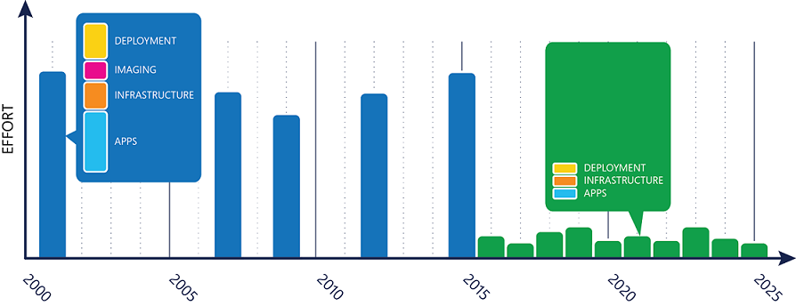

# Prepare servicing strategy for Windows 10 updates

**Applies to**

- Windows 10
- Windows 10 Mobile

In the past, traditional Windows deployments tended to be large, lengthy, and expensive. Windows 10 offers a new approach to deploying both quality and feature updates, making the process much simpler and therefore the planning much more straightforward. With Windows as a service, the methodology around updating Windows has completely changed, moving away from major upgrades every few years to iterative updates twice per year. Each iteration contains a smaller subset of changes so that they won’t seem like substantial differences, like they do today. Figure 1 shows the level of effort needed for traditional Windows deployments versus servicing Windows 10 and how it is now spread evenly over time versus spiking every few years.

**Figure 1**

Windows 10 spreads the traditional deployment effort of a Windows upgrade, which typically occurred every few years, over smaller, continuous updates. With this change, you must approach the ongoing deployment and servicing of Windows differently. A strong Windows 10 deployment strategy begins with establishing a simple, repeatable process for testing and deploying each feature update. Here’s an example of what this process might look like:

- **Configure test devices.** Configure testing PCs in the Windows Insider Program so that Insiders can test feature updates before they’re available to the Current Branch (CB) servicing branch. Typically, this would be a small number of test machines that IT staff members use to evaluate prereleased builds of Windows. Microsoft provides current development builds to Windows Insider members approximately every week so that interested users can see the functionality Microsoft is adding. See the section Windows Insider for details on how to enroll in the Windows Insider Program on a Windows 10 device.
- **Identify excluded PCs.** For some organizations, special-purpose devices such as those used to control factory or medical equipment or run ATMs require a stricter, less frequent feature update cycle than CB or Current Branch for Business (CBB) can offer. For those machines, you must install Windows 10 Enterprise LTSB to avoid feature updates for up to 10 years. Identify these PCs, and separate them from the phased deployment and servicing cycles to help remove confusion for your administrators and ensure that devices are handled correctly. 
- **Recruit volunteers.** The purpose of testing a deployment is to receive feedback. One effective way to recruit pilot users is to request volunteers. When doing so, clearly state that you’re looking for feedback rather than people to just “try it out” and that there could be occasional issues involved with accepting feature updates right away. With Windows as a service, the expectation is that there should be few issues, but if an issue does arise, you want testers to let you know as soon as possible. When considering whom to recruit for pilot groups, be sure to include members who provide the broadest set of applications and devices to validate the largest number of apps and devices possible.
- **Choose a servicing tool.** Decide which product you’ll use to manage the Windows updates in your environment. If you’re currently using Windows Server Update Services (WSUS) or System Center Configuration Manager to manage your Windows updates, you can continue using those products to manage Windows 10 updates. Alternatively, you can use Windows Update for Business. In addition to which product you’ll use, consider how you’ll deliver the updates. With Windows 10, multiple peer-to-peer options are available to make update distribution faster. For a comparison of tools, see [Servicing tools](waas-overview.md#servicing-tools).
- **Prioritize applications.** First, create an application portfolio. This list should include everything installed in your organization and any webpages your organization hosts. Next, prioritize this list to identify those that are the most business critical. Because the expectation is that application compatibility with Windows 10 will be high, only the most business critical applications should be tested before the pilot phase; everything else can be tested afterwards. 

>[!NOTE]
>This strategy is applicable to approaching an environment in which Windows 10 already exists. For information about how to deploy or upgrade to Windows 10 where another version of Windows exists, see [Plan for Windows 10 deployment](https://technet.microsoft.com/itpro/windows/plan/index).

Each time Microsoft releases a Windows 10 feature update, the IT department should use the following high-level process to help ensure that the broad deployment is successful:

1.	**Validate compatibility of business critical apps.** Test your most important business-critical applications for compatibility with the new Windows 10 feature update running on your Windows Insider machines identified in the earlier “Configure test machines” step of the Predeployment strategy section. The list of applications involved in this validation process should be small because most applications can be tested during the pilot phase. For more information about device and application compatibility in Windows 10, see the section Compatibility.
2.	**Pilot and react to feedback.** With Windows 10, Microsoft expects application and device compatibility to be high, but it’s still important to have pilot groups within both the IT department and business units to verify application compatibility for the remaining applications in your application portfolio. Because only the most business-critical applications are tested beforehand, this will represent the majority of application compatibility testing in your environment. This should not necessarily be a formal process but rather user validation through the use of a particular application. So, the next step is to deploy the feature update to early-adopting IT users and your pilot groups running in the CB servicing branch that you identified in the “Recruit volunteers” step of the Predeployment strategy section. Be sure to communicate clearly that you’re looking for feedback as soon as possible, and state exactly how users can submit feedback to you. Should an issue arise, have a remediation plan in place to address it. For an example of what a remediation plan for an application compatibility issue arising from a Windows 10 feature update might look like, see the <Place holder for App Compat guide>.
3.	**Deploy broadly.** Finally, focus on the large-scale deployment using deployment rings, like the ones discussed in Table 1. Build deployment rings that target groups of computers in your selected update-management product. To reduce risk as much as possible, construct your deployment rings in a way that splits individual departments into multiple rings. This way, if you were to encounter an issue, you don’t prevent any critical business from continuing. By using this method, each deployment ring reduces risk as more and more people have been updated in any particular department. 

## Steps to manage updates for Windows 10

<table><tbody>
<tr><td style="border: 0px;width: 24px"></td><td align="left" style="border: 0px">[Learn about updates and servicing branches](waas-overview.md)</td></tr>
<tr><td style="border: 0px;width: 24px"></td><td align="left" style="border: 0px">Prepare servicing strategy for Windows 10 updates (this topic)</td></tr>
<tr><td style="border: 0px;width: 24px"></td><td align="left" style="border: 0px">[Build deployment rings for Windows 10 updates](waas-deployment-rings-windows-10-updates.md)</td></tr>
<tr><td style="border: 0px;width: 24px"></td><td align="left" style="border: 0px">[Assign devices to servicing branches for Windows 10 updates](waas-servicing-branches-windows-10-updates.md)</td></tr>
<tr><td style="border: 0px;width: 24px"></td><td align="left" style="border: 0px">[Optimize update delivery for Windows 10 updates](waas-optimize-windows-10-updates.md)</td></tr>
<tr><td style="border: 0px;width: 24px"></td><td align="left" style="border: 0px">[Manage updates using Windows Update for Business](waas-manage-updates-wufb.md) 
or [Manage Windows 10 updates using Windows Server Update Services](waas-manage-updates-wsus.md) 
or [Manage Windows 10 updates using System Center Configuration Manager](waas-manage-updates-configuration-manager.md)</td></tr>
</tbody></table>
 

## Related topics

- [Update Windows 10 in the enterprise](waas-update-windows-10.md)
- [Manage updates for Windows 10 Mobile Enterprise](waas-mobile-updates.md) 
- [Configure Delivery Optimization for Windows 10 updates](waas-delivery-optimization.md)
- [Configure BranchCache for Windows 10 updates](waas-branchcache.md)
- [Configure Windows Update for Business](waas-configure-wufb.md)
- [Integrate Windows Update for Business with management solutions](waas-integrate-wufb.md)
- [Walkthrough: use Group Policy to configure Windows Update for Business](waas-wufb-group-policy.md)
- [Walkthrough: use Intune to configure Windows Update for Business](waas-wufb-intune.md)
