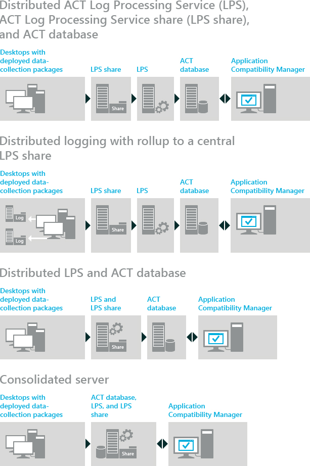

# ACT Deployment Options

**Applies to**

-   Windows 10
-   Windows 8.1
-   Windows 8
-   Windows 7
-   Windows Server 2012
-   Windows Server 2008 R2

While planning your deployment of the Application Compatibility Toolkit (ACT), consider which computers you want running the various tools, packages, and services for ACT.

The following diagram shows supported deployment options for an ACT installation. The options listed first are the most highly recommended.

## Collecting Data Across Domains

If you plan to deploy inventory-collector packages to computers running Windows XP, where some of the computers are on a different domain than the ACT LPS share, do one of the following:

-   Set up a separate ACT LPS share on each domain and configure the inventory-collector package to upload log files to the ACT LPS share on the same domain.

-   Set up a single ACT LPS share on one computer. On the computer that hosts the share, use Group Policy to allow connections from anonymous users.

These steps are not necessary if the computers where you deploy inventory-collector packages are running Windows Vista, Windows 7, Windows 8, Windows 8.1, or Windows 10.

If you choose to have distributed logging with a subsequent step of moving log files to your central share, move the files to the central share before processing the files. You can move the files manually or use a technology like Distributed File-System Replication (DFSR).

## Related topics

[ACT Tools, Packages, and Services](act-tools-packages-and-services.md)

[ACT Database Configuration](act-database-configuration.md)

[ACT Database Migration](act-database-migration.md)

[ACT LPS Share Permissions](act-lps-share-permissions.md)

 

 

