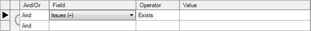
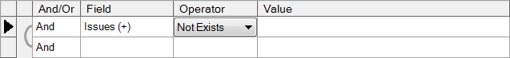
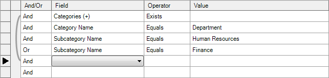

# Example Filter Queries

**Applies to**

-   Windows 10
-   Windows 8.1
-   Windows 8
-   Windows 7
-   Windows Server 2012
-   Windows Server 2008 R2

You can filter your compatibility-issue data or reports by selecting specific restriction criteria.

## Example Queries

The following sections show example queries created by using the Query Builder.

### All Applications with Issues

The following example query returns all applications that have one or more known issues.

### All Applications with Solutions for Known Issues

The following example query returns all applications that have solutions for their known issues.

### All Applications with Specific Solution Types

The following example query returns all applications that have a solution type of Application Update or Application Configuration.

### All Applications with No Known Issues

The following example query returns all applications that have no known issues.

### All Applications with No Active Issues

The following example query returns all applications that have no active issues.

### All Applications Appearing in a Specific Category and Subcategory

The following example query returns all applications that have a category of Department and a subcategory of either Human Resources or Finance.

## Related topics

[Filtering Your Compatibility Data](filtering-your-compatibility-data.md)

 

 

