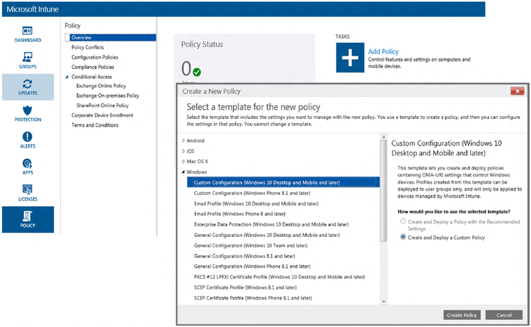
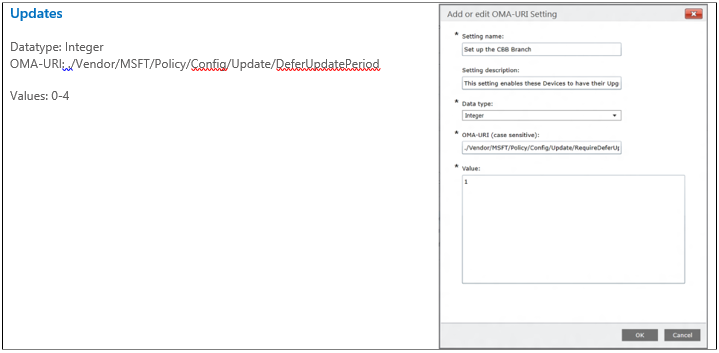
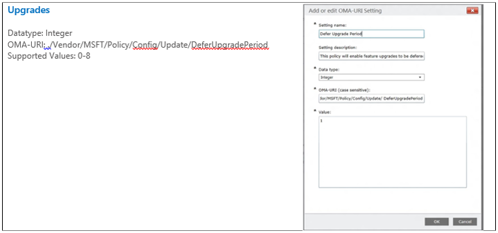

# Integration with management solutions

**Applies to**

-   Windows 10

**In this article**

-   [System Center Configuration Manager](#system-center-configuration-manager)
-   [WSUS standalone](#wsus-standalone-)
-   [Enterprise Mobility Suite: Intune](#enterprise-mobility-suite--intune)
-   [Related topics](#related-topics)

You can integrate Windows Update for Business deployments with existing management tools such as Windows Server Update Services (WSUS), System Center Configuration Manager, and Microsoft Intune.

## System Center Configuration Manager

For Windows 10, version 1511, organizations that already manage their systems with Configuration Manager can also have their devices configured for Windows Update for Business (in other words, set deferral policies on those machines). For Windows 10, version 1511, such devices will be visible in the Configuration Manager console, however they will appear with a detection state of “Unknown”.

## WSUS standalone

For Windows 10, version 1511, you cannot configure devices for both Windows Update for Business *and* to receive updates from WSUS. If both group policies are set (for both deferrals as well as WSUS scanning), Windows Update for Business settings will NOT be respected and devices will continue to scan against WSUS.

## Enterprise Mobility Suite: Intune

You can configure Windows Update for Business by using MDM policy. To configure Windows Update for Business with Intune:

1.  Create a new Windows 10 custom policy. (Add a policy, and choose **Custom Configuration for Windows 10 Desktop and phone…**).

    

2.  Configure the device to Consumer Branch for Business by selecting to defer upgrades (as described in [Setup and deployment](setup-and-deployment.md)).

    **Note**  
    As noted, because WSUS and Windows Update for Business are mutually exclusive policies, do not set **UpdateServiceUrl** if you want to configure to defer upgrades.

     

3.  Establish deferral windows for updates and upgrades.

    

    

## Related topics

[Windows Update for Business](windows-update-for-business.md)

[Setup and deployment](setup-and-deployment.md)

 

 

