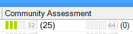

# Ratings Icons in ACM

**Applies to**

-   Windows 10
-   Windows 8.1
-   Windows 8
-   Windows 7
-   Windows Server 2012
-   Windows Server 2008 R2

Compatibility ratings can originate from Microsoft, the application vendor, your organization, and from the Application Compatibility Toolkit (ACT) community.

For information about specifying your own ratings, see [Selecting Your Compatibility Rating](selecting-your-compatibility-rating.md). For information about community ratings, see [ACT Community Ratings and Process](act-community-ratings-and-process.md).

## Icons

The following table shows icons that appear on the report screens and dialog boxes for **Company Assessment** and **Vendor Assessment**.

<table>
<colgroup>
<col width="50%" />
<col width="50%" />
</colgroup>
<thead>
<tr class="header">
<th align="left">Icon</th>
<th align="left">Description</th>
</tr>
</thead>
<tbody>
<tr class="odd">
<td align="left"></td>
<td align="left">
Application, device, or website functions as expected on a 32-bit operating system.
</td>
</tr>
<tr class="even">
<td align="left"></td>
<td align="left">
Application, device, or website functions as expected on a 64-bit operating system.
</td>
</tr>
<tr class="odd">
<td align="left"></td>
<td align="left">
Application, device, or website with issues that are minor or have known solutions on a 32-bit operating system. Severity 3 issues are considered minor issues.
</td>
</tr>
<tr class="even">
<td align="left"></td>
<td align="left">
Application, device, or website with issues that are minor or have known solutions on a 64-bit operating system.
</td>
</tr>
<tr class="odd">
<td align="left"></td>
<td align="left">
Application, device, or website with major issues, such as data loss or severely impaired functionality, on 32-bit operating systems. Severity 1 and Severity 2 issues are considered major issues.
</td>
</tr>
<tr class="even">
<td align="left"></td>
<td align="left">
Application, device, or website with major issues, such as data loss or severely impaired functionality, on 64-bit operating systems.
</td>
</tr>
<tr class="odd">
<td align="left"></td>
<td align="left">
Application, device, or website that does not have any application assessment data for 32-bit operating systems. The item does not match any information in the database, or no assessments have been submitted.
</td>
</tr>
<tr class="even">
<td align="left"></td>
<td align="left">
Application, device, or website that does not have any application assessment data for 64-bit operating systems.
</td>
</tr>
</tbody>
</table>

 

## User Ratings and ACT Community Ratings

Ratings are displayed graphically in the **User Ratings** column and the **Community Assessment** column. The rating color and bar count depend on how the users or community rated the item. There are three possible ratings:

-   **Works**. Applications with this rating receive five green bars.

-   **Works with minor issues or has solutions**. Applications with this rating receive three light-green bars.

-   **Does not work**. Applications with this rating receive a single red bar.

The color gradient from one to five bars shows the average rating.

## Related topics

[Selecting Your Compatibility Rating](selecting-your-compatibility-rating.md)

[Analyzing Your Compatibility Data](analyzing-your-compatibility-data.md)

 

 

