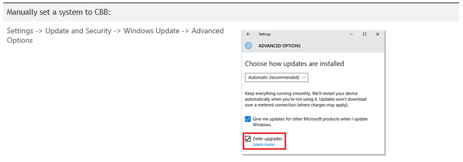
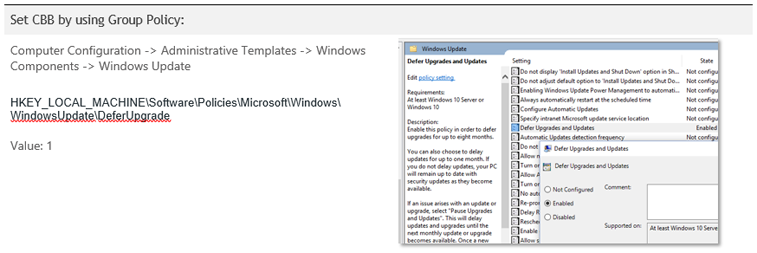
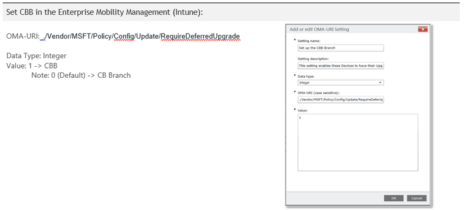
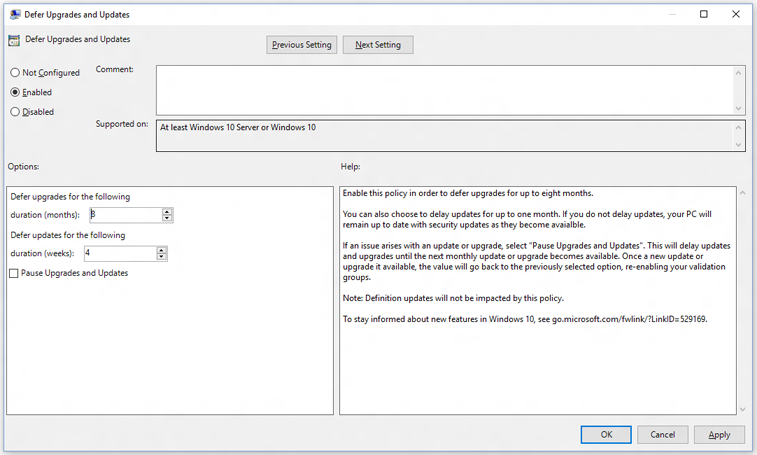
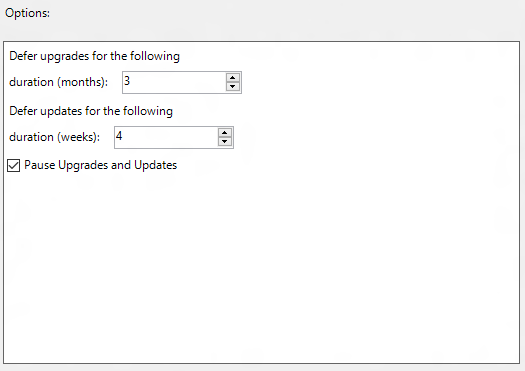
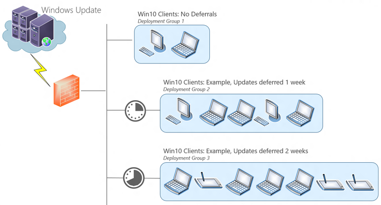

# Setup and deployment

**Applies to**

-   Windows 10

**In this article**

-   [Configure your systems to receive updates on CBB](#configure-your-systems-to-receive-updates-on-cbb)
-   [Defer OS upgrade and update deployments](#defer-os-upgrade)
-   [Pause upgrades and updates](#pause-upgrades-and-updates)
-   [Create validation groups for deployments](#create-validation-groups-for-deployments)
-   [Peer-to-peer networking for deployments](#peer-to-peer-networking-for-deployments-)
-   [Use Group Policy to configure Windows Update Delivery Optimization](#use-group-policy-to-configure-windows-update-delivery-optimization-)
-   [Related topics](#related-topics)

This article describes the basic features of a Windows Update for Business deployment. Use this information to familiarize yourself with a simple deployment with a single group of machines connected to Windows Update, in addition to more complex scenarios such as the creation of Windows Update for Business validation groups that receive updates from Windows Update at different time intervals, as well as Windows Update for Business deployments integrated with existing management tools such as Windows Server Update Services (WSUS), System Center Configuration Manager, or Microsoft Intune.

## Configure your systems to receive updates on CBB

To use Windows Update for Business, Windows 10-based devices must first be configured for the Current Branch for Business (CBB). You can configure devices manually, by using Group Policy, or by using mobile device management (MDM).

## Defer OS upgrade and update deployments

Windows Update for Business allows administrators to control when upgrades and updates are deployed to their Windows 10 clients by specifying deferral windows from when they are initially made available on the Windows Update service. As mentioned, there are restrictions as to how long you can delay upgrades and updates. The following table details these restrictions, per deployment category type:

**Group Policy keys**

HKEY\_LOCAL\_MACHINE\\Software\\Policies\\Microsoft\\Windows\\WindowsUpdate\\DeferUpgradePeriod

-   Values: 0-8 where each unit for upgrade is a month

HKEY\_LOCAL\_MACHINE\\Software\\Policies\\Microsoft\\Windows\\WindowsUpdate\\DeferUpdatePeriod

-   Values: 0-4 where each unit for update is a week

**MDM**

*./Vendor/MSFT/Update/DeferUpgrade*

Software\\Microsoft\\PolicyManager\\current\\Update\\RequireDeferUpgrade

-   Values: 0-8 where each unit for upgrade is a month

Software\\Microsoft\\PolicyManager\\current\\Update\\RequireDeferUpdate

-   Values: 0-4 where each unit for update is a week

 

Administrators can control deferral periods with Group Policy Objects by using the [Local Group Policy Editor (GPEdit)](http://go.microsoft.com/fwlink/p/?LinkId=734030) or, for domain joined systems, [Group Policy Management Console (GPMC)](http://go.microsoft.com/fwlink/p/?LinkId=699325). For additional details on Group Policy management see [Group Policy management for IT pros](http://go.microsoft.com/fwlink/p/?LinkId=699282).

**Set different deferrals based on update classification in GPedit.msc**

## Pause upgrades and updates

Although administrators can use deferral periods to stagger the rate at which deployments go out to their organization (which provides time to verify quality and address any issues), there may be cases where additional time is needed before an update is set to deploy to a machine, or group of machines. Windows Update for Business provides a means for administrators to *pause* updates and upgrades on a per-machine basis. This pause functionality ensures that no updates or upgrades will be made available for the specified machine; the machine will remain in this state until the machine is specifically “unpaused”, or when a period of five weeks (35 days) has passed, at which point updates are auto-resumed.

**Note**  
The five-week period ensures that pause functionality overlaps a possible subsequent Update Tuesday release.

 

**Note**  
Group Policy does not allow you to set a future "unpause” — administrators must actively select to unpause a deployment if they wish to do so before the time expiration.

 

<table>
<colgroup>
<col width="50%" />
<col width="50%" />
</colgroup>
<tbody>
<tr class="odd">
<td align="left">
<strong>Group Policy keys</strong>
</td>
<td align="left">
HKEY_LOCAL_MACHINE\Software\Policies\Microsoft\Windows\WindowsUpdate\Pause
</td>
</tr>
<tr class="even">
<td align="left">
<strong>MDM</strong>

<em>./Vendor/MSFT/Update/DeferUpgrade</em>
</td>
<td align="left">
Software\Microsoft\PolicyManager\current\Update\Pause

<ul>
<li>
Values (bool): 0, 1
</li>
</ul></td>
</tr>
</tbody>
</table>

 

## Create validation groups for deployments

By grouping machines into similar deferral periods, administrators are able to cluster devices into deployment or validation groups which can be used as a quality control measure as updates are deployed in Windows 10. With deferral windows and the ability to pause, administrators can effectively control and measure update deployments by rolling out to a small pool of devices first to verify quality, prior to a broader roll-out to their organization.

Administrators can establish validation groups to maintain a level of control over update/driver deployments which allows them to:

-   Control the date, time, and frequency updates will be applied and devices rebooted

-   Deploy a small set of machines to verify quality prior to broad roll-out

-   Stage broad roll-out in waves to continue quality verification and minimize disruptions

-   Manage membership of waves based on criteria defined by IT

-   Halt and roll-back deployment of updates/drivers that may be causing trouble

## Peer-to-peer networking for deployments

Windows Update Delivery Optimization enables Windows Update for Business enrolled devices to download Windows updates and Windows Store apps from sources other than Microsoft. With multiple devices, Delivery Optimization can reduce the amount of Internet bandwidth that is required to keep all of your Windows Update for Business enrolled systems up to date. It can also help ensure that devices get updates and apps more quickly if they have a limited or unreliable Internet connection.

In addition to downloading updates and apps from Microsoft, Windows will get updates and apps from other PCs that already have them. You can choose which PCs you get these updates from.

### How Delivery Optimization works

-   **PCs on your local network.** When Windows downloads an update or app, it will look for other PCs on your local network that have already downloaded the update or app using Delivery Optimization. Windows then downloads parts of the file from those PCs and parts of the file from Microsoft. Windows doesn’t download the entire file from one place. Instead, the download is broken down into smaller parts. Windows uses the fastest, most reliable download source for each part of the file.

-   **PCs on your local network and PCs on the Internet.** Windows uses the same process as when getting updates and apps from PCs on your local network, and also looks for PCs on the Internet that can be used as a source to download parts of updates and apps.

### Delivery Optimization settings

Delivery Optimization is turned on by default for the Enterprise and Education editions of Windows 10, where the default option is that updates will only be pulled and shared from PCs on your LAN and not the Internet.

Delivery Optimization configuration settings can be viewed by going to: Settings &gt; Update and Security &gt; Advanced Options &gt; Choose how your updates are delivered

## Use Group Policy to configure Windows Update Delivery Optimization

You can use Group Policy to configure Windows Update Delivery Optimization. To do this, use the following steps:

1.  Download the [Administrative Templates (.admx) file for Windows 10](http://go.microsoft.com/fwlink/p/?LinkId=699283) from the Microsoft Download Center.

2.  Copy the following files to the SYSVOL central store:

    -   DeliveryOptimization.admx from C:\\Program Files (x86)\\Microsoft Group Policy\\Windows 10\\PolicyDefinitions

    -   DeliveryOptimization.adml from C:\\Program Files (x86)\\Microsoft Group Policy\\Windows 10\\PolicyDefinitions\\en-US

3.  Start the Gpeditor tool.

4.  Browse to the following location:

    -   Computer Configuration\\Administrative Templates\\Windows Components\\Delivery Optimization

5.  Make the following Windows Update Delivery Optimization settings, as appropriate.

    

**Virus-scan claim**

Microsoft scanned this file for viruses, using the most current virus-detection software that was available on the date that the file was posted. The file is stored on security-enhanced servers that help prevent any unauthorized changes to it.

For more information about Windows Update Delivery Optimization in Windows 10, see the [Windows Update Delivery Optimization FAQ](http://go.microsoft.com/fwlink/p/?LinkId=699284).

For additional resources, see [How to use Group Policy to configure Windows Update Delivery Optimization in Windows 10](http://go.microsoft.com/fwlink/p/?LinkId=699288).

## Related topics

[Windows Update for Business](windows-update-for-business.md)

[Integration with management solutions](integration-with-management-solutions-.md)

 

 

