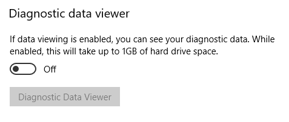

# Diagnostic Data Viewer for PowerShell Overview

**Applies to**

-   Windows 10, version 1809
-   Windows 10, version 1803
-   Windows Server, version 1803
-   Windows Server 2019

## Introduction
The Diagnostic Data Viewer for PowerShell is a PowerShell module that lets you review the diagnostic data your device is sending to Microsoft, grouping the info into simple categories based on how it's used by Microsoft.

## Requirements

You must have administrative privilege on the device in order to use this PowerShell module. This module requires OS version 1803 and higher. 

## Install and Use the Diagnostic Data Viewer for PowerShell

You must install the module before you can use the Diagnostic Data Viewer for PowerShell. 

### Opening an Elevated PowerShell session 

Using the Diagnostic Data Viewer for PowerShell requires administrative (elevated) privilege. There are two ways to open an elevated PowerShell prompt. You can use either method.    
- Go to **Start** > **Windows PowerShell** > **Run as administrator**
- Go to **Start** > **Command prompt** > **Run as administrator**, and run the command `C:\> powershell.exe`

### Install the Diagnostic Data Viewer for PowerShell

   >[!IMPORTANT]
   >It is recommended to visit the documentation on [Getting Started](https://docs.microsoft.com/en-us/powershell/gallery/getting-started) with PowerShell Gallery. This page provides more specific details on installing a PowerShell module. 

To install the newest version of the Diagnostic Data Viewer PowerShell module, run the following command within an elevated PowerShell session: 
```powershell
PS C:\> Install-Module -Name Microsoft.DiagnosticDataViewer
```

To see more information about the module, visit [PowerShell Gallery](https://www.powershellgallery.com/packages/Microsoft.DiagnosticDataViewer).

### Turn on data viewing
Before you can use this tool, you must turn on data viewing. Turning on data viewing enables Windows to store a local history of your device's diagnostic data for you to view until you turn it off. 

Note that this setting does not control whether your device sends diagnostic data. Instead, it controls whether your Windows device saves a local copy of the diagnostic data sent for your viewing. 

**To turn on data viewing through the Settings page**
1. Go to **Start**, select **Settings** > **Privacy** > **Diagnostics & feedback**.

2. Under **Diagnostic data**, turn on the **If data viewing is enabled, you can see your diagnostics data** option.

    

**To turn on data viewing through PowerShell**

Run the following command within an elevated PowerShell session:  

```powershell
PS C:\> Enable-DiagnosticDataViewing
```

Once data viewing is enabled, your Windows machine will begin saving a history of diagnostic data that is sent to Microsoft from this point on.

   >[!IMPORTANT]
   >Turning on data viewing can use up to 1GB (default setting) of disk space on your system drive. We recommend that you turn off data viewing when you're done using the Diagnostic Data Viewer. For info about turning off data viewing, see the [Turn off data viewing](#turn-off-data-viewing) section in this article.


### Getting Started with Diagnostic Data Viewer for PowerShell
To see how to use the cmdlet, the parameters it accepts, and examples, run the following command from an elevated PowerShell session: 

```powershell
PS C:\> Get-Help Get-DiagnosticData
```

**To Start Viewing Diagnostic Data**

From an elevated PowerShell session, run the following command: 

```powershell
PS C:\> Get-DiagnosticData
```

If the number of events is large, and you'd like to stop the command, enter `Ctrl+C`. 

   >[!IMPORTANT]
   >The above command may produce little to no results if you enabled data viewing recently. It can take several minutes before your Windows device can show diagnostic data it has sent. Use your device as you normally would in the mean time and try again. 

### Doing more with the Diagnostic Data Viewer for PowerShell
The Diagnostic Data Viewer for PowerShell provides you with the following features to view and filter your device's diagnostic data. You can also use the extensive suite of other PowerShell tools with this module. 

- **View your diagnostic events.** Running `PS C:\> Get-DiagnosticData`, you can review your diagnostic events. These events reflect activities that occurred and were sent to Microsoft. 

    Each event is displayed as a PowerShell Object. By default each event shows the event name, the time when it was seen by your Windows device, whether the event is [Basic](https://docs.microsoft.com/en-us/windows/privacy/configure-windows-diagnostic-data-in-your-organization), its [diagnostic event category](#view-diagnostic-event-categories), and a detailed JSON view of the information it contains, which shows the event exactly as it was when sent to Microsoft. Microsoft uses this info to continually improve the Windows operating system.

- **View Diagnostic event categories.** Each event shows the diagnostic event categories that it belongs to. These categories define how events are used by Microsoft. The categories are shown as numeric identifiers. For more information about these categories, see [Windows Diagnostic Data](https://docs.microsoft.com/en-us/windows/privacy/windows-diagnostic-data).  
    
    To view the diagnostic category represented by each numeric identifier and what the category means, you can run the command:

    ```powershell
    PS C:\> Get-DiagnosticDataTypes
    ```  

- **Filter events by when they were sent.** You can view events within specified time ranges by specifying a start time and end time of each command. For example, to see all diagnostic data sent between 12 and 6 hours ago, run the following command. Note that data is shown in order of oldest first. 
    ```powershell
    PS C:\> Get-DiagnosticData -StartTime (Get-Date).AddHours(-12) -EndTime (Get-Date).AddHours(-6)
    ```

- **Export the results of each command.** You can export the results of each command to a separate file such as a csv by using pipe `|`. For example, 

    ```powershell
    PS C:\> Get-DiagnosticData | Export-Csv 'mydata.csv'
    ```

## Turn off data viewing
When you're done reviewing your diagnostic data, we recommend turning off data viewing to prevent using up more memory. Turning off data viewing stops Windows from saving a history of your diagnostic data and clears the existing history of diagnostic data from your device. 

**To turn off data viewing through the Settings page**
1. Go to **Start**, select **Settings** > **Privacy** > **Diagnostics & feedback**.

2. Under **Diagnostic data**, turn off the **If data viewing is enabled, you can see your diagnostics data** option.

    

**To turn off data viewing through PowerShell** 

Within an elevated PowerShell session, run the following command:  

```powershell
PS C:\> Disable-DiagnosticDataViewing
```

## Modifying the size of your data history
By default, the tool will show you up to 1GB or 30 days of data (whichever comes first). Once either the time or space limit is reached, the data is incrementally dropped with the oldest data points dropped first. 

**Modify the size of your data history**

   >[!IMPORTANT]
   >Modifying the maximum amount of diagnostic data viewable by the tool may come with performance impacts to your machine.

   >[!IMPORTANT]
   >If you modify the maximum data history size from a larger value to a lower value, you must turn off data viewing and turn it back on in order to reclaim disk space. 

You can change the maximum data history size (in megabytes) that you can view. For example, to set the maximum data history size to 2048MB (2GB), you can run the following command. 

```powershell
PS C:\> Set-DiagnosticStoreCapacity -Size 2048
```

You can change the maximum data history time (in hours) that you can view. For example, to set the maximum data history time to 24 hours, you can run the following command. 

```powershell
PS C:\> Set-DiagnosticStoreCapacity -Time 24
```

   >[!IMPORTANT]
   >You may need to restart your machine for the new settings to take effect. 

   >[!IMPORTANT]
   >If you have the [Diagnostic Data Viewer](diagnostic-data-viewer-overview.md) store app installed on the same device, modifications to the size of your data history through the PowerShell module will also be reflected in the app.  

**Reset the size of your data history**

To reset the maximum data history size back to its original 1GB default value, run the following command in an elevated PowerShell session: 

```powershell
PS C:\> Set-DiagnosticStoreCapacity -Size 1024 -Time 720 
```

When resetting the size of your data history to a lower value, be sure to turn off data viewing and turn it back on in order to reclaim disk space.

## Related Links
- [Module in PowerShell Gallery](https://www.powershellgallery.com/packages/Microsoft.DiagnosticDataViewer)
- [Documentation for Diagnostic Data Viewer for PowerShell](https://docs.microsoft.com/en-us/powershell/module/microsoft.diagnosticdataviewer/?view=win10-ps)
