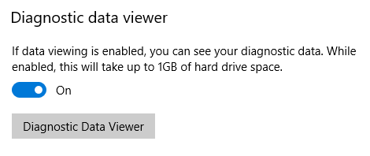
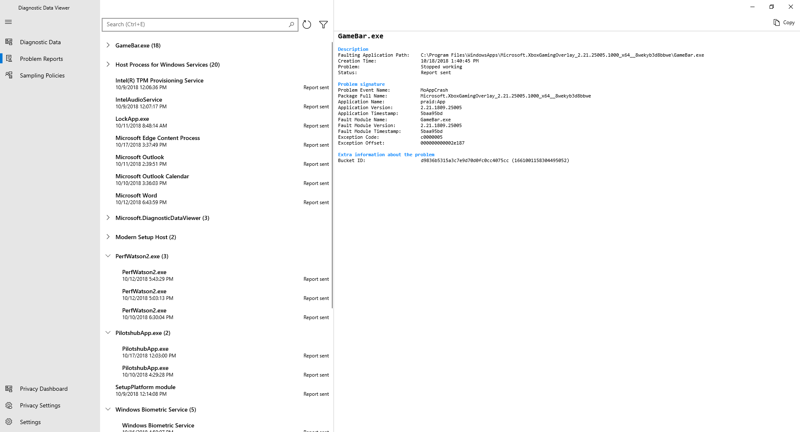

# Diagnostic Data Viewer Overview

**Applies to**

-   Windows 10, version 1809
-   Windows 10, version 1803

## Introduction
The Diagnostic Data Viewer is a Windows app that lets you review the Windows diagnostic data your device is sending to Microsoft, grouping the info into simple categories based on how it's used by Microsoft.

## Install and Use the Diagnostic Data Viewer

You must download the app before you can use the Diagnostic Data Viewer to review your device's diagnostic data.

### Turn on data viewing
Before you can use this tool for viewing Windows diagnostic data, you must turn on data viewing in the **Settings** panel. Turning on data viewing lets Windows store your device's diagnostic data until you turn it off. Turning off data viewing stops Windows from collecting your diagnostic data and clears the existing diagnostic data from your device. Note that this setting does not affect your Office data viewing or history.

**To turn on data viewing**
1. Go to **Start**, select **Settings** > **Privacy** > **Diagnostics & feedback**.

2. Under **Diagnostic data**, turn on the **If data viewing is enabled, you can see your diagnostics data** option.

    

### Download the Diagnostic Data Viewer
Download the app from the [Microsoft Store Diagnostic Data Viewer](https://www.microsoft.com/en-us/store/p/diagnostic-data-viewer/9n8wtrrsq8f7?rtc=1) page.

   >[!Important]
   >It's possible that your Windows machine may not have the Microsoft Store available (e.g. Windows Server). If this is the case, please check out [Diagnostic Data Viewer for PowerShell](https://go.microsoft.com/fwlink/?linkid=2023830).

### Start the Diagnostic Data Viewer
You can start this app from the **Settings** panel.

**To start the Diagnostic Data Viewer**
1. Go to **Start**, select **Settings** > **Privacy** > **Diagnostics & feedback**.

2. Under **Diagnostic data**, select the **Diagnostic Data Viewer** button.

      -OR-  
    
    Go to **Start** and search for _Diagnostic Data Viewer_.

3. Close the Diagnostic Data Viewer app, use your device as you normally would for a few days, and then open Diagnostic Data Viewer again to review the updated list of diagnostic data.

    >[!Important]
    >Turning on data viewing can use up to 1GB (by default) of disk space on your system drive. We strongly recommend that you turn off data viewing when you're done using the Diagnostic Data Viewer. For info about turning off data viewing, see the [Turn off data viewing](#turn-off-data-viewing) section in this article.

### Use the Diagnostic Data Viewer
The Diagnostic Data Viewer provides you with the following features to view and filter your device's diagnostic data.

- **View your Windows diagnostic events.** In the left column, you can review your diagnostic events. These events reflect activities that occurred and were sent to Microsoft. 

    Selecting an event opens the detailed JSON view, which provides the exact details uploaded to Microsoft. Microsoft uses this info to continually improve the Windows operating system.
    
    >[!Important]
    >Seeing an event does not necessarily mean it has been uploaded yet. It’s possible that some events are still queued and will be uploaded at a later time.

     

- **Search your diagnostic events.** The **Search** box at the top of the screen lets you search amongst all of the diagnostic event details. The returned search results include any diagnostic event that contains the matching text. 

    Selecting an event opens the detailed JSON view, with the matching text highlighted.

- **Filter your diagnostic event categories.** The app's **Menu** button opens the detailed menu. In here, you'll find a list of diagnostic event categories, which define how the events are used by Microsoft. Selecting a check box lets you filter between the diagnostic event categories.

- **Help to make your Windows experience better.** Microsoft only needs diagnostic data from a small amount of devices to make big improvements to the Windows operating system and ultimately, your experience. If you’re a part of this small device group and you experience issues, Microsoft will collect the associated event diagnostic data, allowing your info to potentially help fix the issue for others.

    To signify your contribution, you’ll see this icon () if your device is part of the group. In addition, if any of your diagnostic data events are sent from your device to Microsoft to help make improvements, you’ll see this icon (). 

- **Provide diagnostic event feedback.** The **Feedback** icon in the upper right corner of the window opens the Feedback Hub app, letting you provide feedback about the Diagnostic Data Viewer and the diagnostic events.

    Selecting a specific event in the Diagnostic Data Viewer automatically fills in the field in the Feedback Hub. You can add your comments to the box labeled, **Give us more detail (optional)**.
	
    >[!Important]
    >All content in the Feedback Hub is publicly viewable. Therefore, make sure you don't put any personal info into your feedback comments.

- **View a summary of the data you've shared with us over time.** Available for users on build 19H1+, 'About my data' in Diagnostic Data Viewer lets you see an overview of the Windows data you've shared with Microsoft.

    Through this feature, you can checkout how much data you send on average each day, the breakdown of your data by category, the top components and services that have sent data, and more.  
    
    >[!Important]
    >This content is a reflection of the history of Windows data the app has stored. If you'd like to have extended analyses, please modify the storage capacity of Diagnostic Data Viewer. 

     

## View Office Diagnostic Data
By default, Diagnostic Data Viewer shows you Windows data. You can also view Office diagnostic data by enabling the feature in the app settings page. To learn more about how to view Office diagnostic data, please visit this [page](https://go.microsoft.com/fwlink/?linkid=2023830). 

## Turn off data viewing
When you're done reviewing your diagnostic data, you should turn of data viewing. This will also remove your Windows data history. Note that this setting does not affect your Office data viewing or history.

**To turn off data viewing**
1. Go to **Start**, select **Settings** > **Privacy** > **Diagnostics & feedback**.

2. Under **Diagnostic data**, turn off the **If data viewing is enabled, you can see your diagnostics data** option.

    

## Modifying the size of your data history
By default, Diagnostic Data Viewer shows you up to 1GB or 30 days of data (whichever comes first) for Windows diagnostic data. Once either the time or space limit is reached, the data is incrementally dropped with the oldest data points dropped first. 

    >[!Important]
    >Note that if you have [Office diagnostic data viewing enabled](#view-office-diagnostic-data), the Office data history is fixed at 1 GB and cannot be modified.

**Modify the size of your data history**
    
    To make changes to the size of your Windows diagnostic data history, visit the **app settings**, located at the bottom of the navigation menu. Data will be incrementally dropped with the oldest data points first once your chosen size or time limit is reached.  

    >[!Important]
    >Decreasing the maximum amount of diagnostic data viewable through the tool will remove all data history and requires a reboot of your device. Additionally, increasing the maximum amount of diagnostic data viewable by the tool may come with performance impacts to your machine.

     

## View additional diagnostic data in the View problem reports tool
Available on Windows 1809 and higher, you can review additional Windows Error Reporting diagnostic data in the **View problem reports** page within the Diagnostic Data Viewer. 

This page provides you with a summary of various crash reports that are sent to Microsoft as part of Windows Error Reporting. 
We use this data to find and fix specific issues that are hard to replicate and to improve the Windows operating system. 

You can also use the Windows Error Reporting tool available in the Control Panel. 

**To view your Windows Error Reporting diagnostic data using the Diagnostic Data Viewer**

Starting with Windows 1809 and higher, you can review Windows Error Reporting diagnostic data in the Diagnostic Data Viewer.  

**To view your Windows Error Reporting diagnostic data using the Control Panel**

Go to **Start**, select **Control Panel** > **All Control Panel Items** > **Security and Maintenance** > **Problem Reports**.  -OR-  
Go to **Start** and search for _Problem Reports_.
The **Review problem reports** tool opens, showing you your Windows Error Reporting reports, along with a status about whether it was sent to Microsoft.

