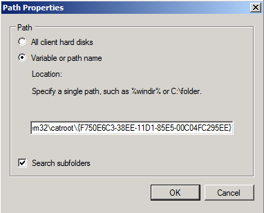

# Deploy catalog files to support App Control for Business

[!INCLUDE [Feature availability note](../includes/feature-availability-note.md)]

*Catalog files* can be important in your deployment of App Control for Business if you have unsigned line-of-business (LOB) applications for which the process of signing is difficult. You can also use catalog files to add your own signature to apps you get from independent software vendors (ISV) when you don't want to trust all code signed by that ISV. In this way, catalog files provide a convenient way for you to "bless" apps for use in your App Control-managed environment. And, you can create catalog files for existing apps without requiring access to the original source code or needing any expensive repackaging.

You need to [obtain a code signing certificate for your own use](use-code-signing-for-better-control-and-protection.md#obtain-code-signing-certificates-for-your-own-use) and use it to sign the catalog file. Then, distribute the signed catalog file using your preferred content deployment mechanism.

Finally, add a signer rule to your App Control policy for your signing certificate. Then, any apps covered by your signed catalog files are able to run, even if the apps were previously unsigned. With this foundation, you can more easily build an App Control policy that blocks all unsigned code, because most malware is unsigned.

## Create catalog files using Package Inspector

To create a catalog file for an existing app, you can use a tool called **Package Inspector** that comes with Windows.

1. Apply a policy in **audit mode** to the computer where you run Package Inspector. Package Inspector uses audit events to include hashes in the catalog file for any temporary installation files that are added and then removed from the computer during the installation process. The audit mode policy should **not** allow the app's binaries or you may miss some critical files that are needed in the catalog file.

    > [!NOTE]
    > You won't be able to complete this process if it's done on a system with an enforced policy, unless the enforced policy already allows the app to run.

    You can use this PowerShell sample to make a copy of the DefaultWindows_Audit.xml template:

    ```powershell
    Copy-Item -Path $env:windir\schemas\CodeIntegrity\ExamplePolicies\DefaultWindows_Audit.xml -Destination $env:USERPROFILE\Desktop\
    $PolicyId = Set-CIPolicyIdInfo -FilePath $env:USERPROFILE\Desktop\DefaultWindows_Audit.xml -PolicyName "Package Inspector Audit Policy" -ResetPolicyID
    $PolicyBinary = $env:USERPROFILE+"\Desktop\"+$PolicyId.substring(11)+".cip"
    ```

    Then apply the policy as described in [Deploy App Control for Business policies with script](deploy-appcontrol-policies-with-script.md).

2. Start Package Inspector to monitor file creation on a **local drive** where you install the app, for example, drive C:

    ```powershell
    PackageInspector.exe Start C:
    ```

    > [!IMPORTANT]
    > Every file that is written to the drive you are watching with Package Inspector will be included in the catalog that is created. Be aware of any other processes that may be running and creating files on the drive.

3. Copy the installation media to the drive you're watching with Package Inspector, so that the actual installer is included in the final catalog file. If you skip this step, you may allow the *app* to run, but not actually be able to install it.

4. Install the app.

5. Start the app to ensure that files created on initial launch are included in your catalog file.

6. Use the app as you would normally, so that files created during normal use are included in your catalog file. For example, some apps may download more files on first use of a feature within the app. Be sure to also check for app updates if the app has that capability.

7. Close and reopen the application to ensure that the scan has captured all binaries.

8. As appropriate, with Package Inspector still running, repeat the previous steps for any other apps that you want to include in the catalog.

9. When you've confirmed that the previous steps are complete, use the following commands to stop Package Inspector. It creates a catalog file and catalog definition file in the specified location. Use a naming convention for your catalog files to make it easier to manage your deployed catalog files over time. The filenames used in this example are **LOBApp-Contoso.cat** (catalog file) and **LOBApp.cdf** (definition file).

    For the last command, which stops Package Inspector, be sure to specify the same local drive you've been watching with Package Inspector, for example, `C:`.

    ```powershell
    $ExamplePath=$env:userprofile+"\Desktop"
    $CatFileName=$ExamplePath+"\LOBApp-Contoso.cat"
    $CatDefName=$ExamplePath+"\LOBApp.cdf"
    PackageInspector.exe Stop C: -Name $CatFileName -cdfpath $CatDefName
    ```

> [!NOTE]
> Package Inspector catalogs the hash values for each discovered file. If the applications that were scanned are updated, complete this process again to trust the new binaries' hash values.

When finished, the tool saves the files to your desktop. You can view the `*.cdf` file with a text editor and see what files Package Inspector included. You can also double-click the `*.cat` file to see its contents and check for a specific file hash.

## Sign your catalog file

Now that you've created a catalog file for your app, you're ready to sign it. We recommend using [Microsoft's Trusted Signing service](/azure/trusted-signing/) for catalog signing. Optionally, you can manually sign the catalog using Signtool using the following instructions.

### Catalog signing with SignTool.exe

If you purchased a code signing certificate or issued one from your own public key infrastructure (PKI), you can use SignTool.exe to sign your catalog files.

You need:

- SignTool.exe, found in the [Windows software development kit (SDK)](https://developer.microsoft.com/windows/downloads/windows-sdk/).
- The catalog file that you created earlier.
- A code signing certificate issued from an internal certificate authority (CA) or a purchased code signing certificate.

For the code signing certificate that you use to sign the catalog file, import it into the signing user's personal store. Then, sign the existing catalog file by copying each of the following commands into an elevated Windows PowerShell session.

1. Initialize the variables to use. Replace the `$ExamplePath` and `$CatFileName` variables as needed:

   ```powershell
   $ExamplePath=$env:userprofile+"\Desktop"
   $CatFileName=$ExamplePath+"\LOBApp-Contoso.cat"
   ```

2. Sign the catalog file with Signtool.exe:

   ```powershell
   <path to signtool.exe> sign /n "ContosoSigningCert" /fd sha256 /v $CatFileName
   ```

   > [!NOTE]
   > The `<Path to signtool.exe>` variable should be the full path to the Signtool.exe utility. `ContosoSigningCert` represents the subject name of the certificate that you use to sign the catalog file. This certificate should be imported to your personal certificate store on the computer on which you are attempting to sign the catalog file.
   >
   > For more information about Signtool.exe and all additional switches, see [Sign Tool](/dotnet/framework/tools/signtool-exe).

3. Verify the catalog file's digital signature. Right-click the catalog file, and then select **Properties**. On the **Digital Signatures** tab, verify that your signing certificate exists with a **sha256** algorithm, as shown in Figure 1.

   :::image type="content" alt-text="Digital Signature list in file Properties." source="../images/dg-fig12-verifysigning.png":::

   Figure 1. Verify that the signing certificate exists.

## Deploy the catalog file to your managed endpoints

Catalog files in Windows are stored under `%windir%\System32\catroot\{F750E6C3-38EE-11D1-85E5-00C04FC295EE}`.

For testing purposes, you can manually copy signed catalog files to this folder. For large-scale deployment of signed catalog files, use group policy file preferences or an enterprise systems management product such as Microsoft Configuration Manager.

### Deploy catalog files with group policy

To simplify the management of catalog files, you can use group policy preferences to deploy catalog files to the appropriate computers in your organization.

The following process walks you through the deployment of a signed catalog file called **LOBApp-Contoso.cat** to a test OU called **App Control Enabled PCs** with a GPO called **Contoso Catalog File GPO Test**.

1. From either a domain controller or a client computer that has Remote Server Administration Tools installed, open the Group Policy Management Console by running **GPMC.MSC** or by searching for Group Policy Management.

2. Create a new GPO: right-click an OU, for example, the **App Control Enabled PCs OU**, and then select **Create a GPO in this domain, and Link it here**, as shown in Figure 2.

   > [!NOTE]
   > You can use any OU name. Also, security group filtering is an option when you consider different ways of combining App Control policies.

   :::image type="content" alt-text="Group Policy Management, create a GPO." source="../images/dg-fig13-createnewgpo.png":::

   Figure 2. Create a new GPO.

3. Give the new GPO a name, for example, **Contoso Catalog File GPO Test**, or any name you prefer.

4. Open the Group Policy Management Editor: right-click the new GPO, and then select **Edit**.

5. Within the selected GPO, navigate to **Computer Configuration\\Preferences\\Windows Settings\\Files**. Right-click **Files**, point to **New**, and then select **File**, as shown in Figure 3.

   :::image type="content" alt-text="Group Policy Management Editor, New File." source="../images/dg-fig14-createnewfile.png":::

   Figure 3. Create a new file.

6. Configure the catalog file share.

   To use this setting to provide consistent deployment of your catalog file (in this example, LOBApp-Contoso.cat), the source file should be on a share that is accessible to the computer account of every deployed computer. This example uses a share on a computer running Windows 10 called `\\Contoso-Win10\Share`. The catalog file being deployed is copied to this share.

7. To keep versions consistent, in the **New File Properties** dialog box as shown in Figure 4, select **Replace** from the **Action** list so that the newest version is always used.

   

   Figure 4. Set the new file properties.

8. In the **Source file(s)** box, type the name of your accessible share, with the catalog file name included. For example, `\\Contoso-Win10\share\LOBApp-Contoso.cat`.

9. In the **Destination File** box, type a path and file name, for example:

   `C:\Windows\System32\catroot\{F750E6C3-38EE-11D1-85E5-00C04FC295EE}\LOBApp-Contoso.cat`

   For the catalog file name, use the name of the catalog you're deploying.

10. On the **Common** tab of the **New File Properties** dialog box, select the **Remove this item when it is no longer applied** option. Enabling this option ensures that the catalog file is removed from every system, in case you ever need to stop trusting this application.

11. Select **OK** to complete file creation.

12. Close the Group Policy Management Editor, and then update the policy on the test computer running Windows 10 or Windows 11, by running GPUpdate.exe. When the policy has been updated, verify that the catalog file exists in `C:\Windows\System32\catroot\{F750E6C3-38EE-11D1-85E5-00C04FC295EE}` on the computer running Windows 10.

### Deploy catalog files with Microsoft Configuration Manager

As an alternative to group policy, you can use Configuration Manager to deploy catalog files to the managed computers in your environment. This approach can simplify the deployment and management of multiple catalog files and provide reporting around which catalog each client or collection has deployed. In addition to the deployment of these files, Configuration Manager can also be used to inventory the currently deployed catalog files for reporting and compliance purposes.

Complete the following steps to create a new deployment package for catalog files:

> [!NOTE]
> The following example uses a network share named `\\Shares\CatalogShare` as a source for the catalog files. If you have collection-specific catalog files, or prefer to deploy them individually, use whichever folder structure works best for your organization.

1. Open the Configuration Manager console, and select the Software Library workspace.

2. Navigate to Overview\\Application Management, right-click **Packages**, and then select **Create Package**.

3. Name the package, set your organization as the manufacturer, and select an appropriate version number.

    

    Figure 5. Specify information about the new package.

4. Select **Next**, and then select **Standard program** as the program type.

5. On the **Standard Program** page, select a name, and then set the **Command Line** property to the following command:

    ```cmd
    XCopy \\Shares\CatalogShare C:\Windows\System32\catroot\{F750E6C3-38EE-11D1-85E5-00C04FC295EE} /H /K /E /Y
    ```

6. On the **Standard Program** page, select the following options, as shown in Figure 6:

    - In **Name**, type a name such as **Contoso Catalog File Copy Program**.
    - In **Command line**, browse to the program location.
    - In **Startup folder**, type `C:\Windows\System32`.
    - From the **Run** list, select **Hidden**.
    - From the **Program can run** list, select **Whether or not a user is logged on**.
    - From the **Drive mode** list, select **Runs with UNC name**.

    

    Figure 6. Specify information about the standard program.

7. Accept the defaults for the rest of the wizard, and then close the wizard.

After you create the deployment package, deploy it to a collection so that the clients will receive the catalog files. In this example, you deploy the package you created to a test collection:

1. In the Software Library workspace, navigate to Overview\\Application Management\\Packages, right-click the catalog file package, and then select **Deploy**.

2. On the **General** page, select the test collection, and then select **Next**.

3. On the **Content** page, select **Add** to select the distribution point to serve content to the selected collection, and then select **Next**.

4. On the **Deployment Settings** page, select **Required** in the **Purpose** box.

5. On the **Scheduling** page, select **New**.

6. In the **Assignment Schedule** dialog box, select **Assign immediately after this event**, set the value to **As soon as possible**, and then select **OK**.

7. On the **Scheduling** page, select **Next**.

8. On the **User Experience** page as shown in Figure 7, set the following options, and then select **Next**:

    - Select the **Software installation** check box.

    - Select the **Commit changes at deadline or during a maintenance window (requires restarts)** check box.

    

    Figure 7. Specify the user experience.

9. On the **Distribution Points** page, in the **Deployment options** box, select **Run program from distribution point**, and then select **Next**.

10. On the **Summary** page, review the selections, and then select **Next**.

11. Close the wizard.

#### Inventory catalog files with Microsoft Configuration Manager

When catalog files have been deployed to the computers within your environment, whether by using group policy or Configuration Manager, you can inventory them with the software inventory feature of Configuration Manager.

You can configure software inventory to find catalog files on your managed systems by creating and deploying a new client settings policy.

> [!NOTE]
> A standard naming convention for your catalog files will significantly simplify the catalog file software inventory process. In this example, *-Contoso* has been added to all catalog file names.

1. Open the Configuration Manager console, and select the Administration workspace.

2. Navigate to **Overview\\Client Settings**, right-click **Client Settings**, and then select **Create Custom Client Device Settings**.

3. Name the new policy, and under **Select and then configure the custom settings for client devices**, select the **Software Inventory** check box, as shown in Figure 8.

    

    Figure 8. Select custom settings.

4. In the navigation pane, select **Software Inventory**, and then select **Set Types**, as shown in Figure 9.

    

    Figure 9. Set the software inventory.

5. In the **Configure Client Setting** dialog box, select the **Start** button to open the **Inventories File Properties** dialog box.

6. In the **Name** box, type a name such as `*Contoso.cat`, and then select **Set**.

    > [!NOTE]
    > When typing the name, follow your naming convention for catalog files.

7. In the **Path Properties** dialog box, select **Variable or path name**, and then type `C:\Windows\System32\catroot\{F750E6C3-38EE-11D1-85E5-00C04FC295EE}` in the box, as shown in Figure 10.

    

    Figure 10. Set the path properties.

8. Select **OK**.

9. Now that you've created the client settings policy, right-click the new policy, select **Deploy**, and then choose the collection on which you would like to inventory the catalog files.

At the time of the next software inventory cycle, when the targeted clients receive the new client settings policy, you'll be able to view the inventoried files in the built-in Configuration Manager reports or Resource Explorer. To view the inventoried files on a client within Resource Explorer, complete the following steps:

1. Open the Configuration Manager console, and select the Assets and Compliance workspace.

2. Navigate to Overview\\Devices, and search for the device on which you want to view the inventoried files.

3. Right-click the computer, point to **Start**, and then select **Resource Explorer**.

4. In Resource Explorer, navigate to Software\\File Details to view the inventoried catalog files.

> [!NOTE]
> If nothing is displayed in this view, navigate to Software\\Last Software Scan in Resource Explorer to verify that the client has recently completed a software inventory scan.

## Allow apps signed by your catalog signing certificate in your App Control policy

Now that you have your signed catalog file, you can add a signer rule to your policy that allows anything signed with that certificate. If you haven't yet created an App Control policy, see the [App Control for Business design guide](../design/appcontrol-design-guide.md).

On a computer where the signed catalog file has been deployed, you can use [New-CiPolicyRule](/powershell/module/configci/new-cipolicyrule) to create a signer rule from any file included in that catalog. Then use [Merge-CiPolicy](/powershell/module/configci/merge-cipolicy) to add the rule to your policy XML. Be sure to replace the path values in the following sample:

  ```powershell
  $Rules = New-CIPolicyRule -DriverFilePath <path to the file covered by the signed catalog> -Level Publisher
  Merge-CIPolicy -OutputFilePath <path to your policy XML> -PolicyPaths <path to your policy XML> -Rules $Rules
  ```

Alternatively, you can use [Add-SignerRule](/powershell/module/configci/add-signerrule) to add a signer rule to your policy from the certificate file (.cer). You can easily save the .cer file from your signed catalog file.

1. Right-click the catalog file, and then select **Properties**.
2. On the **Digital Signatures** tab, select the signature from the list and then select **Details**.
3. Select **View Certificate** to view the properties of the leaf certificate.
4. Select the **Details** tab and select **Copy to File**. This action runs the Certificate Export Wizard.
5. Complete the wizard using the default option for **Export File Format** and specifying a location and file name to save the .cer file.

> [!NOTE]
> These steps select the lowest level of the certificate chain, also called the "leaf" certificate. Instead, you can choose to use the certificate's intermediate or root issuer certificate. To use a different certificate in the chain, switch to the **Certification Path** tab after step 3 above, then select the certificate level you want to use and select **View Certificate**. Then complete the remaining steps.

The following example uses the .cer file to add a signer rule to both the user and kernel mode signing scenarios. Be sure to replace the path values in the following sample:

  ```powershell
  Add-SignerRule -FilePath <path to your policy XML> -CertificatePath <path to your certificate .cer file> -User -Kernel
  ```

## Known issues using Package Inspector

Some of the known issues using Package Inspector to build a catalog file are:

- **USN journal size is too small to track all files created by the installer**
  - To diagnose whether USN journal size is the issue, after running through Package Inspector:
    - Get the value of the reg key at HKEY\_CURRENT\_USER/PackageInspectorRegistryKey/c: (this USN was the most recent one when you ran PackageInspector start). Then use fsutil.exe to read that starting location. Replace "RegKeyValue" in the following command with the value from the reg key:<br>
    `fsutil usn readjournal C: startusn=RegKeyValue > inspectedusn.txt`
    - The above command should return an error if the older USNs don't exist anymore due to overflow
    - You can expand the USN Journal size using: `fsutil usn createjournal` with a new size and allocation delta. `Fsutil usn queryjournal` shows the current size and allocation delta, so using a multiple of that may help.

- **CodeIntegrity - Operational event log is too small to track all files created by the installer**
  - To diagnose whether Eventlog size is the issue, after running through Package Inspector:
    - Open Event Viewer and expand the **Application and Services//Microsoft//Windows//CodeIntegrity//Operational**. Check for a 3076 audit block event for the initial installer launch.
    - To increase the Event log size, in Event Viewer right-click the operational log, select Properties, and then set new values.

- **Installer or app files that change hash each time the app is installed or run**
  - Some apps generate files at run time whose hash value is different every time. You can diagnose this issue by reviewing the hash values in the 3076 audit block events (or 3077 enforcement events) that are generated. If each time you attempt to run the file you observe a new block event with a different hash, the package doesn't work with Package Inspector.

- **Files with an invalid signature blob or otherwise "unhashable" files**
  - This issue arises when a signed file was modified in a way that invalidates the file's PE header. A file modified in this way is unable to be hashed according to the Authenticode spec.
  - Although these "unhashable" files can't be included in the catalog file created by PackageInspector, you should be able to allow them by adding a hash ALLOW rule to your policy that uses the file's flat file hash.
  - This issue affects some versions of InstallShield packages that use signed DLL files in custom actions. InstallShield adds tracking markers to the file (editing it post signature) which leaves the file in this "unhashable" state.
