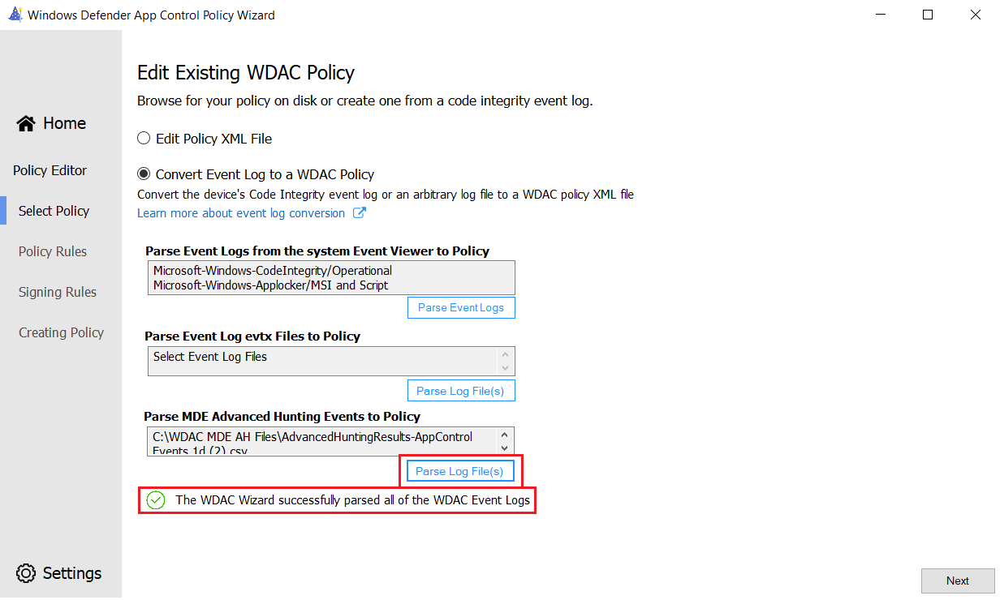
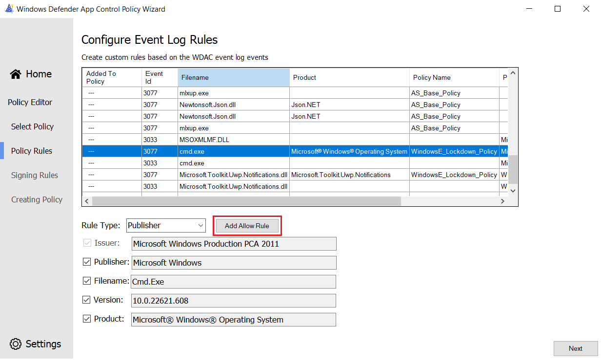

# Creating WDAC Policy Rules from WDAC Events in the Wizard

> [!NOTE]
> Some capabilities of Windows Defender Application Control are only available on specific Windows versions. Learn more about the [Windows Defender Application Control feature availability](../feature-availability.md).

As of [version 2.2.0.0](https://webapp-wdac-wizard.azurewebsites.net/archives.html), the WDAC Wizard supports creating WDAC policy rules from the following event log types: 

1. [WDAC event log events on the system](#wdac-event-viewer-log-parsing)
2. [Exported WDAC events (EVTX files) from any system](#wdac-event-log-file-parsing)
3. [Exported WDAC events from MDE Advanced Hunting](#mde-advanced-hunting-wdac-event-parsing)

## WDAC Event Viewer Log Parsing

To create rules from the WDAC event logs on the system:

1. Select **Policy Editor** from the main page.
2. Select **Convert Event Log to a WDAC Policy**.
3. Select the **Parse Event Logs** button under the **Parse Event Logs from the System Event Viewer to Policy** header.

   The Wizard parses the relevant audit and block events from the CodeIntegrity (WDAC) Operational and AppLocker MSI and Script logs. You see a notification when the Wizard successfully finishes reading the events. 

   > [!div class="mx-imgBorder"]
   > [](../images/wdac-wizard-event-log-system-expanded.png)

4. Select the Next button to view the audit and block events and create rules.
5. [Generate rules from the events](#creating-policy-rules-from-the-events).

## WDAC Event Log File Parsing

To create rules from the WDAC `.EVTX` event logs files on the system:

1. Select **Policy Editor** from the main page.
2. Select **Convert Event Log to a WDAC Policy**.
3. Select the **Parse Log File(s)** button under the **Parse Event Log evtx Files to Policy** header.
4. Select the WDAC CodeIntegrity Event log EVTX file(s) from the disk to parse.

   The Wizard parses the relevant audit and block events from the selected log files. You see a notification when the Wizard successfully finishes reading the events. 

   > [!div class="mx-imgBorder"]
   > [](../images/wdac-wizard-event-log-files-expanded.png)

5. Select the Next button to view the audit and block events and create rules.
6. [Generate rules from the events](#creating-policy-rules-from-the-events).

## MDE Advanced Hunting WDAC Event Parsing

To create rules from the WDAC events in [MDE Advanced Hunting](../operations/querying-application-control-events-centrally-using-advanced-hunting.md):

1. Navigate to the Advanced Hunting section within the MDE console and query the WDAC events. **The Wizard requires the following fields** in the Advanced Hunting csv file export: 

   ```KQL
   | project-keep Timestamp, DeviceId, DeviceName, ActionType, FileName, FolderPath, SHA1, SHA256, IssuerName, IssuerTBSHash, PublisherName, PublisherTBSHash, AuthenticodeHash, PolicyId, PolicyName
   ```

   The following Advanced Hunting query is recommended:

   ```KQL
   DeviceEvents 
   // Take only WDAC events
   | where ActionType startswith 'AppControlCodeIntegrity' 
   // SigningInfo Fields
   | extend IssuerName = parsejson(AdditionalFields).IssuerName
   | extend IssuerTBSHash = parsejson(AdditionalFields).IssuerTBSHash
   | extend PublisherName = parsejson(AdditionalFields).PublisherName
   | extend PublisherTBSHash = parsejson(AdditionalFields).PublisherTBSHash
   // Audit/Block Fields
   | extend AuthenticodeHash = parsejson(AdditionalFields).AuthenticodeHash
   | extend PolicyId = parsejson(AdditionalFields).PolicyID
   | extend PolicyName = parsejson(AdditionalFields).PolicyName
   // Keep only required fields for the WDAC Wizard
   | project-keep Timestamp,DeviceId,DeviceName,ActionType,FileName,FolderPath,SHA1,SHA256,IssuerName,IssuerTBSHash,PublisherName,PublisherTBSHash,AuthenticodeHash,PolicyId,PolicyName
   ```

2. Export the WDAC event results by selecting the **Export** button in the results view.

   > [!div class="mx-imgBorder"]
   > [](../images/wdac-wizard-event-log-mde-ah-export-expanded.png)

3. Select **Policy Editor** from the main page.
4. Select **Convert Event Log to a WDAC Policy**.
5. Select the **Parse Log File(s)** button under the "Parse MDE Advanced Hunting Events to Policy" header.
6. Select the WDAC MDE Advanced Hunting export CSV files from the disk to parse.

   The Wizard will parse the relevant audit and block events from the selected Advanced Hunting log files. You see a notification when the Wizard successfully finishes reading the events. 

   > [!div class="mx-imgBorder"]
   > [](../images/wdac-wizard-event-log-mde-ah-parsing-expanded.png)

7. Select the Next button to view the audit and block events and create rules.
8. [Generate rules from the events](#creating-policy-rules-from-the-events).

## Creating Policy Rules from the Events

On the "Configure Event Log Rules" page, the unique WDAC log events are shown in the table. Event Ids, filenames, product names, the policy name that audited or blocked the file, and the file publisher are all shown in the table. The table can be sorted alphabetically by clicking on any of the headers. 

To create a rule and add it to the WDAC policy: 

1. Select an audit or block event in the table by selecting the row of interest.
2. Select a rule type from the dropdown. The Wizard supports creating Publisher, Path, File Attribute, Packaged App and Hash rules.
3. Select the attributes and fields that should be added to the policy rules using the checkboxes provided for the rule type.
4. Select the **Add Allow Rule** button to add the configured rule to the policy generated by the Wizard. The "Added to policy" label is shown in the selected row confirming that the rule will be generated.

   > [!div class="mx-imgBorder"]
   > [](../images/wdac-wizard-event-rule-creation-expanded.png)

5. Select the **Next** button to output the policy. Once generated, the event log policy should be merged with your base or supplemental policies. 

> [!WARNING]
> It is not recommended to deploy the event log policy on its own, as it likely lacks rules to authorize Windows and may cause blue screens.

## Up next

- [Merging Windows Defender Application Control (WDAC) policies using the Wizard](wdac-wizard-merging-policies.md)
