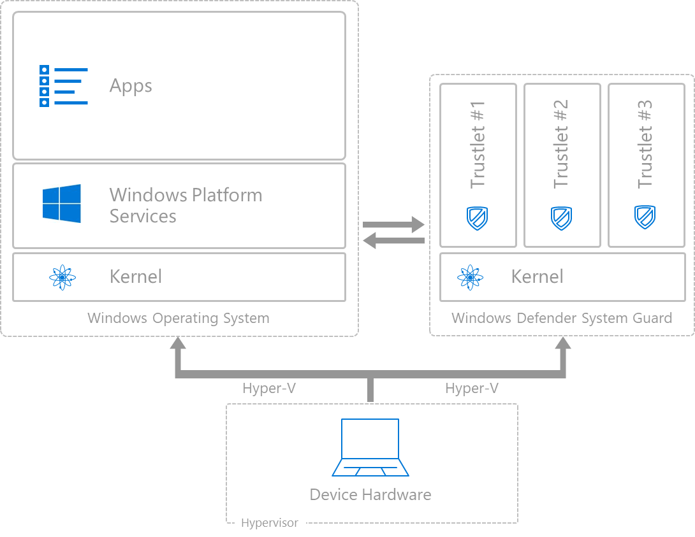

# How hardware-based containers help protect Windows 10

Windows 10 uses containers to isolate sensitive system services and data, enabling them to remain secure even when the operating system has been compromised. 
Windows 10 protects critical resources, such as the Windows authentication stack, single sign-on tokens, Windows Hello biometric stack, and Virtual Trusted Platform Module, by using a container type called Windows Defender System Guard. 

Protecting system services and data with Windows Defender System Guard is an important first step, but is just the beginning of what we need to do as it doesn’t protect the rest of the operating system, information on the device, other apps, or the network. 
Since systems are generally compromised through the application layer, and often though browsers, Windows 10 includes Windows Defender Application Guard to isolate Microsoft Edge from the operating system, information on the device, and the network. 
With this, Windows can start to protect the broader range of resources.

The following diagram shows Windows Defender System Guard and Windows Defender Application Guard in relation to the Windows 10 operating system.

## What security threats do containers protect against

Exploiting zero days and vulnerabilities are an increasing threat that attackers are attempting to take advantage of. 
The following diagram shows the traditional Windows software stack: a kernel with an app platform, and an app running on top of it. 
Let’s look at how an attacker might elevate privileges and move down the stack.

In desktop operating systems, those apps typically run under the context of the user’s privileges. 
If the app was malicious, it would have access to all the files in the file system, all the settings that you as a user Standard user have access to, and so on. 

A different type of app may run under the context of an Administrator. 
If attackers exploit a vulnerability in that app, they could gain Administrator privileges. 
Then they can start turning off defenses. 

They can poke down a little bit lower in the stack and maybe elevate to System, which is greater than Administrator. 
Or if they can exploit the kernel mode, they can turn on and turn off all defenses, while at the same time making the computer look healthy. 
SecOps tools could report the computer as healthy when in fact it’s completely under the control of someone else.

One way to address this threat is to use a sandbox, as smartphones do. 
That puts a layer between the app layer and the Windows platform services. 
Universal Windows Platform (UWP) applications work this way. 
But what if a vulnerability in the sandbox exists? 
The attacker can escape and take control of the system.

## How containers help protect Windows 10

Windows 10 addresses this by using virtualization based security to isolate more and more components out of Windows (left side) over time and moving those components into a separate, isolated hardware container. 
The container helps prevent zero days and vulnerabilities from allowing an attacker to take control of a device.

Anything that's running in that container on the right side will be safe, even from Windows, even if the kernel's compromised. 
Anything that's running in that container will also be secure against a compromised app. 
Initially, Windows Defender System Guard will protect things like authentication and other system services and data that needs to resist malware, and more things will be protected over time.

