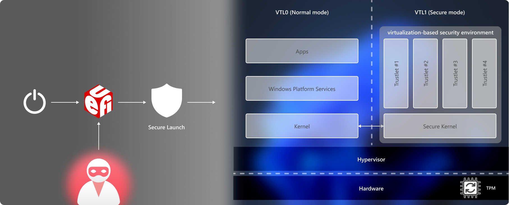
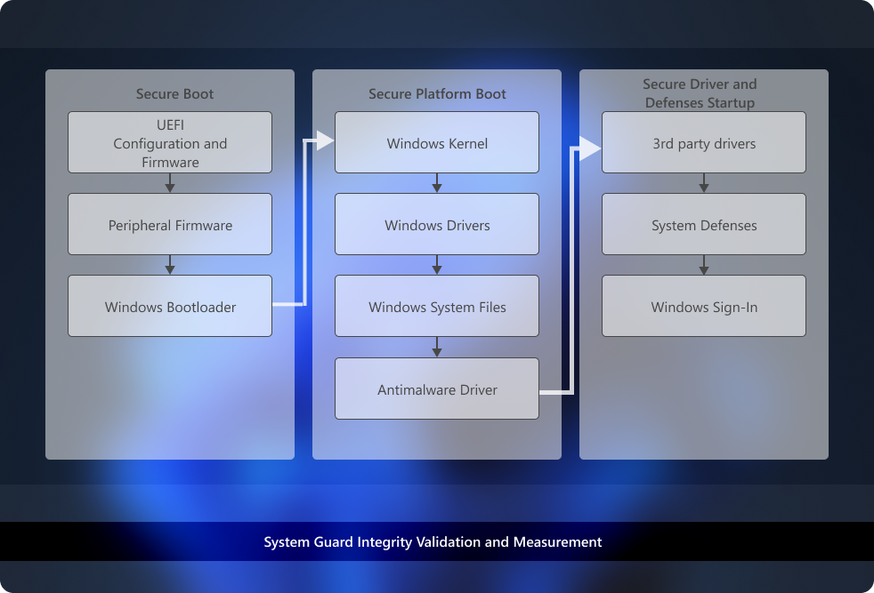

# System Guard: How a hardware-based root of trust helps protect Windows

To protect critical resources such as the Windows authentication stack, single sign-on tokens, the Windows Hello biometric stack, and the Virtual Trusted Platform Module, a system's firmware and hardware must be trustworthy.

System Guard reorganizes the existing Windows system integrity features under one roof and sets up the next set of investments in Windows security. It's designed to make these security guarantees:

- Protect and maintain the integrity of the system as it starts up
- Validate that system integrity has truly been maintained through local and remote attestation

## Maintaining the integrity of the system as it starts

### Static Root of Trust for Measurement (SRTM)

With Windows 7, one of the means attackers would use to persist and evade detection was to install what is often referred to as a bootkit or rootkit on the system. This malicious software would start before Windows started, or during the boot process itself, enabling it to start with the highest level of privilege.

With Windows 10 running on modern hardware, a hardware-based root of trust helps ensure that no unauthorized firmware or software (such as a bootkit) can start before the Windows bootloader. This hardware-based root of trust comes from the device's Secure Boot feature, which is part of the Unified Extensible Firmware Interface (UEFI). This technique of measuring the static early boot UEFI components is called the Static Root of Trust for Measurement (SRTM).

As there are thousands of PC vendors that produce many models with different UEFI BIOS versions, there becomes an incredibly large number of SRTM measurements upon bootup. Two techniques exist to establish trust here—either maintain a list of known 'bad' SRTM measurements (also known as a blocklist), or a list of known 'good' SRTM measurements (also known as an allowlist).

Each option has a drawback:

- A list of known 'bad' SRTM measurements allows a hacker to change just 1 bit in a component to create an entirely new SRTM hash that needs to be listed. This means that the SRTM flow is inherently brittle - a minor change can invalidate the entire chain of trust.
- A list of known 'good' SRTM measurements requires each new BIOS/PC combination measurement to be carefully added, which is slow.
Also, a bug fix for UEFI code can take a long time to design, build, retest, validate, and redeploy.

### Secure Launch—the Dynamic Root of Trust for Measurement (DRTM)

[System Guard Secure Launch](system-guard-secure-launch-and-smm-protection.md), first introduced in Windows 10 version 1809, aims to alleviate these issues by using a technology known as the Dynamic Root of Trust for Measurement (DRTM). DRTM lets the system freely boot into untrusted code initially, but shortly after launches the system into a trusted state by taking control of all CPUs and forcing them down a well-known and measured code path. This has the benefit of allowing untrusted early UEFI code to boot the system, but then being able to securely transition into a trusted and measured state.

Secure Launch simplifies management of SRTM measurements because the launch code is now unrelated to a specific hardware configuration. This means the number of valid code measurements is small, and future updates can be deployed more widely and quickly.

### System Management Mode (SMM) protection

System Management Mode (SMM) is a special-purpose CPU mode in x86 microcontrollers that handles power management, hardware configuration, thermal monitoring, and anything else the manufacturer deems useful. Whenever one of these system operations is requested, a nonmaskable interrupt (SMI) is invoked at runtime, which executes SMM code installed by the BIOS. SMM code executes in the highest privilege level and is invisible to the OS, which makes it an attractive target for malicious activity. Even if System Guard Secure Launch is used to late launch, SMM code can potentially access hypervisor memory and change the hypervisor.

To defend against this, two techniques are used:

- Paging protection to prevent inappropriate access to code and data
- SMM hardware supervision and attestation

Paging protection can be implemented to lock certain code tables to be read-only to prevent tampering. This prevents access to any memory that hasn't been assigned.

A hardware-enforced processor feature known as a supervisor SMI handler can monitor the SMM and make sure it doesn't access any part of the address space that it isn't supposed to.

SMM protection is built on top of the Secure Launch technology and requires it to function. In the future, Windows 10 will also measure this SMI Handler's behavior and attest that no OS-owned memory has been tampered with.

## Validating platform integrity after Windows is running (run time)

While System Guard provides advanced protection that will help protect and maintain the integrity of the platform during boot and at run time, the reality is that we must apply an "assume breach" mentality to even our most sophisticated security technologies. We can trust that the technologies are successfully doing their jobs, but we also need the ability to verify that they were successful in achieving their goals. For platform integrity, we can't just trust the platform, which potentially could be compromised, to self-attest to its security state. So System Guard includes a series of technologies that enable remote analysis of the device's integrity.

As Windows boots, a series of integrity measurements are taken by System Guard using the device's Trusted Platform Module 2.0 (TPM 2.0). System Guard Secure Launch doesn't support earlier TPM versions, such as TPM 1.2. This process and data are hardware-isolated away from Windows to help ensure that the measurement data isn't subject to the type of tampering that could happen if the platform was compromised. From here, the measurements can be used to determine the integrity of the device's firmware, hardware configuration state, and Windows boot-related components, to name a few.

After the system boots, System Guard signs and seals these measurements using the TPM. Upon request, a management system like Intune or Microsoft Configuration Manager can acquire them for remote analysis. If System Guard indicates that the device lacks integrity, the management system can take a series of actions, such as denying the device access to resources.

[!INCLUDE [system-guard](../../../includes/licensing/system-guard.md)]

## System requirements for System Guard

This feature is available for the following processors:

- Intel&reg; vPro&trade; processors starting with Intel&reg; Coffeelake, Whiskeylake, or later silicon
- AMD&reg; processors starting with Zen2 or later silicon
- Qualcomm&reg; processors with SD850 or later chipsets

### Requirements for Intel&reg; vPro&trade; processors starting with Intel&reg; Coffeelake, Whiskeylake, or later silicon

|Name|Description|
|--------|-----------|
|64-bit CPU|A 64-bit computer with minimum four cores (logical processors) is required for hypervisor and Virtualization-based security (VBS). For more information about Hyper-V, see [Hyper-V on Windows Server 2016](/windows-server/virtualization/hyper-v/hyper-v-on-windows-server) or [Introduction to Hyper-V on Windows 10](/virtualization/hyper-v-on-windows/about/). For more information about hypervisor, see [Hypervisor Specifications](/virtualization/hyper-v-on-windows/reference/tlfs).|
|Trusted Platform Module (TPM) 2.0|Platforms must support a discrete TPM 2.0. Integrated/firmware TPMs aren't supported, except Intel chips that support Platform Trust Technology (PTT), which is a type of integrated hardware TPM that meets the TPM 2.0 spec.|
|Windows DMA Protection|Platforms must meet the Windows DMA Protection Specification (all external DMA ports must be off by default until the OS explicitly powers them).|
|SMM communication buffers| All SMM communication buffers must be implemented in EfiRuntimeServicesData, EfiRuntimeServicesCode, EfiACPIMemoryNVS, or EfiReservedMemoryType memory types. |
|SMM Page Tables| Must NOT contain any mappings to EfiConventionalMemory (for example no OS/VMM owned memory).  Must NOT contain any mappings to code sections within EfiRuntimeServicesCode.  Must NOT have execute and write permissions for the same page  Must allow ONLY that TSEG pages can be marked executable and the memory map must report TSEG EfiReservedMemoryType.  BIOS SMI handler must be implemented such that SMM page tables are locked on every SMM entry.  |
|Modern/Connected Standby|Platforms must support Modern/Connected Standby.|
|TPM AUX Index|Platform must set up a AUX index with index, attributes, and policy that exactly corresponds to the AUX index specified in the TXT DG with a data size of exactly 104 bytes (for SHA256 AUX data). (NameAlg = SHA256)   Platforms must set up a PS (Platform Supplier) index with: <ul><li> Exactly the "TXT PS2" style Attributes on creation as follows: <ul><li>AuthWrite</li><li>PolicyDelete</li><li>WriteLocked</li><li>WriteDefine</li><li>AuthRead</li><li>WriteDefine</li><li>NoDa</li><li>Written</li><li>PlatformCreate</li></ul> <li>A policy of exactly PolicyCommandCode(CC = TPM2_CC_UndefineSpaceSpecial) (SHA256 NameAlg and Policy)</li><li> Size of exactly 70 bytes </li><li> NameAlg = SHA256 </li><li> Also, it must have been initialized and locked (TPMA_NV_WRITTEN = 1, TPMA_NV_WRITELOCKED = 1) at time of OS launch. </li></ul> PS index data DataRevocationCounters, SINITMinVersion, and PolicyControl must all be 0x00 |
|AUX Policy|The required AUX policy must be as follows: <ul><li> A = TPM2_PolicyLocality (Locality 3 & Locality 4) </li><li>B = TPM2_PolicyCommandCode (TPM_CC_NV_UndefineSpecial)</li><li>authPolicy = \{A} OR {{A} AND \{B}}</li><li>authPolicy digest = 0xef, 0x9a, 0x26, 0xfc, 0x22, 0xd1, 0xae, 0x8c, 0xec, 0xff, 0x59, 0xe9, 0x48, 0x1a, 0xc1, 0xec, 0x53, 0x3d, 0xbe, 0x22, 0x8b, 0xec, 0x6d, 0x17, 0x93, 0x0f, 0x4c, 0xb2, 0xcc, 0x5b, 0x97, 0x24</li></ul>|
|TPM NV Index|Platform firmware must set up a TPM NV index for use by the OS with: <ul><li>Handle: 0x01C101C0 </li><li>Attributes: <ul><li>TPMA_NV_POLICYWRITE</li><li>TPMA_NV_PPREAD </li><li>TPMA_NV_OWNERREAD</li><li>TPMA_NV_AUTHREAD</li><li>TPMA_NV_POLICYREAD</li><li>TPMA_NV_NO_DA</li><li>TPMA_NV_PLATFORMCREATE</li><li>TPMA_NV_POLICY_DELETE</li></ul> <li>A policy of: </li><ul><li>A = TPM2_PolicyAuthorize(MSFT_DRTM_AUTH_BLOB_SigningKey)</li><li>B = TPM2_PolicyCommandCode(TPM_CC_NV_UndefineSpaceSpecial) </li><li> authPolicy = \{A} OR {{A} AND \{B}} </li><li> Digest value of 0xcb, 0x45, 0xc8, 0x1f, 0xf3, 0x4b, 0xcf, 0x0a, 0xfb, 0x9e, 0x1a, 0x80, 0x29, 0xfa, 0x23, 0x1c, 0x87, 0x27, 0x30, 0x3c, 0x09, 0x22, 0xdc, 0xce, 0x68, 0x4b, 0xe3, 0xdb, 0x81, 0x7c, 0x20, 0xe1 </li></ul></ul> |
|Platform firmware|Platform firmware must carry all code required to execute an Intel&reg; Trusted Execution Technology secure launch: <ul><li>Intel&reg; SINIT ACM must be carried in the OEM BIOS</li><li>Platforms must ship with a production ACM signed by the correct production Intel&reg; ACM signer for the platform</li></ul>|
|Platform firmware update|It's recommended to update System firmware via UpdateCapsule in Windows Update. |

### Requirements for AMD&reg; processors starting with Zen2 or later silicon

|Name|Description|
|--------|-----------|
|64-bit CPU|A 64-bit computer with minimum four cores (logical processors) is required for hypervisor and Virtualization-based security (VBS). For more information about Hyper-V, see [Hyper-V on Windows Server 2016](/windows-server/virtualization/hyper-v/hyper-v-on-windows-server) or [Introduction to Hyper-V on Windows 10](/virtualization/hyper-v-on-windows/about/). For more information about hypervisor, see [Hypervisor Specifications](/virtualization/hyper-v-on-windows/reference/tlfs).|
|Trusted Platform Module (TPM) 2.0|Platforms must support a discrete TPM 2.0 OR Microsoft Pluton TPM.|
|Windows DMA Protection|Platforms must meet the Windows DMA Protection Specification (all external DMA ports must be off by default until the OS explicitly powers them).|
|SMM communication buffers| All SMM communication buffers must be implemented in EfiRuntimeServicesData, EfiRuntimeServicesCode, EfiACPIMemoryNVS, or EfiReservedMemoryType memory types. |
|SMM Page Tables| Must NOT contain any mappings to EfiConventionalMemory (for example no OS/VMM owned memory).  Must NOT contain any mappings to code sections within EfiRuntimeServicesCode.  Must NOT have execute and write permissions for the same page  BIOS SMI handler must be implemented such that SMM page tables are locked on every SMM entry.  |
|Modern/Connected Standby|Platforms must support Modern/Connected Standby.|
|TPM NV Index|Platform firmware must set up a TPM NV index for use by the OS with: <ul><li>Handle: 0x01C101C0 </li><li>Attributes: <ul><li>TPMA_NV_POLICYWRITE</li><li>TPMA_NV_PPREAD </li><li>TPMA_NV_OWNERREAD</li><li>TPMA_NV_AUTHREAD</li><li>TPMA_NV_POLICYREAD</li><li>TPMA_NV_NO_DA</li><li>TPMA_NV_PLATFORMCREATE</li><li>TPMA_NV_POLICY_DELETE</li></ul> <li>A policy of: </li><ul><li>A = TPM2_PolicyAuthorize(MSFT_DRTM_AUTH_BLOB_SigningKey)</li><li>B = TPM2_PolicyCommandCode(TPM_CC_NV_UndefineSpaceSpecial) </li><li> authPolicy = \{A} OR {{A} AND \{B}} </li><li> Digest value of 0xcb, 0x45, 0xc8, 0x1f, 0xf3, 0x4b, 0xcf, 0x0a, 0xfb, 0x9e, 0x1a, 0x80, 0x29, 0xfa, 0x23, 0x1c, 0x87, 0x27, 0x30, 0x3c, 0x09, 0x22, 0xdc, 0xce, 0x68, 0x4b, 0xe3, 0xdb, 0x81, 0x7c, 0x20, 0xe1 </li></ul></ul> |
|Platform firmware|Platform firmware must carry all code required to execute Secure Launch: <ul><li>AMD&reg; Secure Launch platforms must ship with AMD&reg; DRTM driver devnode exposed and the AMD&reg; DRTM driver installed</li></ul> Platform must have AMD&reg; Secure Processor Firmware Anti-Rollback protection enabled   Platform must have AMD&reg; Memory Guard enabled.|
|Platform firmware update|It's recommended to update System firmware via UpdateCapsule in Windows Update. |

### Requirements for Qualcomm&reg; processors with SD850 or later chipsets

|Name|Description|
|--------|-----------|
|Monitor Mode Communication|All Monitor Mode communication buffers must be implemented in either EfiRuntimeServicesData (recommended), data sections of EfiRuntimeServicesCode as described by the Memory Attributes Table, EfiACPIMemoryNVS, or EfiReservedMemoryType memory types|
|Monitor Mode Page Tables|All Monitor Mode page tables must: <ul><li>NOT contain any mappings to EfiConventionalMemory (for example no OS/VMM owned memory) </li><li>They must NOT have execute and write permissions for the same page </li><li>Platforms must only allow Monitor Mode pages marked as executable </li><li>The memory map must report Monitor Mode as EfiReservedMemoryType</li><li>Platforms must provide mechanism to protect the Monitor Mode page tables from modification</li></ul> |
|Modern/Connected Standby|Platforms must support Modern/Connected Standby.|
|Platform firmware|Platform firmware must carry all code required to launch.|
|Platform firmware update|It's recommended to update System firmware via UpdateCapsule in Windows Update. |
