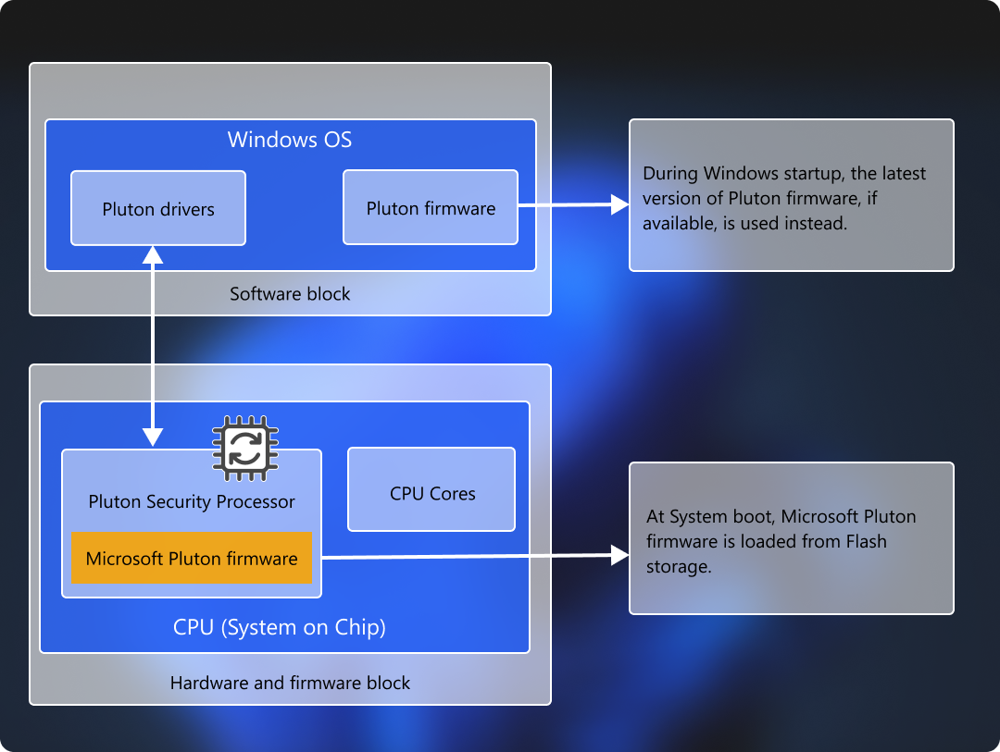
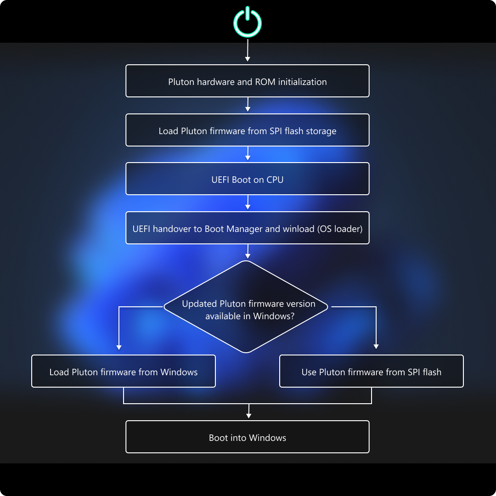

# Microsoft Pluton security processor

Microsoft Pluton security processor is a chip-to-cloud security technology built with [Zero Trust](/security/zero-trust/zero-trust-overview) principles at the core. Microsoft Pluton provides hardware-based root of trust, secure identity, secure attestation, and cryptographic services. Pluton technology is a combination of a secure subsystem, which is part of the System on Chip (SoC) and Microsoft authored software that runs on this integrated secure subsystem.

Microsoft Pluton is currently available on devices with AMD Ryzen&reg; 6000, 7000, 8000, Ryzen AI and Qualcomm Snapdragon&reg; 8cx Gen 3 and Snapdragon X series processors. Microsoft Pluton can be enabled on devices with Pluton capable processors running Windows 11, version 22H2 and later.

## What is Microsoft Pluton?

Designed by Microsoft and built by silicon partners, Microsoft Pluton is a secure crypto-processor built into the CPU for security at the core to ensure code integrity and the latest protection with updates delivered by Microsoft through Windows Update. Pluton protects credentials, identities, personal data, and encryption keys. Information is significantly harder to be removed even if an attacker installs malware or has complete physical possession of the PC.

Microsoft Pluton is designed to provide the functionality of the Trusted Platform Module (TPM) and deliver other security functionality beyond what is possible with the TPM 2.0 specification, and allows for other Pluton firmware and OS features to be delivered over time via Windows Update. For more information, see [Microsoft Pluton as TPM](pluton-as-tpm.md).

Pluton is built on proven technology used in Xbox and Azure Sphere, and provides hardened integrated security capabilities to Windows 11 devices in collaboration with leading silicon partners. For more information, see [Meet the Microsoft Pluton processor – The security chip designed for the future of Windows PCs](https://www.microsoft.com/security/blog/2020/11/17/meet-the-microsoft-pluton-processor-the-security-chip-designed-for-the-future-of-windows-pcs/).

## How can Pluton help customers?

Pluton is built with the goal of providing customers with better end-to-end security experiences. It does so by doing three things:

1. **Zero-trust security and reliability**: Customer security scenarios often span devices and cloud services. Windows PCs and services like Microsoft Entra and Intune need to work harmoniously together to provide frictionless security. Pluton is designed, built and maintained in close collaboration with teams across Microsoft to ensure that customers get both high security and reliability.
1. **Innovation**: Pluton platform and the functionality it provides is informed by customer feedback and Microsoft’s threat intelligence. As an example, Pluton platforms in 2024 AMD and Intel systems will start to use a Rust-based firmware foundation given the importance of memory safety.
1. **Continuous improvement**: Pluton platform supports loading new firmware delivered through operating system updates. This functionality is supported alongside the typical mechanism of UEFI capsule updates that update the Pluton firmware that is resident on the system’s SPI flash and loaded during early system boot. The additional support for dynamically loading valid new Pluton firmware through operating system updates facilitates continuous improvements both for bug fixes and new features.
   
### A practical example: zero-trust security with device-based conditional access policies

An increasingly important zero-trust workflow is conditional access – gating access to resources like Sharepoint documents based on verifying whether requests are coming from a valid, healthy source. Microsoft Intune, for example, supports different workflows for conditional access including [device-based conditional access](/mem/intune/protect/create-conditional-access-intune) which allows organizations to set policies that ensure that managed devices are healthy and compliant before granting access to the organization’s apps and services. 

To ensure that Intune gets an accurate picture about the device’s health as part of enforcing these policies, ideally it has tamper-resistant logs on the state of the relevant security capabilities. This is where hardware security is critical as any malicious software running on the device could attempt to provide false signals to the service. One of the core benefits of a hardware security technology like the TPM, is that it has a tamper-resistant log of the state of the system. Services can cryptographically validate that logs and the associated system state reported by the TPM truly come from the TPM. 

For the end-to-end scenario to be truly successful at scale, the hardware-based security is not enough. Since access to enterprise assets is being gated based on security settings that are being reported by the TPM logs, it is critical that these logs are available reliably. Zero-trust security essentially requires high reliability. 

With Pluton, when it is configured as the TPM for the system, customers using conditional access get the benefits of Pluton’s security architecture and implementation with the reliability that comes from the tight integration and collaboration between Pluton and other Microsoft components and services.

## Microsoft Pluton security architecture overview

Pluton Security subsystem consists of the following layers:

| | Description |
|--|--|
| **Hardware** | Pluton Security Processor is a secure element tightly integrated into the SoC subsystem. It provides a trusted execution environment while delivering cryptographic services required for protecting sensitive resources and critical items like keys, data, etc. |
| **Firmware** | Microsoft authorized firmware provides required secure features and functionality, and exposes interfaces that operating system software and applications can use to interact with Pluton. The firmware is stored in the flash storage available on the motherboard. When the system boots, the firmware is loaded as a part of Pluton Hardware initialization. During Windows startup, a copy of this firmware (or the latest firmware obtained from Windows Update, if available) is loaded in the operating system. For more information, see [Firmware load flow](#firmware-load-flow) |
| **Software** | Operating system drivers and applications available to an end user to allow seamless usage of the hardware capabilities provided by the Pluton security subsystem. |

## Firmware load flow

When the system boots, Pluton hardware initialization is performed by loading the Pluton firmware from the Serial Peripheral Interface (SPI) flash storage available on the motherboard. During Windows startup however, the latest version of the Pluton firmware is used by the operating system. If newer firmware isn't available, Windows uses the firmware that was loaded during the hardware initialization. This diagram illustrates this process:

[!INCLUDE [microsoft-pluton](../../../../includes/licensing/microsoft-pluton.md)]

## Related articles

[Microsoft Pluton as TPM](pluton-as-tpm.md)
