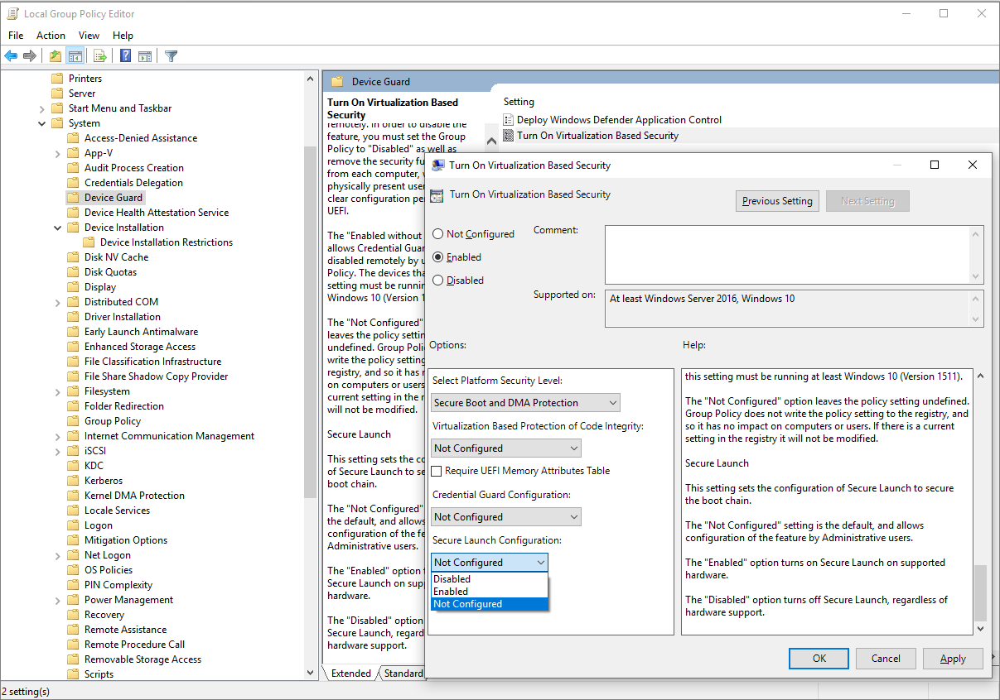

# System Guard Secure Launch and SMM protection

This topic explains how to configure [System Guard Secure Launch and System Management Mode (SMM) protection](how-hardware-based-root-of-trust-helps-protect-windows.md) to improve the startup security of Windows 10 and Windows 11 devices. The information below is presented from a client perspective.

> [!NOTE]
> System Guard Secure Launch feature requires a supported processor. For more information, see [System requirements for System Guard](how-hardware-based-root-of-trust-helps-protect-windows.md#system-requirements-for-system-guard).

## How to enable System Guard Secure Launch

You can enable System Guard Secure Launch by using any of these options:

- [Mobile Device Management (MDM)](#mobile-device-management)
- [Group Policy](#group-policy)
- [Windows Security settings](#windows-security)
- [Registry](#registry)

### Mobile Device Management

System Guard Secure Launch can be configured for Mobile Device Management (MDM) by using DeviceGuard policies in the Policy CSP, [DeviceGuard/ConfigureSystemGuardLaunch](/windows/client-management/mdm/policy-csp-deviceguard#deviceguard-configuresystemguardlaunch).

### Group Policy

1. Click **Start** > type and then click **Edit group policy**.

2. Click **Computer Configuration** > **Administrative Templates** > **System** > **Device Guard** > **Turn On Virtualization Based Security** > **Secure Launch Configuration**.

    

### Windows Security

Click **Start** > **Settings** > **Update & Security** > **Windows Security** > **Open Windows Security** > **Device security** > **Core isolation** > **Firmware protection**.

  

### Registry

1. Open Registry editor.

2. Click **HKEY_LOCAL_MACHINE** > **SYSTEM** > **CurrentControlSet** > **Control** > **DeviceGuard** > **Scenarios**.

3. Right-click **Scenarios** > **New** > **Key** and name the new key **SystemGuard**.

4. Right-click **SystemGuard** > **New** > **DWORD (32-bit) Value** and name the new DWORD **Enabled**.

5. Double-click **Enabled**, change the value to **1**, and click **OK**.

    

## How to verify System Guard Secure Launch is configured and running

To verify that Secure Launch is running, use System Information (MSInfo32). Click **Start**, search for **System Information**, and look under **Virtualization-based Security Services Running** and **Virtualization-based Security Services Configured**.

> [!NOTE]
> To enable System Guard Secure launch, the platform must meet all the baseline requirements for [System Guard](how-hardware-based-root-of-trust-helps-protect-windows.md), [Device Guard](../application-security/application-control/introduction-to-device-guard-virtualization-based-security-and-windows-defender-application-control.md), [Credential Guard](../identity-protection/credential-guard/credential-guard-requirements.md), and [Virtualization Based Security](/windows-hardware/design/device-experiences/oem-vbs).

> [!NOTE]
> For more information around AMD processors, see [Microsoft Security Blog: Force firmware code to be measured and attested by Secure Launch on Windows 10](https://www.microsoft.com/security/blog/2020/09/01/force-firmware-code-to-be-measured-and-attested-by-secure-launch-on-windows-10/).
