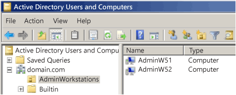
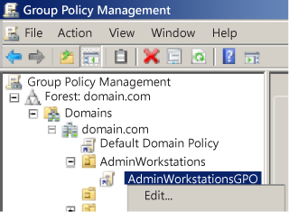
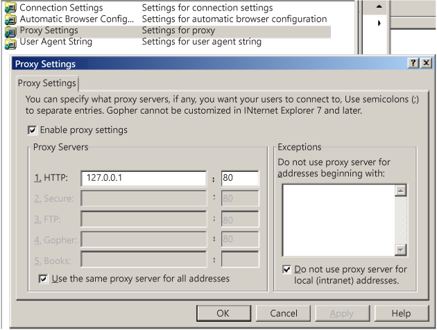
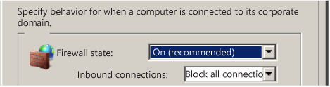
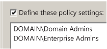
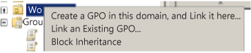

# Active Directory Accounts

**Applies to**
-   Windows Server 2016

Windows Server operating systems are installed with default local accounts. In addition, you can create user accounts to meet the requirements of your organization. This reference topic for the IT professional describes the Windows Server default local accounts that are stored locally on the domain controller and are used in Active Directory.

This reference topic does not describe default local user accounts for a member or standalone server or for a Windows client. For more information, see [Local Accounts](local-accounts.md).

## About this topic

This topic describes the following:

-   [Default local accounts in Active Directory](#sec-ad-default-accounts)

    -   [Administrator account](#sec-administrator)

    -   [Guest account](#sec-guest)

    -   [HelpAssistant account (installed with a Remote Assistance session)](#sec-helpassistant)

    -   [KRBTGT account](#sec-krbtgt)

-   [Settings for default local accounts in Active Directory](#sec-account-settings)

-   [Manage default local accounts in Active Directory](#sec-manage-local-accounts)

-   [Restrict and protect sensitive domain accounts](#sec-restrict-protect-accounts)

    -   [Separate administrator accounts from user accounts](#task1-separate-admin-accounts)

    -   [Create dedicated workstation hosts without Internet and email access](#task2-admin-workstations)

    -   [Restrict administrator logon access to servers and workstations](#task3-restrict-admin-logon)

    -   [Disable the account delegation right for administrator accounts](#task4-disable-account-delegation)

-   [Secure and manage domain controllers](#sec-secure-manage-dcs)

## Default local accounts in Active Directory

Default local accounts are built-in accounts that are created automatically when a Windows Server domain controller is installed and the domain is created. These default local accounts have counterparts in Active Directory. These accounts also have domain-wide access and are completely separate from the default local user accounts for a member or standalone server.

You can assign rights and permissions to default local accounts on a particular domain controller, and only on that domain controller. These accounts are local to the domain. After the default local accounts are installed, they are stored in the Users container in Active Directory Users and Computers. It is a best practice to keep the default local accounts in the User container and not attempt to move these accounts, for example, to a different organizational unit (OU).

The default local accounts in the Users container include: Administrator, Guest, and KRBTGT. The HelpAssistant account is installed when a Remote Assistance session is established. The following sections describe the default local accounts and their use in Active Directory.

Primarily, default local accounts do the following:

-   Let the domain represent, identify, and authenticate the identity of the user that is assigned to the account by using unique credentials (user name and password). It is a best practice to assign each user to a single account to ensure maximum security. Multiple users are not allowed to share one account. A user account lets a user sign in to computers, networks, and domains with a unique identifier that can be authenticated by the computer, network, or domain.

-   Authorize (grant or deny) access to resources. After a user’s credentials have been authenticated, the user is authorized to access the network and domain resources based on the user’s explicitly assigned rights on the resource.

-   Audit the actions that are carried out on a user account.

In Active Directory, default local accounts are used by administrators to manage domain and member servers directly and from dedicated administrative workstations. Active Directory accounts provide access to network resources. Active Directory User accounts and Computer accounts can represent a physical entity, such as a computer or person, or act as dedicated service accounts for some applications.

Each default local account is automatically assigned to a security group that is preconfigured with the appropriate rights and permissions to perform specific tasks. Active Directory security groups collect user accounts, computer accounts, and other groups into manageable units. For more information, see [Active Directory Security Groups](active-directory-security-groups.md).

On an Active Directory domain controller, each default local account is referred to as a security principal. A security principal is a directory object that is used to secure and manage Active Directory services that provide access to domain controller resources. A security principal includes objects such as user accounts, computer accounts, security groups, or the threads or processes that run in the security context of a user or computer account. For more information, see [Security Principals](security-principals.md).

A security principal is represented by a unique security identifier (SID).The SIDs that are related to each of the default local accounts in Active Directory are described in the sections below.

Some of the default local accounts are protected by a background process that periodically checks and applies a specific security descriptor. A security descriptor is a data structure that contains security information that is associated with a protected object. This process ensures that any successful unauthorized attempt to modify the security descriptor on one of the default local accounts or groups is overwritten with the protected settings.

This security descriptor is present on the AdminSDHolder object. If you want to modify the permissions on one of the service administrator groups or on any of its member accounts, you must modify the security descriptor on the AdminSDHolder object to ensure that it is applied consistently. Be careful when making these modifications, because you are also changing the default settings that are applied to all of your protected accounts.

## Administrator account

The Administrator account is a default account that is used in all versions of the Windows operating system on every computer and device. The Administrator account is used by the system administrator for tasks that require administrative credentials. This account cannot be deleted or locked out, but the account can be renamed or disabled.

The Administrator account gives the user complete access (Full Control permissions) of the files, directories, services, and other resources that are on that local server. The Administrator account can be used to create local users, and assign user rights and access control permissions. Administrator can also be used to take control of local resources at any time simply by changing the user rights and permissions. Although files and directories can be protected from the Administrator account temporarily, the Administrator account can take control of these resources at any time by changing the access permissions.

**Account group membership**

The Administrator account has membership in the default security groups as described in the Administrator account attributes table later in this topic.

The security groups ensure that you can control administrator rights without having to change each Administrator account. In most instances, you do not have to change the basic settings for this account. However, you might have to change its advanced settings, such as membership in particular groups.

**Security considerations**

After installation of the server operating system, your first task is to set up the Administrator account properties securely. This includes setting up an especially long, strong password, and securing the Remote control and Remote Desktop Services profile settings.

The Administrator account can also be disabled when it is not required. Renaming or disabling the Administrator account makes it more difficult for malicious users to try to gain access to the account. However, even when the Administrator account is disabled, it can still be used to gain access to a domain controller by using safe mode.

On a domain controller, the Administrator account becomes the Domain Admin account. The Domain Admin account is used to sign in to the domain controller and this account requires a strong password. The Domain Admin account gives you access to domain resources.

**Note**  
When the domain controller is initially installed, you can sign in and use Server Manager to set up a local Administrator account, with the rights and permissions you want to assign. For example, you can use a local Administrator account to manage the operating system when you first install it. By using this approach, you can set up the operating system without getting locked out. Generally, you do not need to use the account after installation. You can only create local user accounts on the domain controller, before Active Directory Domain Services is installed, and not afterwards.

When Active Directory is installed on the first domain controller in the domain, the Administrator account is created for Active Directory. The Administrator account is the most powerful account in the domain. It is given domain-wide access and administrative rights to administer the computer and the domain, and it has the most extensive rights and permissions over the domain. The person who installs Active Directory Domain Services on the computer creates the password for this account during the installation.

**Administrator account attributes**

<table>
<colgroup>
<col width="50%" />
<col width="50%" />
</colgroup>
<thead>
<tr class="header">
<th>Attribute</th>
<th>Value</th>
</tr>
</thead>
<tbody>
<tr class="odd">
<td>
Well-Known SID/RID
</td>
<td>
S-1-5-&lt;domain&gt;-500
</td>
</tr>
<tr class="even">
<td>
Type
</td>
<td>
User
</td>
</tr>
<tr class="odd">
<td>
Default container
</td>
<td>
CN=Users, DC=&lt;domain&gt;, DC=
</td>
</tr>
<tr class="even">
<td>
Default members
</td>
<td>
N/A
</td>
</tr>
<tr class="odd">
<td>
Default member of
</td>
<td>
Administrators, Domain Admins, Enterprise Administrators, Domain Users. Note that the Primary Group ID of all user accounts is Domain Users.

Group Policy Creator Owners, and Schema Admins in Active Directory

Domain Users group
</td>
</tr>
<tr class="even">
<td>
Protected by ADMINSDHOLDER?
</td>
<td>
Yes
</td>
</tr>
<tr class="odd">
<td>
Safe to move out of default container?
</td>
<td>
Yes
</td>
</tr>
<tr class="even">
<td>
Safe to delegate management of this group to non-service administrators?
</td>
<td>
No
</td>
</tr>
</tbody>
</table>

## Guest account

The Guest account is a default local account has limited access to the computer and is disabled by default. The Guest account cannot be deleted or disabled, and the account name cannot be changed. By default, the Guest account password is left blank. A blank password allows the Guest account to be accessed without requiring the user to enter a password.

The Guest account enables occasional or one-time users, who do not have an individual account on the computer, to sign in to the local server or domain with restricted rights and permissions. The Guest account can be enabled, and the password can be set up if needed, but only by a member of the Administrator group on the domain.

**Account group membership**

The Guest account has membership in the default security groups that are described in the following Guest account attributes table. By default, the Guest account is the only member of the default Guests group, which lets a user sign in to a server, and the Domain Guests global group, which lets a user sign in to a domain.

A member of the Administrators group or Domain Admins group can set up a user with a Guest account on one or more computers.

**Security considerations**

Because the Guest account can provide anonymous access, it is a security risk. It also has a well-known SID. For this reason, it is a best practice to leave the Guest account disabled, unless its use is required and then only with restricted rights and permissions for a very limited period of time.

When the Guest account is required, an Administrator on the domain controller is required to enable the Guest account. The Guest account can be enabled without requiring a password, or it can be enabled with a strong password. The Administrator also grants restricted rights and permissions for the Guest account. To help prevent unauthorized access:

-   Do not grant the Guest account the [Shut down the system](/windows/device-security/security-policy-settings/shut-down-the-system) user right. When a computer is shutting down or starting up, it is possible that a Guest user or anyone with local access, such as a malicious user, could gain unauthorized access to the computer.

-   Do not provide the Guest account with the ability to view the event logs. After the Guest account is enabled, it is a best practice to monitor this account frequently to ensure that other users cannot use services and other resources, such as resources that were unintentionally left available by a previous user.

-   Do not use the Guest account when the server has external network access or access to other computers.

If you decide to enable the Guest account, be sure to restrict its use and to change the password regularly. As with the Administrator account, you might want to rename the account as an added security precaution.

In addition, an administrator is responsible for managing the Guest account. The administrator monitors the Guest account, disables the Guest account when it is no longer in use, and changes or removes the password as needed.

For details about the Guest account attributes, see the following table.

**Guest account attributes**

<table>
<colgroup>
<col width="50%" />
<col width="50%" />
</colgroup>
<thead>
<tr class="header">
<th>Attribute</th>
<th>Value</th>
</tr>
</thead>
<tbody>
<tr class="odd">
<td>
Well-Known SID/RID
</td>
<td>
S-1-5-&lt;domain&gt;-501
</td>
</tr>
<tr class="even">
<td>
Type
</td>
<td>
User
</td>
</tr>
<tr class="odd">
<td>
Default container
</td>
<td>
CN=Users, DC=&lt;domain&gt;, DC=
</td>
</tr>
<tr class="even">
<td>
Default members
</td>
<td>
None
</td>
</tr>
<tr class="odd">
<td>
Default member of
</td>
<td>
Guests, Domain Guests
</td>
</tr>
<tr class="even">
<td>
Protected by ADMINSDHOLDER?
</td>
<td>
No
</td>
</tr>
<tr class="odd">
<td>
Safe to move out of default container?
</td>
<td>
Can be moved out, but we do not recommend it.
</td>
</tr>
<tr class="even">
<td>
Safe to delegate management of this group to non-Service admins?
</td>
<td>
No
</td>
</tr>
</tbody>
</table>

## HelpAssistant account (installed with a Remote Assistance session)

The HelpAssistant account is a default local account that is enabled when a Remote Assistance session is run. This account is automatically disabled when no Remote Assistance requests are pending.

HelpAssistant is the primary account that is used to establish a Remote Assistance session. The Remote Assistance session is used to connect to another computer running the Windows operating system, and it is initiated by invitation. For solicited remote assistance, a user sends an invitation from their computer, through e-mail or as a file, to a person who can provide assistance. After the user’s invitation for a Remote Assistance session is accepted, the default HelpAssistant account is automatically created to give the person who provides assistance limited access to the computer. The HelpAssistant account is managed by the Remote Desktop Help Session Manager service.

**Security considerations**

The SIDs that pertain to the default HelpAssistant account include:

-   SID: S-1-5-&lt;domain&gt;-13, display name Terminal Server User. This group includes all users who sign in to a server with Remote Desktop Services enabled. Note that, in Windows Server 2008, Remote Desktop Services are called Terminal Services.

-   SID: S-1-5-&lt;domain&gt;-14, display name Remote Interactive Logon. This group includes all users who connect to the computer by using a remote desktop connection. This group is a subset of the Interactive group. Access tokens that contain the Remote Interactive Logon SID also contain the Interactive SID.

For the Windows Server operating system, Remote Assistance is an optional component that is not installed by default. You must install Remote Assistance before it can be used.

For details about the HelpAssistant account attributes, see the following table.

**HelpAssistant account attributes**

<table>
<colgroup>
<col width="50%" />
<col width="50%" />
</colgroup>
<thead>
<tr class="header">
<th>Attribute</th>
<th>Value</th>
</tr>
</thead>
<tbody>
<tr class="odd">
<td>
Well-Known SID/RID
</td>
<td>
S-1-5-&lt;domain&gt;-13 (Terminal Server User), S-1-5-&lt;domain&gt;-14 (Remote Interactive Logon)
</td>
</tr>
<tr class="even">
<td>
Type
</td>
<td>
User
</td>
</tr>
<tr class="odd">
<td>
Default container
</td>
<td>
CN=Users, DC=&lt;domain&gt;, DC=
</td>
</tr>
<tr class="even">
<td>
Default members
</td>
<td>
None
</td>
</tr>
<tr class="odd">
<td>
Default member of
</td>
<td>
Domain Guests

Guests
</td>
</tr>
<tr class="even">
<td>
Protected by ADMINSDHOLDER?
</td>
<td>
No
</td>
</tr>
<tr class="odd">
<td>
Safe to move out of default container?
</td>
<td>
Can be moved out, but we do not recommend it.
</td>
</tr>
<tr class="even">
<td>
Safe to delegate management of this group to non-Service admins?
</td>
<td>
No
</td>
</tr>
</tbody>
</table>

## KRBTGT account

The KRBTGT account is a local default account that acts as a service account for the Key Distribution Center (KDC) service. This account cannot be deleted, and the account name cannot be changed. The KRBTGT account cannot be enabled in Active Directory.

KRBTGT is also the security principal name used by the KDC for a Windows Server domain, as specified by RFC 4120. The KRBTGT account is the entity for the KRBTGT security principal, and it is created automatically when a new domain is created.

Windows Server Kerberos authentication is achieved by the use of a special Kerberos ticket-granting ticket (TGT) enciphered with a symmetric key. This key is derived from the password of the server or service to which access is requested. The TGT password of the KRBTGT account is known only by the Kerberos service. In order to request a session ticket, the TGT must be presented to the KDC. The TGT is issued to the Kerberos client from the KDC.

### KRBTGT account maintenance considerations

A strong password is assigned to the KRBTGT and trust accounts automatically. Like any privileged service accounts, organizations should change these passwords on a regular schedule. The password for the KDC account is used to derive a secret key for encrypting and decrypting the TGT requests that are issued. The password for a domain trust account is used to derive an inter-realm key for encrypting referral tickets.

Resetting the password requires you either to be a member of the Domain Admins group, or to have been delegated with the appropriate authority. In addition, you must be a member of the local Administrators group, or you must have been delegated the appropriate authority.

After you reset the KRBTGT password, ensure that event ID 6 in the (Kerberos) Key-Distribution-Center event source is written to the System event log.

### Security considerations

It is also a best practice to reset the KRBTGT account password to ensure that a newly restored domain controller does not replicate with a compromised domain controller. In this case, in a large forest recovery that is spread across multiple locations, you cannot guarantee that all domain controllers are shut down, and if they are shut down, they cannot be rebooted again before all of the appropriate recovery steps have been undertaken. After you reset the KRBTGT account, another domain controller cannot replicate this account password by using an old password.

An organization suspecting domain compromise of the KRBTGT account should consider the use of professional incident response services. The impact to restore the ownership of the account is domain-wide and labor intensive an should be undertaken as part of a larger recovery effort.

The KRBTGT password is the key from which all trust in Kerberos chains up to. Resetting the KRBTGT password is similar to renewing the root CA certificate with a new key and immediately not trusting the old key, resulting in almost all subsequent Kerberos operations will be affected.

For all account types (users, computers, and services)

-   All the TGTs that are already issued and distributed will be invalid because the DCs will reject them. These tickets are encrypted with the KRBTGT so any DC can validate them. When the password changes, the tickets become invalid.

-   All currently authenticated sessions that logged on users have established (based on their service tickets) to a resource (such as a file share, SharePoint site, or Exchange server) are good until the service ticket is required to re-authenticate.

-   NTLM authenticated connections are not affected

Because it is impossible to predict the specific errors that will occur for any given user in a production operating environment, you must assume all computers and users will be affected.

**Important**  
Rebooting a computer is the only reliable way to recover functionality as this will cause both the computer account and user accounts to log back in again. Logging in again will request new TGTs that are valid with the new KRBTGT, correcting any KRBTGT related operational issues on that computer.

For information about how to help mitigate the risks associated with a potentially compromised KRBTGT account, see [KRBTGT Account Password Reset Scripts now available for customers](https://blogs.microsoft.com/cybertrust/2015/02/11/krbtgt-account-password-reset-scripts-now-available-for-customers/).

### Read-only domain controllers and the KRBTGT account

Windows Server 2008 introduced the read-only domain controller (RODC). The RODC is advertised as the Key Distribution Center (KDC) for the branch office. The RODC uses a different KRBTGT account and password than the KDC on a writable domain controller when it signs or encrypts ticket-granting ticket (TGT) requests. After an account is successfully authenticated, the RODC determines if a user's credentials or a computer's credentials can be replicated from the writable domain controller to the RODC by using the Password Replication Policy.

After the credentials are cached on the RODC, the RODC can accept that user's sign-in requests until the credentials change. When a TGT is signed with the KRBTGT account of the RODC, the RODC recognizes that it has a cached copy of the credentials. If another domain controller signs the TGT, the RODC forwards requests to a writable domain controller.

### KRBTGT account attributes

For details about the KRBTGT account attributes, see the following table.

<table>
<colgroup>
<col width="50%" />
<col width="50%" />
</colgroup>
<thead>
<tr class="header">
<th>Attribute</th>
<th>Value</th>
</tr>
</thead>
<tbody>
<tr class="odd">
<td>
Well-Known SID/RID
</td>
<td>
S-1-5-&lt;domain&gt;-502
</td>
</tr>
<tr class="even">
<td>
Type
</td>
<td>
User
</td>
</tr>
<tr class="odd">
<td>
Default container
</td>
<td>
CN=Users, DC=&lt;domain&gt;, DC=
</td>
</tr>
<tr class="even">
<td>
Default members
</td>
<td>
None
</td>
</tr>
<tr class="odd">
<td>
Default member of
</td>
<td>
Domain Users group. Note that the Primary Group ID of all user accounts is Domain Users.
</td>
</tr>
<tr class="even">
<td>
Protected by ADMINSDHOLDER?
</td>
<td>
Yes
</td>
</tr>
<tr class="odd">
<td>
Safe to move out of default container?
</td>
<td>
Can be moved out, but we do not recommend it.
</td>
</tr>
<tr class="even">
<td>
Safe to delegate management of this group to non-Service admins?
</td>
<td>
No
</td>
</tr>
</tbody>
</table>

## Settings for default local accounts in Active Directory

Each default local account in Active Directory has a number of account settings that you can use to configure password settings and security-specific information, as described in the following table.

**Settings for default local accounts in Active Directory**

<table>
<colgroup>
<col width="50%" />
<col width="50%" />
</colgroup>
<thead>
<tr class="header">
<th>Account settings</th>
<th>Description</th>
</tr>
</thead>
<tbody>
<tr class="odd">
<td>
User must change password at next logon
</td>
<td>
Forces a password change the next time that the user logs signs in to the network. Use this option when you want to ensure that the user is the only person to know his or her password.
</td>
</tr>
<tr class="even">
<td>
User cannot change password
</td>
<td>
Prevents the user from changing the password. Use this option when you want to maintain control over a user account, such as for a Guest or temporary account.
</td>
</tr>
<tr class="odd">
<td>
Password never expires
</td>
<td>
Prevents a user password from expiring. It is a best practice to enable this option with service accounts and to use strong passwords.
</td>
</tr>
<tr class="even">
<td>
Store passwords using reversible encryption
</td>
<td>
Provides support for applications that use protocols requiring knowledge of the plaintext form of the user’s password for authentication purposes.

This option is required when using Challenge Handshake Authentication Protocol (CHAP) in Internet Authentication Services (IAS), and when using digest authentication in Internet Information Services (IIS).
</td>
</tr>
<tr class="odd">
<td>
Account is disabled
</td>
<td>
Prevents the user from signing in with the selected account. As an administrator, you can use disabled accounts as templates for common user accounts.
</td>
</tr>
<tr class="even">
<td>
Smart card is required for interactive logon
</td>
<td>
Requires that a user has a smart card to sign on to the network interactively. The user must also have a smart card reader attached to their computer and a valid personal identification number (PIN) for the smart card.

When this attribute is applied on the account, the effect is as follows:

<ul>
<li>
The attribute only restricts initial authentication for interactive logon and Remote Desktop logon. When interactive or Remote Desktop logon requires a subsequent network logon, such as with a domain credential, an NT Hash provided by the domain controller is used to complete the smartcard authentication process
</li>
<li>
Each time the attribute is enabled on an account, the account’s current password hash value is replaced with a 128-bit random number. This invalidates the use of any previously configured passwords for the account. The value does not change after that unless a new password is set or the attribute is disabled and re-enabled.
</li>
<li>
Accounts with this attribute cannot be used to start services or run scheduled tasks.
</li>
</ul></td>
</tr>
<tr class="odd">
<td>
Account is trusted for delegation
</td>
<td>
Lets a service running under this account perform operations on behalf of other user accounts on the network. A service running under a user account (also known as a service account) that is trusted for delegation can impersonate a client to gain access to resources, either on the computer where the service is running or on other computers. For example, in a forest that is set to the Windows Server 2003 functional level, this setting is found on the <strong>Delegation</strong> tab. It is available only for accounts that have been assigned service principal names (SPNs), which are set by using the <strong>setspn</strong> command from Windows Support Tools. This setting is security-sensitive and should be assigned cautiously.
</td>
</tr>
<tr class="even">
<td>
Account is sensitive and cannot be delegated
</td>
<td>
Gives control over a user account, such as for a Guest account or a temporary account. This option can be used if this account cannot be assigned for delegation by another account.
</td>
</tr>
<tr class="odd">
<td>
Use DES encryption types for this account
</td>
<td>
Provides support for the Data Encryption Standard (DES). DES supports multiple levels of encryption, including Microsoft Point-to-Point Encryption (MPPE) Standard (40-bit and 56-bit), MPPE standard (56-bit), MPPE Strong (128-bit), Internet Protocol security (IPSec) DES (40-bit), IPSec 56-bit DES, and IPSec Triple DES (3DES).

<strong>Note</strong> 
DES is not enabled by default in Windows Server operating systems starting with Windows Server 2008 R2, nor in Windows client operating systems starting with Windows 7. For these operating systems, computers will not use DES-CBC-MD5 or DES-CBC-CRC cipher suites by default. If your environment requires DES, then this setting might affect compatibility with client computers or services and applications in your environment. For more information, see <a href="http://blogs.technet.com/b/askds/archive/2010/10/19/hunting-down-des-in-order-to-securely-deploy-kerberos.aspx" data-raw-source="[Hunting down DES in order to securely deploy Kerberos](http://blogs.technet.com/b/askds/archive/2010/10/19/hunting-down-des-in-order-to-securely-deploy-kerberos.aspx)">Hunting down DES in order to securely deploy Kerberos</a>.

</td>
</tr>
<tr class="even">
<td>
Do not require Kerberos preauthentication
</td>
<td>
Provides support for alternate implementations of the Kerberos protocol. Because preauthentication provides additional security, use caution when enabling this option. Note that domain controllers running Windows 2000 or Windows Server 2003 can use other mechanisms to synchronize time.
</td>
</tr>
</tbody>
</table>

## Manage default local accounts in Active Directory

After the default local accounts are installed, these accounts reside in the Users container in Active Directory Users and Computers. Default local accounts can be created, disabled, reset, and deleted by using the Active Directory Users and Computers Microsoft Management Console (MMC) and by using command-line tools.

You can use Active Directory Users and Computers to assign rights and permissions on a given local domain controller, and that domain controller only, to limit the ability of local users and groups to perform certain actions. A right authorizes a user to perform certain actions on a computer, such as backing up files and folders or shutting down a computer. In contrast, an access permission is a rule that is associated with an object, usually a file, folder, or printer, that regulates which users can have access to the object and in what manner.

For more information about creating and managing local user accounts in Active Directory, see [Manage Local Users](https://technet.microsoft.com/library/cc731899.aspx).

You can also use Active Directory Users and Computers on a domain controller to target remote computers that are not domain controllers on the network.

You can obtain recommendations from Microsoft for domain controller configurations that you can distribute by using the Security Compliance Manager (SCM) tool. For more information, see [Microsoft Security Compliance Manager](https://technet.microsoft.com/library/cc677002.aspx).

Some of the default local user accounts are protected by a background process that periodically checks and applies a specific security descriptor, which is a data structure that contains security information that is associated with a protected object. This security descriptor is present on the AdminSDHolder object.

This means, when you want to modify the permissions on a service administrator group or on any of its member accounts, you are also required to modify the security descriptor on the AdminSDHolder object. This approach ensures that the permissions are applied consistently. Be careful when you make these modifications, because this action can also affect the default settings that are applied to all of your protected administrative accounts.

## Restrict and protect sensitive domain accounts

Restricting and protecting domain accounts in your domain environment requires you to adopt and implement the following best practices approach:

-   Strictly limit membership to the Administrators, Domain Admins, and Enterprise Admins groups.

-   Stringently control where and how domain accounts are used.

Member accounts in the Administrators, Domain Admins, and Enterprise Admins groups in a domain or forest are high-value targets for malicious users. It is a best practice to strictly limit membership to these administrator groups to the smallest number of accounts in order to limit any exposure. Restricting membership in these groups reduces the possibility that an administrator might unintentionally misuse these credentials and create a vulnerability that malicious users can exploit.

Moreover, it is a best practice to stringently control where and how sensitive domain accounts are used. Restrict the use of Domain Admins accounts and other administrator accounts to prevent them from being used to sign in to management systems and workstations that are secured at the same level as the managed systems. When administrator accounts are not restricted in this manner, each workstation from which a domain administrator signs in provides another location that malicious users can exploit.

Implementing these best practices is separated into the following tasks:

-   [Separate administrator accounts from user accounts](#task1-separate-admin-accounts)

-   [Create dedicated workstation hosts for administrators](#task2-admin-workstations)

-   [Restrict administrator logon access to servers and workstations](#task3-restrict-admin-logon)

-   [Disable the account delegation right for administrator accounts](#task4-disable-account-delegation)

Note that, to provide for instances where integration challenges with the domain environment are expected, each task is described according to the requirements for a minimum, better, and ideal implementation. As with all significant changes to a production environment, ensure that you test these changes thoroughly before you implement and deploy them. Then stage the deployment in a manner that allows for a rollback of the change in case technical issues occur.

### Separate administrator accounts from user accounts

Restrict Domain Admins accounts and other sensitive accounts to prevent them from being used to sign in to lower trust servers and workstations. Restrict and protect administrator accounts by segregating administrator accounts from standard user accounts, by separating administrative duties from other tasks, and by limiting the use of these accounts. Create dedicated accounts for administrative personnel who require administrator credentials to perform specific administrative tasks, and then create separate accounts for other standard user tasks, according to the following guidelines:

-   **Privileged account**. Allocate administrator accounts to perform the following administrative duties only:

    -   **Minimum**. Create separate accounts for domain administrators, enterprise administrators, or the equivalent with appropriate administrator rights in the domain or forest. Use accounts that have been granted sensitive administrator rights only to administer domain data and domain controllers.

    -   **Better**. Create separate accounts for administrators that have reduced administrative rights, such as accounts for workstation administrators, and accounts with user rights over designated Active Directory organizational units (OUs).

    -   **Ideal**. Create multiple, separate accounts for an administrator who has a variety of job responsibilities that require different trust levels. Set up each administrator account with significantly different user rights, such as for workstation administration, server administration and domain administration, to let the administrator sign in to given workstations, servers and domain controllers based strictly on his or her job responsibilities.

-   **Standard user account**. Grant standard user rights for standard user tasks, such as email, web browsing, and using line-of-business (LOB) applications. These accounts should not be granted administrator rights.

**Important**  
Ensure that sensitive administrator accounts cannot access email or browse the Internet as described in the following section.

### Create dedicated workstation hosts without Internet and email access

Administrators need to manage job responsibilities that require sensitive administrator rights from a dedicated workstation because they do not have easy physical access to the servers. A workstation that is connected to the Internet and has email and web browsing access is regularly exposed to compromise through phishing, downloading, and other types of Internet attacks. Because of these threats, it is a best practice to set these administrators up by using workstations that are dedicated to administrative duties only, and not provide access to the Internet, including email and web browsing. For more information, see [Separate administrator accounts from user accounts](#task1-separate-admin-accounts).

**Note**  
If the administrators in your environment can sign in locally to managed servers and perform all tasks without elevated rights or domain rights from their workstation, you can skip this task.

-   **Minimum**. Build dedicated administrative workstations and block Internet access on those workstations including web browsing and email. Use the following ways to block Internet access:

    -   Configure authenticating boundary proxy services, if they are deployed, to disallow administrator accounts from accessing the Internet.

    -   Configure boundary firewall or proxy services to disallow Internet access for the IP addresses that are assigned to dedicated administrative workstations.

    -   Block outbound access to the boundary proxy servers in the Windows Firewall.

    The instructions for meeting this minimum requirement are described in the following procedure.

-   **Better**. Do not grant administrators membership in the local Administrator group on the computer in order to restrict the administrator from bypassing these protections.

-   **Ideal**. Restrict workstations from having any network connectivity, except for the domain controllers and servers that the administrator accounts are used to manage. Alternately, use AppLocker application control policies to restrict all applications from running, except for the operating system and approved administrative tools and applications. For more information about AppLocker, see [AppLocker](/windows/device-security/applocker/applocker-overview).

The following procedure describes how to block Internet access by creating a Group Policy Object (GPO) that configures an invalid proxy address on administrative workstations. These instructions apply only to computers running Internet Explorer and other Windows components that use these proxy settings.

**Note**  
In this procedure, the workstations are dedicated to domain administrators. By simply modifying the administrator accounts to grant permission to administrators to sign in locally, you can create additional OUs to manage administrators that have fewer administrative rights to use the instructions described in the following procedure.

**To install administrative workstations in a domain and block Internet and email access (minimum)**

1.  As a domain administrator on a domain controller, open Active Directory Users and Computers, and create a new OU for administrative workstations.

2.  Create computer accounts for the new workstations.

    > **Note**&nbsp;&nbsp;You might have to delegate permissions to join computers to the domain if the account that joins the workstations to the domain does not already have them. For more information, see [Delegation of Administration in Active Directory](https://social.technet.microsoft.com/wiki/contents/articles/20292.delegation-of-administration-in-active-directory.aspx).

    

3.  Close Active Directory Users and Computers.

4.  Start the **Group Policy Management** Console (GPMC).

5.  Right-click the new OU, and &gt; **Create a GPO in this domain, and Link it here**.

    

6.  Name the GPO, and &gt; **OK**.

7.  Expand the GPO, right-click the new GPO, and &gt; **Edit**.

    

8.  Configure which members of accounts can log on locally to these administrative workstations as follows:

    1.  Navigate to Computer Configuration\\Policies\\Windows Settings\\Local Policies, and then click **User Rights Assignment**.

    2.  Double-click **Allow log on locally**, and then select the **Define these policy settings** check box.

    3.  Click **Add User or Group** &gt; **Browse**, type **Enterprise Admins**, and &gt; **OK**.

    4.  Click **Add User or Group** &gt; **Browse**, type **Domain Admins**, and &gt; **OK**.

        **Important**  
        These instructions assume that the workstation is to be dedicated to domain administrators.

    5.  Click **Add User or Group**, type **Administrators**, and &gt; **OK**.

        

9.  Configure the proxy configuration:

    1.  Navigate to User Configuration\\Policies\\Windows Settings\\Internet Explorer, and &gt; **Connection**.

    2.  Double-click **Proxy Settings**, select the **Enable proxy settings** check box, type **127.0.0.1** (the network Loopback IP address) as the proxy address, and &gt; **OK**.

        

10. Configure the loopback processing mode to enable the user Group Policy proxy setting to apply to all users on the computer as follows:

    1.  Navigate to Computer Configuration\\Policies\\Administrative Templates\\System, and &gt; **Group Policy**.

    2.  Double-click **User Group Policy loopback policy processing mode**, and &gt; **Enabled**.

    3.  Select **Merge Mode**, and &gt; **OK**.

11. Configure software updates as follows:

    1.  Navigate to Computer Configuration\\Policies\\Administrative Templates\\Windows Components, and then click **Windows Update**.

    2.  Configure Windows Update settings as described in the following table.

        <table>
        <colgroup>
        <col width="50%" />
        <col width="50%" />
        </colgroup>
        <tbody>
        <tr class="odd">
        <td>
<strong>Windows Update Setting</strong>
</td>
        <td>
<strong>Configuration</strong>
</td>
        </tr>
        <tr class="even">
        <td>
Allow Automatic Updates immediate installation
</td>
        <td>
Enabled
</td>
        </tr>
        <tr class="odd">
        <td>
Configure Automatic Updates
</td>
        <td>
Enabled 4 - Auto download and schedule the installation 0 - Every day 03:00
</td>
        </tr>
        <tr class="even">
        <td>
Enable Windows Update Power Management to automatically wake up the system to install scheduled updates
</td>
        <td>
Enabled
</td>
        </tr>
        <tr class="odd">
        <td>
Specify intranet Microsoft Update service location
</td>
        <td>
Enabled http://&lt;WSUSServername&gt; http://&lt;WSUSServername&gt; Where &lt;WSUSServername&gt; is the DNS name or IP address of the Windows Server Update Services (WSUS) in the environment.
</td>
        </tr>
        <tr class="even">
        <td>
Automatic Updates detection frequency
</td>
        <td>
6 hours
</td>
        </tr>
        <tr class="odd">
        <td>
Re-prompt for restart with scheduled installations
</td>
        <td>
1 minute
</td>
        </tr>
        <tr class="even">
        <td>
Delay restart for scheduled installations
</td>
        <td>
5 minutes
</td>
        </tr>
        </tbody>
        </table>

        > **Note**&nbsp;&nbsp;This step assumes that Windows Server Update Services (WSUS) is installed and configured in the environment. You can skip this step if you use another tool to deploy software updates. Also, if the public Microsoft Windows Update service only is used on the Internet, then these administrative workstations no longer receive updates.

12. Configure the inbound firewall to block all connections as follows:

    1.  Right-click **Windows Firewall with Advanced Security LDAP://path**, and &gt; **Properties**.

        

    2.  On each profile, ensure that the firewall is enabled and that inbound connections are set to **Block all connections**.

        

    3.  Click **OK** to complete the configuration.

13. Close the Group Policy Management Console.

14. Install the Windows operating system on the workstations, give each workstation the same names as the computer accounts assigned to them, and then join them to the domain.

### Restrict administrator logon access to servers and workstations

It is a best practice to restrict administrators from using sensitive administrator accounts to sign in to lower-trust servers and workstations. This restriction prevents administrators from inadvertently increasing the risk of credential theft by signing in to a lower-trust computer.

**Important**  
Ensure that you either have local access to the domain controller or that you have built at least one dedicated administrative workstation.

Restrict logon access to lower-trust servers and workstations by using the following guidelines:

-   **Minimum**. Restrict domain administrators from having logon access to servers and workstations. Before starting this procedure, identify all OUs in the domain that contain workstations and servers. Any computers in OUs that are not identified will not restrict administrators with sensitive accounts from signing-in to them.

-   **Better**. Restrict domain administrators from non-domain controller servers and workstations.

-   **Ideal**. Restrict server administrators from signing in to workstations, in addition to domain administrators.

**Note**  
For this procedure, do not link accounts to the OU that contain workstations for administrators that perform administration duties only, and do not provide Internet or email access. For more information, see [Create dedicated workstation hosts for administrators](#task2-admin-workstations)

**To restrict domain administrators from workstations (minimum)**

1.  As a domain administrator, open the Group Policy Management Console (GPMC).

2.  Open **Group Policy Management**, and expand *&lt;forest&gt;*\\Domains\\*&lt;domain&gt;*, and then expand to **Group Policy Objects**.

3.  Right-click **Group Policy Objects**, and &gt; **New**.

    

4.  In the **New GPO** dialog box, name the GPO that restricts administrators from signing in to workstations, and &gt; **OK**.

    

5.  Right-click **New GPO**, and &gt; **Edit**.

6.  Configure user rights to deny logon locally for domain administrators.

7.  Navigate to Computer Configuration\\Policies\\Windows Settings\\Local Policies, and then click **User Rights Assignment**, and perform the following:

    1.  Double-click **Deny logon locally**, and &gt; **Define these policy settings**.

    2.  Click **Add User or Group**, click **Browse**, type **Enterprise Admins**, and &gt; **OK**.

    3.  Click **Add User or Group**, click **Browse**, type **Domain Admins**, and &gt; **OK**.

        

        **Note**  
        You can optionally add any groups that contain server administrators who you want to restrict from signing in to workstations.

    4.  Click **OK** to complete the configuration.

8.  Configure the user rights to deny batch and service logon rights for domain administrators as follows:

    **Note**  
    Completing this step might cause issues with administrator tasks that run as scheduled tasks or services with accounts in the Domain Admins group. The practice of using domain administrator accounts to run services and tasks on workstations creates a significant risk of credential theft attacks and therefore should be replaced with alternative means to run scheduled tasks or services.

    1.  Double-click **Deny logon as a batch job**, and &gt; **Define these policy settings**.

    2.  Click **Add User or Group** &gt; **Browse**, type **Enterprise Admins**, and &gt; **OK**.

    3.  Click **Add User or Group** &gt; **Browse**, type **Domain Admins**, and &gt; **OK**.

        

        **Note**  
        You can optionally add any groups that contain server administrators who you want to restrict from signing in to workstations.

    4.  Double-click **Deny logon as a service**, and &gt; **Define these policy settings**.

    5.  Click **Add User or Group** &gt; **Browse**, type **Enterprise Admins**, and &gt; **OK**.

    6.  Click **Add User or Group** &gt; **Browse**, type **Domain Admins**, and &gt; **OK**.

        

        **Note**  
        You can optionally add any groups that contain server administrators who you want to restrict from signing in to workstations.

9.  Link the GPO to the first Workstations OU.

    Navigate to the *&lt;forest&gt;*\\Domains\\*&lt;domain&gt;*\\OU Path, and then:

    1.  Right-click the workstation OU, and then &gt; **Link an Existing GPO**.

        

    2.  Select the GPO that you just created, and &gt; **OK**.

        

10. Test the functionality of enterprise applications on workstations in the first OU and resolve any issues caused by the new policy.

11. Link all other OUs that contain workstations.

    However, do not create a link to the Administrative Workstation OU if it is created for administrative workstations that are dedicated to administration duties only, and that are without Internet or email access. For more information, see [Create dedicated workstation hosts for administrators](#task2-admin-workstations).

    **Important**  
    If you later extend this solution, do not deny logon rights for the **Domain Users** group. The **Domain Users** group includes all user accounts in the domain, including Users, Domain Administrators, and Enterprise Administrators.

### Disable the account delegation right for sensitive administrator accounts

Although user accounts are not marked for delegation by default, accounts in an Active Directory domain can be trusted for delegation. This means that a service or a computer that is trusted for delegation can impersonate an account that authenticates to them to access other resources across the network.

For sensitive accounts, such as those belonging to members of the Administrators, Domain Admins, or Enterprise Admins groups in Active Directory, delegation can present a substantial risk of rights escalation. For example, if an account in the Domain Admins group is used to sign in to a compromised member server that is trusted for delegation, that server can request access to resources in the context of the Domain Admins account, and escalate the compromise of that member server to a domain compromise.

It is a best practice to configure the user objects for all sensitive accounts in Active Directory by selecting the **Account is sensitive and cannot be delegated** check box under **Account options** to prevent these accounts from being delegated. For more information, see [Setting for default local accounts in Active Directory](#sec-account-settings).

As with any configuration change, test this enabled setting fully to ensure that it performs correctly before you implement it.

## Secure and manage domain controllers

It is a best practice to strictly enforce restrictions on the domain controllers in your environment. This ensures that the domain controllers:

1.  Run only required software

2.  Required software is regularly updated

3.  Are configured with the appropriate security settings

One aspect of securing and managing domain controllers is to ensure that the default local user accounts are fully protected. It is of primary importance to restrict and secure all sensitive domain accounts, as described in the preceding sections.

Because domain controllers store credential password hashes of all accounts in the domain, they are high-value targets for malicious users. When domain controllers are not well managed and secured by using restrictions that are strictly enforced, they can be compromised by malicious users. For example, a malicious user could steal sensitive domain administrator credentials from one domain controller, and then use these credentials to attack the domain and forest.

In addition, installed applications and management agents on domain controllers might provide a path for escalating rights that malicious users can use to compromise the management service or administrators of that service. The management tools and services, which your organization uses to manage domain controllers and their administrators, are equally important to the security of the domain controllers and the domain administrator accounts. Ensure that these services and administrators are fully secured with equal effort.

## See also

- [Security Principals](security-principals.md)

- [Access Control Overview](access-control.md)
