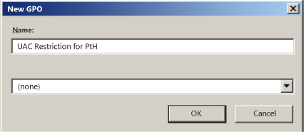
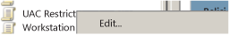
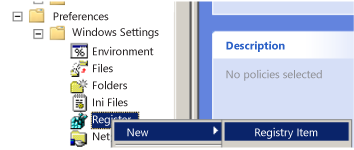

# Local Accounts

**Applies to**
-   Windows 10
-   Windows Server 2019
-   Windows Server 2016

This reference topic for IT professionals describes the default local user accounts for servers, including how to manage these built-in accounts on a member or standalone server. 

## About local user accounts

Local user accounts are stored locally on the server. These accounts can be assigned rights and permissions on a particular server, but on that server only. Local user accounts are security principals that are used to secure and manage access to the resources on a standalone or member server for services or users.

This topic describes the following:

-   [Default local user accounts](#sec-default-accounts)

    -   [Administrator account](#sec-administrator)

    -   [Guest Account](#sec-guest)

    -   [HelpAssistant account (installed by using a Remote Assistance session)](#sec-helpassistant)

    -   [DefaultAccount](#defaultaccount)

-   [Default local system accounts](#sec-localsystem)

-   [How to manage local accounts](#sec-manage-accounts)

    -   [Restrict and protect local accounts with administrative rights](#sec-restrict-protect-accounts)

    -   [Enforce local account restrictions for remote access](#sec-enforce-account-restrictions)

    -   [Deny network logon to all local Administrator accounts](#sec-deny-network-logon)

    -   [Create unique passwords for local accounts with administrative rights](#sec-create-unique-passwords)

For information about security principals, see [Security Principals](security-principals.md).

## Default local user accounts

The default local user accounts are built-in accounts that are created automatically when you install Windows. 

After Windows is installed, the default local user accounts cannot be removed or deleted. In addition, default local user accounts do not provide access to network resources.

Default local user accounts are used to manage access to the local server’s resources based on the rights and permissions that are assigned to the account. The default local user accounts, and the local user accounts that you create, are located in the Users folder. The Users folder is located in the Local Users and Groups folder in the local Computer Management Microsoft Management Console (MMC). Computer Management is a collection of administrative tools that you can use to manage a single local or remote computer. For more information, see [How to manage local accounts](#sec-manage-accounts) later in this topic.

Default local user accounts are described in the following sections.

### Administrator account

The default local Administrator account is a user account for the system administrator. Every computer has an Administrator account (SID S-1-5-*domain*-500, display name Administrator). The Administrator account is the first account that is created during the Windows installation.

The Administrator account has full control of the files, directories, services, and other resources on the local computer. The Administrator account can create other local users, assign user rights, and assign permissions. The Administrator account can take control of local resources at any time simply by changing the user rights and permissions.

The default Administrator account cannot be deleted or locked out, but it can be renamed or disabled.

In Windows 10 and Windows Server 20016, Windows setup disables the built-in Administrator account and creates another local account that is a member of the Administrators group. Members of the Administrators groups can run apps with elevated permissions without using the **Run as Administrator** option. Fast User Switching is more secure than using Runas or different-user elevation.  

**Account group membership**

By default, the Administrator account is installed as a member of the Administrators group on the server. It is a best practice to limit the number of users in the Administrators group because members of the Administrators group on a local server have Full Control permissions on that computer.

The Administrator account cannot be deleted or removed from the Administrators group, but it can be renamed.

**Security considerations**

Because the Administrator account is known to exist on many versions of the Windows operating system, it is a best practice to disable the Administrator account when possible to make it more difficult for malicious users to gain access to the server or client computer.

You can rename the Administrator account. However, a renamed Administrator account continues to use the same automatically assigned security identifier (SID), which can be discovered by malicious users. For more information about how to rename or disable a user account, see [Disable or activate a local user account](https://technet.microsoft.com/library/cc732112.aspx) and [Rename a local user account](https://technet.microsoft.com/library/cc725595.aspx).

As a security best practice, use your local (non-Administrator) account to sign in and then use **Run as administrator** to accomplish tasks that require a higher level of rights than a standard user account. Do not use the Administrator account to sign in to your computer unless it is entirely necessary. For more information, see [Run a program with administrative credentials](https://technet.microsoft.com/library/cc732200.aspx).

In comparison, on the Windows client operating system, a user with a local user account that has Administrator rights is considered the system administrator of the client computer. The first local user account that is created during installation is placed in the local Administrators group. However, when multiple users run as local administrators, the IT staff has no control over these users or their client computers.

In this case, Group Policy can be used to enable secure settings that can control the use of the local Administrators group automatically on every server or client computer. For more information about Group Policy, see [Group Policy Overview](https://technet.microsoft.com/library/hh831791.aspx).

**Note**  
Blank passwords are not allowed in the versions designated in the **Applies To** list at the beginning of this topic.

 

**Important**  
Even when the Administrator account has been disabled, it can still be used to gain access to a computer by using safe mode. In the Recovery Console or in safe mode, the Administrator account is automatically enabled. When normal operations are resumed, it is disabled.

 

### Guest account

The Guest account is disabled by default on installation. The Guest account lets occasional or one-time users, who do not have an account on the computer, temporarily sign in to the local server or client computer with limited user rights. By default, the Guest account has a blank password. Because the Guest account can provide anonymous access, it is a security risk. For this reason, it is a best practice to leave the Guest account disabled, unless its use is entirely necessary.

**Account group membership**

By default, the Guest account is the only member of the default Guests group (SID S-1-5-32-546), which lets a user sign in to a server. On occasion, an administrator who is a member of the Administrators group can set up a user with a Guest account on one or more computers.

**Security considerations**

When enabling the Guest account, only grant limited rights and permissions. For security reasons, the Guest account should not be used over the network and made accessible to other computers.

In addition, the guest user in the Guest account should not be able to view the event logs. After the Guest account is enabled, it is a best practice to monitor the Guest account frequently to ensure that other users cannot use services and other resources, such as resources that were unintentionally left available by a previous user.

## HelpAssistant account (installed with a Remote Assistance session)

The HelpAssistant account is a default local account that is enabled when a Remote Assistance session is run. This account is automatically disabled when no Remote Assistance requests are pending.

HelpAssistant is the primary account that is used to establish a Remote Assistance session. The Remote Assistance session is used to connect to another computer running the Windows operating system, and it is initiated by invitation. For solicited remote assistance, a user sends an invitation from their computer, through e-mail or as a file, to a person who can provide assistance. After the user’s invitation for a Remote Assistance session is accepted, the default HelpAssistant account is automatically created to give the person who provides assistance limited access to the computer. The HelpAssistant account is managed by the Remote Desktop Help Session Manager service.

**Security considerations**

The SIDs that pertain to the default HelpAssistant account include:

-   SID: S-1-5-&lt;domain&gt;-13, display name Terminal Server User. This group includes all users who sign in to a server with Remote Desktop Services enabled. Note that, in Windows Server 2008, Remote Desktop Services are called Terminal Services.

-   SID: S-1-5-&lt;domain&gt;-14, display name Remote Interactive Logon. This group includes all users who connect to the computer by using a remote desktop connection. This group is a subset of the Interactive group. Access tokens that contain the Remote Interactive Logon SID also contain the Interactive SID.

For the Windows Server operating system, Remote Assistance is an optional component that is not installed by default. You must install Remote Assistance before it can be used.

For details about the HelpAssistant account attributes, see the following table.

**HelpAssistant account attributes**

<table>
<colgroup>
<col width="50%" />
<col width="50%" />
</colgroup>
<thead>
<tr class="header">
<th>Attribute</th>
<th>Value</th>
</tr>
</thead>
<tbody>
<tr class="odd">
<td>
Well-Known SID/RID
</td>
<td>
S-1-5-&lt;domain&gt;-13 (Terminal Server User), S-1-5-&lt;domain&gt;-14 (Remote Interactive Logon)
</td>
</tr>
<tr class="even">
<td>
Type
</td>
<td>
User
</td>
</tr>
<tr class="odd">
<td>
Default container
</td>
<td>
CN=Users, DC=&lt;domain&gt;, DC=
</td>
</tr>
<tr class="even">
<td>
Default members
</td>
<td>
None
</td>
</tr>
<tr class="odd">
<td>
Default member of
</td>
<td>
Domain Guests

Guests
</td>
</tr>
<tr class="even">
<td>
Protected by ADMINSDHOLDER?
</td>
<td>
No
</td>
</tr>
<tr class="odd">
<td>
Safe to move out of default container?
</td>
<td>
Can be moved out, but we do not recommend it.
</td>
</tr>
<tr class="even">
<td>
Safe to delegate management of this group to non-Service admins?
</td>
<td>
No
</td>
</tr>
</tbody>
</table>

### DefaultAccount

The DefaultAccount, also known as the Default System Managed Account (DSMA), is a built-in account introduced in Windows 10 version 1607 and Windows Server 2016. 
The DSMA is a well-known user account type. 
It is a user neutral account that can be used to run processes that are either multi-user aware or user-agnostic. 
The DSMA is disabled by default on the desktop SKUs (full windows SKUs) and WS 2016 with the Desktop. 

The DSMA has a well-known RID of 503. The security identifier (SID) of the DSMA will thus have a well-known SID in the following format: S-1-5-21-<ComputerIdentifier>-503 

The DSMA is a member of the well-known group **System Managed Accounts Group**, which has a well-known SID of S-1-5-32-581. 

The DSMA alias can be granted access to resources during offline staging even before the account itself has been created. The account and the group are created during first boot of the machine within the Security Accounts Manager (SAM).

#### How Windows uses the DefaultAccount
From a permission perspective, the DefaultAccount is a standard user account. 
The DefaultAccount is needed to run multi-user-manifested-apps (MUMA apps). 
MUMA apps run all the time and react to users signing in and signing out of the devices. 
Unlike Windows Desktop where apps run in context of the user and get terminated when the user signs off, MUMA apps run by using the DSMA. 

MUMA apps are functional in shared session SKUs such as Xbox. For example, Xbox shell is a MUMA app. 
Today, Xbox automatically signs in as Guest account and all apps run in this context. 
All the apps are multi-user-aware and respond to events fired by user manager. 
The apps run as the Guest account.

Similarly, Phone auto logs in as a “DefApps” account which is akin to the standard user account in Windows but with a few extra privileges. Brokers, some services and apps run as this account. 

In the converged user model, the multi-user-aware apps and multi-user-aware brokers will need to run in a context different from that of the users. 
For this purpose, the system creates DSMA. 

#### How the DefaultAccount gets created on domain controllers

If the domain was created with domain controllers that run Windows Server 2016, the DefaultAccount will exist on all domain controllers in the domain.
If the domain was created with domain controllers that run an earlier version of Windows Server, the DefaultAccount will be created after the PDC Emulator role is transferred to a domain controller that runs Windows Server 2016. The DefaultAccount will then be replicated to all other domain controllers in the domain.

#### Recommendations for managing the Default Account (DSMA)

Microsoft does not recommend changing the default configuration, where the account is disabled. There is no security risk with having the account in the disabled state. Changing the default configuration could hinder future scenarios that rely on this account.

## Default local system accounts

### SYSTEM
The SYSTEM account is used by the operating system and by services that run under Windows. There are many services and processes in the Windows operating system that need the capability to sign in internally, such as during a Windows installation. The SYSTEM account was designed for that purpose, and Windows manages the SYSTEM account’s user rights. It is an internal account that does not show up in User Manager, and it cannot be added to any groups. 

On the other hand, the SYSTEM account does appear on an NTFS file system volume in File Manager in the **Permissions** portion of the **Security** menu. By default, the SYSTEM account is granted Full Control permissions to all files on an NTFS volume. Here the SYSTEM account has the same functional rights and permissions as the Administrator account.

**Note**  
To grant the account Administrators group file permissions does not implicitly give permission to the SYSTEM account. The SYSTEM account's permissions can be removed from a file, but we do not recommend removing them.

### NETWORK SERVICE 
The NETWORK SERVICE account is a predefined local account used by the service control manager (SCM). A service that runs in the context of the NETWORK SERVICE account presents the computer's credentials to remote servers. For more information, see [NetworkService Account](https://docs.microsoft.com/windows/desktop/services/networkservice-account).

### LOCAL SERVICE
The LOCAL SERVICE account is a predefined local account used by the service control manager. It has minimum privileges on the local computer and presents anonymous credentials on the network. For more information, see [LocalService Account](https://docs.microsoft.com/windows/desktop/services/localservice-account).

## How to manage local user accounts

The default local user accounts, and the local user accounts that you create, are located in the Users folder. The Users folder is located in Local Users and Groups. For more information about creating and managing local user accounts, see [Manage Local Users](https://technet.microsoft.com/library/cc731899.aspx).

You can use Local Users and Groups to assign rights and permissions on the local server, and that server only, to limit the ability of local users and groups to perform certain actions. A right authorizes a user to perform certain actions on a server, such as backing up files and folders or shutting down a server. An access permission is a rule that is associated with an object, usually a file, folder, or printer. It regulates which users can have access to an object on the server and in what manner.

You cannot use Local Users and Groups on a domain controller. However, you can use Local Users and Groups on a domain controller to target remote computers that are not domain controllers on the network.

**Note**  
You use Active Directory Users and Computers to manage users and groups in Active Directory.loca

You can also manage local users by using NET.EXE USER and manage local groups by using NET.EXE LOCALGROUP, or by using a variety of PowerShell cmdlets and other scripting technologies.

### Restrict and protect local accounts with administrative rights

An administrator can use a number of approaches to prevent malicious users from using stolen credentials, such as a stolen password or password hash, for a local account on one computer from being used to authenticate on another computer with administrative rights; this is also called "lateral movement".

The simplest approach is to sign in to your computer with a standard user account, instead of using the Administrator account for tasks, for example, to browse the Internet, send email, or use a word processor. When you want to perform an administrative task, for example, to install a new program or to change a setting that affects other users, you don't have to switch to an Administrator account. You can use User Account Control (UAC) to prompt you for permission or an administrator password before performing the task, as described in the next section.

The other approaches that can be used to restrict and protect user accounts with administrative rights include:

-   Enforce local account restrictions for remote access.

-   Deny network logon to all local Administrator accounts.

-   Create unique passwords for local accounts with administrative rights.

Each of these approaches is described in the following sections.

**Note**  
These approaches do not apply if all administrative local accounts are disabled.

 

### Enforce local account restrictions for remote access

The User Account Control (UAC) is a security feature in Windows that has been in use in Windows Server 2008 and in Windows Vista, and the operating systems to which the **Applies To** list refers. UAC enables you to stay in control of your computer by informing you when a program makes a change that requires administrator-level permission. UAC works by adjusting the permission level of your user account. By default, UAC is set to notify you when applications try to make changes to your computer, but you can change how often UAC notifies you.

UAC makes it possible for an account with administrative rights to be treated as a standard user non-administrator account until full rights, also called elevation, is requested and approved. For example, UAC lets an administrator enter credentials during a non-administrator's user session to perform occasional administrative tasks without having to switch users, sign out, or use the **Run as** command.

In addition, UAC can require administrators to specifically approve applications that make system-wide changes before those applications are granted permission to run, even in the administrator's user session.

For example, a default feature of UAC is shown when a local account signs in from a remote computer by using Network logon (for example, by using NET.EXE USE). In this instance, it is issued a standard user token with no administrative rights, but without the ability to request or receive elevation. Consequently, local accounts that sign in by using Network logon cannot access administrative shares such as C$, or ADMIN$, or perform any remote administration.

For more information about UAC, see [User Account Control](/windows/access-protection/user-account-control/user-account-control-overview).

The following table shows the Group Policy and registry settings that are used to enforce local account restrictions for remote access.

<table>
<colgroup>
<col width="33%" />
<col width="33%" />
<col width="33%" />
</colgroup>
<tbody>
<tr class="odd">
<td>
<strong>No.</strong>
</td>
<td>
<strong>Setting</strong>
</td>
<td>
<strong>Detailed Description</strong>
</td>
</tr>
<tr class="even">
<td>

</td>
<td>
Policy location
</td>
<td>
Computer Configuration\Windows Settings\Security Settings\Local Policies\Security Options
</td>
</tr>
<tr class="odd">
<td>
1
</td>
<td>
Policy name
</td>
<td>
<a href="/windows/device-security/security-policy-settings/user-account-control-run-all-administrators-in-admin-approval-mode" data-raw-source="[User Account Control: Run all administrators in Admin Approval Mode](/windows/device-security/security-policy-settings/user-account-control-run-all-administrators-in-admin-approval-mode)">User Account Control: Run all administrators in Admin Approval Mode</a>
</td>
</tr>
<tr class="even">
<td>

</td>
<td>
Policy setting
</td>
<td>
Enabled
</td>
</tr>
<tr class="odd">
<td>
2
</td>
<td>
Policy location
</td>
<td>
Computer Configuration\Windows Settings\Security Settings\Local Policies\Security Options
</td>
</tr>
<tr class="even">
<td>

</td>
<td>
Policy name
</td>
<td>
<a href="/windows/device-security/security-policy-settings/user-account-control-run-all-administrators-in-admin-approval-mode" data-raw-source="[User Account Control: Run all administrators in Admin Approval Mode](/windows/device-security/security-policy-settings/user-account-control-run-all-administrators-in-admin-approval-mode)">User Account Control: Run all administrators in Admin Approval Mode</a>
</td>
</tr>
<tr class="odd">
<td>

</td>
<td>
Policy setting
</td>
<td>
Enabled
</td>
</tr>
<tr class="even">
<td>
3
</td>
<td>
Registry key
</td>
<td>
<strong>HKEY_LOCAL_MACHINE\SOFTWARE\Microsoft\Windows\CurrentVersion\Policies\System</strong>
</td>
</tr>
<tr class="odd">
<td>

</td>
<td>
Registry value name
</td>
<td>
LocalAccountTokenFilterPolicy
</td>
</tr>
<tr class="even">
<td>

</td>
<td>
Registry value type
</td>
<td>
DWORD
</td>
</tr>
<tr class="odd">
<td>

</td>
<td>
Registry value data
</td>
<td>
0
</td>
</tr>
</tbody>
</table>

>[!NOTE]
>You can also enforce the default for LocalAccountTokenFilterPolicy by using the custom ADMX in Security Templates. 
 

**To enforce local account restrictions for remote access**

1.  Start the **Group Policy Management** Console (GPMC).

2.  In the console tree, expand &lt;*Forest*&gt;\\Domains\\&lt;*Domain*&gt;, and then **Group Policy Objects** where *forest* is the name of the forest, and *domain* is the name of the domain where you want to set the Group Policy Object (GPO).

3.  In the console tree, right-click **Group Policy Objects**, and &gt; **New**.

    

4.  In the **New GPO** dialog box, type &lt;**gpo\_name**&gt;, and &gt; **OK** where *gpo\_name* is the name of the new GPO. The GPO name indicates that the GPO is used to restrict local administrator rights from being carried over to another computer.

    

5.  In the details pane, right-click &lt;**gpo\_name**&gt;, and &gt; **Edit**.

    

6.  Ensure that UAC is enabled and that UAC restrictions apply to the default Administrator account by doing the following:

    1.  Navigate to the Computer Configuration\\Windows Settings\\Security Settings\\Local Policies\\, and &gt; **Security Options**.

    2.  Double-click **User Account Control: Run all administrators in Admin Approval Mode** &gt; **Enabled** &gt; **OK**.

    3.  Double-click **User Account Control: Admin Approval Mode for the Built-in Administrator account** &gt; **Enabled** &gt; **OK**.

7.  Ensure that the local account restrictions are applied to network interfaces by doing the following:

    1.  Navigate to Computer Configuration\\Preferences and Windows Settings, and &gt; **Registry**.

    2.  Right-click **Registry**, and &gt; **New** &gt; **Registry Item**.

        

    3.  In the **New Registry Properties** dialog box, on the **General** tab, change the setting in the **Action** box to **Replace**.

    4.  Ensure that the **Hive** box is set to **HKEY\_LOCAL\_MACHINE**.

    5.  Click (**…**), browse to the following location for **Key Path** &gt; **Select** for: **SOFTWARE\\Microsoft\\Windows\\CurrentVersion\\Policies\\System**.

    6.  In the **Value name** area, type **LocalAccountTokenFilterPolicy**.

    7.  In the **Value type** box, from the drop-down list, select **REG\_DWORD** to change the value.

    8.  In the **Value data** box, ensure that the value is set to **0**.

    9.  Verify this configuration, and &gt; **OK**.

        

8.  Link the GPO to the first **Workstations** organizational unit (OU) by doing the following:

    1.  Navigate to the &lt;*Forest*&gt;\\Domains\\&lt;*Domain*&gt;\\OU path.

    2.  Right-click the **Workstations** OU, and &gt; **Link an existing GPO**.

        

    3.  Select the GPO that you just created, and &gt; **OK**.

9.  Test the functionality of enterprise applications on the workstations in that first OU and resolve any issues caused by the new policy.

10. Create links to all other OUs that contain workstations.

11. Create links to all other OUs that contain servers.

### Deny network logon to all local Administrator accounts

Denying local accounts the ability to perform network logons can help prevent a local account password hash from being reused in a malicious attack. This procedure helps to prevent lateral movement by ensuring that the credentials for local accounts that are stolen from a compromised operating system cannot be used to compromise additional computers that use the same credentials.

**Note**  
In order to perform this procedure, you must first identify the name of the local, default Administrator account, which might not be the default user name "Administrator", and any other accounts that are members of the local Administrators group.

 

The following table shows the Group Policy settings that are used to deny network logon for all local Administrator accounts.

<table>
<colgroup>
<col width="33%" />
<col width="33%" />
<col width="33%" />
</colgroup>
<tbody>
<tr class="odd">
<td>
<strong>No.</strong>
</td>
<td>
<strong>Setting</strong>
</td>
<td>
<strong>Detailed Description</strong>
</td>
</tr>
<tr class="even">
<td>

</td>
<td>
Policy location
</td>
<td>
Computer Configuration\Windows Settings\Security Settings\Local Policies\User Rights Assignment
</td>
</tr>
<tr class="odd">
<td>
1
</td>
<td>
Policy name
</td>
<td>
<a href="/windows/device-security/security-policy-settings/deny-access-to-this-computer-from-the-network" data-raw-source="[Deny access to this computer from the network](/windows/device-security/security-policy-settings/deny-access-to-this-computer-from-the-network)">Deny access to this computer from the network</a>
</td>
</tr>
<tr class="even">
<td>

</td>
<td>
Policy setting
</td>
<td>
Local account and member of Administrators group

</td>
</tr>
<tr class="odd">
<td>
2
</td>
<td>
Policy location
</td>
<td>
Computer Configuration\Windows Settings\Security Settings\Local Policies\User Rights Assignment
</td>
</tr>
<tr class="even">
<td>

</td>
<td>
Policy name
</td>
<td>
<a href="/windows/device-security/security-policy-settings/deny-log-on-through-remote-desktop-services" data-raw-source="[Deny log on through Remote Desktop Services](/windows/device-security/security-policy-settings/deny-log-on-through-remote-desktop-services)">Deny log on through Remote Desktop Services</a>
</td>
</tr>
<tr class="odd">
<td>

</td>
<td>
Policy setting
</td>
<td>
Local account and member of Administrators group

</td>
</tr>
</tbody>
</table>

 

**To deny network logon to all local administrator accounts**

1.  Start the **Group Policy Management** Console (GPMC).

2.  In the console tree, expand &lt;*Forest*&gt;\\Domains\\&lt;*Domain*&gt;, and then **Group Policy Objects**, where *forest* is the name of the forest, and *domain* is the name of the domain where you want to set the Group Policy Object (GPO).

3.  In the console tree, right-click **Group Policy Objects**, and &gt; **New**.

4.  In the **New GPO** dialog box, type &lt;**gpo\_name**&gt;, and then &gt; **OK** where *gpo\_name* is the name of the new GPO indicates that it is being used to restrict the local administrative accounts from interactively signing in to the computer.

    

5.  In the details pane, right-click &lt;**gpo\_name**&gt;, and &gt; **Edit**.

    

6.  Configure the user rights to deny network logons for administrative local accounts as follows:

    1.  Navigate to the Computer Configuration\\Windows Settings\\Security Settings\\, and &gt; **User Rights Assignment**.

    2.  Double-click **Deny access to this computer from the network**.

    3.  Click **Add User or Group**, type **Local account and member of Administrators group**, and &gt; **OK**. 

7.  Configure the user rights to deny Remote Desktop (Remote Interactive) logons for administrative local accounts as follows:

    1.  Navigate to Computer Configuration\\Policies\\Windows Settings and Local Policies, and then click **User Rights Assignment**.

    2.  Double-click **Deny log on through Remote Desktop Services**.

    3.  Click **Add User or Group**, type **Local account and member of Administrators group**, and &gt; **OK**. 

8.  Link the GPO to the first **Workstations** OU as follows:

    1.  Navigate to the &lt;*Forest*&gt;\\Domains\\&lt;*Domain*&gt;\\OU path.

    2.  Right-click the **Workstations** OU, and &gt; **Link an existing GPO**.

    3.  Select the GPO that you just created, and &gt; **OK**.

9.  Test the functionality of enterprise applications on the workstations in that first OU and resolve any issues caused by the new policy.

10. Create links to all other OUs that contain workstations.

11. Create links to all other OUs that contain servers.

    **Note**  
    You might have to create a separate GPO if the user name of the default Administrator account is different on workstations and servers.

### Create unique passwords for local accounts with administrative rights

Passwords should be unique per individual account. While this is generally true for individual user accounts, many enterprises have identical passwords for common local accounts, such as the default Administrator account. This also occurs when the same passwords are used for local accounts during operating system deployments.

Passwords that are left unchanged or changed synchronously to keep them identical add a significant risk for organizations. Randomizing the passwords mitigates "pass-the-hash" attacks by using different passwords for local accounts, which hampers the ability of malicious users to use password hashes of those accounts to compromise other computers.

Passwords can be randomized by:

-   Purchasing and implementing an enterprise tool to accomplish this task. These tools are commonly referred to as "privileged password management" tools.

-   Configuring [Local Administrator Password Solution (LAPS)](https://www.microsoft.com/download/details.aspx?id=46899) to accomplish this task.

-   Creating and implementing a custom script or solution to randomize local account passwords.

## See also

The following resources provide additional information about technologies that are related to local accounts.

-   [Security Principals](security-principals.md)

-   [Security Identifiers](security-identifiers.md)

-   [Access Control Overview](access-control.md)
