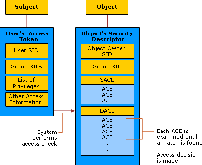

# Security Principals

**Applies to**
-   Windows 10
-   Windows Server 2016

This reference topic for the IT professional describes security principals in regards to Windows accounts and security groups, in addition to security technologies that are related to security principals.

## What are security principals?

Security principals are any entity that can be authenticated by the operating system, such as a user account, a computer account, or a thread or process that runs in the security context of a user or computer account, or the security groups for these accounts. Security principals have long been a foundation for controlling access to securable resources on Windows computers. Each security principal is represented in the operating system by a unique security identifier (SID).

The following content applies to the versions of Windows that are designated in the **Applies To** list at the beginning of this topic.

## How security principals work

Security principals that are created in an Active Directory domain are Active Directory objects, which can be used to manage access to domain resources. Each security principal is assigned a unique identifier, which it retains for its entire lifetime. Local user accounts and security groups are created on a local computer, and they can be used to manage access to resources on that computer. Local user accounts and security groups are managed by the Security Accounts Manager (SAM) on the local computer.

### Authorization and access control components

The following diagram illustrates the Windows authorization and access control process. In this diagram, the subject (a process that is initiated by a user) attempts to access an object, such as a shared folder. The information in the user’s access token is compared to the access control entries (ACEs) in the object’s security descriptor, and the access decision is made. The SIDs of security principals are used in the user’s access token and in the ACEs in the object’s security descriptor.

**Authorization and access control process**

Security principals are closely related to the following components and technologies:

-   [Security identifiers](#bkmk-sids)

-   [Access tokens](#bkmk-accesstokens)

-   [Security descriptors and access control lists](#bkmk-sdandacls)

-   [Permissions](#bkmk-permissions)

### Security identifiers

Security identifiers (SIDs) provide a fundamental building block of the Windows security model. They work with specific components of the authorization and access control technologies in the security infrastructure of the Windows Server operating systems. This helps protect access to network resources and provides a more secure computing environment.

A SID is a value of variable length that is used to uniquely identify a security principal that represents any entity that can be authenticated by the system. These entities include a user account, a computer account, or a thread or process that runs in the security context of a user or computer account. Each security principal is automatically assigned a SID when it is created. The SID is stored in a security database. When a SID is used as the unique identifier for a user or group, it can never be used to identify another user or group.

Each time a user signs in, the system creates an access token for that user. The access token contains the user’s SID, user rights, and the SIDs for groups that the user belongs to. This token provides the security context for whatever actions the user performs on that computer.

In addition to the uniquely created, domain-specific SIDs that are assigned to specific users and groups, there are well-known SIDs that identify generic groups and generic users. For example, the Everyone and the World SIDs identify groups that includes all users. Well-known SIDs have values that remain constant across all operating systems.

### Access tokens

An access token is a protected object that contains information about the identity and user rights that are associated with a user account.

When a user signs in interactively or tries to make a network connection to a computer running Windows, the sign-in process authenticates the user’s credentials. If authentication is successful, the process returns a SID for the user and a list of SIDs for the user’s security groups. The Local Security Authority (LSA) on the computer uses this information to create an access token (in this case, the primary access token). This includes the SIDs that are returned by the sign-in process and a list of user rights that are assigned by the local security policy to the user and to the user’s security groups.

After the LSA creates the primary access token, a copy of the access token is attached to every thread and process that executes on the user’s behalf. Whenever a thread or process interacts with a securable object or tries to perform a system task that requires user rights, the operating system checks the access token that is associated with the thread to determine the level of authorization.

There are two kinds of access tokens, primary and impersonation. Every process has a primary token that describes the security context of the user account that is associated with the process. A primary access token is typically assigned to a process to represent the default security information for that process. Impersonation tokens, on the other hand, are usually used for client and server scenarios. Impersonation tokens enable a thread to run in a security context that differs from the security context of the process that owns the thread.

### Security descriptors and access control lists

A security descriptor is a data structure that is associated with each securable object. All objects in Active Directory and all securable objects on a local computer or on the network have security descriptors to help control access to the objects. Security descriptors include information about who owns an object, who can access it and in what way, and what types of access are audited. Security descriptors contain the access control list (ACL) of an object, which includes all of the security permissions that apply to that object. An object’s security descriptor can contain two types of ACLs:

-   A discretionary access control list (DACL), which identifies the users and groups who are allowed or denied access

-   A system access control list (SACL), which controls how access is audited

You can use this access control model to individually secure objects and attributes such as files and folders, Active Directory objects, registry keys, printers, devices, ports, services, processes, and threads. Because of this individual control, you can adjust the security of objects to meet the needs of your organization, delegate authority over objects or attributes, and create custom objects or attributes that require unique security protections to be defined.

### Permissions

Permissions enable the owner of each securable object, such as a file, Active Directory object, or registry key, to control who can perform an operation or a set of operations on the object or object property. Permissions are expressed in the security architecture as access control entries (ACEs). Because access to an object is at the discretion of the object’s owner, the type of access control that is used in Windows is called discretionary access control.

Permissions are different from user rights in that permissions are attached to objects, and user rights apply to user accounts. Administrators can assign user rights to groups or users. These rights authorize users to perform specific actions, such as signing in to a system interactively or backing up files and directories.

On computers, user rights enable administrators to control who has the authority to perform operations that affect an entire computer, rather than a particular object. Administrators assign user rights to individual users or groups as part of the security settings for the computer. Although user rights can be managed centrally through Group Policy, they are applied locally. Users can (and usually do) have different user rights on different computers.

For information about which user rights are available and how they can be implemented, see [User Rights Assignment](/windows/device-security/security-policy-settings/user-rights-assignment).

###  Security context in authentication

A user account enables a user to sign in to computers, networks, and domains with an identity that can be authenticated by the computer, network, or domain.

In Windows, any user, service, group, or computer that can initiate action is a security principal. Security principals have accounts, which can be local to a computer or domain-based. For example, domain-joined Windows client computers can participate in a network domain by communicating with a domain controller, even when no user is signed in.

To initiate communications, the computer must have an active account in the domain. Before accepting communications from the computer, the Local Security Authority on the domain controller authenticates the computer’s identity and then defines the computer’s security context just as it would for a user’s security principal.

This security context defines the identity and capabilities of a user or service on a particular computer, or of a user, service, group or computer on a network. For example, it defines the resources (such as a file share or printer) that can be accessed and the actions (such as Read, Write, or Modify) that can be performed by a user, service, or computer on that resource.

The security context of a user or computer can vary from one computer to another, such as when a user authenticates to a server or a workstation other than the user’s primary workstation. It can also vary from one session to another, such as when an administrator modifies the user’s rights and permissions. In addition, the security context is usually different when a user or computer is operating on a stand-alone basis, in a mixed network domain, or as part of an Active Directory domain.

## Accounts and security groups

Accounts and security groups that are created in an Active Directory domain are stored in the Active Directory database and managed by using Active Directory tools. These security principals are directory objects, and they can be used to manage access to domain resources.

Local user accounts and security groups are created on a local computer, and they can be used to manage access to resources on that computer. Local user accounts and security groups are stored in and managed by the Security Accounts Manager (SAM) on the local computer.

### User accounts

A user account uniquely identifies a person who is using a computer system. The account signals the system to enforce the appropriate authorization to allow or deny that user access to resources. User accounts can be created in Active Directory and on local computers, and administrators use them to:

-   Represent, identify, and authenticate the identity of a user. A user account enables a user to sign in to computers, networks, and domains with a unique identifier that can be authenticated by the computer, network, or domain.

-   Authorize (grant or deny) access to resources. After a user has been authenticated, the user is authorized access to resources based on the permissions that are assigned to that user for the resource.

-   Audit the actions that are carried out on a user account.

Windows and the Windows Server operating systems have built-in user accounts, or you can create user accounts to meet the requirements of your organization.

### Security groups

A security group is a collection of user accounts, computer accounts, and other groups of accounts that can be managed as a single unit from a security perspective. In Windows operating systems, there are several built-in security groups that are preconfigured with the appropriate rights and permissions for performing specific tasks. Additionally, you can (and, typically, will) create a security group for each unique combination of security requirements that applies to multiple users in your organization.

Groups can be Active Directory-based or local to a particular computer:

-   Active Directory security groups are used to manage rights and permissions to domain resources.

-   Local groups exist in the SAM database on local computers (on all Windows-based computers) except domain controllers. You use local groups to manage rights and permissions only to resources on the local computer.

By using security groups to manage access control, you can:

-   Simplify administration. You can assign a common set of rights, a common set of permissions, or both to many accounts at one time, rather than assigning them to each account individually. Also, when users transfer jobs or leave the organization, permissions are not tied to their user accounts, making permission reassignment or removal easier.

-   Implement a role-based access-control model. You can use this model to grant permissions by using groups with different scopes for appropriate purposes. Scopes that are available in Windows include local, global, domain local, and universal.

-   Minimize the size of access control lists (ACLs) and speed security checking. A security group has its own SID; therefore, the group SID can be used to specify permissions for a resource. In an environment with more than a few thousand users, if the SIDs of individual user accounts are used to specify access to a resource, the ACL of that resource can become unmanageably large, and the time that is needed for the system to check permissions to the resource can become unacceptable.

For descriptions and settings information about the domain security groups that are defined in Active Directory, see [Active Directory Security Groups](active-directory-security-groups.md).

For descriptions and settings information about the Special Identities group, see [Special Identities](special-identities.md).

## See also

- [Access Control Overview](access-control.md)
