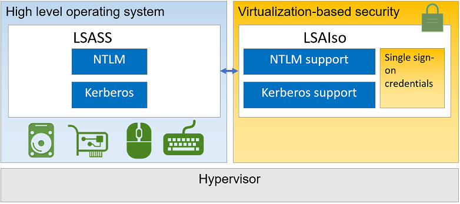

# How Windows Defender Credential Guard works

**Applies to**  
- Windows 10
- Windows 11
- Windows Server 2016
- Windows Server 2019

Kerberos, NTLM, and Credential manager isolate secrets by using Virtualization-based security. Previous versions of Windows stored secrets in the Local Security Authority (LSA). Prior to Windows 10, the LSA stored secrets used by the operating system in its process memory. With Windows Defender Credential Guard enabled, the LSA process in the operating system talks to a new component called the isolated LSA process that stores and protects those secrets. Data stored by the isolated LSA process is protected using Virtualization-based security and is not accessible to the rest of the operating system. LSA uses remote procedure calls to communicate with the isolated LSA process.

For security reasons, the isolated LSA process doesn't host any device drivers. Instead, it only hosts a small subset of operating system binaries that are needed for security and nothing else. All of these binaries are signed with a certificate that is trusted by Virtualization-based security and these signatures are validated before launching the file in the protected environment.

When Windows Defender Credential Guard is enabled, NTLMv1, MS-CHAPv2, Digest, and CredSSP cannot use the signed-in credentials. Thus, single sign-on does not work with these protocols. However, applications can prompt for credentials or use credentials stored in the Windows Vault, which are not protected by Windows Defender Credential Guard with any of these protocols. It is recommended that valuable credentials, such as the sign-in credentials, not be used with any of these protocols. If these protocols must be used by domain or Azure AD users, secondary credentials should be provisioned for these use cases.

When Windows Defender Credential Guard is enabled, Kerberos does not allow unconstrained Kerberos delegation or DES encryption, not only for signed-in credentials, but also prompted or saved credentials.

Here's a high-level overview on how the LSA is isolated by using Virtualization-based security:

  

## See also

**Related videos**

[What is Virtualization-based security?](https://www.linkedin.com/learning/microsoft-cybersecurity-stack-advanced-identity-and-endpoint-protection/what-is-virtualization-based-security)
