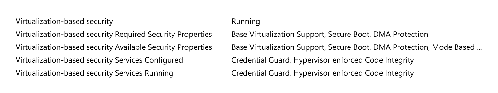

# Manage Windows Defender Credential Guard

**Applies to**
-   Windows 10
-   Windows Server 2016
-   Windows Server 2019


## Enable Windows Defender Credential Guard
Windows Defender Credential Guard can be enabled either by using [Group Policy](#enable-windows-defender-credential-guard-by-using-group-policy), the [registry](#enable-windows-defender-credential-guard-by-using-the-registry), or the Windows Defender Device Guard and Windows Defender Credential Guard [hardware readiness tool](#hardware-readiness-tool). Windows Defender Credential Guard can also protect secrets in a Hyper-V virtual machine, just as it would on a physical machine.
The same set of procedures used to enable Windows Defender Credential Guard on physical machines applies also to virtual machines.


### Enable Windows Defender Credential Guard by using Group Policy

You can use Group Policy to enable Windows Defender Credential Guard. This will add and enable the virtualization-based security features for you if needed.

1.  From the Group Policy Management Console, go to **Computer Configuration** -&gt; **Administrative Templates** -&gt; **System** -&gt; **Device Guard**.
2.  Double-click **Turn On Virtualization Based Security**, and then click the **Enabled** option.
3.  In the **Select Platform Security Level** box, choose **Secure Boot** or **Secure Boot and DMA Protection**.
4.  In the **Credential Guard Configuration** box, click **Enabled with UEFI lock**, and then click **OK**. If you want to be able to turn off Windows Defender Credential Guard remotely, choose **Enabled without lock**.

    

5.  Close the Group Policy Management Console.

To enforce processing of the group policy, you can run ```gpupdate /force```.

### Enable Windows Defender Credential Guard by using Intune

1.  From **Home** click **Microsoft Intune**
2.  Click **Device configuration**
3.  Click **Profiles** > **Create Profile** > **Endpoint protection** > **Windows Defender Credential Guard**.

> [!NOTE]
> It will enable VBS and Secure Boot and you can do it with or without UEFI Lock. If you will need to disable Credential Guard remotely, enable it without UEFI lock.

### Enable Windows Defender Credential Guard by using the registry

If you don't use Group Policy, you can enable Windows Defender Credential Guard by using the registry. Windows Defender Credential Guard uses virtualization-based security features which have to be enabled first on some operating systems.

#### Add the virtualization-based security features

Starting with Windows 10, version 1607 and Windows Server 2016, enabling Windows features to use virtualization-based security is not necessary and this step can be skipped.

If you are using Windows 10, version 1507 (RTM) or Windows 10, version 1511, Windows features have to be enabled to use virtualization-based security.
You can do this by using either the Control Panel or the Deployment Image Servicing and Management tool (DISM).
> [!NOTE]
> If you enable Windows Defender Credential Guard by using Group Policy, the steps to enable Windows features through Control Panel or DISM are not required. Group Policy will install Windows features for you.

 
**Add the virtualization-based security features by using Programs and Features**

1.  Open the Programs and Features control panel.
2.  Click **Turn Windows feature on or off**.
3.  Go to **Hyper-V** -&gt; **Hyper-V Platform**, and then select the **Hyper-V Hypervisor** check box.
4.  Select the **Isolated User Mode** check box at the top level of the feature selection.
5.  Click **OK**.

**Add the virtualization-based security features to an offline image by using DISM**

1.  Open an elevated command prompt.
2.  Add the Hyper-V Hypervisor by running the following command:
    ```
    dism /image:<WIM file name> /Enable-Feature /FeatureName:Microsoft-Hyper-V-Hypervisor /all
    ```
3. Add the Isolated User Mode feature by running the following command:
    ```
    dism /image:<WIM file name> /Enable-Feature /FeatureName:IsolatedUserMode
    ```

> [!NOTE]
> You can also add these features to an online image by using either DISM or Configuration Manager.

#### Enable virtualization-based security and Windows Defender Credential Guard

1.  Open Registry Editor.
2.  Enable virtualization-based security:
    -   Go to HKEY\_LOCAL\_MACHINE\\System\\CurrentControlSet\\Control\\DeviceGuard.
    -   Add a new DWORD value named **EnableVirtualizationBasedSecurity**. Set the value of this registry setting to 1 to enable virtualization-based security and set it to 0 to disable it.
    -   Add a new DWORD value named **RequirePlatformSecurityFeatures**. Set the value of this registry setting to 1 to use **Secure Boot** only or set it to 3 to use **Secure Boot and DMA protection**.
3.  Enable Windows Defender Credential Guard:
    -   Go to HKEY\_LOCAL\_MACHINE\\System\\CurrentControlSet\\Control\\LSA.
    -   Add a new DWORD value named **LsaCfgFlags**. Set the value of this registry setting to 1 to enable Windows Defender Credential Guard with UEFI lock, set it to 2 to enable Windows Defender Credential Guard without lock, and set it to 0 to disable it.
4.  Close Registry Editor.


> [!NOTE]
> You can also enable Windows Defender Credential Guard by setting the registry entries in the [FirstLogonCommands](https://msdn.microsoft.com/library/windows/hardware/dn922797.aspx) unattend setting.

<span id="hardware-readiness-tool"/>

### Enable Windows Defender Credential Guard by using the Windows Defender Device Guard and Windows Defender Credential Guard hardware readiness tool

You can also enable Windows Defender Credential Guard by using the [Windows Defender Device Guard and Windows Defender Credential Guard hardware readiness tool](https://www.microsoft.com/download/details.aspx?id=53337).

```
DG_Readiness_Tool_v3.5.ps1 -Enable -AutoReboot
```
> [!IMPORTANT]
> When running the Windows Defender Device Guard and Windows Defender Credential Guard hardware readiness tool on a non-English operating system, within the script, change `$OSArch = $(gwmi win32_operatingsystem).OSArchitecture` to be `$OSArch = $((gwmi win32_operatingsystem).OSArchitecture).tolower()` instead, in order for the tool to work. 
> This is a known issue.

### Review Windows Defender Credential Guard performance

**Is Windows Defender Credential Guard running?**

You can view System Information to check that Windows Defender Credential Guard is running on a PC.

1.  Click **Start**, type **msinfo32.exe**, and then click **System Information**.
2.  Click **System Summary**.
3.  Confirm that **Credential Guard** is shown next to **Virtualization-based security Services Configured**.

    Here's an example:

    

You can also check that Windows Defender Credential Guard is running by using the [Windows Defender Device Guard and Windows Defender Credential Guard hardware readiness tool](https://www.microsoft.com/download/details.aspx?id=53337).

```
DG_Readiness_Tool_v3.5.ps1 -Ready
```
> [!IMPORTANT]
> When running the Windows Defender Device Guard and Windows Defender Credential Guard hardware readiness tool on a non-English operating system, within the script, change `*$OSArch = $(gwmi win32_operatingsystem).OSArchitecture` to be `$OSAch = $((gwmi win32_operatingsystem).OSArchitecture).tolower()` instead, in order for the tool to work. 
> This is a known issue.

> [!NOTE]
> For client machines that are running Windows 10 1703, LsaIso.exe is running whenever virtualization-based security is enabled for other features.

-   We recommend enabling Windows Defender Credential Guard before a device is joined to a domain. If Windows Defender Credential Guard is enabled after domain join, the user and device secrets may already be compromised. In other words, enabling Credential Guard will not help to secure a device or identity that has already been compromised, which is why we recommend turning on Credential Guard as early as possible.

-   You should perform regular reviews of the PCs that have Windows Defender Credential Guard enabled. This can be done with security audit policies or WMI queries. Here's a list of WinInit event IDs to look for:
    -   **Event ID 13** Windows Defender Credential Guard (LsaIso.exe) was started and will protect LSA credentials.
    -   **Event ID 14** Windows Defender Credential Guard (LsaIso.exe) configuration: 0x1, 0
        -   The first variable: 0x1 means Windows Defender Credential Guard is configured to run. 0x0 means it’s not configured to run.
        -   The second variable: 0 means it’s configured to run in protect mode. 1 means it's configured to run in test mode. This variable should always be 0.
    -   **Event ID 15** Windows Defender Credential Guard (LsaIso.exe) is configured but the secure kernel is not running; continuing without Windows Defender Credential Guard.
    -   **Event ID 16** Windows Defender Credential Guard (LsaIso.exe) failed to launch: \[error code\]
    -   **Event ID 17** Error reading Windows Defender Credential Guard (LsaIso.exe) UEFI configuration: \[error code\]
    You can also verify that TPM is being used for key protection by checking Event ID 51 in the **Microsoft** -&gt; **Windows** -&gt; **Kernel-Boot** event source. If you are running with a TPM, the TPM PCR mask value will be something other than 0.
        -   **Event ID 51** VSM Master Encryption Key Provisioning. Using cached copy status: 0x0. Unsealing cached copy status: 0x1. New key generation status: 0x1. Sealing status: 0x1. TPM PCR mask: 0x0.

## Disable Windows Defender Credential Guard

To disable Windows Defender Credential Guard, you can use the following set of procedures or [the Device Guard and Credential Guard hardware readiness tool](#turn-off-with-hardware-readiness-tool). If Credential Guard was enabled with UEFI Lock then you must use the following procedure as the settings are persisted in EFI (firmware) variables and it will require physical presence at the machine to press a function key to accept the change. If Credential Guard was enabled without UEFI Lock then you can turn it off by using Group Policy.

1. If you used Group Policy, disable the Group Policy setting that you used to enable Windows Defender Credential Guard (**Computer Configuration** -&gt; **Administrative Templates** -&gt; **System** -&gt; **Device Guard** -&gt; **Turn on Virtualization Based Security**).
2. Delete the following registry settings:
   - HKEY\_LOCAL\_MACHINE\\System\\CurrentControlSet\\Control\\LSA\LsaCfgFlags
   - HKEY\_LOCAL\_MACHINE\\Software\\Policies\\Microsoft\\Windows\\DeviceGuard\\LsaCfgFlags
3. If you also wish to disable virtualization-based security delete the following registry settings:
   - HKEY\_LOCAL\_MACHINE\\Software\\Policies\\Microsoft\\Windows\\DeviceGuard\\EnableVirtualizationBasedSecurity
   - HKEY\_LOCAL\_MACHINE\\Software\\Policies\\Microsoft\\Windows\\DeviceGuard\\RequirePlatformSecurityFeatures
     > [!IMPORTANT]
     > If you manually remove these registry settings, make sure to delete them all. If you don't remove them all, the device might go into BitLocker recovery.

4. Delete the Windows Defender Credential Guard EFI variables by using bcdedit. From an elevated command prompt, type the following commands:

   ``` syntax
   mountvol X: /s
   copy %WINDIR%\System32\SecConfig.efi X:\EFI\Microsoft\Boot\SecConfig.efi /Y
   bcdedit /create {0cb3b571-2f2e-4343-a879-d86a476d7215} /d "DebugTool" /application osloader
   bcdedit /set {0cb3b571-2f2e-4343-a879-d86a476d7215} path "\EFI\Microsoft\Boot\SecConfig.efi"
   bcdedit /set {bootmgr} bootsequence {0cb3b571-2f2e-4343-a879-d86a476d7215}
   bcdedit /set {0cb3b571-2f2e-4343-a879-d86a476d7215} loadoptions DISABLE-LSA-ISO
   bcdedit /set {0cb3b571-2f2e-4343-a879-d86a476d7215} device partition=X:
   mountvol X: /d
   ```

5. Restart the PC.
6. Accept the prompt to disable Windows Defender Credential Guard.
7. Alternatively, you can disable the virtualization-based security features to turn off Windows Defender Credential Guard.

> [!NOTE]
> The PC must have one-time access to a domain controller to decrypt content, such as files that were encrypted with EFS. If you want to turn off both Windows Defender Credential Guard and virtualization-based security, run the following bcdedit commands after turning off all virtualization-based security Group Policy and registry settings:

    bcdedit /set {0cb3b571-2f2e-4343-a879-d86a476d7215} loadoptions DISABLE-LSA-ISO,DISABLE-VBS
    bcdedit /set vsmlaunchtype off

> [!NOTE]
> Credential Guard and Device Guard are not currently supported when using Azure IaaS VMs. These options will be made available with future Gen 2 VMs.

For more info on virtualization-based security and Windows Defender Device Guard, see [Windows Defender Device Guard deployment guide](/windows/device-security/device-guard/device-guard-deployment-guide).

<span id="turn-off-with-hardware-readiness-tool" />
#### Disable Windows Defender Credential Guard by using the Windows Defender Device Guard and Windows Defender Credential Guard hardware readiness tool

You can also disable Windows Defender Credential Guard by using the [Windows Defender Device Guard and Windows Defender Credential Guard hardware readiness tool](https://www.microsoft.com/download/details.aspx?id=53337).

```
DG_Readiness_Tool_v3.6.ps1 -Disable -AutoReboot
```
> [!IMPORTANT]
> When running the Windows Defender Device Guard and Windows Defender Credential Guard hardware readiness tool on a non-English operating system, within the script, change `*$OSArch = $(gwmi win32_operatingsystem).OSArchitecture` to be `$OSArch = $((gwmi win32_operatingsystem).OSArchitecture).tolower()` instead, in order for the tool to work. 
> This is a known issue.

#### Disable Windows Defender Credential Guard for a virtual machine

From the host, you can disable Windows Defender Credential Guard for a virtual machine:

``` PowerShell
Set-VMSecurity -VMName <VMName> -VirtualizationBasedSecurityOptOut $true
```


