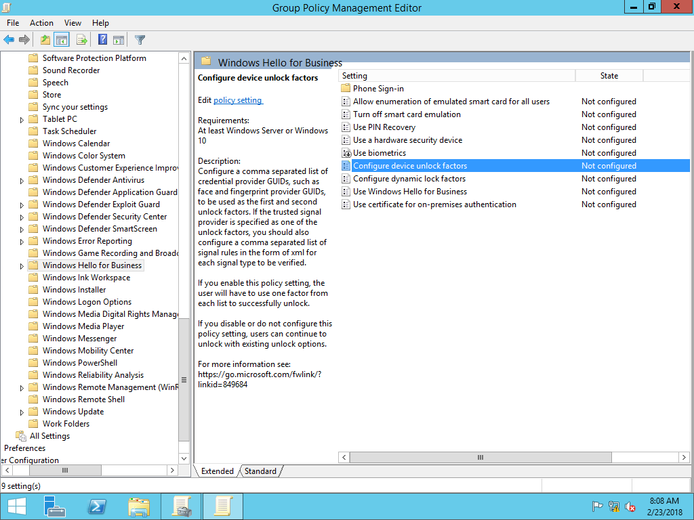
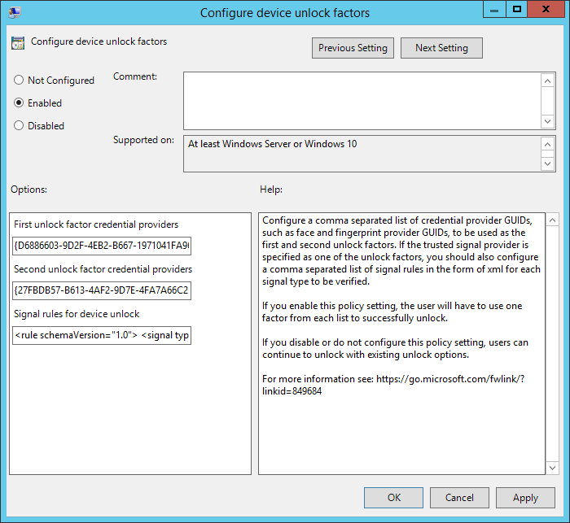

# Multifactor Unlock

**Applies to:**
-   Windows 10

**Requirements:**
* Windows Hello for Business deployment (Hybrid or On-premises)
* Azure AD joined device (Cloud and Hybrid deployments)
* Hybrid Azure AD joined (Hybrid deployments)
* Domain Joined (on-premises deployments) 
* Windows 10, version 1709
* Bluetooth, Bluetooth capable phone - optional

Windows, today, natively only supports the use of a single credential (password, PIN, fingerprint, face, etc.) for unlocking a device. Therefore, if any of those credentials are compromised (shoulder surfed), an attacker could gain access to the system.

Windows 10 offers Multi-factor device unlock by extending Windows Hello with trusted signals, administrators can configure Windows 10 to request a combination of factors and trusted signals to unlock their devices. 

Which organizations can take advantage of Multi-factor unlock? Those who:
* Have expressed that PINs alone do not meet their security needs.
* Want to prevent Information Workers from sharing credentials.
* Want their organizations to comply with regulatory two-factor authentication policy.
* Want to retain the familiar Windows sign-in user experience and not settle for a custom solution.
 
You enable multi-factor unlock using Group Policy.  The **Configure device unlock factors** policy setting is located under **Computer Configuration\Administrative Templates\Windows Components\Windows Hello for Business**.

## The Basics: How it works

First unlock factor credential provider and Second unlock credential provider are responsible for the bulk of the configuration.  Each of these components contains a globally unique identifier (GUID) that represents a different Windows credential provider.  With the policy setting enabled, users unlock the device using at least one credential provider from each category before Windows allows the user to proceed to their desktop.

The policy setting has three components:
* First unlock factor credential provider
* Second unlock factor credential provider 
* Signal rules for device unlock

## Configuring Unlock Factors

The **First unlock factor credential providers** and **Second unlock factor credential providers** portion of the policy setting each contain a comma separated list of credential providers. 

Supported credential providers include: 

|Credential Provider| GUID|
|:------------------|:----|
|PIN | \{D6886603-9D2F-4EB2-B667-1971041FA96B}|  
|Fingerprint | \{BEC09223-B018-416D-A0AC-523971B639F5}|
|Facial Recognition | \{8AF662BF-65A0-4D0A-A540-A338A999D36F}|
|Trusted Signal<br>(Phone proximity, Network location) | \{27FBDB57-B613-4AF2-9D7E-4FA7A66C21AD}|

>[!NOTE]
>Multifactor unlock does not support third-party credential providers or credential providers not listed in the above table.

The default credential providers for the **First unlock factor credential provider** include:
* PIN
* Fingerprint
* Facial Recognition

The default credential providers for the **Second unlock factor credential provider** include:
* Trusted Signal
* PIN

Configure a comma separated list of credential provider GUIDs you want to use as first and second unlock factors. While a credential provider can appear in both lists, remember that a credential supported by that provider can only satisfy one of the unlock factors. Listed credential providers do not need to be in any specific order. 

For example, if you include the PIN and fingerprint credential providers in both first and second factor lists, a user can use their fingerprint or PIN as the first unlock factor.  However, whichever factor they used to satisfy the first unlock factor cannot be used to satisfy the second unlock factor.  Each factor can therefore be used exactly once. The Trusted Signal provider can *only* be specified as part of the Second unlock factor credential provider list.  


## Configure Signal Rules for the Trusted Signal Credential Provider

The **Signal rules for device unlock** setting contains the rules the Trusted Signal credential provider uses to satisfy unlocking the device.

### Rule element
You represent signal rules in XML.  Each signal rule has an starting and ending **rule** element that contains the **schemaVersion** attribute and value.  The current supported schema version is 1.0.<br>
**Example**
```
<rule schemaVersion="1.0">
</rule>
```

### Signal element
Each rule element has a **signal** element.  All signal elements have a **type** element and value.  Windows 10, version 1709 supports the **ipConfig** and **bluetooth** type values.<br>

|Attribute|Value|
|---------|-----|
| type| "bluetooth" or "ipConfig" (Windows 10, version 1709)| 
| type| "wifi" (Windows 10, version 1803)

#### Bluetooth
You define the bluetooth signal with additional attribute in the signal element. The bluetooth configuration does not use any other elements. You can end the signal element with short ending tag "\/>".

|Attribute|Value|Required|
|---------|-----|--------|
|type|"bluetooth"|yes|
|scenario|"Authentication"|yes|
|classOfDevice|"*number*"|no|
|rssiMin|"*number*"|no|
|rssiMaxDelta|"*number*"|no|

Example:
```
<rule schemaVersion="1.0">
    <signal type="bluetooth" scenario="Authentication" classOfDevice="512" rssiMin="-10" rssiMaxDelta="-10"/>
</rule>
```
The **classofDevice** attribute defaults Phones and uses the values from the following table 

|Description|Value|
|:-------------|:-------:|
|Miscellaneous|0|
|Computer|256|
|Phone|512|
|LAN/Network Access Point|768|
|Audio/Video|1024|
|Peripheral|1280|
|Imaging|1536|
|Wearable|1792|
|Toy|2048|
|Health|2304|
|Uncategorized|7936|

The **rssiMin** attribute value signal indicates the strength needed for the device to be considered "in-range".  The default value of **-10** enables a user to move about an average size office or cubicle without triggering Windows to lock the device.  The **rssiMaxDelta** has a default value of **-10**, which instruct Windows 10 to lock the device once the signal strength weakens by more than measurement of 10.  

RSSI measurements are relative and lower as the bluetooth signals between the two paired devices reduces. Therefore a measurement of 0 is stronger than -10, which is stronger than -60, which is an indicator the devices are moving further apart from each other.

>[!IMPORTANT]
>Microsoft recommends using the default values for this policy settings.  Measurements are relative, based on the varying conditions of each environment.  Therefore, the same values may produce different results. Test policy settings in each environment prior to broadly deploying the setting.  Use the rssiMIN and rssiMaxDelta values from the XML file created by the Group Policy Management Editor or remove both attributes to use the default values.

#### IP Configuration
You define IP configuration signals using one or more ipConfiguration elements.  Each element has a string value.  IpConfiguration elements do not have attributes or nested elements.

##### IPv4Prefix
The IPv4 network prefix represented in Internet standard dotted-decimal notation. A network prefix that uses the Classless Inter-Domain Routing (CIDR) notation is required as part of the network string. A network port must not be present in the network string.  A **signal** element may only contain one **ipv4Prefix** element.<br>
**Example**
```
<ipv4Prefix>192.168.100.0/24</ipv4Prefix>
```
The assigned IPv4 addresses in the range of 192.168.100.1 to 192.168.100.254 match this signal configuration.

##### IPv4Gateway
The IPv4 network gateway represented in Internet standard dotted-decimal notation. A network port or prefix must not be present in the network string.  A **signal** element may only contain one **ipv4Gateway** element.<br>
**Example**
```
<ipv4Gateway>192.168.100.10</ipv4Gateway>
```
##### IPv4DhcpServer
The IPv4 DHCP server represented in Internet standard dotted-decimal notation. A network port or prefix must not be present in the network string.  A **signal** element may only contain one **ipv4DhcpServer** element.<br>
**Example**
```
<ipv4DhcpServer>192.168.100.10</ipv4DhcpServer>
```
##### IPv4DnsServer
The IPv4 DNS server represented in Internet standard dotted-decimal notation. A network port or prefix must not be present in the network string.The **signal** element may contain one or more **ipv4DnsServer** elements.<br>
**Example:**
```
<ipv4DnsServer>192.168.100.10</ipv4DnsServer>
```

##### IPv6Prefix
The IPv6 network prefix represented in IPv6 network using Internet standard hexadecimal encoding. A network prefix in CIDR notation is required as part of the network string. A network port or scope ID must not be present in the network string.  A **signal** element may only contain one **ipv6Prefix** element.<br>
**Example** 
```
<ipv6Prefix>21DA:D3::/48</ipv6Prefix>
```

##### IPv6Gateway
The IPv6 network gateway represented in Internet standard hexadecimal encoding. An IPv6 scope ID may be present in the network string. A network port or prefix must not be present in the network string.  A **signal** element may only contain one **ipv6Gateway** element.<br>
**Example** 
```
<ipv6Gateway>21DA:00D3:0000:2F3B:02AA:00FF:FE28:9C5A%2</ipv6Gateway>
```

##### IPv6DhcpServer
The IPv6 DNS server represented in Internet standard hexadecimal encoding. An IPv6 scope ID may be present in the network string. A network port or prefix must not be present in the network string.  A **signal** element may only contain one **ipv6DhcpServer** element.<br>
**Example**
```
<ipv6DhcpServer>21DA:00D3:0000:2F3B:02AA:00FF:FE28:9C5A%2</ipv6DhcpServer
```

##### IPv6DnsServer
The IPv6 DNS server represented in Internet standard hexadecimal encoding. An IPv6 scope ID may be present in the network string. A network port or prefix must not be present in the network string. The **signal** element may contain one or more **ipv6DnsServer** elements.<br>
**Example**
```
<ipv6DnsServer>21DA:00D3:0000:2F3B:02AA:00FF:FE28:9C5A%2</ipv6DnsServer>
```
##### dnsSuffix
The fully qualified domain name of your organizations internal DNS suffix where any part of the fully qualified domain name in this setting exists in the computer's primary DNS suffix.  The **signal** element may contain one or more **dnsSuffix** elements.<br>
**Example**
```
<dnsSuffix>corp.contoso.com</dnsSuffix>
```

#### Wi-Fi

**Applies to:**
-   Windows 10, version 1803

You define Wi-Fi signals using one or more wifi elements.  Each element has a string value.  Wifi elements do not have attributes or nested elements.

#### SSID
Contains the service set identifier (SSID) of a wireless network.  The SSID is the name of the wireless network.  The SSID element is required.<br>
```
<ssid>corpnetwifi</ssid>
```

#### BSSID
Contains the basic service set identifier (BSSID) of a wireless access point.  the BSSID is the mac address of the wireless access point.  The BSSID element is optional.<br>
**Example**
```
<bssid>12-ab-34-ff-e5-46</bssid>
```

#### Security
Contains the type of security the client uses when connecting to the wireless network.  The security element is required and must contain one of the following values:<br>

|Value | Description|
|:----:|:-----------|
|Open| The wireless network is an open network that does not require any authentication or encryption.|
|WEP| The wireless network is protected using Wired Equivalent Privacy.|
|WPA-Personal| The wireless network is protected using Wi-Fi Protected Access.|
|WPA-Enterprise| The wireless network is protected using Wi-Fi Protected Access-Enterprise.|
|WPA2-Personal| The wireless network is protected using Wi-Fi Protected Access 2, which typically uses a pre-shared key.|
|WPA2-Enterprise| The wireless network is protected using Wi-Fi Protected Access 2-Enterprise.|

**Example**
```
<security>WPA2-Enterprise</security> 
```
#### TrustedRootCA
Contains the thumbprint of the trusted root certificate of the wireless network. This may be any valid trusted root certificate. The value is represented as hexadecimal string where each byte in the string is separated by a single space.  This element is optional.<br>
**Example**
```
<trustedRootCA>a2 91 34 aa 22 3a a2 3a 4a 78 a2 aa 75 a2 34 2a 3a 11 4a aa</trustedRootCA>
```
#### Sig_quality
Contains numeric value ranging from 0 to 100 to represent the wireless network's signal strength needed to be considered a trusted signal.<br>
**Example**
```
<sig_quality>80</sig_quality>
```
 
### Sample Trusted Signal Configurations

These examples are wrapped for readability.  Once properly formatted, the entire XML contents must be a single line.

#### Example 1
This example configures an IPConfig signal type using Ipv4Prefix, Ipv4DnsServer, and DnsSuffix elements.
```
<rule schemaVersion="1.0"> 
    <signal type="ipConfig"> 
        <ipv4Prefix>10.10.10.0/24</ipv4Prefix>
        <ipv4DnsServer>10.10.0.1</ipv4DnsServer>
        <ipv4DnsServer>10.10.0.2</ipv4DnsServer>
        <dnsSuffix>corp.contoso.com</dnsSuffix> 
	</signal> 
</rule>
```


#### Example 2
This example configures an IpConfig signal type using a dnsSuffix element and a bluetooth signal for phones.  This configuration is wrapped for reading.  Once properly formatted, the entire XML contents must be a single line.  This example implies that either the ipconfig **or** the Bluetooth rule must evaluate to true, for the resulting signal evaluation to be true.
>[!NOTE] 
>Separate each rule element using a comma.

```
<rule schemaVersion="1.0"> 
	<signal type="ipConfig"> 
	    <dnsSuffix>corp.contoso.com</dnsSuffix> 
	</signal> 
</rule>,
<rule schemaVersion="1.0">
	<signal type="bluetooth" scenario="Authentication" classOfDevice="512" rssiMin="-10" rssiMaxDelta="-10"/>
</rule>
```
#### Example 3
This example configures the same as example 2 using compounding And elements.  This example implies that the ipconfig **and** the Bluetooth rule must evaluate to true, for the resulting signal evaluation to be true.
```
<rule schemaVersion="1.0">
<and>
  <signal type="ipConfig">
   <dnsSuffix>corp.microsoft.com</dnsSuffix>
  </signal> 
  <signal type="bluetooth" scenario="Authentication" classOfDevice="512" rssiMin="-10" rssiMaxDelta="-10"/>
</and>
</rule>
```
#### Example 4 
This example configures Wi-Fi as a trusted signal (Windows 10, version 1803)
```
<rule version="1.0"> 
  <signal type="wifi"> 
    <ssid>contoso</ssid> 
    <bssid>12-ab-34-ff-e5-46</bssid> 
    <security>WPA2-Enterprise</security> 
    <trustedRootCA>a2 91 34 aa 22 3a a2 3a 4a 78 a2 aa 75 a2 34 2a 3a 11 4a aa</trustedRootCA> 
    <sig_quality>80</sig_quality> 
  </signal> 
</rule> 
```

## Deploying Multifactor Unlock

>[!IMPORTANT]
>You need to remove all third party credential providers to ensure users cannot unlock their devices if they do not have the required factors. The fall back options are to use passwords or smart cards (both of which could be disabled as needed).

### How to configure Multifactor Unlock policy settings

You need a Windows 10, version 1709 workstation to run the Group Policy Management Console, which provides the latest Windows Hello for Business  Group Policy settings, which includes multi-factor unlock. To run the Group Policy Management Console, you need to install the Remote Server Administration Tools for Windows 10. You can download these tools from the [Microsoft Download Center](https://www.microsoft.com/en-us/download/details.aspx?id=45520). Install the Remote Server Administration Tools for Windows 10 on a computer running Windows 10, version 1709.

Alternatively, you can create copy the .ADMX and .ADML files from a Windows 10, version 1703 to their respective language folder on a Windows Server or you can create a Group Policy Central Store and copy them their respective language folder. See [How to create and manage the Central Store for Group Policy Administrative Templates in Windows](https://support.microsoft.com/help/3087759/how-to-create-and-manage-the-central-store-for-group-policy-administrative-templates-in-windows) for more information.


### Create the Multifactor Unlock Group Policy object

The Group Policy object contains the policy settings needed to trigger Windows Hello for Business provisioning and to ensure Windows Hello for Business authentication certificates are automatically renewed.

>[!IMPORTANT]
> * PIN **must** be in at least one of the groups
> * Trusted signals **must** be combined with another credential provider
> * You cannot use the same unlock factor to satisfy both categories. Therefore, if you include any credential provider in both categories, it means it can satisfy either category, but not both.

1. Start the **Group Policy Management Console** (gpmc.msc)
2. Expand the domain and select the **Group Policy Object** node in the navigation pane.
3. Right-click **Group Policy object** and select **New**.
4. Type *Multifactor Unlock* in the name box and click **OK**.
5. In the content pane, right-click the **Multifactor Unlock** Group Policy object and click **Edit**.
6. In the navigation pane, expand **Policies** under **Computer Configuration**.
7. Expand **Administrative Templates > Windows Component**, and select **Windows Hello for Business**.<br>
   
8. In the content pane, double-click **Configure device unlock factors**. Click **Enable**.  The **Options** section populates the policy setting with default values.<br>
   
9. Configure first and second unlock factors using the information in the [Configure Unlock Factors](#configuring-unlock-factors) section.
10. If using trusted signals, configure the trusted signals used by the unlock factor using the information in the [Configure Signal Rules for the Trusted Signal Credential Provider](#configure-signal-rules-for-the-trusted-signal-credential-provider) section.
11. Click **Ok** to close the **Group Policy Management Editor**. Use the **Group Policy Management Console** to deploy the newly created Group Policy object to your organization's computers.

    ## Troubleshooting
    Multi-factor unlock writes events to event log under **Application and Services Logs\Microsoft\Windows\HelloForBusiness** with the category name **Device Unlock**.

### Events

|Event ID|Details|
|:------:|:------|
|3520|Unlock attempt initiated|
|5520|Unlock policy not configured|
|6520|Warning event|
|7520|Error event|
|8520|Success event|
