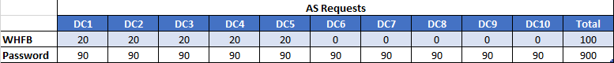
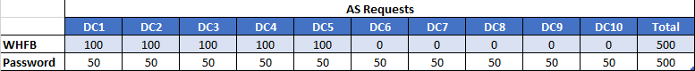

# Planning an adequate number of Windows Server 2019 Domain Controllers for Windows Hello for Business deployments

**Applies to**
-   Windows 10, version 1702 or later
-   Windows Server 2019
-   Hybrid or On-Premises deployment
-   Key trust

## How many is adequate

How can you find out how many domain controllers are needed? You can use performance monitoring on your domain controllers to determine existing authentication traffic.  Windows Server 2019 includes the KDC AS Requests performance counter.  You can use these counters to determine how much of a domain controllers load is due to initial Kerberos authentication.  It's important to remember that authentication for a Windows Hello for Business key trust deployment does not affect Kerberos authentication--it remains unchanged.

Windows 10 accomplishes Windows Hello for Business key trust authentication by mapping an Active Directory user account to one or more public keys.  This mapping occurs on the domain controller, which is why the deployment needs Windows Server 2019 domain controllers. Public key mapping is only supported by Windows Server 2016 domain controllers.  Therefore, users in a key trust deployment must authenticate to a Windows Server 2019 domain controller.
  
Determining an adequate number of Windows Server 2019 domain controllers is important to ensure you have enough domain controllers to satisfy all authentication requests, including users mapped with public key trust. What many administrators do not realize is that adding the most current version of a domain controller (in this case Windows Server 2019) to a deployment of existing domain controllers (Windows Server 2008R2, Windows Server 2012R2 or Windows Server 2016) instantly makes that single domain controller susceptible to carrying the most load, or what is commonly referred to as "piling on".   To illustrate the "piling on" concept, consider the following scenario.
 
Consider a controlled environment where there are 1000 client computers and the authentication load of these 1000 client computers is evenly distributed across 10 domain controllers in the environment.  The Kerberos AS requests load would look something like the following.


The environment changes.  The first change includes DC1 upgraded to Windows Server 2019 to support Windows Hello for Business key-trust authentication. Next, 100 clients enroll for Windows Hello for Business using the public key trust deployment.   Given all other factors stay constant, the authentication would now look like the following.


The Windows Server 2019 domain controller is handling 100 percent of all public key trust authentication.  However, it is also handling 10 percent of the password authentication. Why?  This behavior occurs because domain controllers 2- 10 only support password and certificate trust authentication; only a Windows Server 2019 domain controller supports authentication public key trust authentication.  The Windows Server 2019 domain controller understands how to authenticate password and certificate trust authentication and will continue to share the load of authenticating those clients.  Because DC1 can handle all forms of authentication, it will be bear more of the authentication load, and easily become overloaded.  What if another Windows Server 2019 domain controller is added, but without deploying Windows Hello for Business to anymore clients.


Upgrading another Windows Server 2019 domain controller distributes the public key trust authentication across two domain controllers--each supporting 50 percent of the load.  But it doesn't change the distribution of password and certificate trust authentication.  Both Windows Server 2019 domain controllers still share 10 percent of this load. Now look at the scenario when half of the domain controllers are upgraded to Windows Server 2019, but the number of WHFB clients remains the same.



Domain controllers 1 through 5 now share the public key trust authentication load where each domain controller handles 20 percent of the public key trust load but they each still handle 10 percent of the password and certificate trust authentication.  These domain controllers still have a heavier load than domain controllers 6 through 10; however, the load is adequately distributed.  Now look the scenario when half of the client computers are upgraded to Windows Hello for Business using a key-trust deployment.



You'll notice the distribution did not change.  Each Windows Server 2019 domain controller handles 20 percent of the public key trust authentication.  However, increasing the volume of authentication (by increasing the number of clients) increases the amount of work that is represented by the same 20 percent.  In the previous example, 20 percent of public key trust authentication equated to a volume of 20 authentications per domain controller capable of public key trust authentication.  However, with upgraded clients, that same 20 percent represents a volume 100 public key trust authentications per public key trust capable domain controller.  Also, the distribution of non-public key trust authentication remained at 10 percent, but the volume of password and certificate trust authentication decreased across the older domain controllers.

There are several conclusions here: 
* Upgrading domain controllers changes the distribution of new authentication, but doesn't change the distribution of older authentication.
* Upgrading domain controllers does not affect the distribution of password and certificate trust authentication because newer domain controllers can support password and certificate trust authentication.
* Upgraded domain controllers typically carry a heavier authentication load than down-level domain controllers because they support more forms of authentication.  
* Upgrading clients to Windows Hello for Business, increases the volume of public key trust authentication distributed across domain controllers which support it and, reduces the volume of password and certificate trust authentication across all domain controllers
* Upgrading clients to Windows Hello for Business but does not affect the distribution of authentication; only the volume of authentication. 

The preceding was an example to show why it's unrealistic to have a "one-size-fits-all" number to describe what "an adequate amount" means.  In the real world, authentication is not evenly distributed across domain controllers.

## Determining total AS Request load

Each organization needs to have an baseline of the AS request load that occurs in their environment. Windows Server provides the KDC AS Requests performance counter that helps you determine this.
  
Pick a site where you plan to upgrade the clients to Windows Hello for Business public key trust.  Pick a time when authentication traffic is most significant--Monday morning is great time as everyone is returning to the office.  Enable the performance counter on *all* the domain controllers in that site.  Collect KDC AS Requests performance counters for two hours:
* A half-hour before you expect initial authentication (sign-ins and unlocks) to be significant
* The hour you believe initial authentication to be significant
* And a half-hour after you expect initial authentication to be significant

For example, if employees are scheduled to come into the office at 9:00am.  Your performance capture should begin at 8:30am and end at 10:30am. Ensure your performance logs do not wrap the data.  You want to see authentication trend upward, peak, and trend downward.

> [!NOTE]
> To capture all the authentication traffic.  Ensure that all computers are powered down to get the most accurate authentication information (computers and services authenticate at first power up--you need to consider this authentication in your evaluation).

Aggregate the performance data of all domain controllers. Look for the maximum KDC AS Requests for each domain controller.  Find the median time when the maximum number of requests occurred for the site, this should represent when the site is experience the highest amount of authentication.
 
Add the number of authentications for each domain controller for the median time.  You now have the total authentication for the site during a peak time.  Using this metric, you can determine the distribution of authentication across the domain controllers in the site by dividing the domain controller's authentication number for the median time by the total authentication.  Multiple the quotient by 10 to convert the distribution to a percentage.  To validate your math, all the distributions should equal 100 percent.

Review the distribution of authentication.  Hopefully, none of these are above 70 percent.  It's always good to reserve some capacity for the unexpected.  Also, the primary purposes of a domain controller is to provide authentication and handle Active Directory operations. Identify domain controllers with lower distributions of authentication as potential candidates for the initial domain controller upgrades in conjunction with a reasonable distribution of clients provisioned for Windows Hello for Business.
  
## Monitoring Authentication
Using the same methods previously described above, monitor the Kerberos authentication after upgrading a domain controller and your first phase of Windows Hello for Business deployments.  Make note of the delta of authentication before and after upgrading the domain controller to Windows Server 2019.  This delta is representative of authentication resulting from the first phase of your Windows Hello for Business clients.  This gives you a baseline for your environment to where you can form a statement such as 

```"Every n Windows Hello for Business clients results in x percentage of key-trust authentication."```

Where _n_ equals the number of clients you switched to Windows Hello for Business and _x_ equals the increased percentage of authentication from the upgraded domain controller.  Armed with information, you can apply the observations of upgrading domain controllers and increasing Windows Hello for Business client count to appropriately phase your deployment.
  
Remember, increasing the number of clients changes the volume of authentication distributed across the Windows Server 2019 domain controllers. If there is only one Windows Server 2019 domain controller, there's no distribution and you are simply increasing the volume of authentication for which THAT domain controller is responsible.

Increasing the number of number of domain controllers distributes the volume of authentication, but doesn't change it.  Therefore, as you add more domain controllers, the burden of authentication for which each domain controller is responsible decrease. Upgrading two domain controller changes the distribution to 50 percent. Upgrading three domain controllers changes the distribution to 33 percent, and so on.

## Strategy
The simplest strategy you can employ is to upgrade one domain controller and monitor the single domain controller as you continue to phase in new Windows Hello for Business key-trust clients until it reaches a 70 or 80 percent threshold.
  
Then, upgrade a second domain controller.  Monitor the authentication on both domain controllers to determine how the authentication distributes between the two domain controllers. Introduce more Windows Hello for Business clients while monitoring the authentication on the two upgraded domain controllers.  Once those reach your environments designated capacity, then upgrade another domain controller.
  
Repeat until your deployment for that site is complete.  Now, monitor authentication across all your domain controllers like you did the very first time.  Determine the distribution of authentication for each domain controller.  Identify the percentage of distribution for which it is responsible.  If a single domain controller is responsible for 70 percent of more of the authentication, you may want to consider adding a domain controller to reduce the distribution of authentication volume.
  
However, before considering this, ensure the high load of authentication is not a result of applications and services where their configuration has a statically configured domain controller. Adding domain controllers will not resolve the additional authentication load problem in this scenario.  Instead, manually distribute the authentication to different domain controllers among all the services or applications.  Alternatively, try simply using the domain name rather than a specific domain controller.  Each domain controller has an A record registered in DNS for the domain name, which DNS will round robin with each DNS query. It's not the best load balancer, however, it is a better alternative to static domain controller configurations, provided the configuration is compatible with your service or application.

