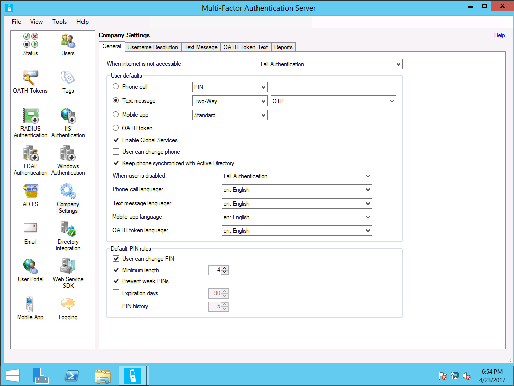
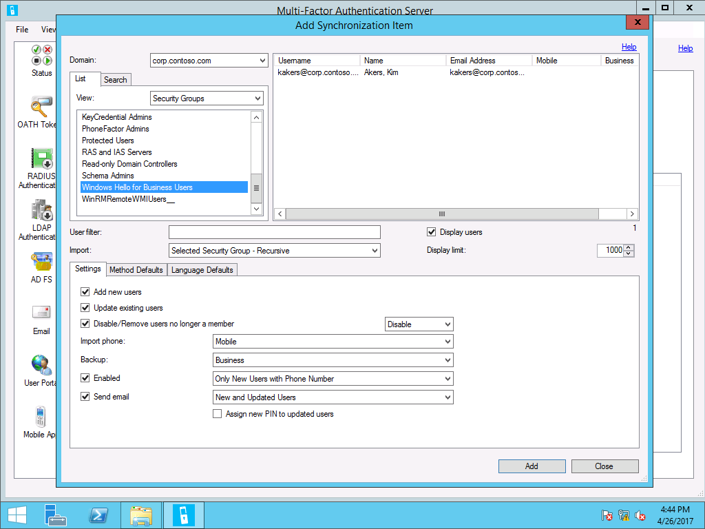
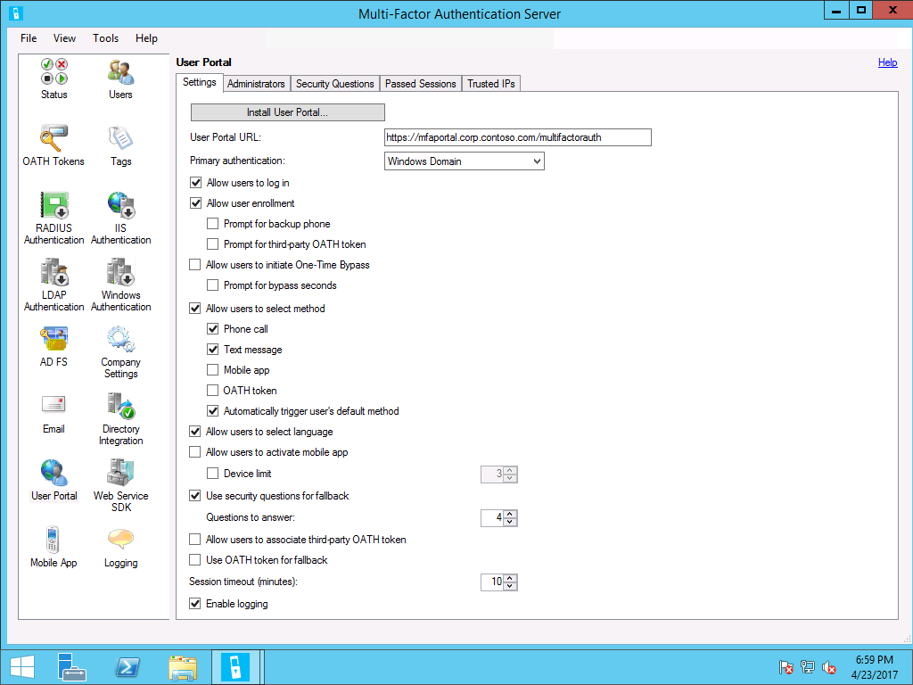

# Configure or Deploy Multifactor Authentication Services

**Applies to**
-   Windows 10, version 1703 or later
-   On-premises deployment
-   Certificate trust

On-premises deployments must use an on-premises MFA Server that provides an AD FS Multifactor authentication adapter. It can be an Azure Multi-Factor Authentication Server or a third-party MFA solution.

>[!TIP]
>Please make sure you've read [Validate and Deploy Multifactor Authentication Services (MFA)](hello-cert-trust-validate-deploy-mfa.md) before proceeding any further.

## Prerequisites

The Azure MFA Server and User Portal servers have several prerequisites and must have connectivity to the Internet.

### Primary MFA Server

The Azure MFA server uses a primary and secondary replication model for its configuration database.  The primary Azure MFA server hosts the writable partition of the configuration database.  All secondary Azure MFA servers hosts read-only partitions of the configuration database.  All production environment should deploy a minimum of two MFA Servers.  

For this documentation, the primary MFA uses the name **mf*a*** or **mfa.corp.contoso.com**.  All secondary servers use the name **mfa*n*** or **mfa*n*.corp.contoso.com**, where *n* is the number of the deployed MFA server.

The primary MFA server is also responsible for synchronizing from Active Directory.  Therefore, the primary MFA server should be domain joined and fully patched. 

#### Enroll for Server Authentication

The communication between the primary MFA server, secondary MFA servers, User Portal servers, and the client is protected using TLS, which needs a server authentication certificate. 

Sign-in the primary MFA server with _domain admin_ equivalent credentials.
1.	Start the Local Computer **Certificate Manager** (certlm.msc).
2.	Expand the **Personal** node in the navigation pane.
3.	Right-click **Personal**. Select **All Tasks** and **Request New Certificate**.
4.	Click **Next** on the **Before You Begin** page.
5.	Click **Next** on the **Select Certificate Enrollment Policy** page.
6.	On the **Request Certificates** page, Select the **Internal Web Server** check box.
7.	Click the **More information is required to enroll for this certificate. Click here to configure settings** link.
8.	Under **Subject name**, select **Common Name** from the **Type** list.  Type the FQDN of the primary MFA server and then click **Add** (mfa.corp.contoso.com).    Click **Add**. Click **OK** when finished.
9.	Click **Enroll**.

A server authentication certificate should appear in the computer’s Personal certificate store.

#### Install the Web Server Role

The Azure MFA server does not require the Web Server role, however, User Portal and the optional Mobile Application server communicate with the MFA server database using the MFA Web Services SDK.  The MFA Web Services SDK uses the Web Server role.

To install the Web Server (IIS) role, please follow [Installing IIS 7 on Windows Server 2008 or Windows Server 2008 R2](https://docs.microsoft.com/iis/install/installing-iis-7/installing-iis-7-and-above-on-windows-server-2008-or-windows-server-2008-r2) or [Installing IIS 8.5 on Windows Server 2012 R2](https://docs.microsoft.com/iis/install/installing-iis-85/installing-iis-85-on-windows-server-2012-r2) depending on the host Operating System you're going to use.

The following services are required:
* Common Parameters > Default Document.
* Common Parameters > Directory Browsing.
* Common Parameters > HTTP Errors.
* Common Parameters > Static Content.
* Health and Diagnostics > HTTP Logging.
* Performance > Static Content Compression.
* Security > Request Filtering.
* Security > Basic Authentication.
* Management Tools > IIS Management Console.
* Management Tools > IIS 6 Management Compatibility.
* Application Development > ASP.NET 4.5. 

#### Update the Server

Update the server using Windows Update until the server has no required or optional updates as the Azure MFA Server software may require one or more of these updates for the installation and software to correctly work.  These procedures install additional components that may need to be updated.

#### Configure the IIS Server Certificate

The TLS protocol protects all the communication to and from the MFA server. To enable this protection, you must configure the default web site to use the previously enrolled server authentication certificate.

Sign in the primary MFA server with _administrator_ equivalent credentials.
1.	From **Administrators**, Start the **Internet Information Services (IIS) Manager** console
2.	In the navigation pane, expand the node with the same name as the local computer.  Expand **Settings** and select **Default Web Site**.
3.	In the **Actions** pane, click **Bindings**.
4.	In the **Site Bindings** dialog, Click **Add**.
5.	In the **Add Site Binding** dialog, select **https** from the **Type** list.  In the **SSL certificate** list, select the certificate with the name that matches the FQDN of the computer.
6.	Click **OK**.  Click **Close**.  From the **Action** pane, click **Restart**.

#### Configure the Web Service’s Security

The Azure MFA Server service runs in the security context of the Local System. The MFA User Portal gets its user and configuration information from the Azure MFA server using the MFA Web Services.  Access control to the information is gated by membership to the **Phonefactor Admins** security group.  You need to configure the Web Service’s security to ensure the User Portal and the Mobile Application servers can securely communicate to the Azure MFA Server.  Also, all User Portal server administrators must be included in the **Phonefactor Admins** security group.

Sign in the domain controller with _domain administrator_ equivalent credentials.

##### Create Phonefactor Admin group 

1. Open **Active Directory Users and Computers**
2. In the navigation pane, expand the node with the organization’s Active Directory domain name.  Right-click the **Users** container, select **New**, and select **Group**.
3. In the **New Object – Group** dialog box, type **Phonefactor Admins** in Group name. 
4. Click **OK**.

##### Add accounts to the Phonefactor Admins group

1. Open **Active Directory Users and Computers**.
2. In the navigation pane, expand the node with the organization’s Active Directory domain name.  Select Users. In the content pane. Right-click the **Phonefactor Admins** security group and select **Properties**.
3. Click the **Members** tab.
4. Click **Add**. Click **Object Types..** In the **Object Types** dialog box, select **Computers** and click **OK**. Enter the following user and/or computers accounts in the **Enter the object names to select** box and then click **OK**.   
    * The computer account for the primary MFA Server
    * Group or user account that will manage the User Portal server.

#### Review

Before you continue with the deployment, validate your deployment progress by reviewing the following items:

* Confirm the hosts of the MFA service has enrolled a server authentication certificate with the proper names.   
    * Record the expiration date of the certificate and set a renewal reminder at least six weeks before it expires that includes the:   
        * Certificate serial number
        * Certificate thumbprint
        * Common name of the certificate
        * Subject alternate name of the certificate
        * Name of the physical host server
        * The issued date
        * The expiration date
        * Issuing CA Vendor (if a third-party certificate)

* Confirm the Web Services Role was installed with the correct configuration (including Basic Authentication, ASP.NET 4.5, etc).
* Confirm the host has all the available updates from Windows Update.
* Confirm you bound the server authentication certificate to the IIS web site.
* Confirm you created the Phonefactor Admins group.
* Confirm you added the computer account hosting the MFA service to the Phonefactor Admins group and any user account who are responsible for administrating the MFA server or User Portal.

### User Portal Server

The User Portal is an IIS Internet Information Server web site that allows users to enroll in Multi-Factor Authentication and maintain their accounts.  A user may change their phone number, change their PIN, or bypass Multi-Factor Authentication during their next sign on.  Users will log in to the User Portal using their normal username and password and will either complete a Multi-Factor Authentication call or answer security questions to complete their authentication.  If user enrollment is allowed, a user will configure their phone number and PIN the first time they log in to the User Portal.  User Portal Administrators may be set up and granted permission to add new users and update existing users.

The User Portal web site uses the user database that is synchronized across the MFA Servers, which enables a design to support multiple web servers for the User Portal and those servers can support internal and external customers.  While the user portal web site can be installed directly on the MFA server, it is recommended to install the User Portal on a server separate from the MFA Server to protect the MFA user database, as a layered, defense-in-depth security design.

#### Enroll for Server Authentication

Internal and external users use the User Portal to manage their multifactor authentication settings. To protect this communication, you need to enroll all User Portal servers with a server authentication certificate.  You can use an enterprise certificate to protect communication to internal User Portal servers.

For external User Portal servers, it is typical to request a server authentication certificate from a public certificate authority.  Contact a public certificate authority for more information on requesting a certificate for public use.  Follow the procedures below to enroll an enterprise certificate on your User Portal server.

Sign-in the User Portal server with _domain admin_ equivalent credentials.
1.	Start the Local Computer **Certificate Manager** (certlm.msc).
2.	Expand the **Personal** node in the navigation pane.
3.	Right-click **Personal**. Select **All Tasks** and **Request New Certificate**.
4.	Click **Next** on the **Before You Begin** page.
5.	Click **Next** on the **Select Certificate Enrollment Policy** page.
6.	On the **Request Certificates** page, Select the **Internal Web Server** check box.
7.	Click the **More information is required to enroll for this certificate. Click here to configure settings** link.
8.	Under **Subject name**, select **Common Name** from the **Type** list.  Type the FQDN of the primary MFA server and then click **Add** (app1.corp.contoso.com).
9.	Under **Alternative name**, select **DNS** from the **Type** list.  Type the FQDN of the name you will use for your User Portal service (mfaweb.corp.contoso.com).
10.	Click **Add**. Click **OK** when finished.
11.	Click **Enroll**.

A server authentication certificate should appear in the computer’s Personal certificate store.

#### Install the Web Server Role

To do this, please follow the instructions mentioned in the previous [Install the Web Server Role](#install-the-web-server-role) section.  However, do **not** install Security > Basic Authentication.  The user portal server does not require this. 

#### Update the Server

Update the server using Windows Update until the server has no required or optional updates as the Azure MFA Server software may require one or more of these updates for the installation and software to correctly work.  These procedures install additional components that may need to be updated.

#### Set the IIS Server Certificate

To do this, please follow the instructions mentioned in the previous [Configure the IIS Server’s Certificate](#configure-the-iis-server-certificate) section.

#### Create WebServices SDK user account

The User Portal and Mobile Application web services need to communicate with the configuration database hosted on the primary MFA server. These services use a user account to communicate to authenticate to the primary MFA server.  You can think of the WebServices SDK account as a service account used by other servers to access the WebServices SDK on the primary MFA server.   

1. Open **Active Directory Users and Computers**.
2. In the navigation pane, expand the node with the organization’s Active Directory domain name.  Right-click the **Users** container, select **New**, and select **User**.
3. In the **New Object – User** dialog box, type **PFWSDK_\<computerName>** in the **First name** and **User logon name** boxes, where *\<computer>* is the name of the primary MFA server running the Web Services SDK.  Click **Next**.
4. Type a strong password and confirm it in the respective boxes.  Clear **User must change password at next logon**. Click **Next**.  Click **Finish** to create the user account.

#### Add the MFA SDK user account to the Phonefactor Admins group

Adding the WebServices SDK user account to the Phonefactor Admins group provides the user account with the proper authorization needed to access the configuration data on the primary MFA server using the WebServices SDK.

1. Open **Active Directory Users and Computers**.
2. In the navigation pane, expand the node with the organization’s Active Directory domain name.  Select **Users**. In the content pane. Right-click the **Phonefactor Admins** security group and select Properties.
3. Click the Members tab.
4. Click **Add**. Click **Object Types..** Type the PFWSDK_\<computerName> user name in the **Enter the object names to select** box and then click **OK**.   
    * The computer account for the primary MFA Server
    * The Webservices SDK user account
    *  Group or user account that will manage the User Portal server.

#### Review

Before you continue with the deployment, validate your deployment progress by reviewing the following items:

* Confirm the hosts of the user portal are properly configure for load balancing and high-availability.
* Confirm the hosts of the user portal have enrolled a server authentication certificate with the proper names.   
    * Record the expiration date of the certificate and set a renewal reminder at least six weeks before it expires that includes the:   
        * Certificate serial number
        * Certificate thumbprint
        * Common name of the certificate
        * Subject alternate name of the certificate
        * Name of the physical host server
        * The issued date
        * The expiration date
        * Issuing CA Vendor (if a third-party certificate)

* Confirm the Web Server Role was properly configured on all servers.
* Confirm all the hosts have the latest updates from Windows Update.
* Confirm you created the web service SDK domain account and the account is a member of the Phonefactor Admins group. 

## Installing Primary Azure MFA Server

When you install Azure Multi-Factor Authentication Server, you have the following options: 
1. Install Azure Multi-Factor Authentication Server locally on the same server as AD FS
2. Install the Azure Multi-Factor Authentication adapter locally on the AD FS server, and then install Multi-Factor Authentication Server on a different computer (preferred deployment for production environments)

See [Configure Azure Multi-Factor Authentication Server to work with AD FS in Windows Server](https://docs.microsoft.com/azure/multi-factor-authentication/multi-factor-authentication-get-started-adfs-w2k12) to view detailed installation and configuration options.

Sign-in the federation server with _Domain Admin_ equivalent credentials and follow [To install and configure the Azure Multi-Factor Authentication server](https://docs.microsoft.com/azure/multi-factor-authentication/multi-factor-authentication-get-started-server#to-install-and-configure-the-azure-multi-factor-authentication-server) for an express setup with the configuration wizard. You can re-run the authentication wizard by selecting it from the Tools menu on the server.

>[!IMPORTANT]
>Only follow the above mention article to install Azure MFA Server. Once it is intstalled, continue configuration using this article.

### Configuring Company Settings

You need to configure the MFA server with the default settings it applies to each user account when it is imported or synchronized from Active Directory.

Sign-in the primary MFA server with MFA _administrator_ equivalent credentials.
1. Start the **Multi-Factor Server** application
2. Click **Company Settings**.
3. On the **General** Tab, select **Fail Authentication** from the **When internet is not accessible** list.
4. In **User defaults**, select **Phone Call** or **Text Message**   
    **Note:** You can use the mobile application; however, the configuration is beyond the scope of this document. Read [Getting started the MFA Server Mobile App Web Service](https://docs.microsoft.com/azure/multi-factor-authentication/multi-factor-authentication-get-started-server-webservice) to configure and use mobile application multi-factor authentication or the Install User Portal topic in the Multi-Factor Server help.
5. Select **Enable Global Services** if you want to allow Multi-Factor Authentications to be made to telephone numbers in rate zones that have an associated charge.
6. Clear the **User can change phone** check box to prevent users from changing their phone during the Multi-Factor Authentication call or in the User Portal.  A consistent configuration is for users to change their phone numbers in Active Directory and let those changes synchronize to the multi-factor server using the Synchronization features in Directory Integration.
7. Select **Fail Authentication** from the **When user is disabled** list.  Users should provision their account through the user portal.
8. Select the appropriate language from the **Phone call language**, **Text message language**, **Mobile app language**, and **OATH token language** lists.
9. Under default PIN rules, Select the User can change PIN check box to enable users to change their PIN during multi-factor authentication and through the user portal.
10. Configure the minimum length for the PIN.
11.	Select the **Prevent weak PINs** check box to reject weak PINs. A weak PIN is any PIN that could be easily guessed by a hacker: 3 sequential digits, 3 repeating digits, or any 4 digit subset of user phone number are not allowed. If you clear this box, then there are no restrictions on PIN format. For example: User tries to reset PIN to 1235 and is rejected because it's a weak PIN. User will be prompted to enter a valid PIN.
12.	Select the **Expiration days** check box if you want to expire PINs.  If enabled, provide a numeric value representing the number of days the PIN is valid.
13.	Select the **PIN history** check box if you want to remember previously used PINs for the user. PIN History stores old PINs for each user. Users are not allowed to reset their PIN to any value stored in their PIN History. When cleared, no PIN History is stored. The default value is 5 and range is 1 to 10. 

### Configuring Email Settings and Content

If you are deploying in a lab or proof-of-concept, then you have the option of skipping this step.  In a production environment, ideally, you’ll want to setup the Azure Multifactor Authentication Server and its user portal web interface prior to sending the email.  The email gives your users time to visit the user portal and configure the multi-factor settings. 

Now that you have imported or synchronized with your Azure Multi-Factor Authentication server, it is advised that you send your users an email that informs them that they have been enrolled in multi-factor authentication.

With the Azure Multi-Factor Authentication Server there are various ways to configure your users for using multi-factor authentication. For instance, if you know the users’ phone numbers or were able to import the phone numbers into the Azure Multi-Factor Authentication Server from their company’s directory, the email will let users know that they have been configured to use Azure Multi-Factor Authentication, provide some instructions on using Azure Multi-Factor Authentication and inform the user of the phone number they will receive their authentications on.  

The content of the email will vary depending on the method of authentication that has been set for the user (e.g. phone call, SMS, mobile application). For example, if the user is required to use a PIN when they authenticate, the email will tell them what their initial PIN has been set to. Users are usually required to change their PIN during their first authentication. 

If users’ phone numbers have not been configured or imported into the Azure Multi-Factor Authentication Server, or users are pre-configured to use the mobile application for authentication, you can send them an email that lets them know that they have been configured to use Azure Multi-Factor Authentication and it will direct them to complete their account enrollment through the Azure Multi-Factor Authentication User Portal. A hyperlink will be included that the user clicks on to access the User Portal. When the user clicks on the hyperlink, their web browser will open and take them to their company’s Azure Multi-Factor Authentication User Portal.

#### Settings

By clicking the email icon on the left you can setup the settings for sending these emails. This is where you can enter the SMTP information of your mail server and it allows you to send a blanket wide email by adding a check to the Send mails to users check box.

#### Content

On the Email Content tab, you will see all of the various email templates that are available to choose from. So, depending on how you have configured your users to use multi-factor authentication, you can choose the template that best suits you.

##### Edit the Content Settings

The Azure MFA server does not send emails, even when configured to do so, until you configured the sender information for each email template listed in the Content tab.

Sign-in the primary MFA server with MFA _administrator_ equivalent credentials.
1. Open the **Multi-Factor Authentication Server** console.
2. Click **Email** from the list of icons and click the **Email Content** tab.
3. Select an email template from the list of templates.  Click **Edit**.
4. In the **Edit Email** dialog, in the **From** text box, type the email address of the person or group that should appear to have sent the email.   
    

5. Optionally, customize other options in the email template.
6. When finished editing the template, Click **Apply**.
7. Click **Next** to move to the next email in the list.  Repeat steps 4 and 6 to edit the changes.
8. Click **Close** when you are done editing the email templates.

### Configuring Directory Integration Settings and Synchronization

Synchronization keeps the Multi-Factor Authentication user database synchronized with the users in Active Directory or another LDAP Lightweight Directory Access Protocol directory.  The process is similar to Importing Users from Active Directory, but periodically polls for Active Directory user and security group changes to process.  It also provides for disabling or removing users removed from a container or security group and removing users deleted from Active Directory.

It is important to use a different group memberships for synchronizing users from Active Directory and for enabling Windows Hello for Business.  Keeping the group memberships separated enables you to synchronize users and configure MFA options without immediately deploying Windows Hello for Business to that user.  This deployment approach provides the maximum flexibility, which gives users the ability to configure their settings before they provision Windows Hello for Business.  To start provisioning, simply add the group used for synchronization to the Windows Hello for Business Users group (or equivalent if you use custom names).

#### MultiFactorAuthAdSync Service

The MultiFactorAuthAdSync service is a Windows service that performs the periodic polling of Active Directory.  It is installed in a Stopped state and is started by the MultiFactorAuth service when configured to run.  If you have a multi-server Multi-Factor Authentication configuration, the MultiFactorAuthAdSync may only be run on a single server.

The MultiFactorAuthAdSync service uses the DirSync LDAP server extension provided by Microsoft to efficiently poll for changes.  This DirSync control caller must have the "directory get changes" right and DS-Replication-Get-Changes extended control access right.  By default, these rights are assigned to the Administrator and LocalSystem accounts on domain controllers.  The MultiFactorAuthAdSync service is configured to run as LocalSystem by default.  Therefore, it is simplest to run the service on a domain controller.  The service can run as an account with lesser permissions if you configure it to always perform a full synchronization.  This is less efficient, but requires less account privileges.

#### Settings

Configuring the directory synchronization between Active Directory and the Azure MFA server is easy. 

Sign in the primary MFA server with _MFA administrator_ equivalent credentials. 
1. Open the **Multi-Factor Authentication Server** console.
2. From the **Multi-Factor Authentication Server** window, click the **Directory Integration** icon.
3. Click the **Synchronization** tab.
4. Select **Use Active Directory**.
5. Select **Include trusted domains** to have the Multi-Factor Authentication Server attempt to connect to domains trusted by the current domain, another domain in the forest, or domains involved in a forest trust.  When not importing or synchronizing users from any of the trusted domains, clear the check box to improve performance.

#### Synchronization

The MFA server uses synchronization items to synchronize users from Active Directory to the MFA server database.  Synchronization items enables you to synchronize a collection of users based security groups or Active Directory containers.

You can configure synchronization items based on different criteria and filters.  For the purpose of configuring Windows Hello for Business, you need to create a synchronization item based membership of the Windows Hello for Business user group.  This ensures the same users who receive Windows Hello for Business policy settings are the same users synchronized to the MFA server (and are the same users with permission to enroll in the certificate).  This significantly simplifies deployment and troubleshooting.

See [Directory integration between Azure MFA Server and Active Directory](https://docs.microsoft.com/azure/multi-factor-authentication/multi-factor-authentication-get-started-server-dirint) for more details.

##### To add a synchronization item

Sign in the primary MFA server with _MFA administrator_ equivalent credentials.
1. Open the **Multi-Factor Authentication Server** console.
2. From the **Multi-Factor Authentication Server** window, click the **Directory Integration** icon.
3. Select the **Synchronization** tab.
4. On the **Synchronization** tab, click **Add**.   
    

5. In the **Add Synchronization Item** dialog, select **Security Groups** from the **View** list.
6. Select the group you are using for replication from the list of groups
7. Select **Selected Security Groups – Recursive** or, select **Security Group** from the **Import** list if you do not plan to nest groups.
8. Select **Add new users and Update existing users**.
9. Select **Disable/Remove users no longer a member** and select **Disable** from the list.
10.	Select the attributes appropriate for your environment for **Import phone** and **Backup**.
11.	Select **Enabled** and select **Only New Users with Phone Number** from the list.
12.	Select **Send email** and select **New and Updated Users**.

##### Configure synchronization item defaults

1. When creating a new or editing a synchronization item from the Multi-Factor Authentication Server, select the **Method Defaults** tab.
2. Select the default second factor authentication method.  For example, if the second factor of authentication is a text message, select **Text message**. Select if the direction of text message authentication and if the authentication should use a one-time password or one-time password and PIN (Ensure users are configured to create a PIN if the default second factor of communication requires a PIN).

##### Configure synchronization language defaults

1. When creating a new or editing a synchronization item from the Multi-Factor Authentication Server, select the **Language Defaults** tab.
2. Select the appropriate default language for these groups of users synchronized by these synchronization item.
3. If creating a new synchronization item, click **Add** to save the item.  If editing an existing synchronization item, click **Apply** and then click **Close**.

>[!TIP]
>For more information on these settings and the behaviors they control, see [Directory integration between Azure MFA Server and Active Directory](https://docs.microsoft.com/azure/multi-factor-authentication/multi-factor-authentication-get-started-server-dirint).

### Installing the MFA Web Services SDK

The Web Service SDK section allows the administrator to install the Multi-Factor Authentication Web Service SDK. The Web Service SDK is an IIS (Internet Information Server) web service that provides an interface for integrating the full features of the Multi-Factor Authentication Server into most any application.  The Web Service SDK uses the Multi-Factor Authentication Server as the data store.

Remember the Web Services SDK is only need on the primary Multi-Factor to easily enable other servers access to the configuration information.  The prerequisites section guided you through installing and configuring the items needed for the Web Services SDK, however the installer will validate the prerequisites and make suggest any corrective action needed.

Please follow the instructions under [Install the web service SDK](https://docs.microsoft.com/azure/multi-factor-authentication/multi-factor-authentication-get-started-server-webservice#install-the-web-service-sdk) to install the MFA Web Services SDK.

## Install Secondary MFA Servers

Additional MFA servers provided redundancy of the MFA configuration. The MFA server models uses one primary MFA server with multiple secondary servers.  Servers within the same group establish communication with the primary server for that group. The primary server replicates to each of the secondary servers. You can use groups to partition the data stored on different servers, for example you can create a group for each domain, forest, or organizational unit.

Follow the same procedures for installing the primary MFA server software for each additional server. Remember that each server must be activated.

Sign in the secondary MFA server with _domain administrator_ equivalent credentials.
1.	Once the Multi-Factor Authentication Server console starts, you must configure the current server’s replication group membership.  You have the option to join an existing group or create a new group.  When joining an existing group, the server becomes a secondary server in the existing replication group.  When creating a new group, the server becomes the primary server of that replication group.  Click **OK**.   
    **Note:** Group membership cannot be changed after activation. If a server was joined to the wrong group, it must be activated again to join a different group.  Please contact support for assistance with deactivating and reactivating a server.
2.	The console asks you if you want to enable replication by running the **Multi-Server Configuration Wizard**. Click **Yes**.
3.	In the **Multi-Server Configuration Wizard**, leave **Active Directory** selected and clear **Certificates**. Click **Next**.
4.	On the **Active Directory** page, the wizard determines what configuration is needed to enable replication.  Typically, the wizard recommends adding the computer account for the current server to the **PhoneFactor Admin** group.  Click **Next** to add the computer account to the group.
5.	On the **Multi-Server Configuration Complete** page, click **Finish** to reboot the computer to update its group membership.

### Review

Before you continue with the deployment, validate your deployment progress by reviewing the following items:
* Confirm you downloaded the latest Azure MFA Server from the Azure Portal.
* Confirm the server has Internet connectivity.
* Confirm you installed and activated the Azure MFA Server.
* Confirm your Azure MFA Server configuration meets your organization’s needs (Company Settings, Email Settings, etc).
* Confirm you created Directory Synchronization items based on your deployment to synchronize users from Active Directory to the Azure MFA server.     
    * For example, you have security groups representing each collection of users that represent a phase of your deployment and a corresponding synchronization item for each of those groups.

* Confirm the Azure MFA server properly communicates with the Azure MFA cloud service by testing multifactor authentication with a newly synchronized user account.
* Confirm you installed the Web Service SDK on the primary MFA server.
* Confirm your MFA servers have adequate redundancy, should you need to promote a secondary server to the primary server. 

## Installing the User Portal Server

You previously configured the User Portal settings on the primary MFA server.  The User Portal web application communicates to the primary MFA server using the Web Services SDK to retrieve these settings.  This configuration is ideal to ensure you can scale up the User Portal application to meet the needs of your internal users.  

### Copying the User Portal Installation file

Sign in the primary MFA server with _local administrator_ equivalent credentials.
1. Open Windows Explorer.
2. Browse to the C:\Program Files\MultiFactor Authentication Server folder.
3. Copy the **MultiFactorAuthenticationUserPortalSetup64.msi** file to a folder on the User Portal server.

### Configure Virtual Directory name

Sign in the User Portal server with _local administrator_ equivalent credentials.
1. Open Windows Explorer and browse to the folder to which you saved the installation file from the previous step.
2. Run the **MultiFactorAuthenticationUserPortalSetup64.msi**. The installation package asks if you want to download **Visual Studio C++ Redistributable for Visual Studio 2015**.  Click **Yes**. When prompted, select **Save As**. The downloaded file is missing its file extension.  **Save the file with a .exe extension and install the runtime**.
3. Run the installation package again. The installer package asks about the C++ runtime again; however, this is for the X64 version (the previous prompt was for x86). Click **Yes** to download the installation package and select **Save As** so you can save the downloaded file with a .exe extension. **Install** the run time.
4. Run the User Portal installation package. On the **Select Installation Address** page, use the default settings for **Site** and **Application Pool** settings. You can modify the Virtual directory to use a name that is more fitting for the environment, such as **mfa** (This virtual directory must match the virtual directory specified in the User Portal settings). Click **Next**.
5. Click **Close**.

### Edit MFA User Portal config file

Sign in the User Portal server with _local administrator_ equivalent credentials.
1. Open Windows Explorer and browse to C:\inetpub\wwwroot\MultiFactorAuth (or appropriate directory based on the virtual directory name) and edit the **web.config** file.
2. Locate the **USE_WEB_SERVICE_SDK** key and change the value from **false** to **true**. 
3. Locate the **WEB_SERVICE_SDK_AUTHENTICATION_USERNAME** key and set the value to the username of the Web Service SDK account in the **PhoneFactor Admins** security group. Use a qualified username, like domain\username or machine\username. 
4. Locate the **WEB_SERVICE_SDK_AUTHENTICATION_PASSWORD** key and set the value to the password of the Web Service SDK account in the **PhoneFactor Admins** security group.
5. Locate the **pfup_pfwssdk_PfWsSdk** setting and change the value from **“<http://localhost:4898/PfWsSdk.asmx”>** to the URL of the Web Service SDK that is running on the Azure Multi-Factor Authentication Server (e.g. <https://computer1.domain.local/MultiFactorAuthWebServiceSdk/PfWsSdk.asmx>). Since SSL is used for this connection, refer to the Web Service SDK by server name, not IP address, since the SSL certificate was issued for the server name. If the server name does not resolve to an IP address from the Internet-facing server, add an entry to the hosts file on that server to map the name of the Azure Multi-Factor Authentication Server to its IP address. Save the **web.config** file after changes have been made.

### Create a DNS entry for the User Portal web site

Sign-in the domain controller or administrative workstation with _Domain Admin_ equivalent credentials.
1.	Open the **DNS Management** console.
2.	In the navigation pane, expand the domain controller name node and **Forward Lookup Zones**.
3.	In the navigation pane, select the node that has the name of your internal Active Directory domain name.
4.	In the navigation pane, right-click the domain name node and click **New Host (A or AAAA)**.
5.	In the **name** box, type the host name of the User Portal, such as *mfaweb* (this name must match the name of the certificate used to secure communication to the User Portal). In the IP address box, type the load balanced **IP address** of the User Portal. Click **Add Host**. 
6.	Close the **DNS Management** console.

### Review

Before you continue with the deployment, validate your deployment progress by reviewing the following items:
* Confirm the user portal application is properly installed on all user portal hosts
* Confirm the USE_WEB_SERVICE_SDK named value has a value equal to true.
* Confirm the WEB_SERVICE_SDK_AUTHENTICATION_USERNAME named value has the username of the web service SDK domain account previously created and that the user name is represented as DOMAIN\USERNAME
* Confirm the WEB_SERVICES_SDK_AUTHENTICATION_PASSWORD named value has the correct password for the web service SDK domain account.
* Confirm the pfup_pfwssdk_PfWsSdk named value has value that matches the URL of for the SDK service installed on the primary MFA server.
* Confirm you saved the changes to the web.config file.

### Validating your work

Windows Hello for Business is a distributed system, which on the surface appears complex and difficult.  The key to a successful Windows Hello for Business deployment is to validate phases of work prior to moving to the next phase.

Using a web browser, navigate to the URL provided in the *pf_up_pfwssdk_PfWsSdk* named value in the web.config file of any one of the user portal servers.  The URL should be protected by a server authentication certificate and should prompt you for authentication.  Authenticate to the web site using the username and password provided in the web.config file.  Successful authentication and page view confirms the Web SDK configured on the primary MFA server is correctly configured and ready to work with the user portal.

### Configuring the User Portal

The User Portal section allows the administrator to install and configure the Multi-Factor Authentication User Portal. The User Portal is an IIS Internet Information Server web site that allows users to enroll in Multi-Factor Authentication and maintain their accounts.  A user may change their phone number, change their PIN, or bypass Multi-Factor Authentication during their next sign on.  Users will log in to the User Portal using their normal username and password and will either complete a Multi-Factor Authentication call or answer security questions to complete their authentication.  If user enrollment is allowed, a user will configure their phone number and PIN the first time they log in to the User Portal.
User Portal Administrators may be set up and granted permission to add new users and update existing users.

#### Settings

Sign in the primary MFA server with _MFA administrator_ equivalent credentials.
1. Open the Multi-Factor Authentication Server console.
2. From the Multi-Factor Authentication Server window, click the User Portal icon.   
    

3. On the Settings tab, type the URL your users use to access the User Portal.  The URL should begin with https, such as `https://mfaportal.corp.contoso.com/mfa`. 
The Multi-Factor Authentication Server uses this information when sending emails to users.
4. Select Allow users to log in and Allow user enrollment check boxes.
5. Select Allow users to select method.  Select Phone call and select Text message (you can select Mobile application later once you have deployed the Mobile application web service).  Select Automatically trigger user’s default method.
6. Select Allow users to select language.
7. Select Use security questions for fallback and select 4 from the Questions to answer list.

>[!TIP]
>For more information on these settings and the behaviors they control, see [Deploy the user portal for the Azure Multi-Factor Authentication Server](https://docs.microsoft.com/azure/multi-factor-authentication/multi-factor-authentication-get-started-portal).

#### Administrators

The User Portal Settings tab allows the administrator to install and configure the User Portal.
1. Open the Multi-Factor Authentication Server console.
2. From the Multi-Factor Authentication Server window, click the User Portal icon.
3. On the Administrators tab, Click Add
4. In the Add Administrator dialog, Click Select User… to pick a user to install and manage the User Portal.  Use the default permissions. 
5. Click Add.

>[!TIP]
>For more information on these settings and the behaviors they control, read the **Multi-Factor Authentication Server Help content**.

#### Security Questions

[Security questions](https://docs.microsoft.com/azure/multi-factor-authentication/multi-factor-authentication-get-started-portal#security-questions) for the User Portal may be customized to meet your requirements.  The questions defined here will be offered as options for each of the four security questions a user is prompted to configure during their first log on to User Portal.  The order of the questions is important since the first four items in the list will be used as defaults for the four security questions.

#### Trusted IPs

The [Trusted IPs](https://docs.microsoft.com/azure/multi-factor-authentication/multi-factor-authentication-get-started-portal#trusted-ips) tab allows you to skip Multi-Factor Authentication for User Portal log ins originating from specific IPs. For example, if users use the User Portal from the office and from home, you may decide you don't want their phones ringing for Multi-Factor Authentication while at the office. For this, you would specify the office subnet as a trusted IP entry.

## Configure the AD FS Server to use the MFA for multifactor authentication

You need to configure the AD FS server to use the MFA server.  You do this by Installing the MFA Adapter on the primary AD FS Server.

### Install the MFA AD FS Adapter

Follow [Install a standalone instance of the AD FS adapter by using the Web Service SDK](https://docs.microsoft.com/azure/multi-factor-authentication/multi-factor-authentication-get-started-adfs-w2k12#install-a-standalone-instance-of-the-ad-fs-adapter-by-using-the-web-service-sdk). You should follow this instructions on all AD FS servers. You can find the files needed on the MFA server.

### Edit the MFA AD FS Adapter config file on all ADFS Servers

Sign in the primary AD FS server with _local administrator_ equivalent credentials.
1. Open Windows Explorer and browse to **C:\inetpub\wwwroot\MultiFactorAuth** (or appropriate directory based on the virtual directory name) and edit the **MultiFactorAuthenticationAdfsAdapter.config** file.
2. Locate the **USE_WEB_SERVICE_SDK** key and change the value from **false** to **true**. 
3. Locate the **WEB_SERVICE_SDK_AUTHENTICATION_USERNAME** key and set the value to the username of the Web Service SDK account in the **PhoneFactor Admins** security group. Use a qualified username, like domain\username or machine\username. 
4. Locate the **WEB_SERVICE_SDK_AUTHENTICATION_PASSWORD** key and set the value to the password of the Web Service SDK account in the **PhoneFactor Admins** security group.
5. Locate the **pfup_pfwssdk_PfWsSdk** setting and change the value from “<http://localhost:4898/PfWsSdk.asmx”> to the URL of the Web Service SDK that is running on the Azure Multi-Factor Authentication Server (e.g. <https://computer1.domain.local/MultiFactorAuthWebServiceSdk/PfWsSdk.asmx>). Since SSL is used for this connection, refer to the Web Service SDK by server name, not IP address, since the SSL certificate was issued for the server name. If the server name does not resolve to an IP address from the Internet-facing server, add an entry to the hosts file on that server to map the name of the Azure Multi-Factor Authentication Server to its IP address. Save the **MultiFactorAuthenticationAdfsAdapter.config** file after changes have been made.

### Edit the AD FS Adapter Windows PowerShell cmdlet

Sign in the primary AD FS server with _local administrator_ equivalent credentials.

Edit the **Register-MultiFactorAuthenticationAdfsAdapter.ps1** script adding `-ConfigurationFilePath <path>` to the end of the `Register-AdfsAuthenticationProvider` command where **\<path>** is the full path to the **MultiFactorAuthenticationAdfsAdapter.config** file.

### Run the AD FS Adapter PowerShell cmdlet

Sign in the primary AD FS server with local administrator equivalent credentials.

Run **Register-MultiFactorAuthenticationAdfsAdapter.ps1** script in PowerShell to register the adapter.  The adapter is registered as **WindowsAzureMultiFactorAuthentication**.  

>[!NOTE]
>You must restart the AD FS service for the registration to take effect.

### Review

Before you continue with the deployment, validate your deployment progress by reviewing the following items:
* Confirm the user portal application is properly installed on all user portal hosts
* Confirm the USE_WEB_SERVICE_SDK named value has a value equal to true.
* Confirm the WEB_SERVICE_SDK_AUTHENTICATION_USERNAME named value has the username of the web service SDK domain account previously created and that the user name is represented as DOMAIN\USERNAME
* Confirm the WEB_SERVICES_SDK_AUTHENTICATION_PASSWORD named value has the correct password for the web service SDK domain account.
* Confirm the pfup_pfwssdk_PfWsSdk named value has value that matches the URL of for the SDK service installed on the primary MFA server.
* Confirm you saved the changes to the web.config file.
* Confirm you restarted the AD FS Service after completing the configuration.

## Test Multifactor Authentication

Now, you should test your Azure Multi-Factor Authentication server configuration before proceeding any further in the deployment.  The AD FS and Azure Multi-Factor Authentication server configurations are complete.

1.	In the **Multi-Factor Authentication** server, on the left, click **Users**.
2.	In the list of users, select a user that is enabled and has a valid phone number to which you have access.
3.	Click **Test**.
4.	In the **Test User** dialog, provide the user’s password to authenticate the user to Active Directory.

The Multi-Factor Authentication server communicates with the Azure MFA cloud service to perform a second factor authentication for the user.  The Azure MFA cloud service contacts the phone number provided and asks for the user to perform the second factor authentication configured for the user.  Successfully providing the second factor should result in the Multi-factor authentication server showing a success dialog. 

## Follow the Windows Hello for Business on premises certificate trust deployment guide
1. [Validate Active Directory prerequisites](hello-cert-trust-validate-ad-prereq.md)
2. [Validate and Configure Public Key Infrastructure](hello-cert-trust-validate-pki.md)
3. [Prepare and Deploy Windows Server 2016 Active Directory Federation Services](hello-cert-trust-adfs.md)
4. [Validate and Deploy Multifactor Authentication Services (MFA)](hello-cert-trust-validate-deploy-mfa.md)
5. [Configure Windows Hello for Business Policy settings](hello-cert-trust-policy-settings.md)
